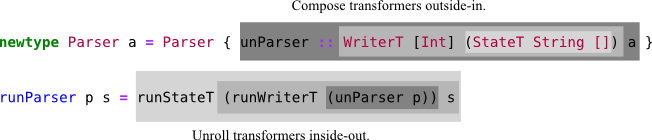
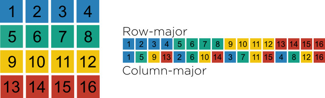

Stephen Diehl (<a class="author" href="https://twitter.com/smdiehl">@smdiehl</a> )

Since I wrote these slides for a little user group talk I gave two years ago they have become a surprisingly
popular reference. I decided to actually turn them into a proper skimmable reference for intermediate and
advanced level Haskell topics that don't necessarily have great coverage or that tend be somewhat opaque as to
where to get going, and then aggregate a bunch of the best external resources for diving into those subjects
with more depth. Hopefully it still captures the "no bullshit brain dump" style that seemed to be liked.

The source for all code is [available here](https://github.com/sdiehl/wiwinwlh/tree/master/src). If there are
any errors or you think of a more illustrative example feel free to submit a pull request.

This is the third draft of this document.

**License**

This code and text are dedicated to the public domain. You can copy, modify, distribute and perform the work,
even for commercial purposes, all without asking permission.

Basics
======

Cabal
-----

Cabal is the build system for Haskell, it also doubles as a package manager.

For example to install the [parsec](http://hackage.haskell.org/package/parsec) package from Hackage to our
system invoke the install command:

```bash
$ cabal install parsec           # latest version
$ cabal install parsec==3.1.5    # exact version
```

The usual build invocation for Haskell packages is the following:

```bash
$ cabal get parsec    # fetch source
$ cd parsec-3.1.5

$ cabal configure
$ cabal build
$ cabal install
```

To update the package index from Hackage run:

```bash
$ cabal update
```

To start a new Haskell project run

```bash
$ cabal init
$ cabal configure
```

A ``.cabal`` file will be created with the configuration options for our new project.

The latest feature of Cabal is the addition of Sandboxes ( in cabal
> 1.18 ) which are self contained environments of Haskell packages
separate from the global package index stored in the ``./.cabal-sandbox`` of our project's root. To create a
new sandbox for our cabal project run.

```bash
$ cabal sandbox init
```

In addition the sandbox can be torn down.

```bash
$ cabal sandbox delete
```

Invoking the cabal commands when in the working directory of a project with a sandbox configuration set up
alters the behavior of cabal itself. For example the ``cabal install`` command will only alter the install to
the local package index and will not touch the global configuration. 

To install the dependencies from the cabal file into the newly created sandbox run:

```bash
$ cabal install --only-dependencies
```

Dependencies can also be built in parallel by passing ``-j<n>`` where ``n`` is the number of concurrent
builds.

```bash
$ cabal install -j4 --only-dependencies
```

Let's look at an example cabal file, there are two main entry points that any package may provide: a ``library``
and an ``executable``. Multiple executables can be defined, but only one library. In addition there is a
special form of executable entry point ``Test-Suite`` which defines an interface for unit tests to be invoked
from cabal.

For a library the ``exposed-modules`` field in the cabal file indicates which modules within the package
structure will be publicly visible when the package is installed, these are the user-facing APIs that we wish
to exposes to downstream consumers.

For an executable the ``main-is`` field indicates the Main module for the project that exports the ``main``
function to run for the executable logic of the application.

```bash
name:               mylibrary
version:            0.1
cabal-version:      >= 1.10
author:             Paul Atreides 
license:            MIT
license-file:       LICENSE
synopsis:           The code must flow.
category:           Math
tested-with:        GHC
build-type:         Simple
  
library                    
    exposed-modules:
      Library.ExampleModule1
      Library.ExampleModule2

    build-depends: 
      base >= 4 && < 5

    default-language: Haskell2010

    ghc-options: -O2 -Wall -fwarn-tabs

executable "example"
    build-depends: 
        base >= 4 && < 5,
        mylibrary == 0.1
    default-language: Haskell2010
    main-is: Main.hs    

Test-Suite test
  type: exitcode-stdio-1.0
  main-is: Test.hs
  default-language: Haskell2010
  build-depends:
      base >= 4 && < 5,
      mylibrary == 0.1
```

To run the "executable" for a library under the cabal sandbox:

```bash
$ cabal run
$ cabal run <name>
```

To load the "library" into a GHCi shell under the cabal sandbox:

```bash
$ cabal repl
$ cabal repl <name>
```

The ``<name>`` metavariable is either one of the executable or library declarations in the cabal file, and can
optionally be disambiguated by the prefix ``exe:<name>`` or ``lib:<name>`` respectively.

To build the package locally into the ``./dist/build`` folder execute the ``build`` command.

```bash
$ cabal build 
```

To run the tests, our package must itself be reconfigured with the ``--enable-tests`` and the
``build-depends`` from the Test-Suite must be manually installed if not already.

```bash
$ cabal configure --enable-tests
$ cabal install --only-dependencies --enable-tests
$ cabal test
$ cabal test <name>
```

In addition arbitrary shell commands can also be invoked with the GHC environmental variables set up for the
sandbox. Quite common is to invoke a new shell with this command such that the ``ghc`` and ``ghci`` commands
use the sandbox ( they don't by default, which is a common source of frustration ).

```bash
$ cabal exec 
$ cabal exec sh # launch a shell with GHC sandbox path set.
```

The haddock documentation can be built for the local project by executing the ``haddock`` command, it will be
built to the ``./dist`` folder.

```bash
$ cabal haddock
```

When we're finally ready to upload to Hackage ( presuming we have a Hackage account set up ), then we can
build the tarball and upload with the following commands:

```bash
$ cabal sdist
$ cabal upload dist/mylibrary-0.1.tar.gz
```

Using the ``cabal repl`` and ``cabal run`` commands are preferable but sometimes we'd like to manually perform
their equivalents at the shell, there are several useful aliases that rely on shell directory expansion to
find the package database in the current working directory and launch GHC with the appropriate flags:

```bash
alias ghc-sandbox="ghc -no-user-package-db -package-db .cabal-sandbox/*-packages.conf.d"
alias ghci-sandbox="ghci -no-user-package-db -package-db .cabal-sandbox/*-packages.conf.d"
alias runhaskell-sandbox="runhaskell -no-user-package-db -package-db .cabal-sandbox/*-packages.conf.d"
```

Courtesy of [Brian McKenna](https://twitter.com/puffnfresh) there is also a zsh script to show the sandbox
status of the current working directory in our shell.

```bash
function cabal_sandbox_info() {
    cabal_files=(*.cabal(N))
    if [ $#cabal_files -gt 0 ]; then
        if [ -f cabal.sandbox.config ]; then
            echo "%{$fg[green]%}sandboxed%{$reset_color%}"
        else
            echo "%{$fg[red]%}not sandboxed%{$reset_color%}"
        fi
    fi
}
 
RPROMPT="\$(cabal_sandbox_info) $RPROMPT"
```

The cabal configuration is stored in ``$HOME/.cabal/config`` and contains various options including credential
information for Hackage upload. One addition to configuration is to completely disallow the installation of
packages outside of sandboxes to prevent accidental collisions.

```perl
-- Don't allow global install of packages.
require-sandbox: True
```

Another common flag to enable is the ``documentation`` which forces the local build of Haddock documentation,
which can be useful for offline reference. On a Linux filesystem these are built to the
``/usr/share/doc/ghc/html/libraries/`` directory.

```perl
documentation: True
```

If GHC is currently installed the documentation for the Prelude and Base libraries should be available at this
local link:

[/usr/share/doc/ghc/html/libraries/index.html](file:///usr/share/doc/ghc/html/libraries/index.html)


See:

* [An Introduction to Cabal Sandboxes](http://coldwa.st/e/blog/2013-08-20-Cabal-sandbox.html)
* [Storage and Identification of Cabalized Packages](http://www.vex.net/~trebla/haskell/sicp.xhtml)

GHCi
----

GHCi is the interactive shell for the GHC compiler. GHCi is where we will spend most of our time.

Command    Shortcut   Action
---------  ---------  --------------------------
`:reload`  `:r`       Code reload 
`:type`    `:t`       Type inspection
`:kind`    `:k`       Kind inspection
`:info`    `:i`       Information
`:print`   `:p`       Print the expression
`:edit`    `:e`       Load file in system editor.

The introspection commands are an essential part of debugging and interacting with Haskell code:

```haskell
λ: :type 3
3 :: Num a => a
```

```haskell
λ: :kind Either
Either :: * -> * -> *
```

```haskell
λ: :info Functor
class Functor f where
  fmap :: (a -> b) -> f a -> f b
  (<$) :: a -> f b -> f a
        -- Defined in `GHC.Base'
  ...
```

```haskell
λ: :i (:)
data [] a = ... | a : [a]       -- Defined in `GHC.Types'
infixr 5 :
```

The current state of the global environment in the shell can also be queried. Such as module-level bindings
and types:

```haskell
λ: :browse
λ: :show bindings
```

Or module level imports:

```haskell
λ: :show imports
import Prelude -- implicit
import Data.Eq
import Control.Monad
```

Or compiler-level flags and pragmas:

```haskell
λ: :set
options currently set: none.
base language is: Haskell2010
with the following modifiers:
  -XNoDatatypeContexts
  -XNondecreasingIndentation
GHCi-specific dynamic flag settings:
other dynamic, non-language, flag settings:
  -fimplicit-import-qualified
warning settings:

λ: :showi language
base language is: Haskell2010
with the following modifiers:
  -XNoDatatypeContexts
  -XNondecreasingIndentation
  -XExtendedDefaultRules
```

Language extensions and compiler pragmas can be set at the prompt. See the [Flag
Reference](http://www.haskell.org/ghc/docs/latest/html/users_guide/flag-reference.html) for the vast set of
compiler flag options. For example several common ones are:

```haskell
:set -XNoMonomorphismRestriction
:set -fno-warn-unused-do-bind
```

Several commands for interactive options have shortcuts: 

        Function
------  ---------
``+t``  Show types of evaluated expressions
``+s``  Show timing and memory usage
``+m``  Enable multi-line expression delimited by ``:{`` and ``:}``.


```haskell
λ: set +t
λ: []
[]
it :: [a]
```

```haskell
λ: set +s
λ: foldr (+) 0 [1..25]
325
it :: Prelude.Integer
(0.02 secs, 4900952 bytes)
```

```haskell
λ: :{ 
λ:| let foo = do
λ:|           putStrLn "hello ghci"
λ:| :}
λ: foo
"hello ghci"
```

The configuration for the GHCi shell can be customized globally by defining a ``ghci.conf`` in 
``$HOME/.ghc/`` or in the in current working directory as ``./.ghci.conf``.

For example we can add a command to use the Hoogle type search from within GHCi.

```bash
cabal install hoogle
```

We can use it by adding a command to our ``ghci.conf``.

~~~~ {.haskell include="src/01-basics/ghci.conf"}
~~~~

```haskell
λ: :hoogle (a -> b) -> f a -> f b
Data.Traversable fmapDefault :: Traversable t => (a -> b) -> t a -> t b
Prelude fmap :: Functor f => (a -> b) -> f a -> f b
```

For reasons of sexiness it is desirable to set your GHC prompt to a ``λ`` or a ``ΠΣ`` if you're into that
lifestyle.

```haskell
:set prompt "λ: "
:set prompt "ΠΣ: "
```

For editor integration with vim and emacs:

```haskell
cabal install hdevtools
cabal install ghc-mod
cabal install hlint
```

Bottoms
-------

```haskell
error :: String -> a
undefined :: a
```

The bottom is a singular value that inhabits every type. When evaluated the semantics of Haskell no longer
yield a meaningful value. It's usually written as the symbol ⊥ (i.e. the compiler flipping you off ).

An example of a infinite looping term:

```haskell
f :: a
f = let x = x in x
```

The ``undefined`` function is nevertheless extremely practical to accommodate writing incomplete programs and
for debugging.

```haskell
f :: a -> Complicated Type
f = undefined -- write tomorrow, typecheck today!
```

Partial functions from non-exhaustive pattern matching is probably the most common introduction of bottoms.

```haskell
data F = A | B
case x of 
  A -> ()
```

The above is translated into the following GHC Core with the exception inserted for the non-exhaustive
patterns. GHC can be made more vocal about incomplete patterns using the ``-fwarn-incomplete-patterns`` and
``-fwarn-incomplete-uni-patterns`` flags.

```haskell
case x of _ {
  A -> ();
  B -> patError "<interactive>:3:11-31|case"
}
```

The same holds with record construction with missing fields, although there's almost never a good reason to
construct a record with missing fields and GHC will warn us by default.

```haskell
data Foo = Foo { example1 :: Int }
f = Foo {}
```

Again this has an error term put in place by the compiler:

```haskell
Foo (recConError "<interactive>:4:9-12|a")
```

What's not immediately apparent is that they are used extensively throughout the Prelude, some for practical
reasons others for historical reasons. The canonical example is the ``head`` function which as written ``[a]
-> a`` could not be well-typed without the bottom.

~~~~ {.haskell include="src/01-basics/bottoms.hs"}
~~~~

It's rare to see these partial functions thrown around carelessly in production code and the preferred method
is instead to use the safe variants provided in ``Data.Maybe`` combined with the usual fold functions
``maybe`` and ``either`` or to use pattern matching.

```haskell
listToMaybe :: [a] -> Maybe a
listToMaybe []     =  Nothing
listToMaybe (a:_)  =  Just a
```

When a bottom define in terms of error is invoked it typically will not generate any position information, but
the function used to provide assertions ``assert`` can be short circuited to generate position information in
the place of either ``undefined`` or ``error`` call.

~~~~ {.haskell include="src/01-basics/fail.hs"}
~~~~

See: [Avoiding Partial Functions](http://www.haskell.org/haskellwiki/Avoiding_partial_functions)

Debugger
--------

Although its use is somewhat rare, GHCi has a builtin debugger.  Debugging uncaught exceptions from bottoms
or asynchronous exceptions is in similar style to debugging segfaults with gdb.

```haskell
λ: :set -fbreak-on-exception
λ: :trace main
λ: :hist
λ: :back
```

Trace
------

Haskell being pure has the unique property that most code is introspectable on its own, as such the "printf"
style of debugging is often unnecessary when we can simply open GHCi and test the function. Nevertheless
Haskell does come with a unsafe ``trace`` function which can be used to perform arbitrary print statements
outside of the IO monad.

~~~~ {.haskell include="src/01-basics/trace.hs"}
~~~~

The function itself is impure ( it uses ``unsafePerformIO`` under the hood ) and shouldn't be used in stable
code.

In addition to just the trace function, several common monadic patterns are quite common.

```haskell
import Text.Printf
import Debug.Trace

traceM :: (Monad m) => String -> m ()
traceM string = trace string $ return ()

traceShowM :: (Show a, Monad m) => a -> m ()
traceShowM = traceM . show

tracePrintfM :: (Monad m, PrintfArg a) => String -> a -> m ()
tracePrintfM s = traceM . printf s
```

Type Holes
----------

Since GHC 7.8 we have a new tool for debugging incomplete programs by means of *type holes*. By placing a
underscore on any value on the right hand-side of a declaration GHC will throw an error during type-checker
that reflects the possible values that could placed at this point in the program to make to make the program
type-check.

```haskell
instance Functor [] where
  fmap f (x:xs) = f x : fmap f _
```

```bash
[1 of 1] Compiling Main             ( src/typehole.hs, interpreted )

src/typehole.hs:7:32:
    Found hole ‘_’ with type: [a]
    Where: ‘a’ is a rigid type variable bound by
               the type signature for fmap :: (a -> b) -> [a] -> [b]
               at src/typehole.hs:7:3
    Relevant bindings include
      xs :: [a] (bound at src/typehole.hs:7:13)
      x :: a (bound at src/typehole.hs:7:11)
      f :: a -> b (bound at src/typehole.hs:7:8)
      fmap :: (a -> b) -> [a] -> [b] (bound at src/typehole.hs:7:3)
    In the second argument of ‘fmap’, namely ‘_’
    In the second argument of ‘(:)’, namely ‘fmap f _’
    In the expression: f x : fmap f _
Failed, modules loaded: none.
```

GHC has rightly suggested that the expression needed to finish the program is ``xs : [a]``.

Monads
======

Eightfold Path to Monad Satori
------------------------------

Much ink has been spilled waxing lyrical about the supposed mystique of monads. Instead I suggest a path to
enlightenment:

1. Don't read the monad tutorials.
2. No really, don't read the monad tutorials.
3. Learn about Haskell types.
4. Learn what a typeclass is.
5. Read the [Typeclassopedia](http://www.haskell.org/haskellwiki/Typeclassopedia).
6. Read the monad definitions.
7. Use monads in real code.
8. Don't write monad-analogy tutorials.

In other words, the only path to understanding monads is to read the fine source, fire up GHC and write some
code. Analogies and metaphors will not lead to understanding.

See: [Monad Tutorial Fallacy](http://byorgey.wordpress.com/2009/01/12/abstraction-intuition-and-the-monad-tutorial-fallacy/)

Monadic Myths
-------------

The following are all **false**:

* Monads are impure.
* Monads are about effects.
* Monads are about state.
* Monads are about sequencing.
* Monads are about IO.
* Monads are dependent on laziness.
* Monads are a "back-door" in the language to perform side-effects.
* Monads are an embedded imperative language inside Haskell.
* Monads require knowing abstract mathematics.

See: [What a Monad Is Not](http://www.haskell.org/haskellwiki/What_a_Monad_is_not)

Laws
----

Monads are not complicated, the implementation is a typeclass with two functions, ``(>>=)`` pronounced "bind"
and ``return``. Any preconceptions one might have for the word "return" should be discarded, it has an
entirely different meaning.

```haskell
class Monad m where
  (>>=)  :: m a -> (a -> m b) -> m b
  return :: a -> m a
```
Together with three laws that all monad instances must satisfy.

**Law 1**

```haskell
return a >>= f ≡ f a
```

**Law 2**

```haskell
m >>= return ≡ m
```

**Law 3**

```haskell
(m >>= f) >>= g ≡ m >>= (\x -> f x >>= g)
```

There is an auxiliary function (``(>>)``) defined in terms of the bind operation that discards its argument.

```haskell
(>>) :: Monad m => m a -> m b -> m b
m >> k = m >>= \_ -> k
```

See: [Monad Laws](http://www.haskell.org/haskellwiki/Monad_laws)

Do Notation
-----------

Monads syntax in Haskell is written in sugared form that is entirely equivalent to just applications of the
monad operations. The desugaring is defined recursively by the rules: 

```haskell
do { a <- f ; m } ≡ f >>= \a -> do { m }
do { f ; m } ≡ f >> do { m }
do { m } ≡ m
```

So for example:

```haskell
do
  a <- f
  b <- g
  c <- h
  return (a, b, c)

do {
  a <- f ;
  b <- g ;
  c <- h ;
  return (a, b, c)
}

f >>= \a ->
  g >>= \b ->
    h >>= \c ->
      return (a, b, c)
```

If one were to write the bind operator as an uncurried function ( this is
not how Haskell uses it ) the same desugaring might look something like the
following chain of nested binds with lambdas.

```haskell
bindMonad(f, lambda a:
  bindMonad(g, lambda b:
    bindMonad(h, lambda c:
      returnMonad (a,b,c))))
```

In the do-notation the monad laws from above are equivalently written:

**Law 1**

```haskell
  do x <- m
     return x

= do m
```

**Law 2**

```haskell
  do y <- return x
     f y

= do f x
```

**Law 3**

```haskell
  do b <- do a <- m
             f a
     g b

= do a <- m
     b <- f a
     g b

= do a <- m
     do b <- f a
        g b
```

See: [Haskell 2010: Do Expressions](http://www.haskell.org/onlinereport/haskell2010/haskellch3.html#x8-470003.14)

Maybe
-----

The *Maybe* monad is the simplest first example of a monad instance. The Maybe monad models computations which
fail to yield a value at any point during computation.

```haskell
data Maybe a = Just a | Nothing
```

```haskell
instance Monad Maybe where
  (Just x) >>= k = k x
  Nothing  >>= k = Nothing

  return = Just
```

```haskell
(Just 3) >>= (\x -> return (x + 1))
-- Just 4

Nothing >>= (\x -> return (x + 1))
-- Nothing

return 4 :: Maybe Int
-- Just 4
```

~~~~ {.haskell include="src/02-monads/maybe.hs"}
~~~~

List
----

The *List* monad is the second simplest example of a monad instance.

```haskell
instance Monad [] where
  m >>= f   =  concat (map f m)
  return x  =  [x]
```

So for example with:

```haskell
m = [1,2,3,4]
f = \x -> [1,0]
```

The reduction is straightforward:

```haskell
m >>= f
==> [1,2,3,4] >>= \x -> [1,0]
==> concat (map (\x -> [1,0]) [1,2,3,4])
==> concat ([[1,0],[1,0],[1,0],[1,0]])
==> [1,0,1,0,1,0,1,0]
```

The list comprehension syntax in Haskell can be implemented in terms of the list monad.

```haskell
a = [f x y | x <- xs, y <- ys, x == y ]

-- Identical to `a`
b = do
  x <- xs
  y <- ys
  guard $ x == y
  return $ f x y
```

~~~~ {.haskell include="src/02-monads/list.hs"}
~~~~

IO
--

A value of type ``IO a`` is a computation which, when performed, does some I/O before returning a value of
type ``a``. Desugaring the IO monad:

```haskell
main :: IO ()
main = do putStrLn "What is your name: "
          name <- getLine
          putStrLn name
```

```haskell
main :: IO ()
main = putStrLn "What is your name:" >>=
       \_    -> getLine >>=
       \name -> putStrLn name
```

```haskell
main :: IO ()
main = putStrLn "What is your name: " >> (getLine >>= (\name -> putStrLn name))
```

See: [Haskell 2010: Basic/Input Output](http://www.haskell.org/onlinereport/haskell2010/haskellch7.html)

Whats the point?
----------------

Consider the non-intuitive fact that we now have a uniform interface for talking about three very different
but foundational ideas for programming: *Failure*, *Collections*, and *Effects*.

Let's write down a new function called ``sequence`` which folds a function ``mcons``, which we can think of as
analogues to the list constructor (i.e. ``(a : b : [])``) except it pulls the two list elements out of of two
monadic values (``p``,``q``) using bind.

```haskell
sequence :: Monad m => [m a] -> m [a] 
sequence = foldr mcons (return [])

mcons :: Monad m => m t -> m [t] -> m [t]
mcons p q = do
  x <- p
  y <- q
  return (x:y)
```

What does this function mean in terms of each of the monads discussed above?

**Maybe**

Sequencing a list of a ``Maybe`` values allows us to collect the results of a series of computations which can
possibly fail and yield the aggregated values only if they all succeeded. 

```haskell
sequence :: [Maybe a] -> Maybe [a]
```

```haskell
sequence [Just 3, Just 4]
-- Just [3,4]
sequence [Just 3, Just 4, Nothing]
-- Nothing
```

**List**

Since the bind operation for the list monad forms the pairwise list of elements from the two operands, folding
the bind over a list of lists with ``sequence`` implements the general Cartesian product for an arbitrary
number of lists.

```haskell
sequence :: [[a]] -> [[a]]
```

```haskell
sequence [[1,2,3],[10,20,30]]
-- [[1,10],[1,20],[1,30],[2,10],[2,20],[2,30],[3,10],[3,20],[3,30]]
```

**IO**

Sequence takes a list of IO actions, performs them sequentially, and returns the list of resulting values in
the order sequenced.

```haskell
sequence :: [IO a] -> IO [a]
```

```haskell
sequence [getLine, getLine]
-- a
-- b
-- ["a","b"]
```

So there we have it, three fundamental concepts of computation that are normally defined independently of each
other actually all share this similar structure that can be abstracted out and reused to build higher
abstractions that work for all current and future implementations. If you want a motivating reason for
understanding monads, this is it! This is the essence of what I wish I knew about monads looking back.

See: [Control.Monad](http://hackage.haskell.org/package/base-4.6.0.1/docs/Control-Monad.html#g:4)

Reader Monad
------------

The reader monad lets us access shared immutable state within a monadic context.

```haskell
ask :: Reader r a
asks :: (r -> a) -> Reader r a
local :: (r -> b) -> Reader b a -> Reader r a
runReader :: Reader r a -> r -> a
```

~~~~ {.haskell include="src/02-monads/reader.hs"}
~~~~

A simple implementation of the Reader monad:

~~~~ {.haskell include="src/02-monads/reader_impl.hs"}
~~~~

Writer Monad
------------

The writer monad lets us emit a lazy stream of values from within a monadic context.

```haskell
tell :: w -> Writer w ()
execWriter :: Writer w a -> w
runWriter :: Writer w a -> (a, w)
```

~~~~ {.haskell include="src/02-monads/writer.hs"}
~~~~

A simple implementation of the Writer monad:

~~~~ {.haskell include="src/02-monads/writer_impl.hs"}
~~~~

This implementation is lazy so some care must be taken that one actually wants to only generate a stream of
thunks.  Often this it is desirable to produce a computation which requires a stream of thunks that can pulled
lazily out of the ``runWriter``, but often times the requirement is to produce a finite stream of values that
are forced at the invocation of ``runWriter``. Undesired laziness from Writer is a common source of grief, but
is very remediable.

State Monad
-----------

The state monad allows functions within a stateful monadic context to access and modify shared state.

```haskell
runState  :: State s a -> s -> (a, s)
evalState :: State s a -> s -> a
execState :: State s a -> s -> s
```

~~~~ {.haskell include="src/02-monads/state.hs"}
~~~~

The state monad is often mistakenly described as being impure, but it is in fact entirely pure and the same
effect could be achieved by explicitly passing state. A simple implementation of the State monad is only a
few lines:

~~~~ {.haskell include="src/02-monads/state_impl.hs"}
~~~~

Monad Transformers
==================

mtl / transformers
------------------

So the descriptions of Monads in the previous chapter are a bit of a white lie. Modern Haskell monad libraries
typically use a more general form of the written in terms of monad transformers which allow us to compose
monads together to form composite monads. The monads mentioned previously are subsumed by the special case of
the transformer form composed with the Identity monad.

Monad   Transformer  Type            Transformed Type
------  -----------  --------------- -------------------
Maybe   MaybeT       ``Maybe a``     ``m (Maybe a)``
Reader  ReaderT      ``r -> a``      ``r -> m a``
Writer  WriterT      ``(a,w)``       ``m (a,w)``
State   StateT       ``s -> (a,s)``  ``s -> m (a,s)``


```haskell
type State  s = StateT  s Identity
type Writer w = WriterT w Identity
type Reader r = ReaderT r Identity

instance Monad m => MonadState s (StateT s m)
instance Monad m => MonadReader r (ReaderT r m)
instance (Monoid w, Monad m) => MonadWriter w (WriterT w m)
```

In terms of generality the mtl library is the most common general interface for these monads, which itself
depends on the transformers library which generalizes the "basic" monads described above into transformers.

See: [transformers](https://github.com/ekmett/transformers/tree/master/Control/Monad/Trans)

Transformers
------------

At their core monad transformers allow us to nest monadic computations in a stack with an interface to
exchange values between the levels, called ``lift``.

```haskell
lift :: (Monad m, MonadTrans t) => m a -> t m a
liftIO :: MonadIO m => IO a -> m a
```

```haskell
class MonadTrans t where
    lift :: Monad m => m a -> t m a

class (Monad m) => MonadIO m where
    liftIO :: IO a -> m a

instance MonadIO IO where
    liftIO = id
```

Just as the base monad class has laws, monad transformers also have several laws:

**Law #1**

```haskell
lift . return = return
```

**Law #2**

```haskell
lift (m >>= f) = lift m >>= (lift . f)
```

Or equivalently written in do notation we have:

**Law #1**

```haskell
  do x <- lift m
     x

= do m
```

**Law #2**

```haskell
  do x <- lift m 
     lift (f x)

= lift $ do x <- m
            f x
```

It's useful to remember that transformers compose outside-in but are unrolled inside out.



See: [Monad Transformers: Step-By-Step](http://www.cs.virginia.edu/~wh5a/personal/Transformers.pdf)

ReaderT
-------

For example there exist three possible forms of Reader monad. The first is the Haskell 98 version that no
longer exists but is useful for pedagogy. Together with the *transformers* variant and the *mtl* variants.

*Reader*

```haskell
newtype Reader r a = Reader { runReader :: r -> a }

instance MonadReader r (Reader r) where
  ask       = Reader id
  local f m = Reader $ runReader m . f
```

*ReaderT*

```haskell
newtype ReaderT r m a = ReaderT { runReaderT :: r -> m a }

instance (Monad m) => Monad (ReaderT r m) where
  return a = ReaderT $ \_ -> return a
  m >>= k  = ReaderT $ \r -> do
      a <- runReaderT m r
      runReaderT (k a) r

instance MonadTrans (ReaderT r) where
    lift m = ReaderT $ \_ -> m
```

*MonadReader*

```haskell
class (Monad m) => MonadReader r m | m -> r where
  ask   :: m r
  local :: (r -> r) -> m a -> m a

instance (Monad m) => MonadReader r (ReaderT r m) where
  ask       = ReaderT return
  local f m = ReaderT $ \r -> runReaderT m (f r)
```

So hypothetically the three variants of ask would be:

```haskell
ask :: Reader r a
ask :: Monad m => ReaderT r m r
ask :: MonadReader r m => m r
```

In practice only the last one is used in modern Haskell.

Basics
------

The most basic use requires us to use the T-variants of the each of the monad transformers for the outer
layers and to explicit ``lift`` and ``return`` values between each the layers. Monads have kind ``(* -> *)``
so monad transformers which take monads to monads have ``((* -> *) -> * -> *)``:

```haskell
Monad (m :: * -> *)
MonadTrans (t :: (* -> *) -> * -> *)
```

So for example if we wanted to form a composite computation using both the Reader and Maybe monads we can now
put the Maybe inside of a ``ReaderT`` to form ``ReaderT t Maybe a``.

~~~~ {.haskell include="src/03-monad-transformers/transformer.hs"}
~~~~

The fundamental limitation of this approach is that we find ourselves ``lift.lift.lift``ing and
``return.return.return``ing a lot.

Newtype Deriving
----------------

Newtypes let us reference a data type with a single constructor as a new distinct type, with no runtime
overhead from boxing, unlike a algebraic datatype with single constructor.  Newtype wrappers around strings
and numeric types can often drastically reduce accidental errors.  Using ``-XGeneralizedNewtypeDeriving`` we
can recover the functionality of instances of the underlying type.


~~~~ {.haskell include="src/03-monad-transformers/newtype.hs"}
~~~~

```haskell
Couldn't match type `Double' with `Velocity'
Expected type: Velocity
  Actual type: Double
In the second argument of `(+)', namely `x'
In the expression: v + x
```

Using newtype deriving with the mtl library typeclasses we can produce flattened transformer types that don't
require explicit lifting in the transform stack. For example a little stack machine the Reader Writer and
State monads.

~~~~ {.haskell include="src/03-monad-transformers/newtype_deriving.hs"}
~~~~

Efficiency
----------

The second monad transformer law guarantees that sequencing consecutive lift operations is semantically
equivalent to lifting the results into the outer monad.

```haskell
do x <- lift m  ==  lift $ do x <- m
   lift (f x)                 f x
```

Although they are guaranteed to yield the same result the operation of lifting the results between the monad
levels is not without cost and crops up frequently when working with the monad traversal and looping
functions. For example all three of the functions on the left below are less efficient than the right hand
side which performs the bind in the base monad instead of lifting on each iteration.

```haskell
-- Less Efficient      More Efficient
forever (lift m)    == lift (forever m)
mapM_ xs (lift . f) == lift (mapM_ xs f)
forM_ xs (lift . f) == lift (forM_ xs f)
```

Language Extensions
===================

It's important to distinguish the categories of language extensions fall into:

The inherent problem with classifying the extensions into **General** and **Specialized** category is that
it's a subjective classification. Haskellers who do type astronautics will have a very different
interpretation of Haskell then people who do database programming. As such this is a conservative assessment,
as an arbitrary baseline let's consider ``FlexibleInstances`` and ``OverloadedStrings`` "everyday" while
``GADTs`` and ``TypeFamilies`` are "specialized".

**Key**

* *Benign* implies that importing the extension won't change the semantics of the module if not used.
* *Historical* implies that one shouldn't use this extension, it's in GHC purely for backwards compatibility.
  Sometimes these are dangerous to enable.

~~~~ {literal="extensions.html"}
~~~~

See: [GHC Extension Reference](http://www.haskell.org/ghc/docs/7.8.2/html/users_guide/flag-reference.html#idp14615552)

The Dangerous
-------------

GHC's typechecker sometimes just casually tells us to enable language extensions when it can't solve certain
problems. These include:

* ``OverlappingInstances``
* ``IncoherentInstances``
* ``ImpredicativeTypes``

These almost always these indicate a design flaw and shouldn't be turned on to remedy the error at hand, as
much as GHC might suggest otherwise!

Inference
---------

Inference in Haskell is generally quite accurate, although there are several boundary cases that tend to cause
problems. Consider the two functions

**Mututally Recursive Binding Groups**

```haskell
f x = const x g
g y = f 'A'
```

The inferred type signatures are correct in their usage, but don't represent the most general signatures. When
GHC analyzes the module it analyzes the dependencies of expressions on each other, groups them together, and
applies substitutions from unification across mutually defined groups. As such the inferred types may not be
the most general types possible, and an explicit signature may be desired.

```haskell
-- Inferred types
f :: Char -> Char
g :: t -> Char

-- Most general types
f :: a -> a
g :: a -> Char
```

**Polymorphic recursion**

```haskell
data Tree a = Leaf | Bin a (Tree (a, a))

size Leaf = 0
size (Bin _ t) = 1 + 2 * size t
```

The problem with this expression is that the inferred type variable ``a``  in ``size`` spans two possible
types (``a`` and ``(a,a)``), the recursion is polymorphic. These two types won't pass the occurs-check of
typechecker and yield to an incorrect inferred type.

```haskell
    Occurs check: cannot construct the infinite type: t0 = (t0, t0)
    Expected type: Tree t0
      Actual type: Tree (t0, t0)
    In the first argument of `size', namely `t'
    In the second argument of `(*)', namely `size t'
    In the second argument of `(+)', namely `2 * size t'
```

Simply adding an explicit type signature corrects this. Type inference using polymorphic recursion is
undecidable in the general case.

```haskell
size :: Tree a -> Int
size Leaf = 0
size (Bin _ t) = 1 + 2 * size t
```

See: [Static Semantics of Function and Pattern Bindings](https://www.haskell.org/onlinereport/haskell2010/haskellch4.html#x10-880004.5)

Monomorphism Restriction
------------------------

The most common edge case of the inference is known as the dreaded *monomorphic restriction*.

When the toplevel declarations of a module are generalized the monomorphism restricts that toplevel values
(i.e. expressions not under a lambda ) whose type contains the subclass of the ``Num`` type from the Prelude
are not generalized and instead are instantiated with a monotype tried sequentially from the list specified by
the ``default`` which is normally `Integer` then `Double`.

~~~~ {.haskell include="src/04-extensions/monomorphism.hs"}
~~~~

As of GHC 7.8 the monomorphism restriction is switched off by default in GHCi.

```haskell
λ: set +t

λ: 3
3 
it :: Num a => a

λ: default (Double)

λ: 3
3.0
it :: Num a => a
```

Safe Haskell
------------

As everyone eventually finds out there are several functions within implementation of GHC ( not the Haskell
language ) that can be used to subvert the type-system, they are marked with the prefix ``unsafe``.  These
functions exist only for when one can manually prove the soundness of an expression but can't express this
property in the type-system. Using these functions without fulfilling the proof obligations will cause all
measure of undefined behavior with unimaginable pain and suffering, and are <span style="font-weight:
bold">strongly discouraged</span>. When initially starting out with Haskell there are no legitimate reason to
use these functions at all, period.

```haskell
unsafeCoerce :: a -> b
unsafePerformIO :: IO a -> a
```

The Safe Haskell language extensions allow us to restrict the use of unsafe language features using ``-XSafe``
which restricts the import of modules which are themselves marked as Safe. It also forbids the use of certain
language extensions (``-XTemplateHaskell``) which can be used to produce unsafe code. The primary use case of
these extensions is security auditing.

```haskell
{-# LANGUAGE Safe #-}
{-# LANGUAGE Trustworthy #-}
```

~~~~ {.haskell include="src/04-extensions/safe.hs"}
~~~~

```haskell
Unsafe.Coerce: Can't be safely imported!
The module itself isn't safe.
```

See: [Safe Haskell](https://ghc.haskell.org/trac/ghc/wiki/SafeHaskell)

Pattern Guards
--------------

```haskell
{-# LANGUAGE PatternGuards #-}

combine env x y
   | Just a <- lookup env x
   , Just b <- lookup env y
   = Just a + b

   | otherwise = Nothing
```

View Patterns
-------------

~~~~ {.haskell include="src/04-extensions/views.hs"}
~~~~

Misc Syntax Extensions
----------------------

**Tuple Sections**

```haskell
{-# LANGUAGE TupleSections #-}

fst' :: a -> (a, Bool)
fst' = (,True)

snd' :: a -> (a, Bool)
snd' = (True,)

example :: (Bool, Bool)
example = fst' False
```

**Multi-way if-expressions**

```haskell
{-# LANGUAGE MultiWayIf #-}

operation x =
  if | x > 100   = 3  
     | x > 10    = 2  
     | x > 1     = 1  
     | otherwise = 0
```

**Lambda Case**

~~~~ {.haskell include="src/04-extensions/lambdacase.hs"}
~~~~

**Package Imports**

```haskell
import qualified "mtl" Control.Monad.Error as Error
import qualified "mtl" Control.Monad.State as State
import qualified "mtl" Control.Monad.Reader as Reader
```

**Record WildCards**

~~~~ {.haskell include="src/04-extensions/wildcards.hs"}
~~~~

```haskell
```

Pattern Synonyms
----------------

Suppose we were writing a typechecker, it would very to common to include a distinct ``TArr`` term ease the
telescoping of function signatures, this is what GHC does in its Core language. Even though technically it
could be written in terms of more basic application of the ``(->)`` constructor. 

```haskell
data Type
  = TVar TVar
  | TCon TyCon
  | TApp Type Type
  | TArr Type Type
  deriving (Show, Eq, Ord)
```

With pattern synonyms we can eliminate the extraneous constructor without loosing the convenience of pattern
matching on arrow types.

```haskell
{-# LANGUAGE PatternSynonyms #-}

pattern TArr t1 t2 = TApp (TApp (TCon "(->)") t1) t2
```

So now we can write an eliminator and constructor for arrow type very naturally.

~~~~ {.haskell include="src/04-extensions/patterns.hs"}
~~~~

Laziness
========

Again, a subject on which *much* ink has been spilled. There is an ongoing
discussion in the land of Haskell about the compromises between lazy and strict
evaluation, and there are nuanced arguments for having either paradigm be the
default. Haskell takes a hybrid approach and allows strict evaluation when
needed and uses laziness by default. Needless to say, we can always find
examples where strict evaluation exhibits worse behavior than lazy evaluation
and vice versa.

The primary advantage of lazy evaluation in the large is that algorithms that
operate over both unbounded and bounded data structures can inhabit the same
type signatures and be composed without additional need to restructure their
logic or force intermediate computations. Languages that attempt to bolt
laziness onto a strict evaluation mode with often bifurcate classes of
algorithms into ones that are had-adjusted to consume unbounded structures and
mixing and matching between lazy vs strict processing often necessitates
manifesting large intermediate structures in memory when such composition would
"just work" in a lazy language.


By virtue of Haskell being the only language to actually explore this point in
the design space, knowledge about lazy evaluation can often be non-intuitive to
the novice. This does reflect on the model itself, merely on the need for more
instruction material.

See: 

* [Oh My Laziness!](http://alpmestan.com/2013/10/02/oh-my-laziness/)
* [Reasoning about Laziness](http://www.slideshare.net/tibbe/reasoning-about-laziness)
* [Lazy Evaluation of Haskell](http://www.vex.net/~trebla/haskell/lazy.xhtml)
* [More Points For Lazy Evaluation](http://augustss.blogspot.hu/2011/05/more-points-for-lazy-evaluation-in.html)

Seq and WHNF
------------

In Haskell evaluation only occurs at outer constructor of case-statements in
Core. If we pattern match on a list we don't implicitly force all values in the
list. A element in a data structure is only evaluated up to the most outer
constructor. For example, to evaluate the length of a list we need only
scrutinize the outer Cons constructors without regard for their inner values.

```haskell
λ: length [undefined, 1]
2

λ: head [undefined, 1]
Prelude.undefined

λ: snd (undefined, 1)
1

λ: fst (undefined, 1)
Prelude.undefined
```

A term is said to be in *weak head normal-form* if the outermost constructor or
lambda cannot be reduced further. A term is said to be in normal form if it is
fully evaluated and all sub-expressions and thunks contained within are
evaluated.

For example in a lazy language the following program terminates even though it
contains diverging terms. 

~~~~ {.haskell include="src/05-laziness/nodiverge.hs"}
~~~~

In a strict language like OCaml ( ignoring it's suspensions for the moment ),
the same program diverges.

~~~~ {.haskell include="src/05-laziness/diverge.ml"}
~~~~

In Haskell a *thunk* is created to stand for an unevaluated computation.
Evaluation of a thunk is called ``forcing`` the thunk. The result is an *update*
a referentially transparent effect, which replaces the memory representation of
the thunk with the computed value. The fundamental idea is that a thunk is only
updated once ( although it may be forced simultaneously in a multi-threaded
environment ) and it's resulting value is shared when referenced subsequently.

The command ``:sprintf`` can be used to introspect the state of unevaluated
thunks inside an expression without forcing evaluation. For instance:

```haskell
λ: let a = [1..]
λ: let b = map (+ 1) a

λ: :sprint a
a = _
λ: :sprint b
b = _
λ: a !! 4
5
λ: :sprint a
a = 1 : 2 : 3 : 4 : 5 : _
λ: b !! 10
12
λ: :sprint a
a = 1 : 2 : 3 : 4 : 5 : 6 : 7 : 8 : 9 : 10 : 11 : _
λ: :sprint b
b = _ : _ : _ : _ : _ : _ : _ : _ : _ : _ : 12 : _
```

While a thunk is being computed it's memory representation is replaced with a
special form known as *blackhole* which indicates that computation is ongoing
and allows a short circuit for when a computation might depend on it itself to
complete. The implementation of this is some of the more subtle details of the
GHC runtime.

The ``seq`` function introduces an artificial dependence on the evaluation of order of two terms by requiring
that the first argument be evaluated to WHNF before the evaluation of the second. The implementation of the
`seq` function is an implementation detail of GHC.

```haskell
seq :: a -> b -> b

⊥ `seq` a = ⊥
a `seq` b = b
```

The infamous ``foldl`` is well-known to leak space when used carelessly and without several compiler
optimizations applied. The strict ``foldl'`` variant uses seq to overcome this.

```haskell
foldl :: (a -> b -> a) -> a -> [b] -> a
foldl f z [] = z
foldl f z (x:xs) = foldl f (f z x) xs
```

```haskell
foldl' :: (a -> b -> a) -> a -> [b] -> a
foldl' _ z [] = z
foldl' f z (x:xs) = let z' = f z x in z' `seq` foldl' f z' xs
```

In practice a combination between the strictness analyzer and the inliner on
``-O2`` will ensure that the strict variant of ``foldl`` is used whenever the
function is inlinable at call site so manually using ``foldl'`` is most often
not required.


Strictness Annotations
----------------------

The extension ``BangPatterns`` allows an alternative syntax to force arguments
to functions to be wrapped in seq. A bang operator on an arguments forces it's
evaluation to weak head normal form before matching it.

```haskell
{-# LANGUAGE BangPatterns #-}

sum :: Num a => [a] -> a
sum = go 0
  where
    go !acc (x:xs) = go (acc + x) (go xs)
    go  acc []     = acc
```

This is desugared into code semantically equivalent to the following:

```haskell
sum :: Num a => [a] -> a
sum = go 0
  where
    go acc _ | acc `seq` False = undefined
    go acc (x:xs)              = go (acc + x) (go xs)
    go acc []                  = acc
```

Function application to seq'd arguments often enough that is has a special operator.

```haskell
($!) :: (a -> b) -> a -> b
f $! x  = let !vx = x in f vx
```

Deepseq
-------

There are often times when for performance reasons we need to deeply evaluate a data structure to normal form
leaving no terms unevaluated. The ``deepseq`` library performs this task.

```haskell
class NFData a where
  rnf :: a -> ()
  rnf a = a `seq` ()

deepseq :: NFData a => a -> b -> a
($!!) :: (NFData a) => (a -> b) -> a -> b
```

```haskell
instance NFData Int
instance NFData (a -> b)

instance NFData a => NFData (Maybe a) where
    rnf Nothing  = ()
    rnf (Just x) = rnf x

instance NFData a => NFData [a] where
    rnf [] = ()
    rnf (x:xs) = rnf x `seq` rnf xs
```

```haskell
[1, undefined] `seq` ()
-- ()

[1, undefined] `deepseq` ()
-- Prelude.undefined
```

To force a data structure itself to be fully evaluated we share the same
argument in both positions of deepseq.

```haskell
force :: NFData a => a
force x = x `deepseq` x
```

Irrefutable Patterns
--------------------

A lazy pattern doesn't require a match on the outer constructor instead it
lazily calls the accessors of the values failing at each call-site instead at
the outer pattern match in the presence of a bottom.

~~~~ {.haskell include="src/05-laziness/lazy_patterns.hs"}
~~~~

Prelude
=======

What to Avoid?
--------------

Haskell being a 25 year old language has witnessed several revolutions in the way we structure and compose
functional programs. Yet as a result several portions of the Prelude still reflect old schools of thought that
simply can't be removed without breaking significant parts of the ecosystem.

Currently it really only exists in folklore which parts to use and which not to use, although this is a topic
that almost all introductory books don't mention and instead make extensive use of the Prelude for simplicity's
sake.

The short version of the advice on the Prelude is:

* Use ``fmap`` instead of ``map``.
* Use Foldable and Traversable instead of the Control.Monad, and Data.List versions of traversals.
* Avoid partial functions like ``head`` and ``read`` or use their total variants.
* Avoid asynchronous exceptions.
* Avoid boolean blind functions.

The instances of Foldable for the list type often conflict with the monomorphic versions in the Prelude which
are left in for historical reasons. So often times it is desirable to explicitly mask these functions from
implicit import and force the use of Foldable and Traversable instead:

```haskell
import  Data.List hiding ( 
    all , and , any , concat , concatMap , elem , filter ,
    find , foldl , foldl' , foldl1 , foldr , foldr1 ,
    mapAccumL , mapAccumR , maximum , maximumBy , minimum , 
    minimumBy , notElem , or , product , sum )

import Control.Monad hiding ( 
    forM , forM_ , mapM , mapM_ , msum , sequence , sequence_ )
```

The nuclear option is to exclude the entire prelude except by explicit qualified use or by the
``-XNoImplicitPrelude`` pragma.

```haskell
import qualified Prelude as P
```

Partial Functions
-----------------

A *partial function* is a function which doesn't terminate and yield a value for all given inputs. Conversely a
*total function* terminates and is always defined for all inputs. As mentioned previously, certain historical
parts of the Prelude are full of partial functions.

The difference between partial and total functions is the compiler can't reason about the runtime safety of
partial functions purely from the information specified in the language and as such the proof of safety is
left to the user to to guarantee. They are safe to use in the case where the user can guarantee that invalid
inputs cannot occur, but like any unchecked property its safety or not-safety is going to depend on the
diligence of the programmer. This very much goes against the overall philosophy of Haskell and as such they
are discouraged when not necessary.

```haskell
head :: [a] -> a
read :: Read a => String -> a
(!!) :: [a] -> Int -> a
```

Safe
----

The Prelude has total variants of the historical partial functions (i.e. ``Text.Read.readMaybe``)in some
cases, but often these are found in the various utility libraries like ``safe``.

The total versions provided fall into three cases:

* ``May``  - return Nothing when the function is not defined for the inputs
* ``Def``  - provide a default value when the function is not defined for the inputs
* ``Note`` - call ``error`` with a custom error message when the function is not defined for the inputs. This
  is not safe, but slightly easier to debug!

```haskell
-- Total
headMay :: [a] -> Maybe a
readMay :: Read a => String -> Maybea
atMay :: [a] -> Int -> Maybe a

-- Total
headDef :: a -> [a] -> a
readDef :: Read a => a -> String -> Maybea
atDef   :: a -> [a] -> Int -> a

-- Partial
headNote :: String -> [a] -> a
readNote :: Read a => String -> String -> Maybea
atNote   :: String -> [a] -> Int -> Maybe a
```

Boolean Blindness
------------------

```haskell
data Bool = True | False

isJust :: Maybe a -> Bool
isJust (Just x) = True
isJust Nothing  = False
```

The problem with the boolean type is that there is effectively no difference between True and False at the
type level. A proposition taking a value to a Bool takes any information given and destroys it. To reason
about the behavior we have to trace the provenance of the proposition we're getting the boolean answer from,
and this introduces whole slew of possibilities for misinterpretation. In the worst case, the only way to
reason about safe and unsafe use of a function is by trusting that a predicate's lexical name reflects
its provenance!

For instance, testing some proposition over a Bool value representing whether the branch can perform the
computation safely in the presence of a null is subject to accidental interchange. Consider that in a
language like C or Python testing whether a value is null is indistinguishable to the language from
testing whether the value is *not null*. Which of these programs encodes safe usage and which segfaults?

```python
# This one?
if p(x):
    # use x
elif not p(x):
    # dont use x

# Or this one?
if p(x):
    # don't use x
elif not p(x):
    # use x
```

For inspection we can't tell without knowing how p is defined, the compiler can't distinguish the two
and thus the language won't save us if we happen to mix them up. Instead of making invalid states
*unrepresentable* we've made the invalid state *indistinguishable* from the valid one!

The more desirable practice is to match match on terms which explicitly witness the proposition as a type (
often in a sum type ) and won't typecheck otherwise.

```haskell
case x of
  Just a  -> use x
  Nothing -> dont use x

-- not ideal
case p x of
  True  -> use x
  False -> dont use x

-- not ideal
if p x
  then use x
  else don't use x
```

To be fair though, many popular languages completely lack the notion of sum types ( the source of many woes in
my opinion ) and only have product types, so this type of reasoning sometimes has no direct equivalence for
those not familiar with ML family languages.

In Haskell, the Prelude provides functions like ``isJust`` and ``fromJust`` both of which can be used to
subvert this kind of reasoning and make it easy to introduce bugs and should often be avoided.

Foldable / Traversable
----------------------

If coming from an imperative background retraining one's self to think about iteration over lists in terms of
maps, folds, and scans can be challenging.

```haskell
-- pseudocode
Prelude.foldl :: (a -> b -> a) -> a -> [b] -> a
Prelude.foldr :: (a -> b -> b) -> b -> [a] -> b

foldr f z [a...] = f a (f b ( ... (f y z) ... )) 
foldl f z [a...] = f ... (f (f z a) b) ... y 
```

Foldable and Traversable are the general interface for all traversables and folds of any data structure which
is parameterized over its element type ( List, Map, Set, Maybe, ...). These are two classes are used
everywhere in modern Haskell and are extremely important.

A foldable instance allows us to apply functions to data types of monoidal values that collapse the
structure using some logic over ``mappend``.

A traversable instance allows us to apply functions to data types that walk the structure left-to-right within
an applicative context.

```haskell
class (Functor f, Foldable f) => Traversable f where
  traverse :: Applicative g => f (g a) -> g (f a)

class Foldable f where
  foldMap :: Monoid m => (a -> m) -> f a -> m
```

```haskell
Data.Foldable.foldr :: Foldable t => (a -> b -> b) -> b -> t a -> b
Data.Foldable.foldl :: Foldable t => (a -> b -> a) -> a -> t b -> a
Data.Traversable.traverse :: (Applicative f, Traversable t) => (a -> f b) -> t a -> f (t b)
```

Most of the operations over lists can be generalized in terms in combinations of ``traverse`` and ``foldMap``
to derive more generation functions that work over all data structures implementing Foldable.

```haskell
Data.Foldable.elem    :: (Eq a, Foldable t) => a -> t a -> Bool
Data.Foldable.sum     :: (Num a, Foldable t) => t a -> a
Data.Foldable.minimum :: (Ord a, Foldable t) => t a -> a
Data.Traversable.mapM :: (Monad m, Traversable t) => (a -> m b) -> t a -> m (t b)
```

Unfortunately for historical reasons the names exported by foldable quite often conflict with ones defined in
the Prelude, either import them qualified or just disable the Prelude. The operations in the Foldable all
specialize to the same behave the same as the ones Prelude for List types.

~~~~ {.haskell include="src/06-prelude/foldable_traversable.hs"}
~~~~

The instances we defined above can also be automatically derived by GHC using several language extensions. The
automatic instances are identical to the hand-written versions above.

```haskell
{-# LANGUAGE DeriveFunctor #-}
{-# LANGUAGE DeriveFoldable #-}
{-# LANGUAGE DeriveTraversable #-}

data Tree a = Node a [Tree a]
  deriving (Show, Functor, Foldable, Traversable)
```

See: [Typeclassopedia](http://www.haskell.org/haskellwiki/Typeclassopedia)

Split
-----

The [split](http://hackage.haskell.org/package/split-0.1.1/docs/Data-List-Split.html) package provides a
variety of missing functions for splitting list and string types.

~~~~ {.haskell include="src/06-prelude/split.hs"}
~~~~

Monad-loops
-----------

The [monad-loops](http://hackage.haskell.org/package/monad-loops-0.4.2/docs/Control-Monad-Loops.html) package
provides a variety of missing functions for control logic in monadic contexts.


```haskell
whileM :: Monad m => m Bool -> m a -> m [a]
untilM :: Monad m => m a -> m Bool -> m [a]
iterateUntilM :: Monad m => (a -> Bool) -> (a -> m a) -> a -> m a
whileJust :: Monad m => m (Maybe a) -> (a -> m b) -> m [b]
```

Text / ByteString
=================

The default Haskell string type is the rather naive linked list of characters, that while perfectly fine for
small identifiers is not well-suited for bulk processing. 

```haskell
type String = [Char]
```

For more performance sensitive cases there are two libraries for processing textual data: ``text`` and
``bytestring``.  With the ``-XOverloadedStrings`` extension string literals can be overloaded without the need
for explicit packing and can be written as string literals in the Haskell source and overloaded via a
  typeclass ``IsString``.

```haskell
class IsString a where
  fromString :: String -> a
```

For instance:

```haskell
λ: :type "foo"
"foo" :: [Char]

λ: :set -XOverloadedStrings

λ: :type "foo"
"foo" :: IsString a => a
```

Text
----

A Text type is a packed blob of Unicode characters.


```haskell
pack :: String -> Text
unpack :: Text -> String
```

~~~~ {.haskell include="src/07-text-bytestring/text.hs"}
~~~~

See: [Text](http://hackage.haskell.org/package/text-1.1.0.1/docs/Data-Text.html)


Text.Builder
------------

TODO


ByteString
----------

ByteStrings are arrays of unboxed characters with either strict or lazy evaluation.

```haskell
pack :: String -> ByteString
unpack :: ByteString -> String
```

~~~~ {.haskell include="src/07-text-bytestring/bytestring.hs"}
~~~~

See: 
* [Bytestring: Bits and Pieces](https://www.fpcomplete.com/school/to-infinity-and-beyond/pick-of-the-week/bytestring-bits-and-pieces)
* [ByteString](http://hackage.haskell.org/package/bytestring-0.10.4.0/docs/Data-ByteString.html)

Printf
------

Haskell also has a variadic ``printf`` function in the style of C.

~~~~ {.haskell include="src/07-text-bytestring/printf.hs"}
~~~~

Overloaded Lists
----------------

It is ubiquitous for data structure libraries to expose ``toList`` and ``fromList`` functions to construct
various structures out of lists. As of GHC 7.8 we now have the ability to overload the list syntax in the
surface language with a typeclass ``IsList``.

```haskell
class IsList l where
  type Item l
  fromList  :: [Item l] -> l
  toList    :: l -> [Item l]

instance IsList [a] where
  type Item [a] = a
  fromList = id
  toList   = id
```

```haskell
λ: :type [1,2,3]
[1,2,3] :: (Num (Item l), IsList l) => l
```

~~~~ {.haskell include="src/07-text-bytestring/overloadedlist.hs"}
~~~~

Applicatives
============

Like monads Applicatives are an abstract structure for a wide class of computations that sit between functors
and monads in terms of generality.

```haskell
pure :: Applicative f => a -> f a
(<$>) :: Functor f => (a -> b) -> f a -> f b
(<*>) :: f (a -> b) -> f a -> f b
```

As of GHC 7.6, Applicative is defined as:

```haskell
class Functor f => Applicative f where
  pure :: a -> f a
  (<*>) :: f (a -> b) -> f a -> f b

(<$>) :: Functor f => (a -> b) -> f a -> f b
(<$>) = fmap
```

With the following laws:

```haskell
pure id <*> v = v
pure f <*> pure x = pure (f x)
u <*> pure y = pure ($ y) <*> u
u <*> (v <*> w) = pure (.) <*> u <*> v <*> w
```

As an example, consider the instance for Maybe:

```haskell
instance Applicative Maybe where
  pure              = Just
  Nothing <*> _     = Nothing
  _ <*> Nothing     = Nothing
  Just f <*> Just x = Just (f x)
```

As a rule of thumb, whenever we would use ``m >>= return . f`` what we probably want is an applicative
functor, and not a monad.

~~~~ {.haskell include="src/08-applicatives/applicative.hs"}
~~~~

The pattern ``f <$> a <*> b ...`` shows us so frequently that there are a family of functions to lift
applicatives of a fixed number arguments.  This pattern also shows up frequently with monads (``liftM``, ``liftM2``, ``liftM3``).

```haskell
liftA :: Applicative f => (a -> b) -> f a -> f b
liftA f a = pure f <*> a

liftA2 :: Applicative f => (a -> b -> c) -> f a -> f b -> f c
liftA2 f a b = f <$> a <*> b

liftA3 :: Applicative f => (a -> b -> c -> d) -> f a -> f b -> f c -> f d
liftA3 f a b c = f <$> a <*> b <*> c
```

The Applicative functions ``<$>`` and ``<*>`` are generalized by ``liftM`` and
``ap`` for monads.

```haskell
import Control.Monad
import Control.Applicative

data C a b = C a b

mnd :: Monad m => m a -> m b -> m (C a b)
mnd a b = C `liftM` a `ap` b

apl :: Applicative f => f a -> f b -> f (C a b)
apl a b = C <$> a <*> b
```

See: [Applicative Programming with Effects](http://www.soi.city.ac.uk/~ross/papers/Applicative.pdf)

Typeclass Hierarchy
-------------------

In principle every monad arises out of an applicative functor (and by corollary a functor) but due to
historical reasons Applicative isn't a superclass of the Monad typeclass. A hypothetical fixed Prelude might
have:

```haskell
class Functor f where
  fmap :: (a -> b) -> f a -> f b
 
class Functor f => Applicative f where
  pure :: a -> f a
  (<*>) :: f (a -> b) -> f a -> f b
 
class Applicative m => Monad m where
  (>>=) :: m a -> (a -> m b) -> m b
  ma >>= f = join (fmap f ma)

return :: Applicative m => a -> m a
return = pure

join :: Monad m => m (m a) -> m a
join x = x >>= id
```

See: [Functor-Applicative-Monad Proposal](http://www.haskell.org/haskellwiki/Functor-Applicative-Monad_Proposal)

Alternative
-----------

Alternative is an extension of the Applicative class with a zero element and an associative binary operation
respecting the zero.

```haskell
class Applicative f => Alternative f where
  -- | The identity of '<|>'
  empty :: f a
  -- | An associative binary operation
  (<|>) :: f a -> f a -> f a
  -- | One or more.
  some :: f a -> f [a]
  -- | Zero or more.
  many :: f a -> f [a]

optional :: Alternative f => f a -> f (Maybe a)
```

```haskell
instance Alternative Maybe where
    empty = Nothing
    Nothing <|> r = r
    l       <|> _ = l

instance Alternative [] where
    empty = []
    (<|>) = (++)
```

```haskell
λ: foldl1 (<|>) [Nothing, Just 5, Just 3]
Just 5
```

These instances show up very frequently in parsers where the alternative operator can model alternative parse
branches.

Polyvariadic Functions
----------------------

One surprising application of typeclasses is the ability to construct functions which take an arbitrary number
of arguments by defining instances over function types. The arguments may be of arbitrary type, but the
resulting collected arguments must either converted into a single type or unpacked into a sum type.

~~~~ {.haskell include="src/08-applicatives/variadic.hs"}
~~~~

See: [Polyvariadic functions](http://okmij.org/ftp/Haskell/polyvariadic.html)


Category
--------

A category is an algebraic structure that includes a notion of an identity and a
composition operation that is associative and preserves dentis.

```haskell
class Category cat where
  id :: cat a a
  (.) :: cat b c -> cat a b -> cat a c
```

```haskell
instance Category (->) where
  id = Prelude.id
  (.) = (Prelude..)
```

```haskell
(<<<) :: Category cat => cat b c -> cat a b -> cat a c
(<<<) = (.)

(>>>) :: Category cat => cat a b -> cat b c -> cat a c
f >>> g = g . f
```

Arrows
------

Arrows are an extension of categories with the notion of products.

```haskell
class Category a => Arrow a where
  arr :: (b -> c) -> a b c
  first :: a b c -> a (b,d) (c,d)
  second :: a b c -> a (d,b) (d,c)
  (***) :: a b c -> a b' c' -> a (b,b') (c,c')
  (&&&) :: a b c -> a b c' -> a b (c,c')
```

The canonical example is for functions.

```haskell
instance Arrow (->) where
  arr f = f
  first f = f *** id
  second f = id *** f
  (***) f g ~(x,y) = (f x, g y)
```

In this form functions of multiple arguments can be threaded around using the
arrow combinators in a much more pointfree form. For instance a histogram
function has a nice one-liner.

```haskell
histogram :: Ord a => [a] -> [(a, Int)]
histogram = map (head &&& length) . group . sort
```

```haskell
λ: histogram "Hello world"
[(' ',1),('H',1),('d',1),('e',1),('l',3),('o',2),('r',1),('w',1)]
```

**Arrow notation**

The following are equivalent: 

```haskell
{-# LANGUAGE Arrows #-}

addA :: Arrow a => a b Int -> a b Int -> a b Int
addA f g = proc x -> do
                y <- f -< x
                z <- g -< x
                returnA -< y + z
```

```haskell
addA f g = arr (\ x -> (x, x)) >>>
           first f >>> arr (\ (y, x) -> (x, y)) >>>
           first g >>> arr (\ (z, y) -> y + z)
```

```haskell
addA f g = f &&& g >>> arr (\ (y, z) -> y + z)
```

See: [Arrow Notation](https://downloads.haskell.org/~ghc/7.8.3/docs/html/users_guide/arrow-notation.html)

Contravariant Functors
----------------------

TODO

In practice this notation is not used often and in the future may become deprecated.

Bifunctors
----------

Bifunctors are a generalization of functors to include types parameterized by
two parameters and includes two map functions for each parameter. 

```haskell
class Bifunctor p where
  bimap :: (a -> b) -> (c -> d) -> p a c -> p b d
  first :: (a -> b) -> p a c -> p b c
  second :: (b -> c) -> p a b -> p a c
```

The bifunctor laws are a natural generalization of the usual functor. Namely
they respect identities and composition in the usual way:

```haskell
bimap id id ≡ id
first id ≡ id
second id ≡ id
```

```haskell
bimap f g ≡ first f . second g
```

The canonical example is for 2-tuples.

```haskell
λ: first (+1) (1,2)
(2,2)
λ: second (+1) (1,2)
(1,3)
λ: bimap (+1) (+1) (1,2)
(2,3)

λ: first (+1) (Left 3)
Left 4
λ: second (+1) (Left 3)
Left 3
λ: second (+1) (Right 3)
Right 4
```

Error Handling
==============

Control.Exception
-----------------

The low-level (and most dangerous) way to handle errors is to use the ``throw`` and ``catch`` functions which
allow us to throw extensible extensions in pure code but catch the resulting exception within IO.  Of
specific note is that return value of the ``throw`` inhabits all types. There's no reason to use this for
custom code that doesn't use low-level system operations.

```haskell
throw :: Exception e => e -> a
catch :: Exception e => IO a -> (e -> IO a) -> IO a
try :: Exception e => IO a -> IO (Either e a)
evaluate :: a -> IO a
```

~~~~ {.haskell include="src/09-errors/ioexception.hs"}
~~~~

Exceptions
----------

The problem with the previous approach is having to rely on GHC's asynchronous exception handling inside of IO
to handle basic operations. The ``exceptions`` provides the same API as ``Control.Exception`` but loosens the
dependency on IO.

~~~~ {.haskell include="src/09-errors/exceptions.hs"}
~~~~

See: [exceptions](http://hackage.haskell.org/package/exceptions)

Either
------

The instance of the Either monad is simple, note the bias toward Left when binding.

~~~~ {.haskell include="src/09-errors/either_impl.hs"}
~~~~

The silly example one always sees is writing safe division function that fails out with a Left value when a
division by zero happens and holds the resulting value in Right otherwise.

~~~~ {.haskell include="src/09-errors/either.hs"}
~~~~

This is admittedly pretty stupid but captures the essence of why Either/EitherT is a suitable monad for
exception handling.

ErrorT
------

Another slightly clumsy method is to use the ``ErrorT`` transformer composed with an Identity and unrolling
into an ``Either Exception a``. This method is simple but requires manual instantiation of an Exception ( or
Typeable ) typeclass if a custom Exception type is desired.

~~~~ {.haskell include="src/09-errors/errors.hs"}
~~~~

ExceptT
-------

As of mtl 2.2 or higher, the ``ErrorT`` class has been replaced by the ``ExceptT`` which fixes many of the
problems with the old class.

At transformers level.

```haskell
newtype ExceptT e m a = ExceptT (m (Either e a))

runExceptT :: ExceptT e m a -> m (Either e a)
runExceptT (ExceptT m) = m

instance (Monad m) => Monad (ExceptT e m) where
    return a = ExceptT $ return (Right a)
    m >>= k = ExceptT $ do
        a <- runExceptT m
        case a of
            Left e -> return (Left e)
            Right x -> runExceptT (k x)
    fail = ExceptT . fail

throwE :: (Monad m) => e -> ExceptT e m a
throwE = ExceptT . return . Left

catchE :: (Monad m) =>
    ExceptT e m a               -- ^ the inner computation
    -> (e -> ExceptT e' m a)    -- ^ a handler for exceptions in the inner
                                -- computation
    -> ExceptT e' m a
m `catchE` h = ExceptT $ do
    a <- runExceptT m
    case a of
        Left  l -> runExceptT (h l)
        Right r -> return (Right r)
```

At MTL level.

```haskell
instance MonadTrans (ExceptT e) where
    lift = ExceptT . liftM Right

class (Monad m) => MonadError e m | m -> e where
    throwError :: e -> m a
    catchError :: m a -> (e -> m a) -> m a

instance MonadError IOException IO where
    throwError = ioError
    catchError = catch

instance MonadError e (Either e) where
    throwError             = Left
    Left  l `catchError` h = h l
    Right r `catchError` _ = Right r
```

See:

* [Control.Monad.Except](https://hackage.haskell.org/package/mtl-2.2.1/docs/Control-Monad-Except.html)


EitherT
-------

```haskell
newtype EitherT e m a = EitherT {runEitherT :: m (Either e a)}
        -- Defined in `Control.Monad.Trans.Either'
```

```haskell
runEitherT :: EitherT e m a -> m (Either e a)
tryIO :: MonadIO m => IO a -> EitherT IOException m a

throwT  :: Monad m => e -> EitherT e m r
catchT  :: Monad m => EitherT a m r -> (a -> EitherT b m r) -> EitherT b m r
handleT :: Monad m => (a -> EitherT b m r) -> EitherT a m r -> EitherT b m
```

The ideal monad to use is simply the ``EitherT`` monad which we'd like to be able to use with an API
similar to ``ErrorT``. For example suppose we wanted to use ``read`` to attempt to read a positive integer
from stdin. There are two failure modes and two failure cases here, one for a parse error which fails with an
error from ``Prelude.readIO``  and one for a non-positive integer which fails with a custom exception after a
check. We'd like to be unify both cases in the same transformer.

Combined, the ``safe`` and ``errors``  make life with ``EitherT`` more pleasant. The safe library provides a
variety of safer variants of the standard prelude functions that handle failures as Maybe values, explicitly
passed default values, or more informative exception "notes".  While the errors library reexports the safe
Maybe functions and hoists them up into the ``EitherT`` monad providing a family of ``try`` prefixed functions
that perform actions and can fail with an exception.

```haskell
-- Exception handling equivalent of `read`
tryRead :: (Monad m, Read a) => e -> String -> EitherT e m a

-- Exception handling equivelent of `head`
tryHead :: Monad m => e -> [a] -> EitherT e m a

-- Exception handling equivelent of `(!!)`
tryAt :: Monad m => e -> [a] -> Int -> EitherT e m a
```

~~~~ {.haskell include="src/09-errors/eithert.hs"}
~~~~

See:

* [Error Handling Simplified](http://www.haskellforall.com/2012/07/errors-10-simplified-error-handling.html)
* [Safe](http://hackage.haskell.org/package/safe)


Advanced Monads
===============

Function Monad
--------------

If one writes Haskell long enough one might eventually encounter the curious beast that is the ``((->) r)``
monad instance. It generally tends to be non-intuitive to work with, but is quite simple when one considers it
as an unwrapped Reader monad.

```haskell
instance Functor ((->) r) where
  fmap = (.)

instance Monad ((->) r) where
  return = const
  f >>= k = \r -> k (f r) r
```

This just uses a prefix form of the arrow type operator.

~~~~ {.haskell include="src/10-advanced-monads/function.hs"}
~~~~

```haskell
type Reader r = (->) r -- pseudocode

instance Monad (Reader r) where
  return a = \_ -> a
  f >>= k = \ r -> k (f r) r

ask' :: r -> r
ask' = id

asks' :: (r -> a) -> (r -> a)
asks' f = id . f

runReader' :: (r -> a) -> r -> a
runReader' = id
```

RWS Monad
---------

The RWS monad combines the functionality of the three monads discussed above, the **R**eader, **W**riter,
and **S**tate. There is also a ``RWST`` transformer.

```haskell
runReader :: Reader r a -> r -> a
runWriter :: Writer w a -> (a, w)
runState  :: State s a -> s -> (a, s)
```

These three eval functions are now combined into the following functions:

```haskell
runRWS  :: RWS r w s a -> r -> s -> (a, s, w)
execRWS :: RWS r w s a -> r -> s -> (s, w)
evalRWS :: RWS r w s a -> r -> s -> (a, w)
```

~~~~ {.haskell include="src/10-advanced-monads/rws.hs"}
~~~~

The usual caveat about Writer laziness also applies to RWS.


Cont
----

```haskell
runCont :: Cont r a -> (a -> r) -> r
callCC :: MonadCont m => ((a -> m b) -> m a) -> m a
cont :: ((a -> r) -> r) -> Cont r a
```

In continuation passing style, composite computations are built up from
sequences of nested computations which are terminated by a final continuation
which yields the result of the full computation by passing a function into the
continuation chain.

```haskell
add :: Int -> Int -> Int
add x y = x + y

add :: Int -> Int -> (Int -> r) -> r
add x y k = k (x + y)
```

~~~~ {.haskell include="src/10-advanced-monads/cont.hs"}
~~~~

~~~~ {.haskell include="src/10-advanced-monads/cont_impl.hs"}
~~~~

* [Wikibooks: Continuation Passing Style](http://en.wikibooks.org/wiki/Haskell/Continuation_passing_style)

MonadPlus
---------

Choice and failure.

```haskell
class Monad m => MonadPlus m where
   mzero :: m a 
   mplus :: m a -> m a -> m a

instance MonadPlus [] where
   mzero = []
   mplus = (++)

instance MonadPlus Maybe where
   mzero = Nothing

   Nothing `mplus` ys  = ys
   xs      `mplus` _ys = xs
```

MonadPlus forms a monoid with

```haskell
mzero `mplus` a = a
a `mplus` mzero = a
(a `mplus` b) `mplus` c = a `mplus` (b `mplus` c)
```

```haskell
when :: (Monad m) => Bool -> m () -> m ()
when p s =  if p then s else return ()

guard :: MonadPlus m => Bool -> m ()
guard True  = return ()
guard False = mzero

msum :: MonadPlus m => [m a] -> m a
msum =  foldr mplus mzero
```

~~~~ {.haskell include="src/10-advanced-monads/monadplus.hs"}
~~~~

~~~~ {.haskell include="src/10-advanced-monads/logict.hs"}
~~~~

MonadFix
--------

The fixed point of a monadic computation. ``mfix f`` executes the action ``f`` only once, with the eventual
output fed back as the input.

```haskell
fix :: (a -> a) -> a
fix f = let x = f x in x

mfix :: (a -> m a) -> m a
```

```haskell
class Monad m => MonadFix m where
   mfix :: (a -> m a) -> m a

instance MonadFix Maybe where
   mfix f = let a = f (unJust a) in a
            where unJust (Just x) = x
                  unJust Nothing  = error "mfix Maybe: Nothing"
```

The regular do-notation can also be extended with ``-XRecursiveDo`` to accomodate recursive monaidc bindings.

~~~~ {.haskell include="src/10-advanced-monads/monadfix.hs"}
~~~~

ST Monad
--------

The ST monad models "threads" of stateful computations which can manipulate mutable references but are
restricted to only return pure values when evaluated and are statically confined to the ST monad of a ``s``
thread.

```haskell
runST :: (forall s. ST s a) -> a
newSTRef :: a -> ST s (STRef s a)
readSTRef :: STRef s a -> ST s a
writeSTRef :: STRef s a -> a -> ST s ()
```

~~~~ {.haskell include="src/10-advanced-monads/st.hs"}
~~~~

Using the ST monad we can create a class of efficient purely functional data
structures that use mutable references in a referentially transparent way.

Free Monads
-----------

```haskell
Pure :: a -> Free f a
Free :: f (Free f a) -> Free f a

liftF :: (Functor f, MonadFree f m) => f a -> m a
retract :: Monad f => Free f a -> f a
```

Free monads are monads which instead of having a ``join`` operation that combines computations, instead forms
composite computations from application of a functor.

```haskell
join :: Monad m => m (m a) -> m a
wrap :: MonadFree f m => f (m a) -> m a
```

One of the best examples is the Partiality monad which models computations which can diverge. Haskell allows
unbounded recursion, but for example we can create a free monad from the ``Maybe`` functor which when can be
used to fix the call-depth of, for example the [Ackermann function](https://en.wikipedia.org/wiki/Ackermann_function).

~~~~ {.haskell include="src/10-advanced-monads/partiality.hs"}
~~~~

The other common use for free monads to build embedded domain languages to describe computations. We can model
a subset of the IO monad by building up a pure description of the computation inside of the IOFree monad
and then using the free monad to encode the translation to an effectful IO computation.

~~~~ {.haskell include="src/10-advanced-monads/free_dsl.hs"}
~~~~


An implementation such as the one found in [free](http://hackage.haskell.org/package/free) might look like the
following:

~~~~ {.haskell include="src/10-advanced-monads/free_impl.hs"}
~~~~

See: 

* [Monads for Free!](http://www.andres-loeh.de/Free.pdf)
* [I/O is not a Monad](http://r6.ca/blog/20110520T220201Z.html)


Indexed Monads
--------------

Indexed monads are a generalisation of monads  that adds an additional type parameter to the class that
carries information about the computation or structure of the monadic implementation.

```haskell
class IxMonad md where
  return :: a -> md i i a
  (>>=) :: md i m a -> (a -> md m o b) -> md i o b
```


The canonical use-case is a variant of the vanilla State which allows type-changing on the state for
intermediate steps inside of the monad. This indeed turns out to very useful for handling a class of problems
involving resource management since the extra index parameter gives us space to statically enforce the
sequence of monadic actions by allowing and restriction certain state transitions on the index parameter at
compile-time.

To make this more usable we'll use the somewhat esoteric ``-XRebindableSyntax`` allowing us to overload the
do-notation and if-then-else syntax by providing alternative definitions local to the module.

~~~~ {.haskell include="src/10-advanced-monads/indexed.hs"}
~~~~

See: [Fun with Indexed monads](http://www.cl.cam.ac.uk/~dao29/ixmonad/ixmonad-fita14.pdf)

Quantification
==============

Universal Quantification
------------------------

Universal quanitfication the primary mechanism of encoding polymorphism in Haskell. The essence of universal
quantification is that we can express functions which operate the same way for a set of types and whose
function behavior is entirely determined *only* by the behavior of all types in this span.

~~~~ {.haskell include="src/11-quantification/universal.hs"}
~~~~

Normally quantifiers are omitted in type signatures since in Haskell's vanilla surface language it is
unambiguous to assume to that free type variables are universally quantified.

A universally quantified type-variable actually implies quite a few rather deep properties about the
implementation of a function that can be deduced from it's type signature. For instance the identity function
in Haskell is guarnateed to only have one implementation since the only information that the information that
can present in the body 

```haskell
id :: forall. a -> a
id x = x
```

The same with the function ``fmap``, the only implementation possible given a function ``(a -> b)`` and a
functor ``f a`` is a implementation which applies ``(a -> b)`` over every ``a`` inside ``f a`` and that every
``b`` in ``f b`` uniquely maps to some input value. It is not possible to write an implementation which did
not have this property, and this high-level property just falls out the interplay of quantifiers in the type
signature!

```haskell
fmap :: forall a b. (a -> b) -> f a -> f b
```

Type Systems
------------

**Hindley Milner Typesystem**

The Hindley-Milner typesystem is historically import as one of the first typed lambda calculi that admitted
both polymorphism and a variety of inference techniques that could always decide principle types.

```haskell
e : x
  | λx:t.e            -- value abstraction
  | e1 e2             -- application
  | let x = e1 in e2  -- let

t : t -> t     -- function types
  | a          -- type variables

σ : ∀ a . t    -- type scheme
```

In an implementation, the function ``generalize`` converts all type variables within the type that into
polymorphic type variables yielding a type scheme. The function ``instantiate`` maps a scheme to a type, but
with any polymorphic variables converted into unbound type variables.

**Rank-N Types**

System-F is the type system that underlies Haskell. System-F subsumes the HM type system in the sense that
every type expressible in HM can be expressed within System-F.

```haskell
t : t -> t     -- function types
  | a          -- type variables
  | ∀ a . t    -- forall 

e : x          -- variables
  | λx:t.e     -- value abstraction
  | e1 e2      -- value application
  | Λa.e       -- type abstraction 
  | e t        -- type application
```

```haskell
id : ∀ t. t -> t
id = Λt. λx:t. x
id = (\ (@ t) (x :: t) -> x

tr :: ∀ a. ∀ b. a -> b -> a
tr = Λa. Λb. λx:a. λy:b. x

fl :: ∀ a. ∀ b. a -> b -> b
fl = Λa. Λb. λx:a. λy:b. y

nil :: ∀ a. [a]
nil = Λa. Λb. -> λ (z :: b) . λ (f :: a -> b -> b). z

cons :: forall a. a -> [a] -> [a]
cons = Λ a -> λ(x :: a) -> λ(xs :: forall b. b -> (a -> b -> b) -> b)
    -> Λ b -> λ(z :: b) -> λ(f :: a -> b -> b) -> f x (xs @ b z f)
```

Normally when Haskell's typechecker infers a type signature it places all quantifiers of type variables at the
outermost position such that that no quantifiers appear within the body of the type expression, called the
prenex restriction This restrict an entire class of type signatures that are would otherwise expressible
within System-F, but has the benefit of making inference much easier.

``-XRankNTypes`` loosens the prenex restriction such that we may explicitly place quantifiers within the body
of the type. The bad news is that the general problem of inference in this relaxed system is undecidable in
general, so we're required to explicitly annotate functions which use RankNTypes or they are otherwise
inferred as rank 1 and may not typecheck at all.

~~~~ {.haskell include="src/11-quantification/rankn.hs"}
~~~~

```haskell
Monomorphic Rank 0: t
Polymorphic Rank 1: forall a. a -> t
Polymorphic Rank 2: (forall a. a -> t) -> t
Polymorphic Rank 3: ((forall a. a -> t) -> t) -> t
```

Of important note is that the type variables bound by an explicit quantifier in
a higher ranked type may not escape their enclosing scope, the typechecker will
explicitly enforce this with by enforcing that variables bound inside of rank-n
types ( called skolem constants ) will not unify with free meta type variables
inferred by the inference engine.

~~~~ {.haskell include="src/11-quantification/skolem_capture.hs"}
~~~~

```perl
Couldn't match expected type `a' with actual type `t'
`a' is a rigid type variable bound by a type expected by the context: a -> a 
`t' is a rigid type variable bound by the inferred type of g :: t -> Int
In the expression: x In the first argument of `escape', namely `(\ a -> x)'
In the expression: escape (\ a -> x)
```

This can be used for our advantage, for example the ST monad uses a second rank
type to prevent the capture of references between ST monads with separate state
threads where the ``s`` type variable is bound within a rank-2 type.

Existential Quantification
--------------------------

The essence of universal quantification is that we can express functions which operate the same way for *any*
type, while for existential quantification we can express functions that operate over an *some* unknown type.
Using an existential we can group heterogeneous values together with a functions under the existential, that
manipulate the data types but whose type signature hides this information.

~~~~ {.haskell include="src/11-quantification/existential.hs"}
~~~~

The existential over ``SBox`` gathers a collection of values defined purely in terms of their their Show
interface, no other information is available about the values and they can't be accessed or unpacked in any
other way.

~~~~ {.haskell include="src/11-quantification/existential2.hs"}
~~~~

Use of existentials can be used to recreate certain concepts from the so-called "Object Oriented Paradigm", a
school of thought popularized in the late 80s that attempted to decompose programming logic into
anthropomorphic entities and actions instead of the modern equational treatment. Recreating this model in
Haskell is widely considered to be an antipattern.

See: [Haskell Antipattern: Existential Typeclass](http://lukepalmer.wordpress.com/2010/01/24/haskell-antipattern-existential-typeclass/)

Impredicative Types
-------------------

Although extremely brittle, GHC also has limited support impredicative
polymorphism which loosens the restriction that that quantifiers must precede
arrow types and now may be placed inside of type-constructors.

```haskell
-- Can't unify ( Int ~ Char )

revUni :: forall a. Maybe ([a] -> [a]) -> Maybe ([Int], [Char])
revUni (Just g) = Just (g [3], g "hello")
revUni Nothing  = Nothing
```

~~~~ {.haskell include="src/11-quantification/impredicative.hs"}
~~~~

Use of this extension is very rare, and there is some consideration that
``-XImpredicativeTypes`` is fundamentally broken. Although GHC is very liberal
about telling us to enable it when one accidentally makes a typo in a type
signature!

Scoped Type Variables
---------------------

Normally the type variables used within the toplevel signature for a function are only scoped to the
type-signature and not the body of the function and it's rigid signatures over terms and let/where clauses.
Enabling ``-XScopedTypeVariables`` loosens this restriction allowing the type variables mentioned in the
toplevel to be scoped within the body.

~~~~ {.haskell include="src/11-quantification/scopedtvars.hs"}
~~~~

GADTs
=====

Void
----

The Void type is the type with no inhabitants. It unifies only with itself.

Using a newtype wrapper we can create a type where recursion makes it impossible to construct an inhabitant.

```haskell
-- Void :: Void -> Void
newtype Void = Void Void
```

Or using ``-XEmptyDataDecls`` we can also construct the uninhabited type equivalently as a data declaration
with no constructors.

```haskell
data Void
```

The only inhabitant of both of these construction is a diverging bottom term like (``undefined``).

Phantom Types
-------------

Phantom types are parameters that appear on the left hand side of a type declaration but which are not
constrained by the values of the types inhabitants. They are effectively slots for us to encode additional
information at the type-level.

~~~~ {.haskell include="src/12-gadts/phantom.hs"}
~~~~

Notice t type variable ``tag`` does not appear in the right hand side of the declaration. Using this allows us
to express invariants at the type-level that need not manifest at the value-level. We're effectively
programming by adding extra information at the type-level.

See: [Fun with Phantom Types](http://www.researchgate.net/publication/228707929_Fun_with_phantom_types/file/9c960525654760c169.pdf)

GADTs
-----

GADTs are an extension to algebraic datatypes that allow us to qualify the constructors to datatypes with type
equality constraints, allowing a class of types that are not expressible using vanilla ADTs.

``-XGADTs`` implicitly enables an alternative syntax for datatype declarations ( ``-XGADTSyntax`` ) such that
the following declaration are equivalent:

```haskell
data List a
  = Empty
  | Cons a (List a)

data List a where
  Empty :: List a
  Cons :: a -> List a -> List a
```

For an example use consider the data type ``Term``, we have a term in which we ``Succ`` which takes a ``Term``
parameterized by ``a`` which span all types. Problems arise between the clash whether (``a ~ Bool``) or (``a ~
Int``) when trying to write the evaluator.

```haskell
data Term a
  = Lit a
  | Succ (Term a)
  | IsZero (Term a)

-- can't be well-typed :(
eval (Lit i)      = i
eval (Succ t)     = 1 + eval t
eval (IsZero i)   = eval i == 0
```

And we admit the construction of meaningless terms which forces more error handling cases.

```haskell
-- This is a valid type.
failure = Succ ( Lit True )
```

Using a GADT we can express the type invariants for our language (i.e. only type-safe expressions are
representable). Pattern matching on this GADTs then carries type equality constraints without the need for
explicit tags.

~~~~ {.haskell include="src/12-gadts/gadt.hs"}
~~~~

This time around:

```haskell
-- This is rejected at compile-time.
failure = Succ ( Lit True )
```

Explicit equality constraints (``a ~ b``) can be added to a function's context.
This effectively asserts that ``a`` and ``b`` should unify across the bounds of
the context.

```haskell
-- f :: a -> a -> (a,a)
-- f :: (a ~ b) => a -> b -> (a,b)
f x y = (x,y)
```

```haskell
data Exp a where
  LitInt  :: Int  -> Exp Int
  LitBool :: Bool -> Exp Bool
  If      :: Exp Bool -> Exp a -> Exp a -> Exp a

data Exp a
  = (a ~ Int) => LitInt Int
  | (a ~ Bool) => LitBool Bool
  | If (Exp Bool) (Exp Int) (Exp Int)

eval :: Exp a -> a
eval e = case e of
  LitInt i   -> i
  LitBool b  -> b
  If b tr fl -> if eval b then eval tr else eval fl
```

Kind Signatures
---------------

Haskell's kind system (i.e. the "type of the types") is a system consisting the
single kind ``*`` and an arrow kind ``->``.

```haskell
κ : *
  | κ -> κ 
```

```haskell
Int :: *
Maybe :: * -> *
Either :: * -> * -> *
```

There are in fact some extensions to this system that will covered later ( see:
PolyKinds and Unboxed types ) but most kinds in everyday code are simply either
stars or arrows.

On top of default GADT declaration we can also constrain the parameters of the
GADT to specific kinds. For basic usage Haskell's kind inference can deduce this
reasonably well, but combined with some other type system extensions that extend
the kind system this becomes essential.

~~~~ {.haskell include="src/12-gadts/kindsignatures.hs"}
~~~~

Type Equality
-------------

With a richer language for datatypes we can express terms that witness the
relationship between terms in the constructors, for example we can now express a
term which expresses propositional equality between two types.
 
The type ``Eql a b`` is a proof that types ``a`` and ``b`` are equal, by pattern
matching on the single ``Refl`` constructor we introduce the equality constraint
into the body of the pattern match. 

~~~~ {.haskell include="src/12-gadts/equal.hs"}
~~~~

As of GHC 7.8 these constructors and functions are included in the Prelude in the
[Data.Type.Equality](http://hackage.haskell.org/package/base-4.7.0.0/docs/Data-Type-Equality.html) module.

Lambda Calculus
===============

The lambda calculus forms the theoretical and pracitcal foundational for many languages. At the heart of every
calculus is three components:

- **Var** - A variable
- **Lam** - A lambda abstraction
- **App** - An application


There are many different ways of modeling these constructions and data structure representations, but they all
more or less contain these three elements. For example, a lambda calculus that uses String names on lambda binders
and variables might be written like the following:

```haskell
type Name = String

data Exp 
  = Var Name
  | Lam Name Exp
  | App Exp Exp
```

A lambda expression in which all variables that appear in the body of the expression are referenced in an
outer lambda binder is said to be *closed* while an expression with unbound free variables is *open*.

SK Combinators
--------------

A closed lambda expression is also sometimes called a combinator, it takes several arguments and manipulates
and applies them in some pattern to yield a result. The most famous combinators are the ``SKI`` combinators
which are interesting in context of several proofs concerning properties of the lambda calculus.

```haskell
s :: (a -> b -> c) -> (a -> b) -> a -> c
s f g x =  f x (g x)

k :: a -> b -> a
k x y = x

i :: a -> a
i x = x

true = k
false = k i
```

In fact the ``I`` combinator can actually be derived ( in several ways ) in terms of the more basic ``SK``
combinators.

```haskell
SKK
=((λxyz.xz(yz))(λxy.x)(λxy.x))
=((λyz.(λxy.x)z(yz))(λxy.x))
=λz.(λxy.x)z((λxy.x)z)
=λz.(λy.z)((λxy.x)z)
=λz.z
=I
```

In fact, in an untyped lambda calculus the Y combinator can also be written in terms of SK.

```haskell
Y=SSK(S(K(SS(S(SSK))))K)
```

Really, all we need is ``S`` and ``K``!

Church Encoding
---------------

In Church's original formulation of the lambda calculus there were no ground types ( integer, booleans, lists
), and remarkably we can actually build all of these constructions using nothing more than lambdas.

Data types like the natural numbers above can also be encoded as lambda expressions with constructors for the
datatype modeled as indexed parameters to the lambda expressions.  Using this method we can encode recursive
definition of natural numbers, lists, and even the expression type for the untyped lambda calculus.

~~~~ {.haskell include="src/13-lambda-calculus/church_encoding.hs"}
~~~~

Although theoretically interesting, Church numbers are not of much practical use in Haskell. Although one
particular encoding of the list ( Church list ) type turns out to be very useful in practice.

```haskell
example :: (a -> b -> b) -> b -> b
example cons nil = cons 1 (cons 2 (cons 3 nil))
```

~~~~ {.haskell include="src/13-lambda-calculus/church_list.hs"}
~~~~

See: [Mogensen–Scott encoding](http://en.wikipedia.org/wiki/Mogensen-Scott_encoding)

Substitution
------------

The downside to using alphabetical terms to bound variable in a closure is that dealing with open lambda
expressions. For instance if we perform the naive substitution ``s = [y / x]`` over the term:

```haskell
λy.yx
```

We get the result:

```haskell
λx.xx
```

Which fundamentally changes the meaning of the expression. We expect that substitution should preserve alpha
equivalence.

To overcome this we ensure that our substitution function checks the free variables in each subterm before
performing substitution and introduces new names where neccessary.  Such a substitution is called a
*capture-avoiding substitution*. There are several techniques to implement capture-avoiding substitutions in
an efficient way.

de Bruijn Indices
-----------------

Instead of using string names, an alternative representation of the lambda calculus uses integers to stand for
names on binders. 

              Named                    de Bruijn
----------    -----                    --------
**S**         ``λx y z. x z (y z)``    ``λ λ λ (3 1) (2 1)``
**K**         ``λ x y. x``             ``λ λ 2``
**I**         ``λ x. x``               ``λ 1``

In this system the process of substitution becomes much more mechanical and simply involves shifting indices
and can be made very efficient. Although in this form human intution about expressions breaks down and such it
is better to convert to this kind of form as an interemdiate step after parsing into a named form.

~~~~ {.haskell include="src/13-lambda-calculus/debruijn.hs"}
~~~~

HOAS
----

Higher Order Abstract Syntax (*HOAS*) is a technique for encoding the lambda calculus that exploits the
function type of the host language ( i.e. Haskell ) to give us capture-avoiding substitution in our custom
language by exploiting Haskell's implementation.

~~~~ {.haskell include="src/13-lambda-calculus/hoas.hs"}
~~~~

There is no however no safeguard preventing us from generating Haskell functions which do not encode
meaningful lambda calculus expression. For example:

```haskell
Lam (\x -> let x = x in x )
```

Pretty printing HOAS encoded terms can also be quite complicated since the body of the function is under a
Haskell lambda binder.

PHOAS
-----

A slightly different form of HOAS called PHOAS uses lambda datatype parameterized over the binder type. In
this form evaluation requires unpacking into a seperate Value type to wrap the lambda expression.

~~~~ {.haskell include="src/13-lambda-calculus/phoas.hs"}
~~~~

See: 

* [Boxes Go Bananas: Encoding Higher-Order Abstract Syntax with Parametric Polymorphism](http://www.seas.upenn.edu/~sweirich/papers/itabox/icfp-published-version.pdf)
* [PHOAS](http://adam.chlipala.net/papers/PhoasICFP08/PhoasICFP08Talk.pdf)

Interpreters
============

Expression Problem
------------------

XXX

Final Interpreters
------------------

Using typeclasses we can implement a *final interpreter* which models a set of
extensible terms using functions bound to typeclasses rather than data
constructors. Instances of the typeclass form interpreters over these terms.

For example we can write a small language that includes basic arithmetic, and
then retroactively extend our expression language with a multiplication operator
without changing the base. At the same time our interpeter interpreter logic
remains invariant under extension with new expressions.

~~~~ {.haskell include="src/14-interpreters/fext.hs"}
~~~~

Finally Tagless
---------------

Writing an evaluator for the lambda calculus can likewise also be modeled with a final interpreter and a
Identity functor.

~~~~ {.haskell include="src/14-interpreters/final.hs"}
~~~~

See: [Typed Tagless Interpretations and Typed Compilation](http://okmij.org/ftp/tagless-final/)

Datatypes
---------

The usual hand-wavy of describing algebraic datatypes is to indicate the how natural correspondence between
sum types, product types, and polynomial expressions arises.

```haskell
data Void                       -- 0
data Unit     = Unit            -- 1
data Sum a b  = Inl a | Inr b   -- a + b
data Prod a b = Prod a b        -- a * b
type (->) a b = a -> b          -- b ^ a
```

Intuitively it follows the notion that the cardinality of set of inhabitants of a type can always be given as
a function of the number of it's holes. A product type admits a number of inhabitants as a function of the
product (i.e. cardinality of the Cartesian product), a sum type as as the sum of it's holes and a function
type as the exponential of the span of the domain and codomain.

```haskell
-- 1 + A
data Maybe a = Nothing | Just a
```

Recursive types are correspond to infinite series of these terms.

```haskell
-- pseudocode

-- μX. 1 + X
data Nat a = Z | S Nat
Nat a = μ a. 1 + a
      = 1 + (1 + (1 + ...))

-- μX. 1 + A * X
data List a = Nil | Cons a (List a)
List a = μ a. 1 + a * (List a) 
       = 1 + a + a^2 + a^3 + a^4 ...

-- μX. A + A*X*X
data Tree a f = Leaf a | Tree a f f
Tree a = μ a. 1 + a * (List a) 
       = 1 + a^2 + a^4 + a^6 + a^8 ...
```

See: [Species and Functors and Types, Oh My!](http://www.cis.upenn.edu/~byorgey/papers/species-pearl.pdf)

F-Algebras
-----------

The *initial algebra* approach differs from the final interpreter approach in
that we now represent our terms as algebraic datatypes and the interpreter
implements recursion and evaluation occurs through pattern matching.

```haskell
type Algebra f a = f a -> a
type Coalgebra f a = a -> f a
newtype Fix f = Fix { unFix :: f (Fix f) }

cata :: Functor f => Algebra f a -> Fix f -> a
ana  :: Functor f => Coalgebra f a -> a -> Fix f
hylo :: Functor f => Algebra f b -> Coalgebra f a -> a -> b
```

In Haskell a F-algebra in a functor ``f a`` together with function ``f a -> a``.
A colagebra reverses the function. For a functor ``f`` we can form it's
recursive unrolling using the recursive ``Fix`` newtype wrapper.


```haskell
newtype Fix f = Fix { unFix :: f (Fix f) }

Fix :: f (Fix f) -> Fix f
unFix :: Fix f -> f (Fix f)
```

```haskell
Fix f = f (f (f (f (f (f ( ... ))))))

newtype T b a = T (a -> b)

Fix (T a)
Fix T -> a
(Fix T -> a) -> a
(Fix T -> a) -> a -> a
...
```

In this form we can write down a generalized fold/unfold function that are datatype generic and written purely
in terms of the recursing under the functor.

```haskell
cata :: Functor f => Algebra f a -> Fix f -> a
cata alg = alg . fmap (cata alg) . unFix

ana :: Functor f => Coalgebra f a -> a -> Fix f
ana coalg = Fix . fmap (ana coalg) . coalg
```

We call these functions *catamorphisms* and *anamorphisms*. Notice especially that the types of thees two
functions simply reverse the direction of arrows. Interpreted in another way they transform an
algebra/colaglebra which defines a flat structure-preserving mapping between ``Fix f`` ``f`` into a function
which either rolls or unrolls the fixpoint. What is particularly nice about this approach is that the
recursion is abstracted away inside the functor definition and we are free to just implement the flat
transformation logic!

For example a construction of the natural numbers in this form:

~~~~ {.haskell include="src/14-interpreters/initial.hs"}
~~~~

Or for example an interpreter for a small expression language that depends on a
scoping dictionary.

~~~~ {.haskell include="src/14-interpreters/initial_interpreter.hs"}
~~~~

What's especially nice about this approach is how naturally catamorphisms
compose into efficient composite transformations.

```haskell
compose :: Functor f => (f (Fix f) -> c) -> (a -> Fix f) -> a -> c
compose f g = f . unFix . g
```

* [Understanding F-Algebras](https://www.fpcomplete.com/user/bartosz/understanding-algebras)

recursion-schemes
-----------------

~~~~ {.haskell include="src/14-interpreters/recursion_schemes.hs"}
~~~~

~~~~ {.haskell include="src/14-interpreters/catamorphism.hs"}
~~~~

See: 

* [recursion-schemes](http://hackage.haskell.org/package/recursion-schemes)

Testing
=======

Contrary to a lot of misinformation, unit testing in Haskell is quite common and robust. Although generally
speaking unit tests tend to be of less importance in Haskell since the type system makes an enormous amount of
invalid programs complete inexpressible by construction. Unit tests tend to be written later in the
development lifecycle and generally tend to be about the core logic of the program and not the intermediate
plumbing.

A prominent school of thought on Haskell library design tends to favor constructing programs built around
strong equation laws which guarantee strong invariants about program behavior under composition. Many of the
testing tools are built around this style of design.

QuickCheck
----------

Probably the most famous Haskell library, QuickCheck is a testing framework for generating large random tests
for arbitrary functions automatically based on the types of their arguments.
  
```haskell
quickCheck :: Testable prop => prop -> IO ()
(==>) :: Testable prop => Bool -> prop -> Property
forAll :: (Show a, Testable prop) => Gen a -> (a -> prop) -> Property
choose :: Random a => (a, a) -> Gen a
```

~~~~ {.haskell include="src/15-testing/qcheck.hs"}
~~~~

```bash
$ runhaskell qcheck.hs
*** Failed! Falsifiable (after 3 tests and 4 shrinks):    
[0]
[1]

$ runhaskell qcheck.hs
+++ OK, passed 1000 tests.
```

The test data generator can be extended with custom types and refined with predicates that restrict the domain
of cases to test.

~~~~ {.haskell include="src/15-testing/arbitrary.hs"}
~~~~

See: [QuickCheck: An Automatic Testing Tool for Haskell](http://www.cse.chalmers.se/~rjmh/QuickCheck/manual.html)

SmallCheck
----------

Like QuickCheck, SmallCheck is a property testing system but instead of producing random arbitrary test data
it instead enumerates a deterministic series of test data to a fixed depth.

```haskell
smallCheck :: Testable IO a => Depth -> a -> IO ()
list :: Depth -> Series Identity a -> [a]
sample' :: Gen a -> IO [a]
```

```haskell
λ: list 3 series :: [Int]
[0,1,-1,2,-2,3,-3]

λ: list 3 series :: [Double]
[0.0,1.0,-1.0,2.0,0.5,-2.0,4.0,0.25,-0.5,-4.0,-0.25]

λ: list 3 series :: [(Int, String)]
[(0,""),(1,""),(0,"a"),(-1,""),(0,"b"),(1,"a"),(2,""),(1,"b"),(-1,"a"),(-2,""),(-1,"b"),(2,"a"),(-2,"a"),(2,"b"),(-2,"b")]
```

It is useful to generate test cases over *all* possible inputs of a program up to some depth.

~~~~ {.haskell include="src/15-testing/smallcheck.hs"}
~~~~

```haskell
$ runhaskell smallcheck.hs
Testing distributivity...
Completed 132651 tests without failure.

Testing Cauchy-Schwarz...
Completed 27556 tests without failure.

Testing invalid Cauchy-Schwarz...
Failed test no. 349.
there exist [1.0] [0.5] such that
  condition is false
```

Just like for QuickCheck we can implement series instances for our custom datatypes. For example there is no
default instance for Vector, so let's implement one:

~~~~ {.haskell include="src/15-testing/smallcheck_series.hs"}
~~~~

SmallCheck can also use Generics to derive Serial instances, for example to enumerate all trees of a certain
depth we might use:

~~~~ {.haskell include="src/15-testing/smallcheck_tree.hs"}
~~~~

QuickSpec
---------

Using the QuickCheck arbitrary machinery we can also rather remarkably enumerate a large number of
combinations of functions to try and deduce algebraic laws from trying out inputs for small cases.

Of course the fundamental limitation of this approach is that a function may not exhibit any interesting
properties for small cases or for simple function compositions. So in general case this approach won't work,
but practically it still quite useful.

~~~~ {.haskell include="src/15-testing/quickspec.hs"}
~~~~

Running this we rather see it is able to deduce most of the laws for list functions.

```bash
$ runhaskell src/quickspec.hs                                                                     
== API ==
-- functions --
map :: (A -> A) -> [A] -> [A]
minimum :: [A] -> A
(++) :: [A] -> [A] -> [A]
length :: [A] -> Int
sort, id, reverse :: [A] -> [A]

-- background functions --
id :: A -> A
(:) :: A -> [A] -> [A]
(.) :: (A -> A) -> (A -> A) -> A -> A
[] :: [A]

-- variables --
f, g, h :: A -> A
xs, ys, zs :: [A]

-- the following types are using non-standard equality --
A -> A

-- WARNING: there are no variables of the following types; consider adding some --
A

== Testing ==
Depth 1: 12 terms, 4 tests, 24 evaluations, 12 classes, 0 raw equations.
Depth 2: 80 terms, 500 tests, 18673 evaluations, 52 classes, 28 raw equations.
Depth 3: 1553 terms, 500 tests, 255056 evaluations, 1234 classes, 319 raw equations.
319 raw equations; 1234 terms in universe.

== Equations about map ==
  1: map f [] == []
  2: map id xs == xs
  3: map (f.g) xs == map f (map g xs)

== Equations about minimum ==
  4: minimum [] == undefined

== Equations about (++) ==
  5: xs++[] == xs
  6: []++xs == xs
  7: (xs++ys)++zs == xs++(ys++zs)

== Equations about sort ==
  8: sort [] == []
  9: sort (sort xs) == sort xs

== Equations about id ==
 10: id xs == xs

== Equations about reverse ==
 11: reverse [] == []
 12: reverse (reverse xs) == xs

== Equations about several functions ==
 13: minimum (xs++ys) == minimum (ys++xs)
 14: length (map f xs) == length xs
 15: length (xs++ys) == length (ys++xs)
 16: sort (xs++ys) == sort (ys++xs)
 17: map f (reverse xs) == reverse (map f xs)
 18: minimum (sort xs) == minimum xs
 19: minimum (reverse xs) == minimum xs
 20: minimum (xs++xs) == minimum xs
 21: length (sort xs) == length xs
 22: length (reverse xs) == length xs
 23: sort (reverse xs) == sort xs
 24: map f xs++map f ys == map f (xs++ys)
 25: reverse xs++reverse ys == reverse (ys++xs)
```

Keep in mind the rather remarkable fact that this is all deduced automatically
from the types alone!

Criterion
---------

Criterion is a statistically aware benchmarking tool.

```haskell
whnf :: (a -> b) -> a -> Pure
nf :: NFData b => (a -> b) -> a -> Pure
nfIO :: NFData a => IO a -> IO ()
bench :: Benchmarkable b => String -> b -> Benchmark
```

~~~~ {.haskell include="src/15-testing/criterion.hs"}
~~~~

```haskell
$ runhaskell criterion.hs
warming up
estimating clock resolution...
mean is 2.349801 us (320001 iterations)
found 1788 outliers among 319999 samples (0.6%)
  1373 (0.4%) high severe
estimating cost of a clock call...
mean is 65.52118 ns (23 iterations)
found 1 outliers among 23 samples (4.3%)
  1 (4.3%) high severe

benchmarking naive/fib 10
mean: 9.903067 us, lb 9.885143 us, ub 9.924404 us, ci 0.950
std dev: 100.4508 ns, lb 85.04638 ns, ub 123.1707 ns, ci 0.950

benchmarking naive/fib 20
mean: 120.7269 us, lb 120.5470 us, ub 120.9459 us, ci 0.950
std dev: 1.014556 us, lb 858.6037 ns, ub 1.296920 us, ci 0.950

benchmarking de moivre/fib 10
mean: 7.699219 us, lb 7.671107 us, ub 7.802116 us, ci 0.950
std dev: 247.3021 ns, lb 61.66586 ns, ub 572.1260 ns, ci 0.950
found 4 outliers among 100 samples (4.0%)
  2 (2.0%) high mild
  2 (2.0%) high severe
variance introduced by outliers: 27.726%
variance is moderately inflated by outliers

benchmarking de moivre/fib 20
mean: 8.082639 us, lb 8.018560 us, ub 8.350159 us, ci 0.950
std dev: 595.2161 ns, lb 77.46251 ns, ub 1.408784 us, ci 0.950
found 8 outliers among 100 samples (8.0%)
  4 (4.0%) high mild
  4 (4.0%) high severe
variance introduced by outliers: 67.628%
variance is severely inflated by outliers
```

Tasty
-----

Tasty combines all of the testing frameworks into a common API for forming runnable batches of tests and
collecting the results.

~~~~ {.haskell include="src/15-testing/tasty.hs"}
~~~~

```bash
$ runhaskell TestSuite.hs
Unit tests
  Units
    Equality:        OK
    Assertion:       OK
  QuickCheck tests
    Quickcheck test: OK
      +++ OK, passed 100 tests.
  SmallCheck tests
    Negation:        OK
      11 tests completed
```

Type Families
=============

MultiParam Typeclasses
----------------------

Resolution of vanilla Haskell 98 typeclasses proceeds via very simple context reduction that minimizes
interdependency between predicates, resolves superclasses, and reduces the types to head normal form. For
example:

```haskell
(Eq [a], Ord [a]) => [a]
==> Ord a => [a]
```

If a single parameter typeclass expresses a property of a type ( i.e. it's in a class or not in class ) then a
multiparamater typeclass expresses relationships between types. For example whether if we wanted to express
the relation a type can be converted to another type we might use a class like:

~~~~ {.haskell include="src/16-type-families/mparam.hs"}
~~~~

Of course now our instances for ``Convertible Int`` are not unique anymore, so there no longer exists a nice
procedure for determining the inferred type of ``b`` from just ``a``. To remedy this let's add a functional
dependency ``a -> b``, which says tells GHC that an instance ``a`` uniquely determines the instance that b can
be.  So we'll see that our two instances relating ``Int`` to both ``Integer`` and ``Char`` conflict.

~~~~ {.haskell include="src/16-type-families/mparam_fun.hs"}
~~~~

```haskell
Functional dependencies conflict between instance declarations:
  instance Convertible Int Integer
  instance Convertible Int Char
```

Now there's a simpler procedure for determining instances uniquely and multiparameter typeclasses become more
usable and inferable again.

```haskell
λ: convert (42 :: Int)
'42'
λ: convert '*'
42
```

Now let's make things not so simple. Turning on ``UndecidableInstances`` loosens the constraint on context
reduction can only allow constraints of the class to become structural smaller than it's head. As a result
implicit computation can now occur *within in the type class instance search*. Combined with a type-level
representation of Peano numbers we find that we can encode basic arithmetic at the type-level.

~~~~ {.haskell include="src/16-type-families/fundeps.hs"}
~~~~

If the typeclass contexts look similar to Prolog you're not wrong, if one reads the contexts qualifier
``(=>)`` backwards as backwards turnstiles ``:-`` then it's precisely the same equations.

```prolog
add(0, A, A).
add(s(A), B, s(C)) :- add(A, B, C).

pred(0, 0).
pred(S(A), A).
```

This is kind of abusing typeclasses and if used carelessly it can fail to terminate or overflow at
compile-time. ``UndecidableInstances`` shouldn't be turned on without careful forethought about what it
implies.

```haskell
<interactive>:1:1:
    Context reduction stack overflow; size = 201
```

Type Families
-------------

Type families allows us to write functions in the type domain which take types as arguments which can yield
either types or values indexed on their arguments which are evaluated at compile-time in during typechecking.
Type families come in two varieties: **data families** and **type synonym families**.

* **type familes** are named function on types
* **data familes** are type-indexed data types

First let's look at *type synonym families*, there are two equivalent syntactic ways of constructing them.
Either as *associated* type families declared within a typeclass or as standalone declarations at the
toplevel. The following forms are semantically equivalent, although the unassociated form is strictly more
general:

```haskell
-- (1) Unassociated form
type family Rep a
type instance Rep Int = Char
type instance Rep Char = Int

class Convertible a where
  convert :: a -> Rep a

instance Convertible Int where
  convert = chr

instance Convertible Char where
  convert = ord


-- (2) Associated form
class Convertible a where
  type Rep a
  convert :: a -> Rep a

instance Convertible Int where
  type Rep Int = Char
  convert = chr

instance Convertible Char where
  type Rep Char = Int
  convert = ord
```

Using the same example we used for multiparamater + functional dependencies illustration we see that there is
a direct translation between the type family approach and functional dependencies. These two approaches have
the same expressive power.

An associated type family can be queried using the ``:kind!`` command in GHCi.

```haskell
λ: :kind! Rep Int
Rep Int :: *
= Char
λ: :kind! Rep Char
Rep Char :: *
= Int
```

*Data families* on the other hand allow us to create new type parameterized data constructors. Normally we can
only define typeclasses functions whose behavior results in a uniform result which is purely a result of the
typeclasses arguments. With data families we can allow specialized behavior indexed on the type.

For example if we wanted to create more complicated vector structures ( bit-masked vectors, vectors of tuples,
... ) that exposed a uniform API but internally handled the differences in their data layout we can use data
families to accomplish this:

~~~~ {.haskell include="src/16-type-families/datafamily.hs"}
~~~~

Injectivity
-----------

The type level functions defined by type-families are not neccessarily *injective*, the function may map two
disctinct input types to the same output type. This differs from the behavior of type constructors ( which are
also type-level functions ) which are injective.

For example for the constructor ``Maybe``,  ``Maybe t1 = Maybe t2`` implies that ``t1 = t2``.

```haskell
data Maybe a = Nothing | Just a
-- Maybe a ~ Maybe b  implies  a ~ b

type instance F Int = Bool
type instance F Char = Bool

-- F a ~ F b does not imply  a ~ b, in general
```

Roles
-----

Roles are a further level of specification for type variables parameters of
datatypes.

* ``nominal``
* ``representational``
* ``phantom``

They were added to the language to address a rather nasty and long-standing bug
around the correspondence between a newtype and it's runtime representation.

Roles are normally automatically inferred but with the ``RoleAnnotations``
extension they can be manually annotated. Except in rare cases this should not
be necessary although it is helpful to know what is going on under the hood.

~~~~ {.haskell include="src/16-type-families/role_infer.hs"}
~~~~

Coercible 
---------

XXX

Monotraversable
---------------

Using type families, mono-traversable generalizes the notion of Functor, Foldable, and Traversable to include
both monomorphic and polymorphic types.

```haskell
omap :: MonoFunctor mono => (Element mono -> Element mono) -> mono -> mono

otraverse :: (Applicative f, MonoTraversable mono)
          => (Element mono -> f (Element mono)) -> mono -> f mono

ofoldMap :: (Monoid m, MonoFoldable mono)
         => (Element mono -> m) -> mono -> m
ofoldl' :: MonoFoldable mono
        => (a -> Element mono -> a) -> a -> mono -> a
ofoldr :: MonoFoldable mono
        => (Element mono -> b -> b) -> b -> mono -> b
```

For example the text type normally does not admit either any of these type-classes since, but now we can write
down the instances that model the interface of Foldable and Traversable.

~~~~ {.haskell include="src/16-type-families/mono.hs"}
~~~~

See: [From Semigroups to Monads](http://fundeps.com/tables/FromSemigroupToMonads.pdf)

NonEmpty
--------

Rather than having degenerate (and often partial) cases of many of the Prelude functions to accommodate the
null case of lists, it is sometimes preferable to statically enforce empty lists from even being constructed
as an inhabitant of a type.

```haskell
infixr 5 :|, <|
data NonEmpty a = a :| [a]

head :: NonEmpty a -> a
toList :: NonEmpty a -> [a]
fromList :: [a] -> NonEmpty a
```

```haskell
head :: NonEmpty a -> a
head ~(a :| _) = a
```

~~~~ {.haskell include="src/16-type-families/noempty.hs"}
~~~~

In GHC 7.8 ``-XOverloadedLists`` can be used to avoid the extraneous ``fromList`` and ``toList`` conversions.

Manual Proofs
-------------

One of most deep results in computer science, the [Curry–Howard
correspondence](https://en.wikipedia.org/wiki/Curry%E2%80%93Howard_correspondence), is the relation that
logical propositions can be modeled by types and instantiating those types constitute proofs of these
propositions. Programs are proofs and proofs are programs.

Types       Logic
-------     -----------
``A``       proposition
``a : A``   proof
``B(x)``    predicate
``Void``    ⊥
``Unit``    ⊤
``A + B``   A ∨ B
``A × B``   A ∧ B
``A -> B``  A ⇒ B

In dependently typed languages we can exploit this result to it's full extent, in Haskell we don't have the
strength that dependent types provide but can still prove trivial results. For example, now we can model a
type level function for addition and provide a small proof that zero is an additive identity.

```haskell
P 0                   [ base step ]
∀n. P n  → P (1+n)    [ inductive step ]
-------------------
∀n. P(n)
```

```haskell
Axiom 1: a + 0 = a
Axiom 2: a + suc b = suc (a + b)

  0 + suc a
= suc (0 + a)  [by Axiom 2]
= suc a        [Induction hypothesis]
∎
```

Translated into Haskell our axioms are simply are type definitions and recursing over the inductive datatype
constitutes the inductive step of our our proof.

~~~~ {.haskell include="src/16-type-families/proof.hs"}
~~~~

Using the ``TypeOperators`` extension we can also use infix notation at the type-level.

```haskell
data a :=: b where
  Refl :: a :=: a

cong :: a :=: b -> (f a) :=: (f b)
cong Refl = Refl

type family (n :: Nat) :+ (m :: Nat) :: Nat
type instance Zero     :+ m = m
type instance (Succ n) :+ m = Succ (n :+ m)

plus_suc :: forall n m. SNat n -> SNat m -> (n :+ (S m)) :=: (S (n :+ m))
plus_suc Zero m = Refl
plus_suc (Succ n) m = cong (plus_suc n m)
```

Constraint Kinds
----------------

GHC's implementation also exposes the predicates that bound quantifiers in Haskell as types themselves, with
the ``-XConstraintKinds`` extension enabled. Using this extension we work with constraints as first class
types.

```haskell
Num :: * -> Constraint
Odd :: * -> Constraint
```

```haskell
type T1 a = (Num a, Ord a)
```

The empty constraint set is indicated by  ``() :: Constraint``.

For a contrived example if we wanted to create a generic ``Sized`` class that
carried with it constraints on the elements of the container in question we
could achieve this quite simply using type families.

~~~~ {.haskell include="src/16-type-families/constraintkinds.hs"}
~~~~

One use-case of this is to capture the typeclass dictionary constrained by a
function and reify it as a value.

~~~~ {.haskell include="src/16-type-families/dict.hs"}
~~~~

Reflection
----------

XXX

Promotion
=========

Higher Kinds
------------

The kind system in Haskell is unique most other languages in that it allows
datatypes to be constructed which take types and type constructor to other
types. Such a system is said to support *higher kinded types*.

All kind annotations in Haskell necessarily result in a kind ``*`` although any
terms to the left may be higher-kinded (``* -> *``).

The common example is the Monad which has kind ``* -> *``. But we have also seen
this higher-kindedness in free monads.

```haskell
data Free f a where
  Pure :: a -> Free f a
  Free :: f (Free f a) -> Free f a

data Cofree f a where
  Cofree :: a -> f (Cofree f a) -> Cofree f a
```

```haskell
Free :: (* -> *) -> * -> *
Cofree :: (* -> *) -> * -> *
```

For instance ``Cofree Maybe a`` for some monokinded type ``a`` models a
non-empty list with ``Maybe :: * -> *``.

```haskell
-- Cofree Maybe a is a non-empty list
testCofree :: Cofree Maybe Int
testCofree = (Cofree 1 (Just (Cofree 2 Nothing)))
```

Kind Polymorphism
-----------------

The regular value level function which takes a function and applies it to an argument is universally
generalized over in the usual Hindley-Milner way.

```haskell
app :: forall a b. (a -> b) -> a -> b
app f a = f a
```

But when we do the same thing at the type-level we see we loose information about the polymorphism of the
constructor applied.

```haskell
-- TApp :: (* -> *) -> * -> *
data TApp f a = MkTApp (f a)
```

Turning on ``-XPolyKinds`` allows polymorphic variables at the kind level as well.

```haskell
-- Default:   (* -> *) -> * -> *
-- PolyKinds: (k -> *) -> k -> *
data TApp f a = MkTApp (f a)

-- Default:   ((* -> *) -> (* -> *)) -> (* -> *)
-- PolyKinds: ((k -> *) -> (k -> *)) -> (k -> *)
data Mu f a = Roll (f (Mu f) a)

-- Default:   * -> *
-- PolyKinds: k -> *
data Proxy a = Proxy
```

Using the polykinded ``Proxy`` type allows us to write down type class functions which over constructors of
arbitrary kind arity.

~~~~ {.haskell include="src/17-promotion/kindpoly.hs"}
~~~~

For example we can write down the polymorphic ``S`` ``K`` combinators at the
type level now.

```haskell
{-# LANGUAGE PolyKinds #-}

newtype I (a :: *) = I a
newtype K (a :: *) (b :: k) = K a
newtype Flip (f :: k1 -> k2 -> *) (x :: k2) (y :: k1) = Flip (f y x)

unI :: I a -> a
unI (I x) = x

unK :: K a b -> a
unK (K x) = x

unFlip :: Flip f x y -> f y x
unFlip (Flip x) = x
```

**AnyK**

```haskell
λ: import GHC.Prim
λ: :kind AnyK
AnyK :: BOX
λ: :kind Constraint
Constraint :: BOX
```

Data Kinds
----------

The ``-XDataKinds`` extension allows us to use refer to constructors at the value level and the type level.
Consider a simple sum type:

```haskell
data S a b = L a | R b

-- S :: * -> * -> *
-- L :: a -> S a b
-- R :: b -> S a b
```

With the extension enabled we see that we our type constructors are now automatically promoted so that ``L``
or ``R`` can be viewed as both a data constructor of the type ``S`` or as the type ``L`` with kind ``S``.

```haskell
{-# LANGUAGE DataKinds #-}

data S a b = L a | R b

-- S :: * -> * -> *
-- L :: * -> S * *
-- R :: * -> S * *
```

Promoted data constructors can referred to in type signatures by prefixing them with a single quote.  Also of
importance is that these promoted constructors are not exported with a module by default, but type synonym
instances can be created using this notation.

```haskell
data Foo = Bar | Baz
type Bar = 'Bar
type Baz = 'Baz
```

Combining this with type families we see we can not write meaningful, meaningful type-level functions by
lifting types to the kind level.

~~~~ {.haskell include="src/17-promotion/typefamily.hs"}
~~~~

Vectors
-------

Using this new structure we can create a ``Vec`` type which is parameterized by it's length as well as it's
element type now that we have a kind language rich enough to encode the successor type in the kind signature
of the generalized algebraic datatype. 

~~~~ {.haskell include="src/17-promotion/datakinds.hs"}
~~~~

So now if we try to zip two ``Vec`` types with the wrong shape then we get a error at compile-time about the
off-by-one error.

```haskell
example2 = zipVec vec4 vec5
-- Couldn't match type 'S 'Z with 'Z
-- Expected type: Vec Four Int
--   Actual type: Vec Five Int
```

The same technique we can use to create a container which is statically indexed by a empty or non-empty flag,
such that if we try to take the head of a empty list we'll get a compile-time error, or stated equivalently we
have an obligation to prove to the compiler that the argument we hand to the head function is non-empty.

~~~~ {.haskell include="src/17-promotion/nonempty.hs"}
~~~~

```haskell
Couldn't match type None with Many
Expected type: List NonEmpty Int
  Actual type: List Empty Int
```

See:

* [Giving Haskell a Promotion](https://research.microsoft.com/en-us/people/dimitris/fc-kind-poly.pdf)
* [Faking It: Simulating Dependent Types in Haskell](http://citeseerx.ist.psu.edu/viewdoc/download?doi=10.1.1.22.2636&rep=rep1&type=pdf)


Typelevel Numbers
-----------------

GHC's type literals can also be used in place of explicit Peano arithmetic,

GHC 7.6 is very conservative about performing reduction, GHC 7.8 is much less so and will can solve many
typelevel constraints involving natural numbers but sometimes still needs a little coaxing.

~~~~ {.haskell include="src/17-promotion/typenat.hs"}
~~~~

~~~~ {.haskell include="src/17-promotion/typenat_cmp.hs"}
~~~~

See: [Type-Level Literals](http://www.haskell.org/ghc/docs/7.8.2/html/users_guide/type-level-literals.html)

Type Equality
-------------

Continuing with the theme of building more elaborate proofs in Haskell, GHC 7.8 recently shipped with the
``Data.Type.Equality`` module which provides us with an extended set of type-level operations for expressing
the equality of types as values, constraints, and promoted booleans.

```haskell
(~)   :: k -> k -> Constraint
(==)  :: k -> k -> Bool
(<=)  :: Nat -> Nat -> Constraint
(<=?) :: Nat -> Nat -> Bool
(+)   :: Nat -> Nat -> Nat
(-)   :: Nat -> Nat -> Nat
(*)   :: Nat -> Nat -> Nat
(^)   :: Nat -> Nat -> Nat
```

```haskell
(:~:)     :: k -> k -> *
Refl      :: a1 :~: a1
sym       :: (a :~: b) -> b :~: a
trans     :: (a :~: b) -> (b :~: c) -> a :~: c
castWith  :: (a :~: b) -> a -> b
gcastWith :: (a :~: b) -> (a ~ b => r) -> r
```

With this we have a much stronger language for writing restrictions that can be checked at a compile-time, and
a mechanism that will later allow us to write more advanced proofs.

~~~~ {.haskell include="src/17-promotion/type_equality.hs"}
~~~~

Proxy
-----

Using kind polymorphism with phantom types allows us to express the Proxy type which is inhabited by a single
constructor with no arguments but with a polykinded phantom type variable which carries an arbirary type as
the value is passed around.

```haskell
{-# LANGUAGE PolyKinds #-}

-- | A concrete, poly-kinded proxy type
data Proxy t = Proxy
```

```haskell
import Data.Proxy

a :: Proxy ()
a = Proxy

b :: Proxy 3
b = Proxy

c :: Proxy "symbol"
c = Proxy

d :: Proxy Maybe
d = Proxy

e :: Proxy (Maybe ())
e = Proxy
```

This is provided by the [tagged](http://hackage.haskell.org/package/tagged-0.7.2/docs/Data-Proxy.html) package
in 7.6 and provided by the Prelude in 7.8.

Promoted Syntax
---------------

We've seen constructors promoted using DataKinds, but just like at the value-level GHC also allows us some
syntatic sugar for list and tuples instead of explicit cons'ing and pair'ing. This is enabled with the
``-XTypeOperators`` extension, which introduces list syntax and tuples of arbitrary arity at the type-level.

```haskell
data HList :: [*] -> * where
  HNil  :: HList '[]
  HCons :: a -> HList t -> HList (a ': t)

data Tuple :: (*,*) -> * where
  Tuple :: a -> b -> Tuple '(a,b)
```

Using this we can construct all variety of composite type-level objects.

```haskell
λ: :kind 1
1 :: Nat

λ: :kind "foo"
"foo" :: Symbol

λ: :kind [1,2,3]
[1,2,3] :: [Nat]

λ: :kind [Int, Bool, Char]
[Int, Bool, Char] :: [*]

λ: :kind Just [Int, Bool, Char]
Just [Int, Bool, Char] :: Maybe [*]

λ: :kind '("a", Int)
(,) Symbol *

λ: :kind [ '("a", Int), '("b", Bool) ]
[ '("a", Int), '("b", Bool) ] :: [(,) Symbol *]
```

Singleton Types
---------------

A singleton type is a type a single value inhabitant. Singleton types can be constructed in a variety of ways
using GADTs or with data families.

```haskell
data instance Sing (a :: Nat) where
  SZ :: Sing 'Z
  SS :: Sing n -> Sing ('S n)

data instance Sing (a :: Maybe k) where
  SNothing :: Sing 'Nothing
  SJust :: Sing x -> Sing ('Just x)

data instance Sing (a :: Bool) where
  STrue :: Sing True
  SFalse :: Sing False
```

**Promoted Naturals**

```haskell
Value-level  Type-level         Models
-----------  ------------       -------
SZ           Sing 'Z            0
SS SZ        Sing ('S 'Z)       1
SS (SS SZ)   Sing ('S ('S 'Z))  2
```

**Promoted Booleans**

```haskell
Value-level  Type-level         Models
-----------  ---------------    -------
STrue        Sing 'False        False
SFalse       Sing 'True         True
```

**Promoted Maybe**

```haskell
Value-level  Type-level         Models
-----------  ---------------    -------
SJust a      Sing (SJust 'a)    Just a
SNothing     Sing Nothing       Nothing
```

Singleton types are an integral part of the small cottage industry of faking dependent types in Haskell, i.e.
constructing types with terms impredicated upon values. Singleton types are a way of "cheating" by modeling
the map between types and values as a structural property of the type.

~~~~ {.haskell include="src/17-promotion/singleton_class.hs"}
~~~~

The builtin singleton types provided in GHC.TypeLits have the useful implementation that type-level values can
be reflected to the value-level and back up to the type-level, albeit under an existential.

```haskell
someNatVal :: Integer -> Maybe SomeNat
someSymbolVal :: String -> SomeSymbol

natVal :: KnownNat n => proxy n -> Integer
symbolVal :: KnownSymbol n => proxy n -> String
```

~~~~ {.haskell include="src/17-promotion/singleton.hs"}
~~~~

Closed Type Families
--------------------

In the type families we've used so far (called open type families) there is no notion of ordering of the
equations involved in the type-level function. The type family can be extended at any point in the code
resolution simply proceeds sequentially through the available definitions. Closed type-families allow an
alternative declaration that allows for a base case for the resolution allowing us to actually write recursive
functions over types.

For example consider if we wanted to write a function which counts the arguments in the type of a function and
reifies at the value-level.

~~~~ {.haskell include="src/17-promotion/countargs.hs"}
~~~~

The variety of functions we can now write down are rather remarkable, allowing us to write meaningful logic at
the type level.

~~~~ {.haskell include="src/17-promotion/closed_typefamily.hs"}
~~~~

The results of type family functions need not necessarily be kinded as ``(*)`` either. For example using Nat
or Constraint is permitted.

```haskell
type family Elem (a :: k) (bs :: [k]) :: Constraint where
  Elem a (a ': bs) = (() :: Constraint)
  Elem a (b ': bs) = a `Elem` bs

type family Sum (ns :: [Nat]) :: Nat where
  Sum '[] = 0
  Sum (n ': ns) = n + Sum ns
```

Kind Indexed Type Families
--------------------------

Just as typeclasses are normally indexed on types, classes can also be indexed on kinds with the kinds given
as explicit kind signatures on type variables.

```haskell
type family (a :: k) == (b :: k) :: Bool
type instance a == b = EqStar a b
type instance a == b = EqArrow a b
type instance a == b = EqBool a b

type family EqStar (a :: *) (b :: *) where
  EqStar a a = True
  EqStar a b = False

type family EqArrow (a :: k1 -> k2) (b :: k1 -> k2) where
  EqArrow a a = True
  EqArrow a b = False

type family EqBool a b where
  EqBool True  True  = True
  EqBool False False = True
  EqBool a     b     = False

type family EqList a b where
  EqList '[]        '[]        = True
  EqList (h1 ': t1) (h2 ': t2) = (h1 == h2) && (t1 == t2)
  EqList a          b          = False
```

Promoted Symbols
----------------

~~~~ {.haskell include="src/17-promotion/hasfield.hs"}
~~~~

Since record is fundamentally no different from the tuple we can also do the same kind of construction over
record field names.

~~~~ {.haskell include="src/17-promotion/typelevel_fields.hs"}
~~~~

Notably this approach is mostly just all boilerplate class instantiation which could be abstracted away using
TemplateHaskell or a Generic deriving.

HLists
------

A heterogeneous list is a cons list whose type statically encodes the ordered types of of it's values.

~~~~ {.haskell include="src/17-promotion/hlist.hs"}
~~~~

Of course this immediately begs the question of how to print such a list out to a string in the presence of
type-heterogeneity. In this case we can use type-families combined with constraint kinds to apply the Show
over the HLists parameters to generate the aggregate constraint that all types in the HList are Showable, and
then derive the Show instance.

~~~~ {.haskell include="src/17-promotion/constraint_list.hs"}
~~~~

Typelevel Maps
--------------

Much of this discussion of promotion begs the question whether we can create data structures at the type-level
to store information at compile-time. For example a type-level association list can be used to model a map
between type-level symbols and any other promotable types. Together with type-families we can write down
type-level traversal and lookup functions.

~~~~ {.haskell include="src/17-promotion/typemap.hs"}
~~~~

If we ask GHC to expand out the type signature we can view the explicit implementation of the type-level map
lookup function.

```haskell
(!!)
  :: If
       (GHC.TypeLits.EqSymbol "a" k)
       ('Just 1)
       (If
          (GHC.TypeLits.EqSymbol "b" k)
          ('Just 2)
          (If
             (GHC.TypeLits.EqSymbol "c" k)
             ('Just 3)
             (If (GHC.TypeLits.EqSymbol "d" k) ('Just 4) 'Nothing)))
     ~ 'Just v =>
     Proxy k -> Proxy v
```

Advanced Proofs
---------------

Now that we have the this length-indexed vector let's go write the reverse function, how hard could it be?

So we go and write down something like this:

```haskell
reverseNaive :: forall n a. Vec a n -> Vec a n
reverseNaive xs = go Nil xs -- Error: n + 0 != n
  where
    go :: Vec a m -> Vec a n -> Vec a (n :+ m)
    go acc Nil = acc
    go acc (Cons x xs) = go (Cons x acc) xs -- Error: n + succ m != succ (n + m)
```

Running this we find that GHC is unhappy about two lines in the code:

```haskell
Couldn't match type ‘n’ with ‘n :+ 'Z’
    Expected type: Vec a n
      Actual type: Vec a (n :+ 'Z)

Could not deduce ((n1 :+ 'S m) ~ 'S (n1 :+ m))
    Expected type: Vec a1 (k :+ m)
      Actual type: Vec a1 (n1 :+ 'S m)
```

As we unfold elements out of the vector we'll end up a doing a lot of type-level arithmetic over indices as we
combine the subparts of the vector backwards, but as a consequence we find that GHC will run into some
unification errors because it doesn't know about basic arithmetic properties of the natural numbers. Namely
that ``forall n. n + 0 = 0`` and   ``forall n m. n + (1 + m) = 1 + (n + m) ``.  Which of course it really
shouldn't given that we've constructed a system at the type-level which intuitively *models* arithmetic but
GHC is just a dumb compiler, it can't automatically deduce the isomorphism between natural numbers and Peano
numbers.

So at each of these call sites we now have a proof obligation to construct proof terms which rearrange the
type signatures of the terms in question such that actual types in the error messages GHC gave us align with
the expected values to complete the program.

Recall from our discussion of propositional equality from GADTs that we actually have such machinery to do
this!

~~~~ {.haskell include="src/17-promotion/reverse.hs"}
~~~~

One might consider whether we could avoid using the singleton trick and just use type-level natural numbers,
and technically this approach should be feasible although it seems that the natural number solver in GHC 7.8
can decide some properties but not the ones needed to complete the natural number proofs for the reverse
functions.

```haskell
{-# LANGUAGE DataKinds #-}
{-# LANGUAGE ExplicitForAll #-}
{-# LANGUAGE TypeFamilies #-}
{-# LANGUAGE TypeOperators #-}
{-# LANGUAGE UndecidableInstances #-}

import Prelude hiding (Eq)
import GHC.TypeLits
import Data.Type.Equality

type Z = 0

type family S (n :: Nat) :: Nat where
  S n = n + 1

-- Yes!
eq_zero :: Z :~: Z
eq_zero = Refl

-- Yes!
zero_plus_one :: (Z + 1) :~: (1 + Z)
zero_plus_one = Refl

-- Yes!
plus_zero :: forall n. (n + Z) :~: n
plus_zero = Refl

-- Yes!
plus_one :: forall n. (n + S Z) :~: S n
plus_one = Refl

-- No.
plus_suc :: forall n m. (n + (S m)) :~: (S (n + m))
plus_suc = Refl
```

Caveat should be that there might be a way to do this in GHC 7.6 that I'm not aware of.  In GHC 7.10 there are
some planned changes to solver that should be able to resolve these issues.

As an aside this is a direct transliteration of the equivalent proof in Agda, which is accomplished via the
same method but without the song and dance to get around the lack of dependent types.

~~~~ {.haskell include="src/17-promotion/Vector.agda"}
~~~~

Generics
========

Haskell has several techniques for automatic generation of type classes for a variety of tasks that consist
largely of boilerplate code generation such as:

* Pretty Printing
* Equality
* Serialization
* Ordering
* Traversal

Typeable
--------

The ``Typeable`` class be used to create runtime type information for arbitrary types.

```haskell
typeOf :: Typeable a => a -> TypeRep
```

~~~~ {.haskell include="src/18-generics/typeable.hs"}
~~~~

Using the Typeable instance allows us to write down a type safe cast function which can safely use
``unsafeCast`` and provide a proof that the resulting type matches the input.

```haskell
cast :: (Typeable a, Typeable b) => a -> Maybe b
cast x
  | typeOf x == typeOf ret = Just ret
  | otherwise = Nothing
  where
    ret = unsafeCast x
```

Of historical note is that writing our own Typeable classes is currently possible of GHC 7.6 but allows us to
introduce dangerous behavior that can cause crashes, and shouldn't be done except by GHC itself. As of 7.8 GHC
forbids hand-written Typeable instances.

See: [Typeable and Data in Haskell](http://chrisdone.com/posts/data-typeable)

Dynamic
-------

Since we have a way of querying runtime type information we can use this machinery to implement a ``Dynamic``
type. This allows us to box up any monotype into a uniform type that can be passed to any function taking a
Dynamic type which can then unpack the underlying value in a type-safe way.

```haskell
toDyn :: Typeable a => a -> Dynamic
fromDyn :: Typeable a => Dynamic -> a -> a
fromDynamic :: Typeable a => Dynamic -> Maybe a
cast :: (Typeable a, Typeable b) => a -> Maybe b
```

~~~~ {.haskell include="src/18-generics/dynamic.hs"}
~~~~

In GHC 7.8 the Typeable class is poly-kinded so polymorphic functions can be
applied over dynamic objects.

Data
----

Just as Typeable let's create runtime type information where needed, the Data class allows us to reflect
information about the structure of datatypes to runtime as needed.

```haskell
class Typeable a => Data a where
  gfoldl  :: (forall d b. Data d => c (d -> b) -> d -> c b)
          -> (forall g. g -> c g)
          -> a
          -> c a

  gunfold :: (forall b r. Data b => c (b -> r) -> c r)
          -> (forall r. r -> c r)
          -> Constr
          -> c a

  toConstr :: a -> Constr
  dataTypeOf :: a -> DataType
  gmapQl :: (r -> r' -> r) -> r -> (forall d. Data d => d -> r') -> a -> r
```

The types for ``gfoldl`` and ``gunfold`` are a little intimidating ( and depend on ``Rank2Types`` ), the best
way to understand is to look at some examples. First the most trivial case a simple sum type ``Animal`` would
produce the follow the following code:

```haskell
data Animal = Cat | Dog deriving Typeable
```

```haskell
instance Data Animal where
  gfoldl k z Cat = z Cat
  gfoldl k z Dog = z Dog

  gunfold k z c
    = case constrIndex c of
        1 -> z Cat
        2 -> z Dog 

  toConstr Cat = cCat
  toConstr Dog = cDog

  dataTypeOf _ = tAnimal

tAnimal :: DataType
tAnimal = mkDataType "Main.Animal" [cCat, cDog]

cCat :: Constr
cCat = mkConstr tAnimal "Cat" [] Prefix

cDog :: Constr
cDog = mkConstr tAnimal "Dog" [] Prefix
```

For a type with non-empty containers we get something a little more interesting. Consider the list type:

```haskell
instance Data a => Data [a] where
  gfoldl _ z []     = z []
  gfoldl k z (x:xs) = z (:) `k` x `k` xs

  toConstr []    = nilConstr
  toConstr (_:_) = consConstr

  gunfold k z c 
    = case constrIndex c of
        1 -> z []
        2 -> k (k (z (:)))

  dataTypeOf _ = listDataType

nilConstr :: Constr
nilConstr = mkConstr listDataType "[]" [] Prefix

consConstr :: Constr
consConstr = mkConstr listDataType "(:)" [] Infix

listDataType :: DataType
listDataType = mkDataType "Prelude.[]" [nilConstr,consConstr]
```

Looking at ``gfoldl`` we see the Data has an implementation of a function for us to walk an applicative over
the elements of the constructor by applying a function ``k`` over each element and applying ``z`` at the
spine. For example look at the instance for a 2-tuple as well:


```haskell
instance (Data a, Data b) => Data (a,b) where
  gfoldl k z (a,b) = z (,) `k` a `k` b

  toConstr (_,_) = tuple2Constr

  gunfold k z c  
    = case constrIndex c of
      1 -> k (k (z (,)))

  dataTypeOf _  = tuple2DataType

tuple2Constr :: Constr
tuple2Constr = mkConstr tuple2DataType "(,)" [] Infix

tuple2DataType :: DataType
tuple2DataType = mkDataType "Prelude.(,)" [tuple2Constr]
```

This is pretty cool, now within the same typeclass we have a generic way to introspect any ``Data`` instance
and writing logic that depends on the structure and types of its subterms. We can now write a function which
allow us to traverse an arbitrary instance Data and twiddle values based on pattern matching on the runtime
types. So let's write down a function ``over`` which increments a ``Value`` type for both for n-tuples and
lists.

~~~~ {.haskell include="src/18-generics/data.hs"}
~~~~

We can also write generic operations to for instance count the number of parameters in a data type.

```haskell
numHoles :: Data a => a -> Int
numHoles = gmapQl (+) 0 (const 1)

example1 :: Int
example1 = numHoles (1,2,3,4,5,6,7)
-- 7

example2 :: Int
example2 = numHoles (Just 3)
-- 1
```

This method adapts itself well to generic traversals but the types quickly become rather hairy when dealing
anymore more complicated involving folds and unsafe coercions.


Generic
-------

The most modern method of doing generic programming uses type families to achieve a better of deriving the
structural properties of arbitrary type classes.  Generic implements a typeclass with an associated type
``Rep`` ( Representation ) together with a pair of functions that form a 2-sided inverse ( isomorphism ) for
converting to and from the associated type and the derived type in question.

```haskell
class Generic a where
  type Rep a
  from :: a -> Rep a
  to :: Rep a -> a

class Datatype d where
  datatypeName :: t d f a -> String
  moduleName :: t d f a -> String

class Constructor c where
  conName :: t c f a -> String
```

[GHC.Generics](https://www.haskell.org/ghc/docs/7.4.1/html/libraries/ghc-prim-0.2.0.0/GHC-Generics.html)
defines a set of named types for modeling the various structural properties of types in available in Haskell.

```haskell
-- | Sums: encode choice between constructors
infixr 5 :+:
data (:+:) f g p = L1 (f p) | R1 (g p)

-- | Products: encode multiple arguments to constructors
infixr 6 :*:
data (:*:) f g p = f p :*: g p

-- | Tag for M1: datatype
data D
-- | Tag for M1: constructor
data C

-- | Constants, additional parameters and recursion of kind *
newtype K1 i c p = K1 { unK1 :: c }

-- | Meta-information (constructor names, etc.)
newtype M1 i c f p = M1 { unM1 :: f p }

-- | Type synonym for encoding meta-information for datatypes
type D1 = M1 D

-- | Type synonym for encoding meta-information for constructors
type C1 = M1 C
```

Using the deriving mechanics GHC can generate this Generic instance for us mechanically, if we were to write
it by hand for a simple type it might look like this:

~~~~ {.haskell include="src/18-generics/generics.hs"}
~~~~

Use ``kind!`` in GHCi we can look at the type family ``Rep`` associated with a Generic instance. 

```haskell
λ: :kind! Rep Animal
Rep Animal :: * -> *
= M1 D T_Animal (M1 C C_Dog U1 :+: M1 C C_Cat U1)

λ: :kind! Rep ()
Rep () :: * -> *
= M1 D GHC.Generics.D1() (M1 C GHC.Generics.C1_0() U1)

λ: :kind! Rep [()]
Rep [()] :: * -> *
= M1
    D
    GHC.Generics.D1[]
    (M1 C GHC.Generics.C1_0[] U1
     :+: M1
           C
           GHC.Generics.C1_1[]
           (M1 S NoSelector (K1 R ()) :*: M1 S NoSelector (K1 R [()])))
```

Now the clever bit, instead writing our generic function over the datatype we instead write it over the Rep
and then reify the result using ``from``. Some for an equivalent version of Haskell's default ``Eq`` that
instead uses generic deriving we could write:

```haskell
class GEq' f where
  geq' :: f a -> f a -> Bool

instance GEq' U1 where
  geq' _ _ = True

instance (GEq c) => GEq' (K1 i c) where
  geq' (K1 a) (K1 b) = geq a b

instance (GEq' a) => GEq' (M1 i c a) where
  geq' (M1 a) (M1 b) = geq' a b

-- Equality for sums.
instance (GEq' a, GEq' b) => GEq' (a :+: b) where
  geq' (L1 a) (L1 b) = geq' a b
  geq' (R1 a) (R1 b) = geq' a b
  geq' _      _      = False

-- Equality for products.
instance (GEq' a, GEq' b) => GEq' (a :*: b) where
  geq' (a1 :*: b1) (a2 :*: b2) = geq' a1 a2 && geq' b1 b2
```

Now to to accommodate the two methods of writing classes (generic-deriving or custom implementations) we can
use ``DefaultSignatures`` extension to allow the user to leave typeclass functions blank and defer to the
Generic or to define their own.

```haskell
{-# LANGUAGE DefaultSignatures #-}

class GEq a where 
  geq :: a -> a -> Bool

  default geq :: (Generic a, GEq' (Rep a)) => a -> a -> Bool
  geq x y = geq' (from x) (from y)
```

Now anyone using our library need only derive Generic and create an empty instance of our typeclass instance
without writing any boilerplate for GEq. 

See: 

* [Andres Loh: Datatype-generic Programming in Haskell](http://www.andres-loeh.de/DGP-Intro.pdf)
* [generic-deriving](http://hackage.haskell.org/package/generic-deriving-1.6.3)


Generic Deriving
----------------

GHC.Generics, we can use GHC to do lots of non-trivial code generation which works spectacularly well.

The [hashable](http://hackage.haskell.org/package/hashable) library allows us to derive hashing functions.

~~~~ {.haskell include="src/18-generics/hashable.hs"}
~~~~

The [cereal](http://hackage.haskell.org/package/cereal-0.4.0.1) library allows us to automatically derive a binary
representation.

~~~~ {.haskell include="src/18-generics/cereal.hs"}
~~~~

The [aeson](http://hackage.haskell.org/package/aeson) library allows us to derive JSON representations for
JSON instances.

~~~~ {.haskell include="src/18-generics/derive_aeson.hs"}
~~~~

See: [A Generic Deriving Mechanism for Haskell](http://dreixel.net/research/pdf/gdmh.pdf)

Uniplate
--------

Uniplate is a generics library for writing traversals and transformation for arbitrary data structures. It is
extremely useful for writing AST transformations and rewrite systems.

```haskell
plate :: from -> Type from to
(|*)  :: Type (to -> from) to -> to -> Type from to
(|-)  :: Type (item -> from) to -> item -> Type from to

descend   :: Uniplate on => (on -> on) -> on -> on
transform :: Uniplate on => (on -> on) -> on -> on
rewrite   :: Uniplate on => (on -> Maybe on) -> on -> on
```

The ``descend`` function will apply a function to each immediate descendent of an expression and then combines
them up into the parent expression.

The ``transform`` function will perform a single pass bottom-up transformation of all terms in the expression.

The ``rewrite`` function will perform a exhaustive transformation of all terms in the expression to fixed
point, using Maybe to signify termination.

~~~~ {.haskell include="src/18-generics/uniplate.hs"}
~~~~

Alternatively Uniplate instances can be derived automatically from instances of Data without the need to
explicitly write a Uniplate instance. This approach carries a slight amount of overhead over an explicit
hand-written instance.

```haskell
import Data.Data
import Data.Typeable
import Data.Generics.Uniplate.Data

data Expr a
  = Fls
  | Tru
  | Lit a
  | Not (Expr a)
  | And (Expr a) (Expr a)
  | Or (Expr a) (Expr a)
  deriving (Data, Typeable, Show, Eq)
```

**Biplate**

Biplates generalize plates where the target type isn't necessarily the same as
the source, it uses multiparamater typeclasses to indicate the type sub of the
sub-target. The Uniplate functions all have an equivalent generalized biplate
form.

```haskell
descendBi   :: Biplate from to => (to -> to) -> from -> from
transformBi :: Biplate from to => (to -> to) -> from -> from
rewriteBi   :: Biplate from to => (to -> Maybe to) -> from -> from

descendBiM   :: (Monad m, Biplate from to) => (to -> m to) -> from -> m from
transformBiM :: (Monad m, Biplate from to) => (to -> m to) -> from -> m from
rewriteBiM   :: (Monad m, Biplate from to) => (to -> m (Maybe to)) -> from -> m from
```

~~~~ {.haskell include="src/18-generics/biplate.hs"}
~~~~

Sums of Products
----------------

XXX

Numbers
=======

Numeric Tower
-------------

Haskell's numeric tower is usuall the source of some confusion for novices.
Haskell is one of the few languages to incorporate statically typed overloaded
literals without a mechanism for "coercions" often found in other languages.

An integer literal in Haskell is literally desugared into a function from a
numeric typeclass which yields a polymorphic value that can be instantiated to
nay instance of the ``Num`` or ``Fractional`` typeclass at the call-site,
depending on the inferred type.

```haskell
42 :: Num a => a
fromInteger (42 :: Integer)

2.71 :: Fractional a => a
fromRational (2.71 :: Rational)
```

The numeric typeclass hierarchy is defined as such:

```haskell
class Num a
class (Num a, Ord a) => Real
class Num a => Fractional a
class (Real a, Enum a) => Integral a
class (Real a, Fractional a) => RealFrac a
class Fractional a => Floating a
class (RealFrac a, Floating a) => RealFloat a
```


Conversions between concrete numeric types (from : top row, to : left column )
is accomplished with several generic functions.

         Double       Float         Int           Word           Integer       Rational
------   ------       -----         ---           ----           --------      --------
Double   id           fromRational  truncate      truncate       truncate      toRational
Float    fromRational id            truncate      truncate       truncate      toRational
Int      fromIntegral fromIntegral  id            fromIntegral   fromIntegral  fromIntegral
Word     fromIntegral fromIntegral  fromIntegral  id             fromIntegral  fromIntegral                           
Integer  fromIntegral fromIntegral  fromIntegral  fromIntegral   id            fromIntegral                           
Rational fromRatoinal fromRational  truncate      truncate       truncate      id

Integer
-------

The ``Integer`` type in GHC is implemented by the GMP (``libgmp``) arbitrary precision arithmetic library.
Unlike the ``Int`` type the size of Integer values are bounded only by the available memory. Most notably
libgmp is the on few libraries that compiled Haskell binaries are dynamically linked against. 

An alternative library ``integer-simple`` can be linked in place of libgmp.

See: [GHC, primops and exorcising GMP](http://www.well-typed.com/blog/32/)

Complex
-------

```haskell
data Complex a = a :+ a 
mkPolar :: RealFloat a => a -> a -> Complex a
```

The ``Num`` instance for ``Complex`` is only defined if parameter of
``Complex`` is an instance of ``RealFloat``.

```haskell
λ: 0 :+ 1
0 :+ 1 :: Complex Integer

λ: (0 :+ 1) + (1 :+ 0)
1.0 :+ 1.0 :: Complex Integer

λ: exp (0 :+ 2 * pi)
1.0 :+ (-2.4492935982947064e-16) :: Complex Double

λ: mkPolar 1 (2*pi)
1.0 :+ (-2.4492935982947064e-16) :: Complex Double

λ: let f x n = (cos x :+ sin x)^n
λ: let g x n = cos (n*x) :+ sin (n*x)
```

Scientific
----------

```haskell
scientific :: Integer -> Int -> Scientific
fromFloatDigits :: RealFloat a => a -> Scientific
```

Scientific provides arbitrary-precision number represented using scientific notation. The constructor takes an
arbitrarily sized Integer argument with for digits and a Int for the exponential. Alternatively the value can
be parsed from a String or coerced from either Double/Float.

~~~~ {.haskell include="src/19-numbers/scientific.hs"}
~~~~

Statistics
----------

~~~~ {.haskell include="src/19-numbers/stats.hs"}
~~~~

Constructive Reals
------------------

Instead of modeling the real numbers of finite precision floating point numbers
we alternatively work with ``Num`` of that internally manipulate the power
series expansions for the expressions when performing operations like arithmetic
or transcendental functions without loosing precision when performing
intermediate computations. Then when simply slice of a fixed number of terms and
approximate the resulting number to a desired precision. This approach is not
without it's limitations and caveats ( notably that it may diverge ) but works
quite well in practice.

```haskell
exp(x)    = 1 + x + 1/2*x^2 + 1/6*x^3 + 1/24*x^4 + 1/120*x^5 ...
sqrt(1+x) = 1 + 1/2*x - 1/8*x^2 + 1/16*x^3 - 5/128*x^4 + 7/256*x^5 ...
atan(x)   = x - 1/3*x^3 + 1/5*x^5 - 1/7*x^7 + 1/9*x^9 - 1/11*x^11 ...
pi        = 16 * atan (1/5) - 4 * atan (1/239)
```

~~~~ {.haskell include="src/19-numbers/creal.hs"}
~~~~

SAT Solvers
-----------

Solutions to a statement of the form:

```text
(A v ¬B v C) ∧ (B v D v E) ∧ (D v F)
```

Can be written as zero-terminated lists of integers:

```haskell
1 -2 3  -- (A v ¬B v C)
2 4 5   -- (B v D v E)
4 6     -- (D v F)
```

```haskell
import Picosat

main :: IO [Int]
main = do
  solve [[1, -2, 3], [2,4,5], [4,6]]
  -- Solution [1,-2,3,4,5,6]
```

The SAT solver itself can be used to solve satisfiability problems with millions
of variables in this form and is finely tuned.

See:

* [picosat](http://hackage.haskell.org/package/picosat-0.1.1)

SMT Solvers
-----------

A generalization of the SAT problem to include predicates other theories gives
rise to the very sophisticated domain of "Satisfiability Modulo Theory"
problems. The existing SMT solvers are very sophisticated projects ( usually
bankrolled by large institutions ) and usually have to called out to via foreign
function interface or via a common interface called SMT-lib. The two most common
of use in Haskell are ``cvc4`` from Stanford and ``z3`` from Microsoft Research.

The SBV library can abstract over different SMT solvers allow us to express the
problem in a embedded domain language in Haskell and then offload the solving
work to the third party library.

See:

* [cvc4](http://cvc4.cs.nyu.edu/web/)
* [z3](http://z3.codeplex.com/)

Data Structures
===============

Map
---

~~~~ {.haskell include="src/20-data-structures/map.hs"}
~~~~

Tree
----

~~~~ {.haskell include="src/20-data-structures/tree.hs"}
~~~~

Set
---

~~~~ {.haskell include="src/20-data-structures/set.hs"}
~~~~

Vector
------

Vectors are high performance single dimensional arrays that come come in six variants, two for each of the
following types of a mutable and an immutable variant.

* Data.Vector
* Data.Vector.Storable
* Data.Vector.Unboxed

The most notable feature of vectors is constant time memory access with (``(!)``) as well as variety of
efficient map, fold and scan operations on top of a fusion framework that generates surprisingly optimal code.

```haskell
fromList :: [a] -> Vector a
toList :: Vector a -> [a]
(!) :: Vector a -> Int -> a
map :: (a -> b) -> Vector a -> Vector b
foldl :: (a -> b -> a) -> a -> Vector b -> a
scanl :: (a -> b -> a) -> a -> Vector b -> Vector a
zipWith :: (a -> b -> c) -> Vector a -> Vector b -> Vector c
iterateN :: Int -> (a -> a) -> a -> Vector a
```

~~~~ {.haskell include="src/20-data-structures/vector.hs"}
~~~~

See: [Numerical Haskell: A Vector Tutorial](http://www.haskell.org/haskellwiki/Numeric_Haskell:_A_Vector_Tutorial)

Mutable Vectors
---------------

```haskell
freeze :: MVector (PrimState m) a -> m (Vector a)
thaw :: Vector a -> MVector (PrimState m) a
```

Within the IO monad we can perform arbitrary read and writes on the mutable vector with constant time reads
and writes. When needed a static Vector can be created to/from the ``MVector`` using the freeze/thaw
functions.


~~~~ {.haskell include="src/20-data-structures/vector_mutable.hs"}
~~~~

Unordered-Containers
--------------------

```haskell
fromList :: (Eq k, Hashable k) => [(k, v)] -> HashMap k v
lookup :: (Eq k, Hashable k) => k -> HashMap k v -> Maybe v
insert :: (Eq k, Hashable k) => k -> v -> HashMap k v -> HashMap k v
```

Both the ``HashMap`` and ``HashSet`` are purely functional data structures that are drop in replacements for
the ``containers`` equivalents but with more efficient space and time performance. Additionally all stored
elements must have a ``Hashable`` instance.

~~~~ {.haskell include="src/20-data-structures/unordered.hs"}
~~~~

See: [Johan Tibell: Announcing Unordered Containers](http://blog.johantibell.com/2012/03/announcing-unordered-containers-02.html)

Hashtables
----------

Hashtables provides hashtables with efficient lookup within the ST or IO monad.

~~~~ {.haskell include="src/20-data-structures/hashtables.hs"}
~~~~

```haskell
new :: ST s (HashTable s k v)
insert :: (Eq k, Hashable k) => HashTable s k v -> k -> v -> ST s ()
lookup :: (Eq k, Hashable k) => HashTable s k v -> k -> ST s (Maybe v)
```

Graph
-----

The Graph module in the containers library is a somewhat antiquated API for working with directed graphs.  A
little bit of data wrapping makes it a little more straightforward to use. The library is not necessarily
well-suited for large graph-theoretic operations but is perfectly fine for example, to use in a typechecker
which need to resolve strongly connected components of the module definition graph.

~~~~ {.haskell include="src/20-data-structures/graph.hs"}
~~~~

So for example we can construct a simple graph:


```haskell
ex1 :: [(String, String, [String])]
ex1 = [
    ("a","a",["b"]),
    ("b","b",["c"]),
    ("c","c",["a"])
  ]

ts1 :: [String]
ts1 = topo' (fromList ex1)
-- ["a","b","c"]

sc1 :: [[String]]
sc1 = scc' (fromList ex1)
-- [["a","b","c"]]

```

Or with two strongly connected subgraphs:


```haskell
ex2 :: [(String, String, [String])]
ex2 = [
    ("a","a",["b"]),
    ("b","b",["c"]),
    ("c","c",["a"]),

    ("d","d",["e"]),
    ("e","e",["f", "e"]),
    ("f","f",["d", "e"])
  ]


ts2 :: [String]
ts2 = topo' (fromList ex2)
-- ["d","e","f","a","b","c"]

sc2 :: [[String]]
sc2 = scc' (fromList ex2)
-- [["d","e","f"],["a","b","c"]]
```

See: [GraphSCC](http://hackage.haskell.org/package/GraphSCC)

DList
-----

A dlist is a list-like structure that is optimized for O(1) append operations,
internally it uses a Church encoding of the list structure. It is specifically
suited for operations which are append-only and need only access it when
manifesting the entire structure. It is particularly well-suited for use in the
Writer monad.

~~~~ {.haskell include="src/20-data-structures/dlist.hs"}
~~~~

Sequence
--------

The sequence data structure behaves structurally similar to list but is
optimized for append/prepend operations and traversal.

~~~~ {.haskell include="src/20-data-structures/sequence.hs"}
~~~~

Matrices and HBlas
------------------

Just as in C when working with n-dimensional matrices we'll typically overlay the high-level matrix structure
onto a unboxed contiguous block of memory with index functions which perform the coordinate translations to
calculate offsets. The two most common layouts are:

* Row-major order
* Column-major order

Which are best illustrated.



The calculations have a particularly nice implementation in Haskell in terms of scans over indices.

~~~~ {.haskell include="src/20-data-structures/matrix_index.hs"}
~~~~

Unboxed matrices of this type can also be passed to C or Fortran libraries such BLAS or LAPACK linear algebra
libraries. The ``hblas`` package wraps many of these routines and forms the low-level wrappers for higher
level-libraries that need access to these foreign routines.

For example the
[dgemm](https://software.intel.com/sites/products/documentation/doclib/mkl_sa/11/tutorials/mkl_mmx_c/GUID-36BFBCE9-EB0A-43B0-ADAF-2B65275726EA.htm)
routine takes two pointers to a sequence of ``double`` values of two matrices of size ``(m × k)`` and ``(k ×
n)`` and performs efficient matrix multiplication writing the resulting data through a pointer to a ``(m ×
n)`` matrix.

~~~~ {.haskell include="src/20-data-structures/hblas.hs"}
~~~~

Hopefully hblas and [numerical-core](https://github.com/wellposed/numerical) libraries will serve as a
foundation to build out the Haskell numerical ecosystem in the coming years.

See: [hblas](https://github.com/wellposed/hblas)

FFI
===

Pure Functions
--------------

Wrapping pure C functions with primitive types is trivial.

~~~~ {.cpp include="src/21-ffi/simple.c"}
~~~~

~~~~ {.haskell include="src/21-ffi/simple_ffi.hs"}
~~~~

Storable Arrays
----------------

There exists a ``Storable`` typeclass that can be used to provide low-level access to the memory underlying
Haskell values. The Prelude defines Storable interfaces for most of the basic types as well as types in the
``Foreign.C`` library.

```haskell
class Storable a where
  sizeOf :: a -> Int
  alignment :: a -> Int
  peek :: Ptr a -> IO a
  poke :: Ptr a -> a -> IO ()
```

To pass arrays from Haskell to C we can again use Storable Vector and several unsafe operations to grab a
foreign pointer to the underlying data that can be handed off to C. Once we're in C land, nothing will protect
us from doing evil things to memory!

~~~~ {.cpp include="src/21-ffi/qsort.c"}
~~~~

~~~~ {.haskell include="src/21-ffi/ffi.hs"}
~~~~

The names of foreign functions from a C specific header file can qualified.

```haskell
foreign import ccall unsafe "stdlib.h malloc"
    malloc :: CSize -> IO (Ptr a)
```

Prepending the function name with a ``&`` allows us to create a reference to the function itself.

```haskell
foreign import ccall unsafe "stdlib.h &malloc"
    malloc :: FunPtr a
```

Function Pointers
-----------------

Pass a function pointer to a Haskell function into to C.

XXX

Concurrency
===========

The definitive reference on concurrency and parallelism in Haskell is Simon
Marlow's text.  This will section will just gloss over these topics because they
are far better explained in this book.

See: [Parallel and Concurrent Programming in Haskell](http://chimera.labs.oreilly.com/books/1230000000929)

```haskell
forkIO :: IO () -> IO ThreadId
```

Haskell threads are extremely cheap to spawn, using only 1.5KB of RAM depending
on the platform and are much cheaper than a pthread in C. Calling forkIO
10<sup>6</sup> times completes just short of a 1s. Additionally, functional
purity in Haskell also guarantees that a thread can almost always be terminated
even in the middle of a computation without concern.

See: [The Scheduler](https://ghc.haskell.org/trac/ghc/wiki/Commentary/Rts/Scheduler#TheScheduler)

Sparks
------

The most basic "atom" of parallelism in Haskell is a spark. It is a hint to the
GHC runtime that a computation can be evaluated to weak head normal form in
parallel.


```haskell
rpar :: a -> Eval a
rseq :: a -> Eval a

runEval :: Eval a -> a
```

TODO

```haskell
-- Evaluates the arguments to f in parallel before application.
par2 f x y = x `par` y `par` f x y
```

The parallel computations themselves are encapsulated in the ``Eval`` monad,
whose evaluation is a pure computation.

```haskell
example :: (a -> b) -> a -> a -> (b, b)
example f x y = runEval $ do
  a <- rpar $ f x
  b <- rpar $ f y
  rseq a
  rseq b
  return (a, b)
```

The value passed to ``rpar`` is called a spark and represent a single unit of
work that is stored in a spark pool that the GHC runtime distributes across
available processors. An argument to ``rseq`` forces the evaluation of a spark
before evaluation continues.

When a spark is evaluated is said to be *converted*. There are several other
possible outcomes for a spark.

Action          Description
-------------   --------------
``Overflowed``  Insufficient space in the spark pool when spawning.
``Dud``         The expression has already been evaluated, the computed value is returned and the spark is not converted.
``GC'd``        The spark is added to the spark pool but the result is not referenced, so it is garbage collected.
``Fizzled``     The resulting value has already been evaluated by the main thread so the spark need not be converted.

The runtime can be asked to dump information about the spark evaluation by
passing the ``-s`` flag.

```haskell
$ ./spark +RTS -N4 -s

                                    Tot time (elapsed)  Avg pause  Max pause
  Gen  0         5 colls,     5 par    0.02s    0.01s     0.0017s    0.0048s
  Gen  1         3 colls,     2 par    0.00s    0.00s     0.0004s    0.0007s

  Parallel GC work balance: 1.83% (serial 0%, perfect 100%)

  TASKS: 6 (1 bound, 5 peak workers (5 total), using -N4)

  SPARKS: 20000 (20000 converted, 0 overflowed, 0 dud, 0 GC'd, 0 fizzled)
```

Threadscope
-----------

Passing the flag ``-l``  generates the eventlog which can be rendered with the
threadscope library.

```haskell
$ ghc -O2 -threaded -rtsopts -eventlog Example.hs 
$ ./program +RTS -N4 -l
$ threadscope Example.eventlog
```


See Simon Marlows's *Parallel and Concurrent Programming in Haskell* for a
detailed guide on interpeting and profiling using Threascope.

Strategies
----------

```haskell
type Strategy a = a -> Eval a
using :: a -> Strategy a -> a
```

Sparks themselves form the foundation for higher level parallelism constructs known as ``strategies`` which
adapt spark creation to fit the computation or data structure being evaluated. For instance if we wanted to
evaluate both elements of a tuple in parallel we can create a strategy which uses sparks to evaluate both
sides of the tuple.

~~~~ {.haskell include="src/22-concurrency/strategies.hs"}
~~~~

This pattern occurs so frequently the combinator ``using``  can be used to write it equivelantly in
operator-like form that may be more visually appealing to some.

```haskell
using :: a -> Strategy a -> a
x `using` s = runEval (s x)

parallel ::: (Int, Int)
parallel = (fib 30, fib 31) `using` parPair
```

For a less contrived example consider a parallel ``parmap`` which maps a pure function over a list of a values
in parallel.

~~~~ {.haskell include="src/22-concurrency/spark.hs"}
~~~~

The functions above are quite useful, but will break down if evaluation of the arguments needs to be
parallelized beyond simply weak head normal form. For instance if the arguments to ``rpar`` is a nested
constructor we'd like to parallelize the entire section of work in evaluated the expression to normal form
instead of just the outer layer. As such we'd like to generalize our strategies so the the evaluation strategy
for the arguments can be passed as an argument to the strategy.
  
``Control.Parallel.Strategies`` contains a generalized version of ``rpar`` which embeds additional evaluation
logic inside the ``rpar`` computation in Eval monad.

```haskell
rparWith :: Strategy a -> Strategy a
```

Using the deepseq library we can now construct a Strategy variant of rseq that evaluates to full normal form.

```haskell
rdeepseq :: NFData a => Strategy a
rdeepseq x = rseq (force x)
```

We now can create a "higher order" strategy that takes two strategies and itself yields a a computation which
when evaluated uses the passed strategies in it's scheduling.

~~~~ {.haskell include="src/22-concurrency/strategies_param.hs"}
~~~~

These patterns are implemented in the Strategies library along with several other general forms and
combinators for combining strategies to fit many different parallel computations.

```haskell
parTraverse :: Traversable t => Strategy a -> Strategy (t a)
dot :: Strategy a -> Strategy a -> Strategy a
($||) :: (a -> b) -> Strategy a -> a -> b
(.||) :: (b -> c) -> Strategy b -> (a -> b) -> a -> c
```

See:

* [Control.Concurent.Strategies](http://hackage.haskell.org/package/parallel-3.2.0.4/docs/Control-Parallel-Strategies.html)

STM
---

```haskell
atomically :: STM a -> IO a
orElse :: STM a -> STM a -> STM a
retry :: STM a

newTVar :: a -> STM (TVar a)
newTVarIO :: a -> IO (TVar a)
writeTVar :: TVar a -> a -> STM ()
readTVar :: TVar a -> STM a

modifyTVar :: TVar a -> (a -> a) -> STM ()
modifyTVar' :: TVar a -> (a -> a) -> STM ()
```

Software Transactional Memory is a technique for guaranteeing atomicity of values in parallel computations,
such that all contexts view the same data when read and writes are guaranteed never to result in inconsistent
states.

The strength of Haskell's purity guarantees that transactions within STM are pure and can always be rolled
back if a commit fails.

~~~~ {.haskell include="src/22-concurrency/stm.hs"}
~~~~

See: [Beautiful Concurrency](https://www.fpcomplete.com/school/advanced-haskell/beautiful-concurrency)

par-monad
---------

Using the Par monad we express our computation as a data flow graph which is scheduled in order of the
connections between forked computations which exchange resulting computations with ``IVar``.

```haskell
new :: Par (IVar a)
put :: NFData a => IVar a -> a -> Par ()
get :: IVar a -> Par a
fork :: Par () -> Par ()
spawn :: NFData a => Par a -> Par (IVar a)
```


~~~~ {.haskell include="src/22-concurrency/par.hs"}
~~~~

async
-----

Async is a higher level set of functions that work on top of Control.Concurrent
and STM.

```haskell
async :: IO a -> IO (Async a)
wait :: Async a -> IO a
cancel :: Async a -> IO ()
concurrently :: IO a -> IO b -> IO (a, b)
race :: IO a -> IO b -> IO (Either a b)
```

~~~~ {.haskell include="src/22-concurrency/async.hs"}
~~~~

Graphics
========

Diagrams
--------

Diagrams is a a parser combinator library for generating vector images to SVG and a variety of other formats.

~~~~ {.haskell include="src/23-graphics/diagrams.hs"}
~~~~

```bash
$ runhaskell diagram1.hs -w 256 -h 256 -o diagram1.svg
```


See: [Diagrams Quick Start Tutorial](http://projects.haskell.org/diagrams/doc/quickstart.html)

Gloss
-----

Parsing
=======

Parsec
------

For parsing in Haskell it is quite common to use a family of libraries known as *Parser Combinators* which let
us write code to generate parsers which themselves looks very similar to the parser grammar itself! 

              Combinators   
-----------   ------------
``<|>``       The choice operator tries to parse the first argument before proceeding to the second. Can be chained sequentially to a generate a sequence of options.
``many``      Consumes an arbitrary number of patterns matching the given pattern and returns them as a list.
``many1``     Like many but requires at least one match. 
``optional``  Optionally parses a given pattern returning it's value as a Maybe.
``try``       Backtracking operator will let us parse ambiguous matching expressions and restart with a different pattern.

There are two styles of writing Parsec, one can choose to write with monads or with applicatives.

```haskell
parseM :: Parser Expr
parseM = do
  a <- identifier
  char '+'
  b <- identifier
  return $ Add a b
```

The same code written with applicatives uses the applicative combinators:

```haskell
-- | Sequential application.
(<*>) :: f (a -> b) -> f a -> f b

-- | Sequence actions, discarding the value of the first argument.
(*>) :: f a -> f b -> f b
(*>) = liftA2 (const id)

-- | Sequence actions, discarding the value of the second argument.
(<*) :: f a -> f b -> f a
(<*) = liftA2 const
```

```haskell
parseA :: Parser Expr
parseA = Add <$> identifier <* char '+' <*> identifier
```

Now for instance if we want to parse simple lambda expressions we can encode the parser logic as compositions
of these combinators which yield the string parser when evaluated under with the ``parse``.

~~~~ {.haskell include="src/24-parsing/simple_parser.hs"}
~~~~

Custom Lexer
------------

In our previous example lexing pass was not necessary because each lexeme mapped to a sequential collection
of characters in the stream type. If we wanted to extend this parser with a non-trivial set of tokens, then
Parsec provides us with a set of functions for defining lexers and integrating these with the parser
combinators. The simplest example builds on top of the builtin Parsec language definitions which define a set
of most common lexical schemes.

```haskell
haskellDef   :: LanguageDef st
emptyDef     :: LanguageDef st
haskellStyle :: LanguageDef st
javaStyle    :: LanguageDef st
```

For instance we'll build on top of the empty language grammar.

~~~~ {.haskell include="src/24-parsing/lexer.hs"}
~~~~

See: [Text.ParserCombinators.Parsec.Language](http://hackage.haskell.org/package/parsec-3.1.5/docs/Text-ParserCombinators-Parsec-Language.html)

Simple Parsing
--------------

Putting our lexer and parser together we can write down a more robust parser for our little lambda calculus
syntax.

~~~~ {.haskell include="src/24-parsing/parser.hs"}
~~~~

Trying it out:

```bash
λ: runhaskell simpleparser.hs
1+2
Op Add (Num 1) (Num 2)

\i -> \x -> x
Lam "i" (Lam "x" (Var "x"))

\s -> \f -> \g -> \x -> f x (g x)
Lam "s" (Lam "f" (Lam "g" (Lam "x" (App (App (Var "f") (Var "x")) (App (Var "g") (Var "x"))))))
```

Stateful Parsing
----------------

For a more complex use, consider parser that are internally stateful, for example adding operators that can
defined at parse-time and are dynamically added to the ``expressionParser`` table upon definition.

~~~~ {.haskell include="src/24-parsing/parsec_operators.hs"}
~~~~

For example input try:

```haskell
infixl 3 ($);
infixr 4 (#);

infix 4 (.);

prefix 10 (-);
postfix 10 (!);

let z = y in a $ a $ (-a)!;
let z = y in a # a # a $ b; let z = y in a # a # a # b;
```

Generic Parsing
---------------

XXX

~~~~ {.haskell include="src/24-parsing/generics.hs"}
~~~~

```haskell
λ: parseTest parseMusician "Bach"
Bach

λ: parseTest parseScientist "Feynmann"
Feynman
```

Indentation Parsing
------------------

XXX

Attoparsec
----------

Attoparsec is a parser combinator like Parsec but more suited for bulk parsing of large text and binary files
instead of parsing language syntax to ASTs. When written properly Attoparsec parsers can be [extremely
efficient](http://www.serpentine.com/blog/2014/05/31/attoparsec/).

~~~~ {.haskell include="src/24-parsing/attoparsec.hs"}
~~~~

XXX

See: [Text Parsing Tutorial](https://www.fpcomplete.com/school/starting-with-haskell/libraries-and-frameworks/text-manipulation/attoparsec)

Optparse-Applicative
--------------------

Optparse applicative is a library for parsing command line options with a interface similar to parsec that
makes also makes heavy use of monoids to combine operations.

~~~~ {.haskell include="src/24-parsing/optparse_applicative.hs"}
~~~~

See: [optparse-applicative](https://github.com/pcapriotti/optparse-applicative)


Streaming
=========

Lazy IO
-------

The problem with using the usual monadic approach to processing data accumulated through IO is that the
Prelude tools require us to manifest large amounts of data in memory all at once before we can even begin
computation.

```haskell
mapM :: Monad m => (a -> m b) -> [a] -> m [b]
sequence :: Monad m => [m a] -> m [a]
```

Reading from the file creates a thunk for the string that forced will then read the file. The problem is then
that this method ties the ordering of IO effects to evaluation order which is difficult to reason about in the
large.

Consider that normally the monad laws ( in the absence of `seq` ) guarantee that these computations should be
identical. But using lazy IO we can construct a degenerate case.

~~~~ {.haskell include="src/25-streaming/lazyio.hs"}
~~~~

So what we need is a system to guarantee deterministic resource handling with constant memory usage. To that
end both the Conduits and Pipes libraries solved this problem using different ( though largely equivalent )
approaches.

Pipes
-----

```haskell
await :: Monad m => Pipe a y m a
yield :: Monad m => a -> Pipe x a m ()

(>->) :: Monad m
      => Pipe a b m r
      -> Pipe b c m r
      -> Pipe a c m r

runEffect :: Monad m => Effect m r -> m r
toListM :: Monad m => Producer a m () -> m [a]
```

Pipes is a stream processing library with a strong emphasis on the static semantics of composition. The
simplest usage is to connect "pipe" functions with a ``(>->)`` composition operator, where each component can
``await`` and ``yield`` to push and pull values along the stream.

~~~~ {.haskell include="src/25-streaming/pipes.hs"}
~~~~

For example we could construct a "FizzBuzz" pipe.


~~~~ {.haskell include="src/25-streaming/pipes_io.hs"}
~~~~

To continue with the degenerate case we constructed with Lazy IO, consider than we can now compose and sequence
deterministic actions over files without having to worry about effect order.

~~~~ {.haskell include="src/25-streaming/pipes_file.hs"}
~~~~

See: [Pipes Tutorial](http://hackage.haskell.org/package/pipes-4.1.0/docs/Pipes-Tutorial.html)

Safe Pipes
----------

```haskell
bracket :: MonadSafe m => Base m a -> (a -> Base m b) -> (a -> m c) -> m c
```

As a motivating example, ZeroMQ is a network messaging library that abstracts over traditional Unix sockets to
a variety of network topologies.  Most notably it isn't designed to guarantee any sort of transactional
guarantees for delivery or recovery in case of errors so it's necessary to design a layer on top of it to
provide the desired behavior at the application layer.

In Haskell we'd like to guarantee that if we're polling on a socket we get messages delivered in a timely
fashion or consider the resource in a error state and recover from it. Using ``pipes-safe`` we can manage the
life cycle of lazy IO resources and can safely handle failures, resource termination and finalization
gracefully. In other languages this kind of logic would be smeared across several places, or put in some
global context and prone to introduce errors and subtle race conditions. Using pipes we instead get a nice
tight abstraction designed exactly to fit this kind of use case.

For instance now we can bracket the ZeroMQ socket creation and finalization within the ``SafeT`` monad
transformer which guarantees that after successful message delivery we execute the pipes function as expected,
or on failure we halt the execution and finalize the socket.

~~~~ {.haskell include="src/25-streaming/pipes_safe.hs"}
~~~~

Conduits
--------

```haskell
await :: Monad m => ConduitM i o m (Maybe i)
yield :: Monad m => o -> ConduitM i o m ()
($$) :: Monad m => Source m a -> Sink a m b -> m b
(=$) :: Monad m => Conduit a m b -> Sink b m c -> Sink a m c

type Sink i = ConduitM i Void
type Source m o = ConduitM () o m ()
type Conduit i m o = ConduitM i o m ()
```

Conduits are conceptually similar though philosophically different approach to the same problem of constant
space deterministic resource handling for IO resources.

The first initial difference is that await function now returns a ``Maybe`` which allows different handling of
termination. The composition operators are also split into a connecting operator (``$$``) and a fusing
operator (``=$``) for combining Sources and Sink and a Conduit and a Sink respectively.

~~~~ {.haskell include="src/25-streaming/conduit.hs"}
~~~~

See: [Conduit Overview](https://www.fpcomplete.com/user/snoyberg/library-documentation/conduit-overview)

Data Formats
=============

JSON
----

Aeson is library for efficient parsing and generating JSON.

```haskell
decode :: FromJSON a => ByteString -> Maybe a
encode :: ToJSON a => a -> ByteString
eitherDecode :: FromJSON a => ByteString -> Either String a

fromJSON :: FromJSON a => Value -> Result a
toJSON :: ToJSON a => a -> Value
```

We'll work with this contrived example:

~~~~ {.json include="src/26-data-formats/example.json"}
~~~~

Aeson uses several high performance data structures (Vector, Text, HashMap) by default instead of the naive
versions so typically using Aeson will require that us import them and use ``OverloadedStrings`` when
indexing into objects.

```haskell
type Object = HashMap Text Value

type Array = Vector Value

-- | A JSON value represented as a Haskell value.
data Value = Object !Object
           | Array !Array
           | String !Text
           | Number !Scientific
           | Bool !Bool
           | Null
```

See: [Aeson Documentation](http://hackage.haskell.org/package/aeson)

**Unstructured**

In dynamic scripting languages it's common to parse amorphous blobs of JSON without any a priori structure and
then handle validation problems by throwing exceptions while traversing it. We can do the same using Aeson and
the Maybe monad.

~~~~ {.haskell include="src/26-data-formats/aeson_unstructured.hs"}
~~~~

**Structured**

This isn't ideal since we've just smeared all the validation logic across our traversal logic instead of
separating concerns and handling validation in separate logic. We'd like to describe the structure before-hand
and the invalid case separately. Using Generic also allows Haskell to automatically write the serializer and
deserializer between our datatype and the JSON string based on the names of record field names.

~~~~ {.haskell include="src/26-data-formats/aeson_structured.hs"}
~~~~

Now we get our validated JSON wrapped up into a nicely typed Haskell ADT.

```haskell
Data
  { id = 1
  , name = "A green door"
  , price = 12
  , tags = [ "home" , "green" ]
  , refs = Refs { a = "red" , b = "blue" }
  }
```

The functions ``fromJSON`` and ``toJSON`` can be used to convert between this sum type and regular Haskell
types with.

```haskell
data Result a = Error String | Success a
```

```haskell
λ: fromJSON (Bool True) :: Result Bool
Success True

λ: fromJSON (Bool True) :: Result Double
Error "when expecting a Double, encountered Boolean instead"
```

CSV
---

Cassava is an efficient CSV parser library. We'll work with this tiny snippet from the iris dataset:

~~~~ {.perl include="src/26-data-formats/iris.csv"}
~~~~

**Unstructured**

Just like with Aeson if we really want to work with unstructured data the library accommodates this.

~~~~ {.haskell include="src/26-data-formats/cassava_unstructured.hs"}
~~~~

We see we get the nested set of stringy vectors:


```haskell
[ [ "sepal_length"
  , "sepal_width"
  , "petal_length"
  , "petal_width"
  , "plant_class"
  ]
, [ "5.1" , "3.5" , "1.4" , "0.2" , "Iris-setosa" ]
, [ "5.0" , "2.0" , "3.5" , "1.0" , "Iris-versicolor" ]
, [ "6.3" , "3.3" , "6.0" , "2.5" , "Iris-virginica" ]
]
```

**Structured**

Just like with Aeson we can use Generic to automatically write the deserializer between our CSV data and our
custom datatype.

~~~~ {.haskell include="src/26-data-formats/cassava_structured.hs"}
~~~~

And again we get a nice typed ADT as a result.

```haskell
[ Plant
    { sepal_length = 5.1
    , sepal_width = 3.5
    , petal_length = 1.4
    , petal_width = 0.2
    , plant_class = "Iris-setosa"
    }
, Plant
    { sepal_length = 5.0
    , sepal_width = 2.0
    , petal_length = 3.5
    , petal_width = 1.0
    , plant_class = "Iris-versicolor"
    }
, Plant
    { sepal_length = 6.3
    , sepal_width = 3.3
    , petal_length = 6.0
    , petal_width = 2.5
    , plant_class = "Iris-virginica"
    }
]
```

Network & Web Programming
=========================

HTTP
----

~~~~ {.haskell include="src/27-web/http.hs"}
~~~~

Warp
----

Warp is a web server, it writes data to sockets quickly.

~~~~ {.haskell include="src/27-web/warp.hs"}
~~~~

See: [Warp](http://aosabook.org/en/posa/warp.html)

Scotty
------

Continuing with our trek through web libraries, Scotty is a web microframework similar in principle to Flask
in Python or Sinatra in Ruby.

~~~~ {.haskell include="src/27-web/scotty.hs"}
~~~~

Of importance to note is the Blaze library used here overloads do-notation but is not itself a proper monad.

See: [Making a Website with Haskell](http://adit.io/posts/2013-04-15-making-a-website-with-haskell.html)

Cryptography
============

Databases
=========

Acid State
----------

Acid-state allows us to build a "database on demand" for arbitrary Haskell datatypes that guarantees atomic
transactions. For example, we can build a simple key-value store wrapped around the Map type.

~~~~ {.haskell include="src/28-databases/acid.hs"}
~~~~

Persistent
----------

Esqueleto
---------

GHC
===

Block Diagram
-------------


Flag                   Action
--------------         ------------
``-ddump-parsed``      Frontend AST.
``-ddump-rn``          Output of the rename pass.
``-ddump-tc``          Output of the typechecker.
``-ddump-splices``     Output of TemplateHaskell splices.
``-ddump-types``       Typed AST representation.
``-ddump-deriv``       Output of deriving instances.
``-ddump-ds``          Output of the desugar pass.
``-ddump-spec``        Outut of specialisation pass.
``-ddump-rules``       Output of applying rewrite rules.
``-ddump-vect``        Output results of vectorizer pass.
``-ddump-simpl``       Ouptut of the SimplCore pass. 
``-ddump-inlinings``   Output of the inliner.
``-ddump-cse``         Output of the common subsexpression elimination pass.
``-ddump-prep``        The CorePrep pass.
``-ddump-stg``         The resulting STG.
``-ddump-cmm``         The resulting C--.
``-ddump-opt-cmm``     The resulting C-- optimization pass.
``-ddump-asm``         The final assembly generated.
``-ddump-llvm``        The final LLVM IR generated.


Core
----

To inspect the core from GHCi we can invoke it using the following flags and the alias:

```bash
alias ghci-core="ghci -ddump-simpl -dsuppress-idinfo \
-dsuppress-coercions -dsuppress-type-applications \ 
-dsuppress-uniques -dsuppress-module-prefixes"
```

At the interactive prompt we can then explore the core representation interactively:

```bash
$ ghci-core
λ: let f x = x + 2 ; f :: Int -> Int

==================== Simplified expression ====================
returnIO
  (: ((\ (x :: Int) -> + $fNumInt x (I# 2)) `cast` ...) ([]))

λ: let f x = (x, x)

==================== Simplified expression ====================
returnIO (: ((\ (@ t) (x :: t) -> (x, x)) `cast` ...) ([]))
```

[ghc-core](http://hackage.haskell.org/package/ghc-core) is also very useful for looking at GHC's compilation
artifacts.

```bash
$ ghc-core --no-cast --no-asm
```

Alternatively the major stages of the compiler ( parse tree, core, stg, cmm, asm ) can be manually outputted
and inspected by passing several flags to the compiler:

```bash
$ ghc -ddump-to-file -ddump-parsed -ddump-simpl -ddump-stg -ddump-cmm -ddump-asm
```

Core from GHC is roughly human readable, but it's helpful to look at simple human written examples to get the
hang of what's going on.

```haskell
id :: a -> a
id x = x
```

```haskell
id :: forall a. a -> a
id = \ (@ a) (x :: a) -> x

idInt :: GHC.Types.Int -> GHC.Types.Int
idInt = id @ GHC.Types.Int
```

```haskell
compose :: (b -> c) -> (a -> b) -> a -> c
compose f g x = f (g x)
```

```haskell
compose :: forall b c a. (b -> c) -> (a -> b) -> a -> c
compose = \ (@ b) (@ c) (@ a) (f1 :: b -> c) (g :: a -> b) (x1 :: a) -> f1 (g x1)
```

```haskell
map :: (a -> b) -> [a] -> [b]
map f []     = []
map f (x:xs) = f x : map f xs
```

```haskell
map :: forall a b. (a -> b) -> [a] -> [b]
map =
  \ (@ a) (@ b) (f :: a -> b) (xs :: [a]) ->
    case xs of _ {
      []     -> [] @ b;
      : y ys -> : @ b (f y) (map @ a @ b f ys)
    }
```

Of important note is that the Λ and λ for type-level and value-level lambda
abstraction are represented by the same symbol (``\``) in core, which is a simplifying detail of the GHC's
implementation but a source of some confusion when starting.

```haskell
-- System-F Notation
Λ b c a. λ (f1 :: b -> c) (g :: a -> b ) (x1 :: a). f1 (g x1)
-- Haskell Core
\ (@ b) (@ c) (@ a) (f1 :: b -> c) (g :: a -> b) (x1 :: a) -> f1 (g x1)
```

The ``seq`` function has a intuitive implementation in the Core langauge. 

```haskell
x `seq` y
```

```haskell
case x of _ { 
  __DEFAULT -> y 
}
```

One particularly notable case of the Core desugaring process is that pattern matching on overloaded numbers
implicitly translates into equality test (i.e. ``Eq``).

```haskell
f 0 = 1
f 1 = 2
f 2 = 3
f 3 = 4
f 4 = 5
f _ = 0


f :: forall a b. (Eq a, Num a, Num b) => a -> b
f =
  \ (@ a)
    (@ b)
    ($dEq :: Eq a)
    ($dNum :: Num a)
    ($dNum1 :: Num b)
    (ds :: a) ->
    case == $dEq ds (fromInteger $dNum (__integer 0)) of _ {
      False ->
        case == $dEq ds (fromInteger $dNum (__integer 1)) of _ {
          False ->
            case == $dEq ds (fromInteger $dNum (__integer 2)) of _ {
              False ->
                case == $dEq ds (fromInteger $dNum (__integer 3)) of _ {
                  False ->
                    case == $dEq ds (fromInteger $dNum (__integer 4)) of _ {
                      False -> fromInteger $dNum1 (__integer 0);
                      True -> fromInteger $dNum1 (__integer 5)
                    };
                  True -> fromInteger $dNum1 (__integer 4)
                };
              True -> fromInteger $dNum1 (__integer 3)
            };
          True -> fromInteger $dNum1 (__integer 2)
        };
      True -> fromInteger $dNum1 (__integer 1)
    }
```

Of course, adding a concrete type signature changes the desugar just matching on the unboxed values. 

```haskell
f :: Int -> Int
f =
  \ (ds :: Int) ->
    case ds of _ { I# ds1 ->
    case ds1 of _ {
      __DEFAULT -> I# 0;
      0 -> I# 1;
      1 -> I# 2;
      2 -> I# 3;
      3 -> I# 4;
      4 -> I# 5
    }
    }
```

See:

* [Core Spec](https://github.com/ghc/ghc/blob/master/docs/core-spec/core-spec.pdf)
* [Core By Example](http://alpmestan.com/2013/06/27/ghc-core-by-example-episode-1/)

Inliner
-------

```haskell
infixr 0  $

($):: (a -> b) -> a -> b
f $ x =  f x
```

Having to enter a secondary closure everytime we used ``($)`` would introduce an enormous overhead. Fortunatly
GHC has a pass to eliminate small funtions like this by simply replacing the function call with the body of
it's definition at appropriate call-sites. There compiler contains a variety heuristics for determening when
this kind of substitution is appropriate and the potential costs involved.

In addition to the automatic inliner, manual pragmas are provided for more granular control over inlining.
It's important to note that naive inlining quite often results in signifigantly worse perormance and longer
compilation times.

```haskell
{-# INLINE func #-}
{-# INLINABLE func #-}
{-# NOINLINE func #-}
```

Cases marked with ``NOINLINE`` generally indicate that the logic in the function is using something like
``unsafePerformIO`` or some other unholy act. In hese cases naive inlining might duplicate effects at multiple
call-sites throughout the program.

See: 

* [Secrets of the Glasgow Haskell Compiler inliner](https://research.microsoft.com/en-us/um/people/simonpj/Papers/inlining/inline.pdf)


Specialization
--------------

XXX

IO/ST
-----

Both the IO and the ST monad have special state in the GHC runtime and share a
very similar implementation. The ``PrimMonad`` abstracts over both these monads
and can be used to write operations that generic over both ST and IO. This is
used extensively inside of the vector package.

~~~~ {.haskell include="src/29-ghc/io_impl.hs"}
~~~~

~~~~ {.haskell include="src/29-ghc/monad_prim.hs"}
~~~~

Dictionaries
------------

The Haskell language defines the notion of Typeclasses but is agnostic to how they are implemented in a
Haskell compiler. GHC's particular implementation uses a pass called the *dictionary passing translation* part
of the elaboration phase of the typechecker which translates Core functions with typeclass constraints into
implicit parameters of which record-like structures containing the function implementations are passed.

```haskell
class Num a where
  (+) :: a -> a -> a
  (*) :: a -> a -> a
  negate :: a -> a
```

This class can be thought as the implementation equivalent to the following parameterized record of functions.

```haskell
data DNum a = DNum (a -> a -> a) (a -> a -> a) (a -> a)

add (DNum a m n) = a
mul (DNum a m n) = m
neg (DNum a m n) = n

numDInt :: DNum Int
numDInt = DNum plusInt timesInt negateInt

numDFloat :: DNum Float
numDFloat = DNum plusFloat timesFloat negateFloat
```

```haskell
+ :: forall a. Num a => a -> a -> a
+ = \ (@ a) (tpl :: Num a) -> 
  case tpl of _ { D:Num tpl _ _ -> tpl }

* :: forall a. Num a => a -> a -> a
* = \ (@ a) (tpl :: Num a) -> 
  case tpl of _ { D:Num _ tpl _ -> tpl }

negate :: forall a. Num a => a -> a
negate = \ (@ a) (tpl :: Num a) -> 
  case tpl of _ { D:Num _ _ tpl -> tpl }
```

``Num`` and ``Ord`` have simple translation but for monads with existential type
variables in their signatures, the only way to represent the equivalent
dictionary is using RankNTypes. In addition a typeclass may also include
superclasses which would be included in the typeclass dictionary and
parameterized over the same arguments.

```haskell
data DMonad m = DMonad
  { bind   :: forall a b. m a -> (a -> m b) -> m b
  , return :: forall a. a -> m a
  }
```

```haskell
class (Functor t, Foldable t) => Traversable t where
    traverse :: Applicative f => (a -> f b) -> t a -> f (t b)
    traverse f = sequenceA . fmap f
```

```haskell
data DTraversable t = DTraversable
  { dFunctorTraversable :: DFunctor t  -- superclass dictionary
  , dFoldableTraversable :: DFoldable t -- superclass dictionary
  , traverse :: forall a. Applicative f => (a -> f b) -> t a -> f (t b)
  }
```

Indeed this is not that far from how GHC actually implements typeclasses. It
elaborates into projection functions and data constructors nearly identical to
this, and are implicitly threaded for every overloaded identifier that occurs.

See: [Scrap Your Type Classes](http://www.haskellforall.com/2012/05/scrap-your-type-classes.html)

Static Compilation
------------------

```bash
$ ghc -O2 --make -static -optc-static -optl-static -optl-pthread Example.hs
$ file Example                                                                                       
Example: ELF 64-bit LSB executable, x86-64, version 1 (GNU/Linux), statically linked, for GNU/Linux 2.6.32, not stripped
$ ldd Example                                                                                        
	not a dynamic executable
 
```

In addition the file size of the resulting binary can be reduced by stripping unneeded symbols.

```bash
$ strip Example
```

Unboxed Types
--------------

The usual integer type in Haskell can be considered to be a regular algebraic datatype with a special
constructor.

```haskell
λ: :set -XMagicHash
λ: :m +GHC.Types
λ: :m +GHC.Prim

λ: :i Int
data Int = I# Int#      -- Defined in GHC.Types

λ: :k Int#
Int# :: #

λ: :type 3#
3# :: GHC.Prim.Int#

λ: :type 3.14#
3.14# :: GHC.Prim.Float#
```

An unboxed type with kind ``#`` and will never unify a type variable of kind ``*``. Intuitively a type with
kind ``*`` indicates a type with a uniform runtime representation that can be used polymorphically.

TODO

- *Lifted* - Can contain a bottom term, represented by a pointer. ( ``Int``, ``Any``, ``(,)`` )
- *Unlited* - Cannot contain a bottom term, represented by a value on the stack. ( ``Int#``, ``(#, #)`` )

~~~~ {.haskell include="src/29-ghc/prim.hs"}
~~~~

The function for integer arithmetic used in the ``Num`` typeclass for ``Int`` is just pattern matching on this
type to reveal the underlying unboxed value, performing the builtin arithmetic and then performing the packing
up into ``Int`` again.

```haskell
plusInt :: Int -> Int -> Int
(I# x) `plusInt` (I# y) = I# (x +# y)
```

Where ``(+#)`` is a low level function built into GHC that maps to unboxed integer arithmetic directly.

```haskell
plusInt :: Int -> Int -> Int
plusInt a b = case a of {
    (I# a_) -> case b of {
      (I# b_) -> I# (+# a_ b_);
    };
};
```

Since the Int type we'd write down for normal logic is itself boxed, we'd sometimes like to inform GHC that
our value should is just a fixed unboxed value on the heap and to refer to it by value instead of by
reference. In C the rewrite would be like the following:

```cpp
struct A {
  int *a;
};

struct A {
  int a;
};
```

Effectively we'd like to be able to define our constructor to be stored as:

```haskell
data A = A Int#
```
But maintain all our logic around as if it were written against Int, performing the boxing and unboxing where
needed.

```haskell
data A = A !Int
```

To do this there is the ``UNPACK`` pragma or ``-funbox-strict-fields`` to inform GHC to perform the rewrite we
want.

```haskell
data A = A {-# UNPACK #-} !Int
```

See: 

* [Unboxed Values as First-Class Citizens](http://www.haskell.org/ghc/docs/papers/unboxed-values.ps.gz)

STG
---

After being compiled into Core, a program is translated into a very similar
intermediate form known as STG ( Spineless Tagless G-Machine ) an abstract
machine model that makes all laziness explicit. The spineless indicates that
function applications in the language do not have a spine of applications of
functions are collapsed into a sequence of arguments. Currying is still present
in the semantics since arity information is stored and partially applied
functions will evaluate differently than saturated functions.

```haskell
-- Spine
f x y z = App (App (App f x) y) z

-- Spineless
f x y z = App f [x, y, z]
```

All let statements in STG bind a name to a *lambda form*. A lambda form with no
arguments is a thunk, while a lambda-form with arguments indicates that a
closure is to be allocated that captures the variables explicitly mentioned.

Thunks themselves are either reentrant (``\r``) or updatable (``\u``) indicating
that the thunk and either yields a value to the stack or is allocated on the
heap and after being evaluated initially all subsequent entry's of the thunk
will yield the already-computed value without needing to redo work.

A lambda form also indicates the *static reference table* a collection of
references to static heap allocated values referred to by the body of the
function.

For example turning on ``-ddump-stg`` we can see the expansion of the following
compose function.

```haskell
-- Frontend
compose f g = \x -> f (g x)
```

```haskell
-- Core
compose :: forall t t1 t2. (t1 -> t) -> (t2 -> t1) -> t2 -> t
compose =
  \ (@ t) (@ t1) (@ t2) (f :: t1 -> t) (g :: t2 -> t1) (x :: t2) ->
    f (g x)
```

```haskell
-- STG
compose :: forall t t1 t2. (t1 -> t) -> (t2 -> t1) -> t2 -> t =
    \r [f g x] let { sat :: t1 = \u [] g x; } in  f sat;
SRT(compose): []
```

For a more sophisticated example, let's trace the compilation of the factorial
function.

```haskell
-- Frontend
fac :: Int -> Int -> Int
fac a 0 = a
fac a n = fac (n*a) (n-1)
```

```haskell
-- Core
Rec {
fac :: Int -> Int -> Int
fac =
  \ (a :: Int) (ds :: Int) ->
    case ds of wild { I# ds1 ->
    case ds1 of _ {
      __DEFAULT ->
        fac (* @ Int $fNumInt wild a) (- @ Int $fNumInt wild (I# 1));
      0 -> a
    }
    }
end Rec }
```

```haskell
-- STG
fac :: Int -> Int -> Int =
    \r srt:(0,*bitmap*) [a ds]
        case ds of wild {
          I# ds1 ->
              case ds1 of _ {
                __DEFAULT ->
                    let {
                      sat :: Int =
                          \u srt:(1,*bitmap*) []
                              let { sat :: Int = NO_CCS I#! [1]; } in  - $fNumInt wild sat; } in
                    let { sat :: Int = \u srt:(1,*bitmap*) [] * $fNumInt wild a;
                    } in  fac sat sat;
                0 -> a;
              };
        };
SRT(fac): [fac, $fNumInt]
```

Notice that the factorial function allocates three thunks inside of the loop
which are updated when computed. It also includes static references to both
itself and the dictionary for instance of ``Num`` typeclass over the type
``Int``.

Worker/Wrapper
--------------

With ``-O2`` turned on GHC will perform a special optimization known as the
Worker-Wrapper transformation which will split the logic of the factorial
function across two definitions, the worker will operate over stack unboxed
allocated machine integers which compiles into a tight inner loop while the
wrapper calls into the worker and collects the end result of the loop and
packages it back up into a boxed heap value. This can often be an order of of
magnitude faster than the naive implementation which needs to pack and unpack
the boxed integers on every iteration.

```haskell
-- Worker
$wfac :: Int# -> Int# -> Int# =
    \r [ww ww1]
        case ww1 of ds {
          __DEFAULT ->
              case -# [ds 1] of sat {
                __DEFAULT ->
                    case *# [ds ww] of sat { __DEFAULT -> $wfac sat sat; };
              };
          0 -> ww;
        };
SRT($wfac): []

-- Wrapper
fac :: Int -> Int -> Int =
    \r [w w1]
        case w of _ {
          I# ww ->
              case w1 of _ {
                I# ww1 -> case $wfac ww ww1 of ww2 { __DEFAULT -> I# [ww2]; };
              };
        };
SRT(fac): []
```

EKG
---

XXX

Profiling
---------

The GHC runtime system can be asked to dump information about 

```haskell
$ ./program +RTS -s

       1,939,784 bytes allocated in the heap
          11,160 bytes copied during GC
          44,416 bytes maximum residency (2 sample(s))
          21,120 bytes maximum slop
               1 MB total memory in use (0 MB lost due to fragmentation)

                                    Tot time (elapsed)  Avg pause  Max pause
  Gen  0         2 colls,     0 par    0.00s    0.00s     0.0000s    0.0000s
  Gen  1         2 colls,     0 par    0.00s    0.00s     0.0002s    0.0003s

  INIT    time    0.00s  (  0.00s elapsed)
  MUT     time    0.00s  (  0.01s elapsed)
  GC      time    0.00s  (  0.00s elapsed)
  EXIT    time    0.00s  (  0.00s elapsed)
  Total   time    0.01s  (  0.01s elapsed)

  %GC     time       5.0%  (7.1% elapsed)

  Alloc rate    398,112,898 bytes per MUT second

  Productivity  91.4% of total user, 128.8% of total elapsed
```

Productivity indicates the amount of time spent during execution compared to the
time spent garbage collecting. Well tuned CPU bound programs are often in the
90-99% range of productivity range.

In addition individual function profiling information can be generated by
compiling the program with ``-prof`` flag. The resulting information is
outputted to a ``.prof`` file of the same name as the module. This is useful for
tracking down hotspots in the program.

```haskell
$ ghc -O2 program.hs -prof -auto-all
$ ./program +RTS -p
$ cat program.prof
	Mon Oct 27 23:00 2014 Time and Allocation Profiling Report  (Final)

	   program +RTS -p -RTS

	total time  =        0.01 secs   (7 ticks @ 1000 us, 1 processor)
	total alloc =   1,937,336 bytes  (excludes profiling overheads)

COST CENTRE MODULE           %time %alloc

CAF         Main             100.0   97.2
CAF         GHC.IO.Handle.FD   0.0    1.8


                                                      individual     inherited
COST CENTRE MODULE                  no.     entries  %time %alloc   %time %alloc

MAIN        MAIN                     42           0    0.0    0.7   100.0  100.0
 CAF        Main                     83           0  100.0   97.2   100.0   97.2
 CAF        GHC.IO.Encoding          78           0    0.0    0.1     0.0    0.1
 CAF        GHC.IO.Handle.FD         77           0    0.0    1.8     0.0    1.8
 CAF        GHC.Conc.Signal          74           0    0.0    0.0     0.0    0.0
 CAF        GHC.IO.Encoding.Iconv    69           0    0.0    0.0     0.0    0.0
 CAF        GHC.Show                 60           0    0.0    0.0     0.0    0.0
```

Rewrites and Fusion
-------------------

TODO

Haddock
-------

```haskell
-- | Documentation for f
f :: a -> a
f = ...
```

```haskell
-- | Multiline documentation for the function
-- f with multiple arguments.
fmap :: Functor f => 
     => (a -> b)  -- ^ function
     -> f a       -- ^ input
     -> f b       -- ^ output
```

```haskell
data T a b
  = A a -- ^ Documentation for A
  | B b -- ^ Documentation for B
```

Elements within a module (value, types, classes) can be hyperlinked by enclosing the identifier in single
quotes.

```haskell
data T a b
  = A a -- ^ Documentation for 'A'
  | B b -- ^ Documentation for 'B'
```

Modules themselves can be referenced by enclosing them in double quotes.

```haskell
-- | Here we use "Data.Text" library and import
-- the 'Data.Text.pack' function.
```

```haskell
-- | An example of a code block.
-- 
-- @
--    f x = f (f x)
-- @

-- > f x = f (f x)
```

```haskell
-- | Example of an interactive shell session.
--
-- >>> factorial 5
-- 120
```

```haskell
module Foo (
  -- $section1
  example1,
  example2
)

-- $section1
-- Here is the documentation section that describes the symbols
-- 'example1' and 'example2'.
```

Languages
=========

Unbound
-------

Several libraries exist to mechanize the process of writing name capture and substitution, since it is largely
mechanical. Probably the most robust is the ``unbound`` library.  For example we can implement the infer
function for a small Hindley-Milner system over a simple typed lambda calculus without having to write the
name capture and substitution mechanics ourselves.

~~~~ {.haskell include="src/30-languages/unbound.hs"}
~~~~

Unbound Generics
----------------

XXX

LLVM 
----

LLVM is a library for generating machine code. The llvm-general bindings provide a way to model, compile and
execute LLVM bytecode from within the Haskell runtime.

See: 

* [Implementing a JIT Compiled Language with Haskell and LLVM](http://www.stephendiehl.com/llvm/)

Printer Combinators
-------------------

Pretty printer combinators compose logic to print strings.

              Combinators   
-----------   ------------
``<>``        Concatenation
``<+>``       Spaced concatenation
``char``      Renders a character as a ``Doc``
``text``      Renders a string as a ``Doc``

~~~~ {.haskell include="src/30-languages/pretty.hs"}
~~~~

The pretty printed form of the ``k`` combinator:

```haskell
\f g x . (f (g x))
```

The ``Text.Show.Pretty`` library can be used to pretty print nested data structures in a more human readable
form for any type that implements ``Show``.  For example a dump of the structure for the AST of SK combinator
with ``ppShow``. 

```haskell
App
  (Lam
     "f" (Lam "g" (Lam "x" (App (Var "f") (App (Var "g") (Var "x"))))))
  (Lam "x" (Lam "y" (Var "x")))
```

Adding the following to your ghci.conf can be useful for working with deeply nested structures interactively.

```haskell
import Text.Show.Pretty (ppShow)
let pprint x = putStrLn $ ppShow x
```

See: [The Design of a Pretty-printing Library](http://belle.sourceforge.net/doc/hughes95design.pdf)

Haskeline
---------

Haskeline is cross-platform readline support which plays nice with GHCi as well.

```haskell
runInputT :: Settings IO -> InputT IO a -> IO a
getInputLine :: String -> InputT IO (Maybe String)
```

~~~~ {.haskell include="src/30-languages/haskelline.hs"}
~~~~

Template Haskell
================

Quasiquotation
-------------

Quasiquotation allows us to express "quoted" blocks of syntax that need not necessarily be be the syntax of
the host language, but unlike just writing a giant string it is instead parsed into some AST datatype in the
host language. Notably values from the host languages can be injected into the custom language via
user-definable logic allowing information to flow between the two languages.

In practice quasiquotation can be used to implement custom domain specific languages or integrate with other
general languages entirely via code-generation. 

We've already seen how to write a Parsec parser, now let's write a quasiquoter for it.

~~~~ {.haskell include="src/31-template-haskell/Quasiquote.hs"}
~~~~

Testing it out:

~~~~ {.haskell include="src/31-template-haskell/quasiquote_use.hs"}
~~~~

One extremely important feature is the ability to preserve position information so that errors in the embedded
language can be traced back to the line of the host syntax.

language-c-quote
----------------

Of course since we can provide an arbitrary parser for the quoted expression, one might consider embedding the
AST of another language entirely. For example C or CUDA C.

```haskell
hello :: String -> C.Func
hello msg = [cfun|

int main(int argc, const char *argv[])
{
    printf($msg);
    return 0;
}

|]
```

Evaluating this we get back an AST representation of the quoted C program which we can manipulate or print
back out to textual C code using ``ppr`` function.

```haskell
Func
  (DeclSpec [] [] (Tint Nothing))
  (Id "main")
  DeclRoot
  (Params
     [ Param (Just (Id "argc")) (DeclSpec [] [] (Tint Nothing)) DeclRoot
     , Param
         (Just (Id "argv"))
         (DeclSpec [] [ Tconst ] (Tchar Nothing))
         (Array [] NoArraySize (Ptr [] DeclRoot))
     ]
     False)
  [ BlockStm
      (Exp
         (Just
            (FnCall
               (Var (Id "printf"))
               [ Const (StringConst [ "\"Hello Haskell!\"" ] "Hello Haskell!")
               ])))
  , BlockStm (Return (Just (Const (IntConst "0" Signed 0))))
  ]
```

In this example we just spliced in the anti-quoted Haskell string in the printf statement, but we can pass
many other values to and from the quoted expressions including identifiers, numbers, and other quoted
expressions which implement the ``Lift`` type class.

For example now if we wanted programmatically generate the source for a CUDA kernel to run on a GPU we can
switch over the CUDA C dialect to emit the C code.

~~~~ {.haskell include="src/31-template-haskell/cquote.hs"}
~~~~

Running this we generate:

```cpp
__global__ void saxpy(float* x, float* y)
{
    int i = blockIdx.x * blockDim.x + threadIdx.x;

    if (i < 65536) {
        y[i] = 2.0 * x[i] + y[i];
    }
}
int driver(float* x, float* y)
{
    float* d_x, * d_y;

    cudaMalloc(&d_x, 65536 * sizeof(float));
    cudaMalloc(&d_y, 65536 * sizeof(float));
    cudaMemcpy(d_x, x, 65536, cudaMemcpyHostToDevice);
    cudaMemcpy(d_y, y, 65536, cudaMemcpyHostToDevice);
    saxpy<<<(65536 + 255) / 256, 256>>>(d_x, d_y);
    return 0;
}
```

Run the resulting output through ``nvcc -ptx -c`` to get the PTX associated with the outputted code.

Template Haskell
----------------

Of course the most useful case of quasiquotation is the ability to procedurally generate Haskell code itself
from inside of Haskell. The ``template-haskell`` framework provides four entry points for the quotation to
generate various types of Haskell declarations and expressions.

Type         Quasiquoted     Class
------------ --------------  -----------
``Q Exp``    ``[e| ... |]``  expression
``Q Pat ``   ``[p| ... |]``  pattern
``Q Type``   ``[t| ... |]``  type
``Q [Dec]``  ``[d| ... |]``  declaration

```haskell
data QuasiQuoter = QuasiQuoter 
  { quoteExp  :: String -> Q Exp
  , quotePat  :: String -> Q Pat
  , quoteType :: String -> Q Type
  , quoteDec  :: String -> Q [Dec]
  }
```

The logic evaluating, splicing, and introspecting compile-time values is embedded within the Q monad, which
has a ``runQ`` which can be used to evaluate it's context. These functions of this monad is deeply embedded in
the implementation of GHC.

```haskell
runQ :: Quasi m => Q a -> m a
runIO :: IO a -> Q a
```

Just as before, TemplateHaskell provides the ability to lift Haskell values into the their AST quantities
within the quoted expression using the Lift type class.

```haskell
class Lift t where
  lift :: t -> Q Exp

instance Lift Integer where
  lift x = return (LitE (IntegerL x))

instance Lift Int where
  lift x= return (LitE (IntegerL (fromIntegral x)))

instance Lift Char where
  lift x = return (LitE (CharL x))

instance Lift Bool where
  lift True  = return (ConE trueName)
  lift False = return (ConE falseName)

instance Lift a => Lift (Maybe a) where
  lift Nothing  = return (ConE nothingName)
  lift (Just x) = liftM (ConE justName `AppE`) (lift x)

instance Lift a => Lift [a] where
  lift xs = do { xs' <- mapM lift xs; return (ListE xs') }
```

In many cases Template Haskell can be used interactively to explore the AST form of various Haskell syntax.

```haskell
λ: runQ [e| \x -> x |]
LamE [VarP x_2] (VarE x_2)

λ: runQ [d| data Nat = Z | S Nat |]
[DataD [] Nat_0 [] [NormalC Z_2 [],NormalC S_1 [(NotStrict,ConT Nat_0)]] []]

λ: runQ [p| S (S Z)|]
ConP Singleton.S [ConP Singleton.S [ConP Singleton.Z []]]

λ: runQ [t| Int -> [Int] |]
AppT (AppT ArrowT (ConT GHC.Types.Int)) (AppT ListT (ConT GHC.Types.Int))

λ: let g = $(runQ [| \x -> x |])

λ: g 3
3
```

Using
[Language.Haskell.TH](http://hackage.haskell.org/package/template-haskell-2.4.0.0/docs/Language-Haskell-TH-Syntax.html#t:Dec)
we can piece together Haskell AST element by element but subject to our own custom logic to generate the code.
This can be somewhat painful though as the source-language (called ``HsSyn``) to Haskell is enormous,
consisting of around 100 nodes in it's AST many of which are dependent on the state of language pragmas.

```haskell
-- builds the function (f = \(a,b) -> a)
f :: Q [Dec]
f = do
  let f = mkName "f"
  a <- newName "a"
  b <- newName "b"
  return [ FunD f [ Clause [TupP [VarP a, VarP b]] (NormalB (VarE a)) [] ] ]
```

```haskell
my_id :: a -> a
my_id x = $( [| x |] )

main = print (my_id "Hello Haskell!")
```

As a debugging tool it is useful to be able to dump the reified information out for a given symbol
interactively, to do so there is a simple little hack.

~~~~ {.haskell include="src/31-template-haskell/template_info.hs"}
~~~~

```haskell
λ: $(introspect 'id)
VarI
  GHC.Base.id
  (ForallT
     [ PlainTV a_1627405383 ]
     []
     (AppT (AppT ArrowT (VarT a_1627405383)) (VarT a_1627405383)))
  Nothing
  (Fixity 9 InfixL)


λ: $(introspect ''Maybe)
TyConI
  (DataD
     []
     Data.Maybe.Maybe
     [ PlainTV a_1627399528 ]
     [ NormalC Data.Maybe.Nothing []
     , NormalC Data.Maybe.Just [ ( NotStrict , VarT a_1627399528 ) ]
     ]
     [])
```

```haskell
import Language.Haskell.TH

foo :: Int -> Int
foo x = x + 1

data Bar

fooInfo :: InfoQ
fooInfo = reify 'foo

barInfo :: InfoQ
barInfo = reify ''Bar
```

```haskell
$( [d| data T = T1 | T2 |] )

main = print [T1, T2]
```

Splices are indicated by ``$(f)`` syntax for the expression level and at the toplevel simply by invocation of
the template Haskell function. Running GHC with ``-ddump-splices`` shows our code being spliced in at the
specific location in the AST at compile-time.

```haskell
$(f)

template_haskell_show.hs:1:1: Splicing declarations
    f
  ======>
    template_haskell_show.hs:8:3-10
    f (a_a5bd, b_a5be) = a_a5bd
```

~~~~ {.haskell include="src/31-template-haskell/Splice.hs"}
~~~~

~~~~ {.haskell include="src/31-template-haskell/Insert.hs"}
~~~~

At the point of the splice all variables and types used must be in scope, so it must appear after their
declarations in the module. As a result we often have to mentally topologically sort our code when using
TemplateHaskell such that declarations are defined in order. 

See: [Template Haskell AST](http://hackage.haskell.org/package/template-haskell-2.9.0.0/docs/Language-Haskell-TH.html#t:Exp)

Antiquotation
-------------

Extending our quasiquotation from above now that we have TemplateHaskell machinery we can implement the same
class of logic that it uses to pass Haskell values in and pull Haskell values out via pattern matching on
templated expressions.

~~~~ {.haskell include="src/31-template-haskell/Antiquote.hs"}
~~~~

~~~~ {.haskell include="src/31-template-haskell/use_antiquote.hs"}
~~~~

Templated Type Families
----------------------

Just like at the value-level we can construct type-level constructions by piecing together their AST.

```haskell
Type          AST
----------    ----------
t1 -> t2      ArrowT `AppT` t2 `AppT` t2
[t]           ListT `AppT` t
(t1,t2)       TupleT 2 `AppT` t1 `AppT` t2
```

For example consider that type-level arithmetic is still somewhat incomplete in GHC 7.6, but there often cases
where the span of typelevel numbers is not full set of integers but is instead some bounded set of numbers. We
can instead define operations with a type-family instead of using an inductive definition ( which often
requires manual proofs ) and simply enumerates the entire domain of arguments to the type-family and maps them
to some result computed at compile-time.

For example the modulus operator would be non-trivial to implement at type-level but instead we can use the
``enumFamily`` function to splice in type-family which simply enumerates all possible pairs of numbers up to a
desired depth.

~~~~ {.haskell include="src/31-template-haskell/EnumFamily.hs"}
~~~~

~~~~ {.haskell include="src/31-template-haskell/enum_family_splice.hs"}
~~~~

In practice GHC seems fine with enormous type-family declarations although compile-time may
increase a bit as a result.

The singletons library also provides a way to automate this process by letting us write seemingly value-level
declarations inside of a quasiquoter and then promoting the logic to the type-level. For example if we wanted
to write a value-level and type-level map function for our HList this would normally involve quite a bit of
boilerplate, now it can stated very concisely.

~~~~ {.haskell include="src/31-template-haskell/singleton_promote.hs"}
~~~~

Templated Type Classes
----------------------

Probably the most common use of Template Haskell is the automatic generation of type-class instances. Consider
if we wanted to write a simple Pretty printing class for a flat data structure that derived the ppr method in
terms of the names of the constructors in the AST we could write a simple instance.

~~~~ {.haskell include="src/31-template-haskell/Class.hs"}
~~~~

In a separate file invoke the pretty instance at the toplevel, and with ``--ddump-splice`` if we want to view
the spliced class instance.


~~~~ {.haskell include="src/31-template-haskell/splice_class.hs"}
~~~~

Templated Singletons
--------------------

In the previous discussion about singletons, we introduced quite a bit of boilerplate code to work with the
singletons. This can be partially abated by using Template Haskell to mechanically generate the instances and
classes.

~~~~ {.haskell include="src/31-template-haskell/Singleton.hs"}
~~~~

Trying it out by splicing code at the expression level, type level and as patterns.

~~~~ {.haskell include="src/31-template-haskell/splice_singleton.hs"}
~~~~

The [singletons](https://hackage.haskell.org/package/singletons) package takes this idea to it's logical
conclusion allow us to toplevel declarations of seemingly regular Haskell syntax with singletons spliced in,
the end result resembles the constructions in a dependently typed language if one squints hard enough.

~~~~ {.haskell include="src/31-template-haskell/singleton_lib.hs"}
~~~~

After template splicing we see that we now that several new constructs in scope:

```haskell
type SNat a = Sing Nat a

type family IsEven a :: Bool
type family Plus a b :: Nat

sIsEven :: Sing Nat t0 -> Sing Bool (IsEven t0)
splus   :: Sing Nat a -> Sing Nat b -> Sing Nat (Plus a b)
```

Lenses
======

There are two implementations of note that are mostly compatible but differ in scope:

* *lens* - The kitchen sink library with a wide variety of instances for many common libraries.
* *lens-family-core* - The core abstractions in a standalone library with minimal dependencies.

van Laarhoven Lenses
--------------------

At it's core a lens is a form of coupled getter and setter functions as a value under an existential functor.

```haskell
--         +---- a : Type of structure
--         | +-- b : Type of target
--         | |
type Lens' a b = forall f. Functor f => (b -> f b) -> (a -> f a)
```

There are two derivations of van Laarhoven lenses, one that allows polymorphic update and one that is strictly
monomorphic. Let's just consider the monomorphic variant first:

```haskell
type Lens' a b = forall f. Functor f => (b -> f b) -> (a -> f a)

newtype Const x a  = Const { runConst :: x } deriving Functor
newtype Identity a = Identity { runIdentity :: a } deriving Functor

lens :: (s -> a) -> (s -> a -> s) -> Lens' s a
lens getter setter l b = setter b <$> l (getter b)

set :: Lens' a b -> b -> a -> a
set l b = runIdentity . l (const (Identity b))

get :: Lens' a b -> a -> b
get l = runConst . l Const

over :: Lens' a b -> (b -> b) -> a -> a
over l f a = set l (f (get l a)) a
```

```haskell
infixl 1 &
infixr 4 .~
infixr 4 %~
infixr 8 ^.

(&) :: a -> (a -> b) -> b
(&) = flip ($)

(^.) = flip get
(.~) = set
(%~) = over
```

Such that we have:

```haskell
s ^. (lens getter setter)       -- getter s
s  & (lens getter setter) .~ b  -- setter s b
```

**Law 1**

```haskell
get l (set l b a) = b
```

**Law 2**

```haskell
set l (view l a) a = a
```

**Law 3**

```haskell
set l b1 (set l b2 a) = set l b1 a
```

With composition identities:

```haskell
x^.a.b ≡ x^.a^.b
a.b %~ f ≡ a %~ b %~ f

x ^. id ≡ x
id %~ f ≡ f
```

While this may look like a somewhat convoluted way of reinventing record update, consider the types of these
functions align very nicely such Lens themselves compose using the normal ``(.)`` composition, although in the
reverse direction of function composition.

```haskell
f     :: a -> b
g     :: b -> c
g . f :: a -> c

f     :: Lens a b  ~  (b -> f b) -> (a -> f a)
g     :: Lens b c  ~  (c -> f c) -> (b -> f b)
f . g :: Lens a c  ~  (c -> f c) -> (a -> f a)
```

~~~~ {.haskell include="src/32-lenses/lens_impl.hs"}
~~~~

It turns out that these simple ideas lead to a very rich set of composite combinators that be used to perform
a wide for working with substructure of complex data structures.

Combinator      Description
-------------   -----------------------------
``view``        View a single target or fold the targets of a monoidal quantity.
``set``         Replace target with a value and return updated structure.
``over``        Update targets with a function and return updated structure.
``to``          Construct a retrieval function from an arbitrary Haskell function.
``traverse``    Map each element of a structure to an action and collect results.
``ix``          Target the given index of a generic indexable structure.
``toListOf``    Return a list of the targets.
``firstOf``     Returns ``Just`` the target of a prism or Nothing.

Certain patterns show up so frequently that they warrant their own operators, although they can be expressed
textual terms as well.

Symbolic Textual Equivalent   Description
-------- -------------------  -----------
``^.``   ``view``             Access value of target
``.~``   ``set``              Replace target ``x``
``%~``   ``over``             Apply function to target
``+~``   ``over t (+n)``      Add to target
``-~``   ``over t (-n)``      Subtract to target
``*~``   ``over t (*n)``      Multiply to target
``//~``  ``over t (//n)``     Divide to target
``^~``   ``over t (^n)``      Integral power to target
``^^~``  ``over t (^^n)``     Fractional power to target
``||~``  ``over t (|| p)``    Logical or to target
``&&~``  ``over t (&& p)``    Logical and to target
``<>~``  ``over t (<> n)``    Append to a monoidal target
``?~``   ``set t (Just x)``   Replace target with ``Just x``
``^?``   ``firstOf``          Return ``Just`` target or ``Nothing``
``^..``  ``toListOf``         View list of targets

Constructing the lens field types from an arbitrary datatype involves a bit of boilerplate code generation.
But compiles into simple calls which translate the fields of a record into functions involving the ``lens``
function and logic for the getter and the setter.

```haskell
import Control.Lens

data Foo = Foo { _field :: Int }

field :: Lens' Foo Int
field = lens getter setter
  where
    getter :: Foo -> Int
    getter = _field

    setter :: Foo -> Int -> Foo
    setter = (\f new -> f { _field = new })
```

These are pure boilerplate, and Template Haskell can automatically generate these functions using
``makeLenses`` by introspecting the AST at compile-time.

```haskell
{-# LANGUAGE TemplateHaskell #-}

import Control.Lens

data Foo = Foo { _field :: Int } deriving Show
makeLenses ''Foo
```

The simplest usage of lens is simply as a more compositional way of dealing with record access and updates,
shown below in comparison with traditional record syntax:

~~~~ {.haskell include="src/32-lenses/simplelens.hs"}
~~~~

Of course this just scratches the surface of lens, the real strength comes when dealing with complex and
deeply nested structures:

~~~~ {.haskell include="src/32-lenses/lens.hs"}
~~~~

Lens also provides us with an optional dense slurry of operators that expand into combinations of the core
combinators. Many of the operators do have a [consistent naming
scheme](https://www.fpcomplete.com/school/to-infinity-and-beyond/pick-of-the-week/a-little-lens-starter-tutorial#actually-there-are-a-whole-lot-of-operators-in-lens---over-100).

The sheer number of operators provided by lens is a polarizing for some, but all of the operators can be
written in terms of the textual functions (``set``, ``view``, ``over``, ``at``, ...) and some people prefer to
use these instead. 

Surprisingly lenses can be used as a very general foundation to write logic over a wide variety of data
structures and computations and subsume many of the existing patterns found in the Prelude under a new common
framework.

~~~~ {.haskell include="src/32-lenses/complexlens.hs"}
~~~~

See: 

* [A Little Lens Tutorial](https://www.fpcomplete.com/school/to-infinity-and-beyond/pick-of-the-week/a-little-lens-starter-tutorial)
* [CPS based functional references](http://twanvl.nl/blog/haskell/cps-functional-references)
* [Lens Derivation](https://github.com/ekmett/lens/wiki/Derivation)
* [Lens infix operators](https://github.com/quchen/articles/blob/master/lens-infix-operators.md)

lens-family
-----------

The interface for ``lens-family`` is very similar to ``lens`` but with a smaller API and core.

~~~~ {.haskell include="src/32-lenses/lens_family.hs"}
~~~~

Polymorphic Update
------------------

```haskell
--        +---- a  : Type of input structure
--        | +-- a' : Type of output structure
--        | |
type Lens a a' b b' = forall f. Functor f => (b -> f b') -> (a -> f a')
--             | |
--             | +-- b  : Type of input target
--             +---- b' : Type of output target
```

~~~~ {.haskell include="src/32-lenses/lenspoly_impl.hs"}
~~~~

Prisms
------

```haskell
type Prism a a' b b' = forall f. Applicative f => (b -> f b') -> (a -> f a')
```

Just as lenses allow us to manipulate product types, Prisms allow us to manipulate sum types allowing us to
traverse and apply functions over branches of a sum type selectively.

The two libraries ``lens`` and ``lens-family`` disagree on how these structures are defined and which
constraints they carry but both are defined in terms of at least an Applicative instance. A prism instance in
the lens library is constructed via ``prism`` for polymorphic lens ( those which may change a resulting type
parameter) and ``prism'`` for those which are strictly monomorphic. Just as with the Lens instance
``makePrisms`` can be used to abstract away this boilerplate via Template Haskell.

~~~~ {.haskell include="src/32-lenses/prism.hs"}
~~~~

```haskell
_just :: Prism (Maybe a) (Maybe b) a b
_just = prism Just $ maybe (Left Nothing) Right

_nothing :: Prism' (Maybe a) ()
_nothing = prism' (const Nothing) $ maybe (Just ()) (const Nothing)

_left :: Prism (Either a c) (Either b c) a b
_left = prism Left $ either Right (Left . Right)

_right :: Prism (Either c a) (Either c b) a b
_right = prism Right $ either (Left . Left) Right
```

In keeping with the past examples, I'll try to derive Prisms from first principles although this is no easy
task as they typically are built on top of machinery in other libraries. This a (very) rough approximation of
how one might do it using ``lens-family-core`` types.

~~~~ {.haskell include="src/32-lenses/prism_impl.hs"}
~~~~

State and Zoom
--------------

Within the context of the state monad there are a particularly useful set of lens patterns.

* ``use`` - View a target from the state of the State monad.
* ``assign`` - Replace the target within a State monad.
* ``zoom`` - Modify a target of the state with a function and perform it on the global state of the State monad.

So for example if we wanted to write a little physics simulation of the random motion of particles in a box.
We can use the ``zoom`` function to modify the state of our particles in each step of the simulation.

~~~~ {.haskell include="src/32-lenses/zoom.hs"}
~~~~

This results in a final state like the following.

```haskell
Box
  { _particles =
      [ Particle
          { _pos = 
              Vector { _x = 3.268546939011934 , _y = 4.356638656040016 }
          , _vel =
              Vector { _x = 0.6537093878023869 , _y = 0.8713277312080032 }
          }
      , Particle
          { _pos =
              Vector { _x = 0.5492296641559635 , _y = 0.27244422070641594 }
          , _vel =
              Vector { _x = 0.1098459328311927 , _y = 5.448884414128319e-2 }
          }
      , Particle
          { _pos =
              Vector { _x = 3.961168796078436 , _y = 4.9317543172941765 }
          , _vel =
              Vector { _x = 0.7922337592156872 , _y = 0.9863508634588353 }
          }
      , Particle
          { _pos =
              Vector { _x = 4.821390854065674 , _y = 1.6601909953629823 }
          , _vel =
              Vector { _x = 0.9642781708131349 , _y = 0.33203819907259646 }
          }
      , Particle
          { _pos =
              Vector { _x = 2.6468253761062943 , _y = 2.161403445396069 }
          , _vel =
              Vector { _x = 0.5293650752212589 , _y = 0.4322806890792138 }
          }
      ]
  }
```

Lens + Aeson
------------

One of the best showcases for lens is writing transformations over arbitrary JSON structures. For example
consider some sample data related to Kiva loans.

~~~~ {.json include="src/32-lenses/kiva.json"}
~~~~

Then using ``Data.Aeson.Lens`` we can traverse the structure using our lens combinators.

~~~~ {.haskell include="src/32-lenses/lens_aeson.hs"}
~~~~

```haskell
[13.75,93.75,43.75,63.75,93.75,93.75,93.75,93.75]
```

Categories
==========

Alas we come to the topic of category theory. Some might say all discussion of Haskell eventually leads here
at one point or another...

Nevertheless the overall importance of category theory in the context of Haskell has been somewhat overstated
and unfortunately mystified to some extent. The reality is that amount of category theory which is directly
applicable to Haskell roughly amounts to a subset of the first chapter of any undergraduate text.

Categories
----------

The most basic structure is a category which is an algebraic structure of objects (``Obj``) and morphisms
(``Hom``) with the structure that morphisms compose associatively and the existence of a identity morphism for
each object.

With kind polymorphism enabled we can write down the general category parameterized by a type variable "c" for
category, and the instance ``Hask`` the category of Haskell types with functions between types as morphisms.

~~~~ {.haskell include="src/33-categories/categories.hs"}
~~~~

Isomorphisms
------------

Two objects of a category are said to be isomorphic if there exists a morphism with 2-sided inverse.

```haskell
f  :: a -> b
f' :: b -> a
```

Such that:

```haskell
f . f' = id
f'. f  = id
```

For example the types ``Either () a`` and ``Maybe a`` are isomorphic.

~~~~ {.haskell include="src/33-categories/iso.hs"}
~~~~

```haskell
data Iso a b = Iso { to :: a -> b, from :: b -> a }

instance Category Iso where
  id = Iso id id
  (Iso f f') . (Iso g g') = Iso (f . g) (g' . f')
```

Duality
-------

One of the central ideas is the notion of duality, that reversing some internal structure yields a new
structure with a "mirror" set of theorems. The dual of a category reverse the direction of the morphisms
forming the category C<sup>Op</sup>.

~~~~ {.haskell include="src/33-categories/dual.hs"}
~~~~

See:

* [Duality for Haskellers](http://blog.ezyang.com/2012/10/duality-for-haskellers/)

Functors
--------

Functors are mappings between the objects and morphisms of categories that preserve identities and
composition.

~~~~ {.haskell include="src/33-categories/functors.hs"}
~~~~

```haskell
fmap id ≡ id
fmap (a . b) ≡ (fmap a) . (fmap b)
```

Natural Transformations
-----------------------

Natural transformations are mappings between functors that are invariant under interchange of morphism
composition order.

```haskell
type Nat f g = forall a. f a -> g a
```

Such that for a natural transformation ``h`` we have:

```haskell
fmap f . h ≡ h . fmap f 
```

The simplest example is between (f = List) and (g = Maybe) types.

```haskell
headMay :: forall a. [a] -> Maybe a
headMay []     = Nothing
headMay (x:xs) = Just x
```

Regardless of how we chase ``safeHead``, we end up with the same result.

```haskell
fmap f (headMay xs) ≡ headMay (fmap f xs)
```

```haskell
fmap f (headMay [])
= fmap f Nothing
= Nothing

headMay (fmap f [])
= headMay []
= Nothing
```

```haskell
fmap f (headMay (x:xs))
= fmap f (Just x)
= Just (f x)

headMay (fmap f (x:xs))
= headMay [f x]
= Just (f x)
```

Or consider the Functor ``(->)``.

```haskell
f :: (Functor t)
  => (->) a b
  -> (->) (t a) (t b)
f = fmap

g :: (b -> c)
  -> (->) a b
  -> (->) a c
g = (.)

c :: (Functor t)
  => (b -> c)
  -> (->) (t a) (t b)
  -> (->) (t a) (t c)
c = f . g
```

```haskell
f . g x = c x . g
```


A lot of the expressive power of Haskell types comes from the interesting fact that with a few caveats,
Haskell polymorphic functions are natural transformations.

See: [You Could Have Defined Natural Transformations](http://blog.sigfpe.com/2008/05/you-could-have-defined-natural.html)

Yoneda Lemma
------------

The Yoneda lemma is an elementary, but deep result in Category theory. The Yoneda lemma states that for any
functor ``F``, the types ``F a`` and ``∀ b. (a -> b) -> F b`` are isomorphic.

```haskell
{-# LANGUAGE RankNTypes #-}

embed :: Functor f => f a -> (forall b . (a -> b) -> f b)
embed x f = fmap f x

unembed :: Functor f => (forall b . (a -> b) -> f b) -> f a
unembed f = f id
```

So that we have:

```haskell
embed . unembed ≡ id
unembed . embed ≡ id
```

The most broad hand-wavy statement of the theorem is that an object in a category can be represented by the
set of morphisms into it, and that the information about these morphisms alone sufficiently determines all
properties of the object itself.

In terms of Haskell types, given a fixed type ``a`` and a functor ``f``, if we have some a higher order
polymorphic function ``g`` that when given a function of type ``a -> b`` yields ``f b`` then the behavior
``g`` is entirely determined by ``a -> b`` and the behavior of ``g`` can written purely in terms of ``f a``.

See:

* [Reverse Engineering Machines with the Yoneda Lemma](http://blog.sigfpe.com/2006/11/yoneda-lemma.html)

Kleisli Category
----------------

Kleisli composition (i.e. Kleisli Fish) is defined to be:

```haskell
(>=>) :: Monad m => (a -> m b) -> (b -> m c) -> a -> m c
f >=> g ≡ \x -> f x >>= g 

(<=<) :: Monad m => (b -> m c) -> (a -> m b) -> a -> m c
(<=<) = flip (>=>)
```

The monad laws stated in terms of the Kleisli category of a monad ``m`` are stated much more symmetrically as
one associativity law and two identity laws.

```haskell
(f >=> g) >=> h ≡ f >=> (g >=> h)
return >=> f ≡ f
f >=> return ≡  f
```

Stated simply that the monad laws above are just the category laws in the Kleisli category.

~~~~ {.haskell include="src/33-categories/kleisli.hs"}
~~~~

For example, ``Just`` is just an identity morphism in the Kleisli category of the ``Maybe`` monad.

```haskell
Just >=> f ≡ f
f >=> Just ≡ f
```

Resources
---------

* [Category Theory, Awodey](http://www.amazon.com/Category-Theory-Oxford-Logic-Guides/dp/0199237182)
* [Category Theory Foundations](https://www.youtube.com/watch?v=ZKmodCApZwk)
* [The Catsters](http://www.youtube.com/user/TheCatsters)
