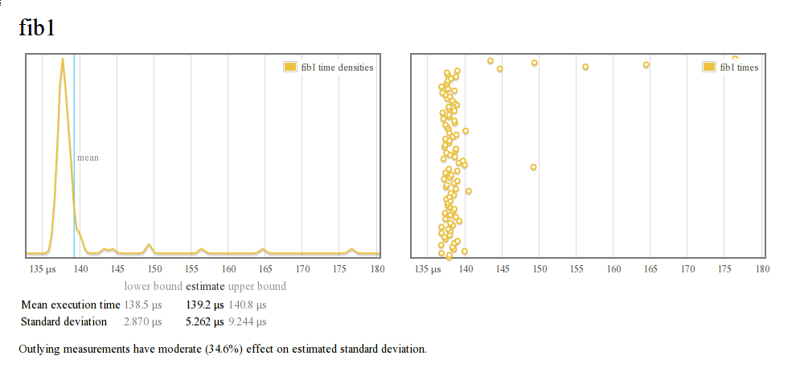
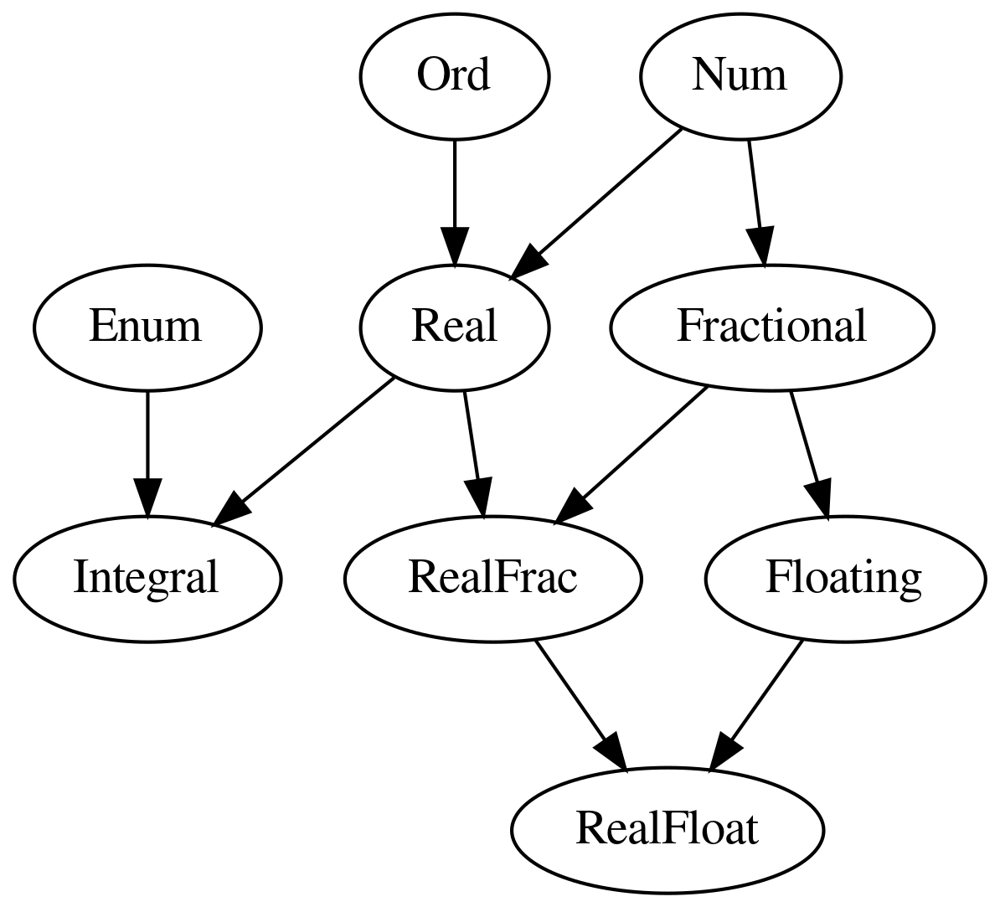
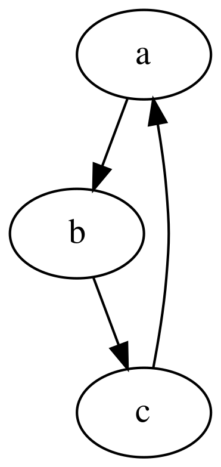
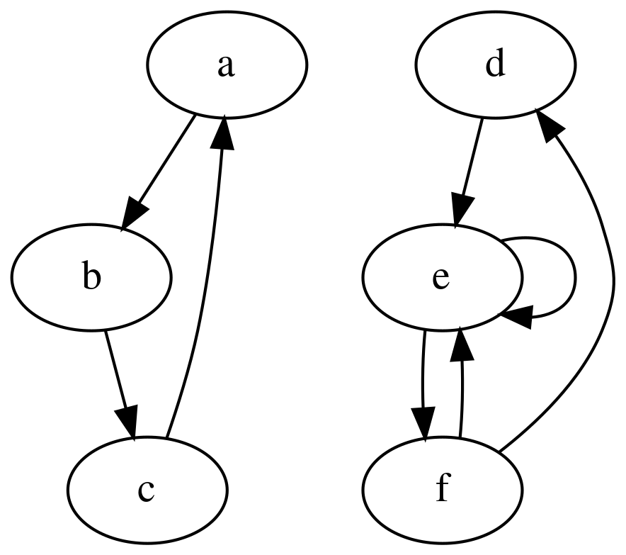
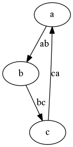
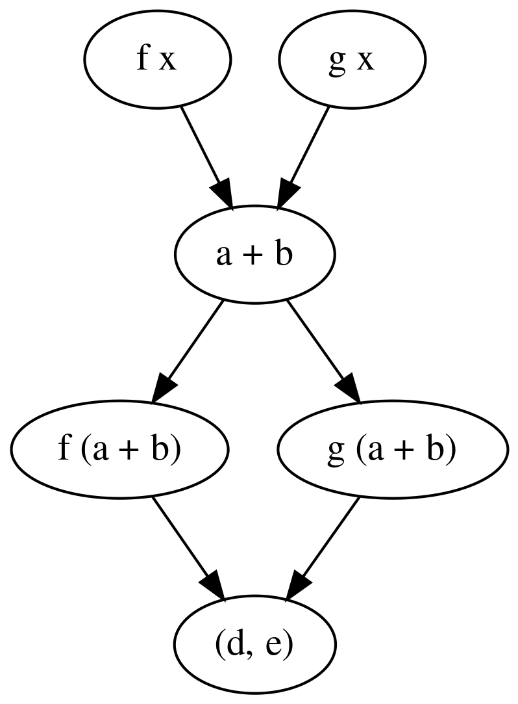
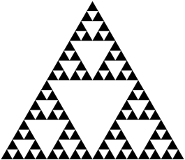
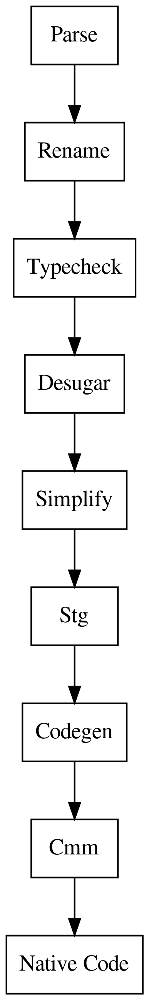
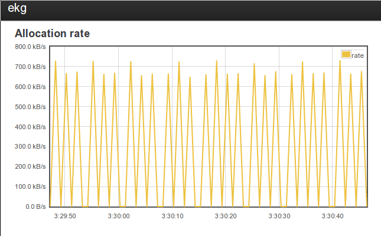

% What I Wish I Knew When Learning Haskell (Version 2.3)
% Stephen Diehl
% March 2016

Stephen Diehl (<a class="author" href="https://twitter.com/smdiehl">@smdiehl</a> )

This is the fourth draft of this document.

**[PDF Version](tutorial.pdf)**

#### License

This code and text are dedicated to the public domain. You can copy, modify,
distribute and perform the work, even for commercial purposes, all without
asking permission.

You may copy and paste any code here verbatim into your codebase, wiki, blog,
book or Haskell musical production as you see fit. The Markdown and Haskell
source is [available on
Github](https://github.com/sdiehl/wiwinwlh/tree/master/src). Pull requests are
always accepted for changes and additional content. This is a living document.


#### Changelog

**2.3**

* Stack
* Stackage
* ghcid
* Nix (Removed)
* Aeson (Updated)
* Language Extensions (Updated)
* Type Holes (Updated)
* Partial Type Signatures
* Pattern Synonyms (Updated)
* Unboxed Types ( Updated )
* Vim Integration ( Updated )
* Emacs Integration ( Updated )
* Strict Language Extension
* Injective Type Families
* Custom Type Errors
* Language Comparisons
* Recursive Do
* Applicative Do
* LiquidHaskell
* Cpp
* Minimal Pragma
* Typeclass Extensions
* ExtendedDefaultRules
* mmorph
* integer-gmp
* Static Pointers
* spoon
* monad-control
* monad-base
* postgresql-simple
* hedis
* happy/alex
* configurator
* string-conv
* resource-pool
* resourcet
* optparse-applicative
* hastache
* silently
* Mulitiline Strings
* git-embed
* Coercible
* -fdefer-type-errors

**2.2**

Sections that have had been added or seen large changes:

* Irrefutable Patterns
* Hackage
* Exhaustiveness
* Stacktraces
* Laziness
* Skolem Capture
* Foreign Function Pointers
* Attoparsec Parser
* Inline Cmm
* PrimMonad
* Specialization
* unbound-generics
* Editor Integration
* EKG
* Nix
* Haddock
* Corecursion
* Category
* Arrows
* Bifunctors
* ExceptT
* hint / mueval
* Roles
* Higher Kinds
* Kind Polymorphism
* Numeric Tower
* SAT Solvers
* Graph
* Sparks
* Threadscope
* Generic Parsers
* GHC Block Diagram
* GHC Debug Flags
* Core
* Inliner
* Unboxed Types
* Runtime Memory Representation
* ghc-heapview
* STG
* Worker/Wrapper
* Z-Encoding
* Cmm
* Runtime Optimizations
* RTS Profiling
* Algebraic Relations

<hr/>

Basics
======

Cabal
-----

<div class="alert alert-success">
Historically Cabal had a component known as ``cabal-install`` that has largely been
replaced by [Stack](#stack). The following use of Cabal sandboxes is left for
historical reasons and can often be replaced by modern tools.
</div>

[Cabal](https://www.haskell.org/cabal/) is the build system for Haskell.

For example, to install the [parsec](http://hackage.haskell.org/package/parsec)
package to our system from [Hackage](#hackage), the upstream source of Haskell
packages, invoke the ``install`` command:

```bash
$ cabal install parsec           # latest version
$ cabal install parsec==3.1.5    # exact version
```

The usual build invocation for Haskell packages is the following:

```bash
$ cabal get parsec    # fetch source
$ cd parsec-3.1.5

$ cabal configure
$ cabal build
$ cabal install
```

To update the package index from Hackage, run:

```bash
$ cabal update
```

To start a new Haskell project, run:

```bash
$ cabal init
$ cabal configure
```

A ``.cabal`` file will be created with the configuration options for our new
project.

The latest feature of ``cabal`` is the addition of
[Sandboxes](http://coldwa.st/e/blog/2013-08-20-Cabal-sandbox.html), ( in
cabal > 1.18 ) which are self contained environments of Haskell packages
separate from the global package index stored in the ``./.cabal-sandbox`` of our
project's root. To create a new ``sandbox`` for our ``cabal`` project, run:

```bash
$ cabal sandbox init
```

Additionally, the ``sandbox`` can be torn down:

```bash
$ cabal sandbox delete
```

When in the working directory of a project with a ``sandbox`` that has a configuation
already set up, invoking ``cabal`` commands alters the behaviour of cabal itself. For
instance, the ``cabal install`` command will alter only the install to the local
package index, not the global configuration.

To install the dependencies from the ``.cabal`` file into the newly created
``sandbox``, run:

```bash
$ cabal install --only-dependencies
```

Dependencies can also be built in parallel by passing ``-j<n>`` where ``n`` is
the number of concurrent builds.

```bash
$ cabal install -j4 --only-dependencies
```

Let's look at an example ``.cabal`` file. There are two main entry points that
any package may provide: a ``library`` and an ``executable``. Multiple
executables can be defined but only one library. In addition, there is a special
form of executable entry point ``Test-Suite``, which defines an interface for
invoking unit tests from ``cabal``.

For a library, the ``exposed-modules`` field in the ``.cabal`` file indicates
which modules within the package structure will be publicly visible when the
package is installed. These modules are the user-facing APIs that we wish to
expose to downstream consumers.

For an executable, the ``main-is`` field indicates the Main module for the
project that exports the ``main`` function that runs the executable logic of
the application. Every module in the package must be listed in one of
``other-modules``, ``exposed-modules`` or ``main-is`` fields.


```bash
name:               mylibrary
version:            0.1
cabal-version:      >= 1.10
author:             Paul Atreides
license:            MIT
license-file:       LICENSE
synopsis:           The code must flow.
category:           Math
tested-with:        GHC
build-type:         Simple

library
    exposed-modules:
      Library.ExampleModule1
      Library.ExampleModule2

    build-depends:
      base >= 4 && < 5

    default-language: Haskell2010

    ghc-options: -O2 -Wall -fwarn-tabs

executable "example"
    build-depends:
        base >= 4 && < 5,
        mylibrary == 0.1
    default-language: Haskell2010
    main-is: Main.hs

Test-Suite test
  type: exitcode-stdio-1.0
  main-is: Test.hs
  default-language: Haskell2010
  build-depends:
      base >= 4 && < 5,
      mylibrary == 0.1
```

To run the "executable" for a library under the ``cabal`` ``sandbox``:

```bash
$ cabal run
$ cabal run <name>
```

To load the "library" into a [GHCi](#ghci) shell under ``cabal`` ``sandbox``:

```bash
$ cabal repl
$ cabal repl <name>
```

The ``<name>`` metavariable is either one of the executable or library
declarations in the ``.cabal`` file and can optionally be disambiguated by the
prefix ``exe:<name>`` or ``lib:<name>`` respectively.

To build the package locally into the ``./dist/build`` folder, execute the
``build`` command:

```bash
$ cabal build
```

To run the tests, our package must itself be reconfigured with the
``--enable-tests`` and the ``build-depends`` options. The ``Test-Suite`` must be
installed manually, if not already present.

```bash
$ cabal install --only-dependencies --enable-tests
$ cabal configure --enable-tests
$ cabal test
$ cabal test <name>
```

Moreover, arbitrary shell commands can be invoked with the
[GHC](https://www.haskell.org/ghc/) environmental variables set up for the
``sandbox``. Quite common is to invoke a new shell with this command such that
the ``ghc`` and ``ghci`` commands use the ``sandbox``. ( They don't by default,
which is a common source of frustration. ).

```bash
$ cabal exec
$ cabal exec sh # launch a shell with GHC sandbox path set.
```

The [haddock](#haddock) documentation can be generated for the local project by
executing the ``haddock`` command. The documentation will be built to
the ``./dist`` folder.

```bash
$ cabal haddock
```

When we're finally ready to upload to Hackage ( presuming we have a Hackage
account set up ), then we can build the tarball and upload with the following
commands:

```bash
$ cabal sdist
$ cabal upload dist/mylibrary-0.1.tar.gz
```

Sometimes you'd also like to add a library from a local project into
a ``sandbox``. In this case, run the ``add-source`` command to bring the
library into the ``sandbox`` from a local directory:

```bash
$ cabal sandbox add-source /path/to/project
```

The current state of a ``sandbox`` can be frozen with all current package
constraints enumerated:

```bash
$ cabal freeze
```

This will create a file ``cabal.config`` with the constraint set.

```haskell
constraints: mtl ==2.2.1,
             text ==1.1.1.3,
             transformers ==0.4.1.0
```

Using the ``cabal repl`` and ``cabal run`` commands is preferable, but sometimes
we'd like to manually perform their equivalents at the shell. Several useful
aliases rely on shell directory expansion to find the package database in the
current working directory and launch GHC with the appropriate flags:

```bash
alias ghc-sandbox="ghc -no-user-package-db -package-db .cabal-sandbox/*-packages.conf.d"
alias ghci-sandbox="ghci -no-user-package-db -package-db .cabal-sandbox/*-packages.conf.d"
alias runhaskell-sandbox="runhaskell -no-user-package-db -package-db .cabal-sandbox/*-packages.conf.d"
```

There is also a zsh script to show the sandbox status of the current working
directory in our shell:

```bash
function cabal_sandbox_info() {
    cabal_files=(*.cabal(N))
    if [ $#cabal_files -gt 0 ]; then
        if [ -f cabal.sandbox.config ]; then
            echo "%{$fg[green]%}sandboxed%{$reset_color%}"
        else
            echo "%{$fg[red]%}not sandboxed%{$reset_color%}"
        fi
    fi
}

RPROMPT="\$(cabal_sandbox_info) $RPROMPT"
```

The ``cabal`` configuration is stored in ``$HOME/.cabal/config`` and contains
various options including credential information for Hackage upload. One
addition to configuration is to completely disallow the installation of packages
outside of sandboxes to prevent accidental collisions.

```perl
-- Don't allow global install of packages.
require-sandbox: True
```

A library can also be compiled with runtime profiling information enabled. More
on this is discussed in the section on [Concurrency](#concurrency) and
[Profiling](#profiling).

```perl
library-profiling: True
```

Another common flag to enable is ``documentation`` which forces the local
build of Haddock documentation, which can be useful for offline reference. On a
Linux filesystem these are built to the ``/usr/share/doc/ghc-doc/html/libraries/``
directory.

```perl
documentation: True
```

If GHC is currently installed, the documentation for the Prelude and Base
libraries should be available at this local link:

[/usr/share/doc/ghc-doc/html/libraries/index.html](file:///usr/share/doc/ghc-doc/html/libraries/index.html)


See:

* [An Introduction to Cabal Sandboxes](http://coldwa.st/e/blog/2013-08-20-Cabal-sandbox.html)
* [Storage and Identification of Cabalized Packages](http://www.vex.net/~trebla/haskell/sicp.xhtml)

Stack
-----

[Stack](http://docs.haskellstack.org/en/stable/README/) is a new approach to
Haskell package structure that emerged in 2015. Instead of using a rolling
build like ``cabal-install``,  ``stack`` breaks up sets of packages into
release blocks that guarantee internal compatibility between sets of packages.
The package solver for ``stack`` uses a different, more robust strategy for
resolving dependencies than ``cabal-install`` has historically used.

<div class="alert alert-success">
Contrary to much misinformation, **Stack does not replace [Cabal](#cabal) as
the build system** and [uses it under the
hood](http://docs.haskellstack.org/en/stable/faq/#what-is-the-relationship-between-stack-and-cabal).
Stack simply streamlines integration with third-party packages and the
resolution of their dependencies.
</div>

</hr>

#### Install

To install ``stack`` on Ubuntu Linux, run:

```bash
sudo apt-key adv --keyserver keyserver.ubuntu.com --recv-keys 575159689BEFB442                             # get fp complete key
echo 'deb http://download.fpcomplete.com/ubuntu trusty main'|sudo tee /etc/apt/sources.list.d/fpco.list    # add appropriate source repo
sudo apt-get update && sudo apt-get install stack -y
```

For other operating systems, see [the official install
directions](http://docs.haskellstack.org/en/stable/install_and_upgrade/).

#### Usage

Once ``stack`` is installed, it is possible to setup a build environment on top
of your existing project's ``cabal`` file by running:

```bash
stack init
```

An example ``stack.yaml`` file for [GHC](https://www.haskell.org/ghc) 7.10.2 would look like:

```bash
resolver: lts-3.14
flags: {}
extra-package-dbs: []
packages: []
extra-deps: []
```

Most of the common libraries used in everyday development are already in the
[Stackage](https://www.stackage.org/) repository. The ``extra-deps`` field
can be used to add [Hackage](http://hackage.haskell.org/) dependencies that are
not in the Stackage repository. They are specified by the package and the
version key. For instance, the ``zenc`` package could be added to
the ``stack`` build:

```
extra-deps:
- zenc-0.1.1
```

The ``stack`` command can be used to install packages and executables into
either the current build environment or the global environment. For example, the
following command installs the executable for ``hlint``, [a popular linting tool for
Haskell](https://github.com/ndmitchell/hlint), and places it in the PATH:

```bash
$ stack install hlint
```

To check the set of dependencies, run:

```bash
$ stack list-dependencies
```

Just as with ``cabal``,  the build and debug process can be orchestrated using
``stack`` commands:

```bash
$ stack build                 # Build a cabal target
$ stack repl                  # Launch ghci
$ stack ghc                   # Invoke the standalone compiler in stack environment
$ stack exec bash             # Execute a shell command with the stack GHC environment variables
$ stack build --file-watch    # Build on every filesystem change
```

To visualize the dependency graph, use the dot command piped first into
graphviz, then piped again into your favorite image viewer:

```bash
$ stack dot --external | dot -Tpng | feh -
```

Flags
-----

Enabling [GHC](https://www.haskell.org/ghc) [compiler
flags](https://downloads.haskell.org/~ghc/latest/docs/html/users_guide/flag-reference.html)
grants the user more control in detecting common code errors. The most
frequently used flags are:

Flag                                 Description
----                                 ------------
-fwarn-tabs                          Emit warnings of tabs instead of spaces in the source code
-fwarn-unused-imports                Warn about libraries imported without being used
-fwarn-name-shadowing                Warn on duplicate names in nested bindings
-fwarn-incomplete-uni-patterns       Emit warnings for incomplete patterns in lambdas or pattern bindings
-fwarn-incomplete-patterns           Warn on non-exhaustive patterns
-fwarn-overlapping-patterns          Warn on pattern matching branches that overlap
-fwarn-incomplete-record-updates     Warn when records are not instantiated with all fields
-fdefer-type-errors                  Turn type errors into warnings
-fwarn-missing-signatures            Warn about toplevel missing type signatures
-fwarn-monomorphism-restriction      Warn when the monomorphism restriction is applied implicitly
-fwarn-orphans                       Warn on orphan typeclass instances
-fforce-recomp                       Force recompilation regardless of timestamp
-fno-code                            Don't doing code generation, just parse and typecheck
-fobject-code                        Don't doing code generation, just parse and typecheck

Like most compilers, GHC takes the ``-Wall`` flag to enable all warnings.
However, a few of the enabled warnings are highly verbose. For example,
``-fwarn-unused-do-bind`` and ``-fwarn-unused-matches`` typically
would not correspond to errors or failures.

Any of these flags can be added to the ``ghc-options`` section of a
project's ``.cabal`` file. For example:

```perl
library mylib

  ghc-options:
    -fwarn-tabs
    -fwarn-unused-imports
    -fwarn-missing-signatures
    -fwarn-name-shadowing
    -fwarn-incomplete-patterns
```

The flags described above are simply the most useful. See the [official
reference](https://downloads.haskell.org/~ghc/latest/docs/html/users_guide/flag-reference.html)
for the complete set of GHC's supported flags.

For information on debugging GHC internals, see the [commentary](#block-diagram)
on GHC internals.

Hackage
-------

[Hackage](http://hackage.haskell.org/) is the upstream source of
[Free](://www.fsf.org/about/what-is-free-software) and/or [Open
Source](https://opensource.org/) Haskell packages. With Haskell's continuing
evolution, Hackage has become many things to developers, but there seem to be
two dominant philosophies of uploaded libraries.

**Reusable Code / Building Blocks**

In the first philosophy, libraries exist as reliable, community-supported
building blocks for constructing higher level functionality on top of a common,
stable edifice. In development communities where this method is the dominant
philosophy, the author(s) of libraries have written them as a means of packaging
up their understanding of a problem domain so that others can build on their
understanding and expertise.

**A Staging Area / Request for Comments**

In contrast to the previous method of packaging, a common philosophy in the
Haskell community is that Hackage is a place to upload experimental libraries
as a means of getting community feedback and making the code publicly available.
Library author(s) often rationalize putting these kind of libraries up
undocumented, often without indication of what the library actually does, by
simply stating that they intend to tear the code down and rewrite it later. This
approach unfortunately means a lot of Hackage namespace has become polluted
with dead-end, bit-rotting code. Sometimes packages are also uploaded purely for
internal use within an organisation, to accompany a paper, or just to
integrate with the ``cabal`` build system. These packages are often left
undocumented as well.

For developers coming to Haskell from other language ecosystems that favor
the former philsophy (e.g., Python, Javascript, Ruby), seeing  *thousands of
libraries without the slightest hint of documentation or description of purpose*
can be unnerving. It is an open question whether the current cultural state of
Hackage is sustainable in light of these philsophical differences.

Needless to say, there is a lot of very low-quality Haskell code and
documentation out there today, so being conservative in library assessment is a
necessary skill. That said, there are also quite a few phenomenal libraries on
Hackage that are highly curated by many people.

As a general rule, if the Haddock documentation for the library does not have
a **minimal worked example**, it is usually safe to assume that it is an
RFC-style library and probably should be avoided in production-grade code.

Similarly, if the library **predates the
[text](http://hackage.haskell.org/package/text) library** (released circa
2007), it probably should be avoided in production code. The way we write
Haskell has changed drastically since the early days.

GHCi
----

[GHCi](https://wiki.haskell.org/GHC/GHCi) is the interactive shell for the
[GHC](https://www.haskell.org/GHC) compiler. GHCi is where we will spend
most of our time in every day development.

Command    Shortcut   Action
---------  ---------  --------------------------
`:reload`  `:r`       Code reload
`:type`    `:t`       Type inspection
`:kind`    `:k`       Kind inspection
`:info`    `:i`       Information
`:print`   `:p`       Print the expression
`:edit`    `:e`       Load file in system editor
`:load`    `:l`       Set the active Main module in the REPL
`:add`     `:ad`      Load a file into the REPL namespace
`:browse`  `:bro`     Browse all available symbols in the REPL namespace

The introspection commands are an essential part of debugging and interacting
with Haskell code:

```haskell
λ: :type 3
3 :: Num a => a
```

```haskell
λ: :kind Either
Either :: * -> * -> *
```

```haskell
λ: :info Functor
class Functor f where
  fmap :: (a -> b) -> f a -> f b
  (<$) :: a -> f b -> f a
        -- Defined in `GHC.Base'
  ...
```

```haskell
λ: :i (:)
data [] a = ... | a : [a]       -- Defined in `GHC.Types'
infixr 5 :
```

Querying the current state of the global environment in the shell is also
possible. For example, to view module-level bindings and types in GHCi, run:

```haskell
λ: :browse
λ: :show bindings
```

Examining module-level imports, execute:

```haskell
λ: :show imports
import Prelude -- implicit
import Data.Eq
import Control.Monad
```

To see compiler-level flags and pragmas, use:

```haskell
λ: :set
options currently set: none.
base language is: Haskell2010
with the following modifiers:
  -XNoDatatypeContexts
  -XNondecreasingIndentation
GHCi-specific dynamic flag settings:
other dynamic, non-language, flag settings:
  -fimplicit-import-qualified
warning settings:

λ: :showi language
base language is: Haskell2010
with the following modifiers:
  -XNoDatatypeContexts
  -XNondecreasingIndentation
  -XExtendedDefaultRules
```

Language extensions and compiler pragmas can be set at the prompt. See the [Flag
Reference](#flags) for the vast collection of compiler flag options.

Several commands for the interactive shell have shortcuts:

        Function
------  ---------
``+t``  Show types of evaluated expressions
``+s``  Show timing and memory usage
``+m``  Enable multi-line expression delimited by ``:{`` and ``:}``.


```haskell
λ: :set +t
λ: []
[]
it :: [a]
```

```haskell
λ: :set +s
λ: foldr (+) 0 [1..25]
325
it :: Prelude.Integer
(0.02 secs, 4900952 bytes)
```

```haskell
λ: :{
λ:| let foo = do
λ:|           putStrLn "hello ghci"
λ:| :}
λ: foo
"hello ghci"
```

The configuration for the GHCi shell can be customized globally by defining a
``ghci.conf`` in ``$HOME/.ghc/`` or in the current working directory as
``./.ghci.conf``.

For example, we can add a command to use the
[Hoogle](https://www.haskell.org/hoogle/) type search from within GHCi. First,
install ``hoogle``:

```bash
cabal install hoogle
```

Then, we can enable the search functionality  by adding a command to
our ``ghci.conf``:

~~~~ {.haskell include="src/01-basics/ghci.conf"}
~~~~

```haskell
λ: :hoogle (a -> b) -> f a -> f b
Data.Traversable fmapDefault :: Traversable t => (a -> b) -> t a -> t b
Prelude fmap :: Functor f => (a -> b) -> f a -> f b
```

For reasons of sexiness, it is desirable to set your GHC prompt to a ``λ`` or a
``λΠ``. Only if you're into that lifestyle, though.

```haskell
:set prompt "λ: "
:set prompt "ΠΣ: "
```

#### GHCi Performance

For large projects, GHCi with the default flags can use quite a bit of memory
and take a long time to compile. To speed compilation by keeping artificats for
compiled modules around, we can enable object code compilation instead of
bytecode.

```haskell
:set -fobject-code
```

Enabling object code compliation may complicate type inference, since type
information provided to the shell can sometimes be less informative than
source-loaded code. This under specificity can result in breakage with some
langauge extensions. In that case, you can temporarily reenable bytecode
compilation on a per module basis with the ``-fbyte-code`` flag.

```haskell
:set -fbyte-code
:load MyModule.hs
```

If you all you need is to typecheck your code in the interactive shell, then
disabling code generation entirely makes reloading code almost instantaneous:

```haskell
:set -fno-code
```

Editor Integration
---------------

Haskell has a variety of editor tools that can be used to provide interactive
development feedback and functionality such as querying types of subexpressions,
linting, type checking, and code completion.

Several prepackaged setups exist to expedite the process of setting up many of
the programmer editors for Haskell development. In particular,
using ``ghc-mod`` can remarkably improve programmer efficiency and productivity
because [the project](http://www.mew.org/~kazu/proj/ghc-mod/en/) attempts to
implement features common to modern IDEs.

**Vim**

* [haskell-vim-now](https://github.com/begriffs/haskell-vim-now)
* [Vim and Haskell in 2016](http://www.stephendiehl.com/posts/vim_2016.html)

**Emacs**

* [Chris Done's Emacs Config](https://github.com/chrisdone/emacs-haskell-config)
* [Haskell Development From Emacs](http://tim.dysinger.net/posts/2014-02-18-haskell-with-emacs.html)
* [Structured Haskell Mode](https://github.com/chrisdone/structured-haskell-mode)

Bottoms
-------

The bottom is a singular value that inhabits every type. When this value is
evaluated, the semantics of Haskell no longer yield a meaningful value. In
other words, further operations on the value cannot be defined in Haskell. A
bottom value is usually written as the symbol
[⊥](https://en.wikipedia.org/wiki/Up_tack), ( i.e. the compiler flipping you
off ). Several ways exist to express bottoms in Haskell code.

For instance, ``undefined`` is an easily called example of a bottom value.
This function has type ``a`` but lacks any type constraints in its type
signature. Thus, ``undefined`` is able to stand in for any type in a function
body, allowing type checking to succeed, even if the function is incomplete or
lacking a definition entirely. The ``undefined`` function is extremely
practical for debugging or to accommodate writing incomplete programs.

```haskell
undefined :: a


mean :: Num a => Vector a -> a
mean nums = (total / count) where            -- Partially defined function
              total = undefined
              count = undefined

addThreeNums :: Num a => a -> a -> a -> a
addThreeNums n m j = undefined               -- No function body declared at all

f :: a -> Complicated Type
f = undefined                                -- Write tomorrow, typecheck today!
                                             -- Arbitrarily complicated types
                                             -- welcome!
```

Another example of a bottom value comes from the evaluation of the``error``
function, which takes a ``String`` and returns something that can be of any
type. This property is quite similar to ``undefined``, which also can also
stand in for any type.

Calling ``error`` in a function causes the compiler to throw an
exception, halt the program, and print the specified error message. In the
``divByY`` function below, passing the function ``0`` as the divisor results
in this function results in such an exception.

```haskell
error :: String -> a                       -- Takes an error message of type
                                           -- String and returns what ever type
                                           -- is needed
```

~~~~ {.haskell include="src/01-basics/errors.hs"}
~~~~

A third type way to express a bottom is with an infinitely looping term:

```haskell
f :: a
f = let x = x in x
```

Examples of actual Haskell code that use this looping syntax live in the source
code of the [GHC.Prim](https://hackage.haskell.org/package/ghc-prim-0.4.0.0/docs/GHC-Prim.html)
module. These bottoms exist because the operations [cannot be defined in native
Haskell](https://downloads.haskell.org/~ghc/7.10.3/docs/html/users_guide/primitives.html).
Such operations are baked into the compiler at a very low level. However, this
module exists so that [Haddock](#haddock) can generate documentation for these
primative operations, while the looping syntax serves as a placeholder for the
actual implementation of the primops.

Perhaps the most common introduction to bottoms is writing a partial function
that does not have [exhaustive](#exhaustiveness) pattern matching defined. For
example, the following code has non-exhaustive pattern matching because
the ``case`` expression, lacks a definition of what to do with a ``B``:

```haskell
data F = A | B
case x of
  A -> ()
```

The code snippet immediately above is translated into the following [GHC
Core](#code) output. The compiler inserts an exception to account for the
non-exhaustive patterns:

```haskell
case x of _ {
  A -> ();
  B -> patError "<interactive>:3:11-31|case"
}
```

GHC can be made more vocal about incomplete patterns using
the ``-fwarn-incomplete-patterns`` and ``-fwarn-incomplete-uni-patterns``flags.

A similar situation can arise with records. Although constructing a record with
missing fields is rarely useful, it is still possible.

```haskell
data Foo = Foo { example1 :: Int }
f = Foo {}     -- Record defined with a missing field
```

When the developer omits a field's definition, the compiler inserts an
exception in the GHC Core representation:

```haskell
Foo (recConError "<interactive>:4:9-12|a")
```

Fortunately, GHC will warn us by default about missing record fields.

Bottoms are used extensively throughout [the Prelude](#prelude), although this
fact may not be immediately apparent. The reasons for including bottoms are
either practical or historical.

The canonical example is the ``head`` function which has type ``[a] -> a``.
This function could not be well-typed without the bottom.

~~~~ {.haskell include="src/01-basics/bottoms.hs"}
~~~~

It is rare to see these partial functions thrown around carelessly in production
code because they cause the program to halt. The preferred method for handling
exceptions is instead to combine the use of safe variants provided in
``Data.Maybe``with the usual fold functions ``maybe`` and ``either``.

Another method is to use pattern matching, as shown in ``listToMaybe``, a
safer version of ``head`` described below:

```haskell
listToMaybe :: [a] -> Maybe a
listToMaybe []     =  Nothing    -- An empty list returns Nothing
listToMaybe (a:_)  =  Just a     -- A non-empty list returns the first element
                                 -- wrapped in the Just context.
```

Invoking a bottom defined in terms of ``error`` typically will not generate any
position information. However, ``assert``, which is used to provide assertions,
can be short-circuited to generate position information in the place of either
``undefined`` or ``error`` calls.

~~~~ {.haskell include="src/01-basics/fail.hs"}
~~~~

See: [Avoiding Partial Functions](https://wiki.haskell.org/Avoiding_partial_functions)

Exhaustiveness
--------------

Pattern matching in Haskell allows for the possibility of non-exhaustive
patterns. For example, passing Nothing to ``unsafe``  will cause the program
to crash at runtime. However, this function is an otherwise valid, type-checked
program.

```haskell
unsafe :: Num a => Maybe a -> Maybe a
unsafe (Just x) = Just $ x + 1
```

Since ``unsafe`` takes a ``Maybe a`` value as its argument, two possible
values are valid input: ``Nothing```and ``Just a``. Since the case of a
``Nothing`` was not defined in ``unsafe``, we say that the pattern matching
within that function is *non-exhaustive*. In other words, the function does not
implement appropriate handling of all valid inputs. Instead of yielding a value,
such a function will halt from an incomplete match.

Partial functions from non-exhaustivity are a controversial subject, and
frequent use of non-exhaustive patterns is considered a dangerous code smell.
However, the complete removal of non-exhaustive patterns from the language
would itself be too restrictive and forbid too many valid programs.

Several flags exist that we can pass to the compiler to warn us about such
patterns or forbid them entirely either locally or globally.

```haskell
$ ghc -c -Wall -Werror A.hs
A.hs:3:1:
    Warning: Pattern match(es) are non-exhaustive
             In an equation for `unsafe': Patterns not matched: Nothing
```

The ``-Wall`` or ``-fwarn-incomplete-patterns`` flag can also be added on a
per-module basis by using the ``OPTIONS_GHC``
[pragma](https://downloads.haskell.org/~ghc/7.10.3/docs/html/users_guide/pragmas.html).

```haskell
{-# OPTIONS_GHC -Wall #-}
{-# OPTIONS_GHC -fwarn-incomplete-patterns #-}
```

A more subtle case of non-exhaustivity is the use of implicit pattern matching
with a single *uni-pattern* in a lambda expression. In a manner similar to
the ``unsafe`` function above, a uni-pattern cannot handle all types of valid
input. For instance, the function ``boom`` will fail when given a Nothing,
even though the type of the lambda expression's argument is a ``Maybe a``.

```haskell
boom = \(Just a) -> something
```

Non-exhaustivity arising from uni-patterns in lambda expressions occurs
frequently in ``let`` or ``do``-blocks after desugaring because such
code is translated into lambda expressions similar to ``boom``.

```haskell
boom2 = let
  Just a = something

boom3 = do
  Just a <- something
```

GHC can warn about these cases of non-exhaustivity with
the ``-fwarn-incomplete-uni-patterns`` flag.

Grossly speaking, any non-trivial program will use some measure of partial
functions. It is simply a fact. Thus, there exists obligations for the
programmer than cannot be manifest in the Haskell type system.

Debugger
--------

Since [GHCi](#ghci) version 6.8.1, a built-in
[debugger](https://downloads.haskell.org/~ghc/latest/docs/html/users_guide/ghci-debugger.html).
has been available, although its use is somewhat rare. Debugging uncaught
exceptions from bottoms or asynchronous exceptions is in similar style to
debugging segfaults with gdb.

```haskell
λ: :set -fbreak-on-exception       -- Sets option for evaluation to stop on exception
λ: :break 2 15                     -- Sets a break point at line 2, column 15
λ: :trace main                     -- Run a function to generate a sequence of evaluation steps
λ: :hist                           -- Step backwards from a breakpoint through previous steps of evaluation
λ: :back                           -- Step backwards a single step at a time through the history
λ: :forward                        -- Step forward a single step at a time through the history
```

Stack Traces
-----------

With [runtime profiling
enabled](https://downloads.haskell.org/~ghc/latest/docs/html/users_guide/profiling.html),
[GHC](https://www.haskell.org/ghc/) can also print a stack trace when a
diverging bottom term (error, undefined) is hit. This action, though, requires
a special flag and profiling to be enabled, both of which are disabled by
default. So for example:

~~~~ {.haskell include="src/01-basics/stacktrace.hs"}
~~~~

```haskell
$ ghc -O0 -rtsopts=all -prof -auto-all --make stacktrace.hs
./stacktrace +RTS -xc
```

And indeed, the runtime tells us that the exception occurred in the function
``g`` and enumerates the call stack.

```haskell
*** Exception (reporting due to +RTS -xc): (THUNK_2_0), stack trace:
  Main.g,
  called from Main.f,
  called from Main.main,
  called from Main.CAF
  --> evaluated by: Main.main,
  called from Main.CAF
```

It is best to run this code without optimizations applied ``-O0`` so as to
preserve the original call stack as represented in the source. With
optimizations applied, GHC will rearrange the program in rather drastic ways,
resulting in what may be an entirely different call stack.

See:

* [xc flag](https://downloads.haskell.org/~ghc/latest/docs/html/users_guide/runtime-control.html#idp13041968)

Trace
-----

Since Haskell is a [pure
language](http://dev.stephendiehl.com/fun/000_introduction.html#functional-languages),
it has the unique property that most code is introspectable on its own. As such,
using [printf](https://www.codingunit.com/printf-format-specifiers-format-conversions-and-formatted-output)
to display the state of the program at critical times throughout execution is
often unnecessary because we can simply open [GHCi](#ghci) and test the
function. Nevertheless, Haskell does come with an unsafe ``trace`` function
which can be used to perform arbitrary print statements outside of the IO monad.

~~~~ {.haskell include="src/01-basics/trace.hs"}
~~~~


<div class="alert alert-danger">
Trace uses ``unsafePerformIO`` under the hood and should **not** be used in
stable code.
</div>

In addition to the ``trace`` function, several monadic ``trace`` varients are
quite common.

```haskell
import Text.Printf
import Debug.Trace

traceM :: (Monad m) => String -> m ()
traceM string = trace string $ return ()

traceShowM :: (Show a, Monad m) => a -> m ()
traceShowM = traceM . show

tracePrintfM :: (Monad m, PrintfArg a) => String -> a -> m ()
tracePrintfM s = traceM . printf s
```

Type Holes
----------

Since the release of GHC 7.8, *typed holes* allow for debugging incomplete
programs. By placing an underscore on any value on the right hand-side of a
declaration, [GHC](https://www.haskell.org/ghc/) will throw an error during
type-checking. Such an error reflects what type(s) the value in the position
of the type hole could be in order to cause the program to type-check
successfully.

```haskell
instance Functor [] where
  fmap f (x:xs) = f x : fmap f _
```

```bash
[1 of 1] Compiling Main             ( src/typedhole.hs, interpreted )

src/typedhole.hs:7:32:
    Found hole ‘_’ with type: [a]
    Where: ‘a’ is a rigid type variable bound by
               the type signature for fmap :: (a -> b) -> [a] -> [b]
               at src/typedhole.hs:7:3
    Relevant bindings include
      xs :: [a] (bound at src/typedhole.hs:7:13)
      x :: a (bound at src/typedhole.hs:7:11)
      f :: a -> b (bound at src/typedhole.hs:7:8)
      fmap :: (a -> b) -> [a] -> [b] (bound at src/typedhole.hs:7:3)
    In the second argument of ‘fmap’, namely ‘_’
    In the second argument of ‘(:)’, namely ‘fmap f _’
    In the expression: f x : fmap f _
Failed, modules loaded: none.
```

GHC has rightly suggested that the expression needed to finish the program is
``xs :: [a]``.

Deferred Type Errors
--------------------

Since the release of version 7.8, [GHC](https://www.haskell.org/ghc/) supports
the option of treating type errors as runtime errors. With this option enabled,
programs will run, but they will fail when a mistyped expression is evaluated.
This feature is enabled with the ``-fdefer-type-errors`` flag in three ways:
at the module level, when compiled from the command line, or inside of a
[GHCi](#ghci) interactive session.

For instance, the program below will compile:

~~~~ {.haskell include="src/01-basics/defer.hs"}
~~~~
However, when a pathological term is evaluated at runtime, we'll see a message
like:

```bash
defer: defer.hs:4:5:
    Couldn't match expected type ‘()’ with actual type ‘IO ()’
    In the expression: print 3
    In an equation for ‘x’: x = print 3
(deferred type error)
```

This error tells us that while ``x`` has a declared type of ``()``, the body
of the function ``print 3`` has a type of ``IO ()``. However, if the term is
never evaluated, GHC will not throw an exception.

ghcid
-----

[ghcid](https://github.com/ndmitchell/ghcid) is a lightweight IDE hook that
allows continuous feedback whenever code is updated.  It is run from the
command line in the root of the ``cabal`` project directory by specifying a
command to run (e.g.,  ``ghci``, ``cabal repl``, or ``stack repl``).

```bash
ghcid --command="cabal repl"   # Run cabal repl under ghcid
ghcid --command="stack repl"   # Run stack repl under ghcid
ghcid --command="ghci baz.hs"  # Open baz.hs under ghcid
```
When a Haskell module is loaded into ``ghcid``, the code is evaluated in order
to provide the user with any errors or warnings that would happen at compile
time. When the developer edits and saves code loaded into ``ghcid``, the
program automatically reloads and evaluates the code for errors and warnings.

Haddock
-------

[Haddock](haskel://www.haskell.org/haddock/#Overview) is the automatic
documentation generation tool for Haskell source code. It integrates with the
usual ``cabal`` toolchain. In this section, we will explore how to document
code so that Haddock can generate documentation successfully.

Several frequent comment patterns are used to document code for Haddock. The
first of these methods uses ``--|`` to delineate the beginning of a comment:

```haskell
-- | Documentation for f
f :: a -> a
f = ...
```

Multiline comments are also possible:

```haskell
-- | Multiline documentation for the function
-- f with multiple arguments.
fmap :: Functor f =>
     => (a -> b)  -- ^ function
     -> f a       -- ^ input
     -> f b       -- ^ output
```

Using ``-- ^`` to comment on Constructors or Record fields is also possible:

```haskell
data T a b
  = A a -- ^ Documentation for A
  | B b -- ^ Documentation for B

data MyRecord = MR { name :: String -- ^ Documentation for name field
                   , age  :: Int    -- ^ Documentation for age field
                   } deriving (Eq, Show)
```

Elements within a module (i.e., value, types, classes) can be hyperlinked by
enclosing the identifier in single quotes:

```haskell
data T a b
  = A a -- ^ Documentation for 'A'
  | B b -- ^ Documentation for 'B'
```

Modules themselves can be referenced by enclosing them in double quotes:

```haskell
-- | Here we use the "Data.Text" library and import
-- the 'Data.Text.pack' function.
```

``haddock`` also allows the user to include blocks of code within the
generated documentation. Two methods of demarcating the code blocks
exist in ``haddock``. For example, enclosing a code snippet in ``@``
symbols marks it as a code block:

```haskell
-- | An example of a code block.
--
-- @
--    f x = f (f x)
-- @
```

Similarly, it's possible to use bird tracks (``>``) in a comment line to
set off a code block. This usage is very similar to [Bird style Literate
Haskell](https://wiki.haskell.org/Literate_programming#Bird_Style).

```haskell
-- | A similar code block example that uses bird tracks (i.e. '>')
-- > f x = f (f x)
```

Snippets of interactive shell sessions can be also include in ``haddock``
documentation. In order to denote the beginning of code intended to be
run in a REPL, the ``>>>`` symbol is used:

```haskell
-- | Example of an interactive shell session embedded within documentation
--
-- >>> factorial 5
-- 120
```

Headers for specific blocks can be added by prefacing the comment in the module
block with a ``*``:

```haskell
module Foo (
  -- * My Header
  example1,
  example2
)
```

Sections can also be delineated by ``$`` blocks that pertain to references in the
body of the module:

```haskell
module Foo (
  -- $section1
  example1,
  example2
)

-- $section1
-- Here is the documentation section that describes the symbols
-- 'example1' and 'example2'.
```

Links can be added with the following syntax:

```haskell
<url text>
```

Images can can also be included, so long as the path is either relative to the
directory in which ``haddock`` is run or an absolute reference.

```haskell
<<diagram.png title>>
```

``haddock`` options can also be specified with pragmas in the source, either at
the module or project level.

```haskell
{-# OPTIONS_HADDOCK show-extensions, ignore-exports #-}
```

Option           Description
------           -------------------------------
ignore-exports   Ignores the export list and includes all signatures in scope.
not-home         Module will not be considered in the root documentation.
show-extensions  Annotates the documentation with the language extensions used.
hide             Forces the module to be hidden from Haddock.
prune            Omits definitions with no annotations.

<hr/>

Monads
======

Eightfold Path to Monad Satori
------------------------------

Much ink has been spilled waxing lyrical about the supposed mystique of monads.
Instead, I suggest a path to enlightenment:

1. Don't read the monad tutorials.
2. No really, don't read the monad tutorials.
3. Learn about [Haskell types](http://book.realworldhaskell.org/read/types-and-functions.html).
4. Learn what a typeclass is.
5. Read the [Typeclassopedia](http://wiki.haskell.org/Typeclassopedia).
6. Read the monad definitions.
7. Use monads in real code.
8. Don't write monad-analogy tutorials.

In other words, the only path to understanding monads is to read the fine
source, fire up GHC, and write some code. Analogies and metaphors will not lead
to understanding.


Monadic Myths
-------------

The following are all **false**:

* Monads are impure.
* Monads are about effects.
* Monads are about state.
* Monads are about imperative sequencing.
* Monads are about IO.
* Monads are dependent on laziness.
* Monads are a "back-door" in the language to perform side-effects.
* Monads are an embedded imperative language inside Haskell.
* Monads require knowing abstract mathematics.
* Monads are unique to Haskell.

See: [What a Monad Is Not](http://wiki.haskell.org/What_a_Monad_is_not)

Monadic Methods
---------------

Monads are not complicated. They are implemented as a typeclass with two
methods, ``return`` and ``(>>=)`` (pronounced "bind"). In order to implement
a Monad instance, these two functions must be defined in accordance with the
arity described in the typeclass definition:

```haskell
class Monad m where
  return :: a -> m a                    -- N.B. 'm' refers to a type constructor
                                        -- (e.g., Maybe, Either, etc.) that
                                        -- implements the Monad typeclass

  (>>=)  :: m a -> (a -> m b) -> m b
```

The first type signature in the Monad class definition is for ``return``.
Any preconceptions one might have for the word "return" should be discarded:
It has an entirely different meaning in the context of Haskell and acts very
differently than in languages like C, Python, or Java. Instead of being the
final arbiter of what value a function produces, ``return`` in Haskell injects a
value of type ``a`` into a monadic context (e.g., Maybe, Either, etc.), which is
denoted as ``m a``.

The other function essential to implementing a Monad instance is ``(>>=)``.
This infix takes two arguments. On its left side is a value with type ``m a``,
while on the right side is a function with type ``(a -> m b)``. The bind
operation results in a final value of type ``m b``.

A third, auxiliary function (``(>>)``) is defined in terms of the bind operation
that discards its argument.

```haskell
(>>) :: Monad m => m a -> m b -> m b
m >> k = m >>= \_ -> k
```

This definition says that (>>) has a left and right argument which are monadic
with types ``m a`` and ``m b`` respectively, while the infix returns a value of
type ``m b``.  The actual implementation of (>>) says that when ``m`` is passed
to ``(>>)`` with ``k`` on the right, the value ``k`` will always be returned.

Laws
----

In addition to specific implementations of ``(>>=)`` and ``return``, all monad
instance must satisfy three laws.

**Law 1**

The first law says that when ``return a`` is passed through a ``(>>=)`` into a
function ``f``, this expression is exactly equivalent to ``f a``.

```haskell
return a >>= f ≡ f a    -- N.B. 'a' refers to a value, not a type
```

In discussing the next two laws, we'll refer to a value ``m``. This notation is
shorthand for value wrapped in a monadic context. Such a value has type ``m a``,
and could be represented more concretely by values like ``Nothing``, ``Just x``,
or ``Right x``. It is important to note that some of these concrete
instantiations of the value ``m`` have multiple components. In discussing the
second and third monad laws, we'll see some examples of how this plays out.

**Law 2**

The second law states that a monadic value ``m`` passed through ``(>>=)``
into ``return`` is exactly equivalent to itself. In other words, using bind to
pass a monadic value to ``return`` does not change the initial value.

```haskell
m >>= return ≡ m        -- 'm' here refers to a value that has type 'm a'
```

A more explicit way to write the second Monad law exists. In this following
example code, the first expression shows how the second law applies to values
represented by
[non-nullary](https://wiki.haskell.org/Constructor#Type_constructor) type
constructors. The second snippet shows how a value represented by a nullary type
constructor works within the context of the second law.

```haskell
(SomeMonad val) >>= return ≡ SomeMonad val  -- 'SomeMonad val' has type 'm a' just
                                            -- 'm' from the first example of the
                                            -- second law

NullaryMonadType >>= return ≡ NullaryMonadType
```

**Law 3**

While the first two laws are relatively clear, the third law may be more
difficult to understand. This law states that when a monadic value ``m`` is
passed through ``(>>=)`` to the function ``f`` and then the result of that
expression is passed to ``>>= g``, the entire expression is exactly equivalent
to passing ``m`` to a lamda expression that takes one parameter ``x`` and
outputs the function ``f`` applied to ``x``. By the definition of bind, ``f x``
*must* return a value wrapped in the same Monad. Because of this property, the
resultant value of that expression can be  passed through ``(>>=)`` to the
function ``g``, which also returns a monadic value.

```haskell
(m >>= f) >>= g ≡ m >>= (\x -> f x >>= g)  -- Like in the last law, 'm' has
                                           -- has type 'm a'. The functions 'f'
                                           -- and 'g' have types '(a -> m b)'
                                           -- and '(b -> m c)' respectively
```

Again, it is possible to write this law with more explicit code. Like in the
explict examples for law 2, ``m`` has been replaced by ``SomeMonad val`` in
order to be very clear that there can be multiple components to a monadic value.
Although little has changed in the code, it is easier to see what
value--namely, ``val``--corresponds to the ``x`` in the lambda expression.
After ``SomeMonad val`` is passed through ``(>>=)`` to ``f``, the function ``f``
operates on ``val`` and returns a result still wrapped in the ``SomeMonad``
type constructor. We can call this new value ``SomeMonad newVal``. Since it is
still wrapped in the monadic context, ``SomeMonad newVal`` can thus be passed
through the bind operation into the function ``g``.

```haskell
((SomeMonad val) >>= f) >>= g ≡ (SomeMonad val) >>= (\x -> f x >>= g)

```

See: [Monad Laws](http://wiki.haskell.org/Monad_laws)

Do Notation
-----------

Monadic syntax in Haskell is written in a sugared form, known as ``do``
notation. The advantages of this special syntax are that it is easier to write
and is entirely equivalent to just applications of the monad operations. The
desugaring is defined recursively by the rules:

```haskell
do { a <- f ; m } ≡ f >>= \a -> do { m }  -- bind 'f' to a, proceed to desugar
                                          -- 'm'

do { f ; m } ≡ f >> do { m }              -- evaluate 'f', then proceed to
                                          -- desugar  m

do { m } ≡ m
```

Thus, through the application of the desugaring rules, the following expressions
are equivalent:

```haskell
do
  a <- f                               -- f, g, and h are bound to the names a,
  b <- g                               -- b, and c. These names are then passed
  c <- h                               -- to 'return' to ensure that all values
  return (a, b, c)                     -- are wrapped in the appropriate monadic
                                       -- context

do {                                   -- N.B. '{}'  and ';' characters are
  a <- f;                              --  rarely used in do-notation
  b <- g;
  c <- h;
  return (a, b, c)
  }

f >>= \a ->
  g >>= \b ->
    h >>= \c ->
      return (a, b, c)
```

If one were to write the bind operator as an uncurried function ( this is
not how Haskell uses it ) the same desugaring might look something like the
following chain of nested binds with lambdas.

```haskell
bindMonad(f, lambda a:
  bindMonad(g, lambda b:
    bindMonad(h, lambda c:
      returnMonad (a,b,c))))
```

In the do-notation, the [monad laws](#laws) from above are equivalently written:

**Law 1**

```haskell
  do y <- return x
     f y

= do f x
```

**Law 2**

```haskell
  do x <- m
     return x

= do m
```

**Law 3**

```haskell
  do b <- do a <- m
             f a
     g b

= do a <- m
     b <- f a
     g b

= do a <- m
     do b <- f a
        g b
```

See: [Haskell 2010: Do Expressions](http://www.haskell.org/onlinereport/haskell2010/haskellch3.html#x8-470003.14)


Maybe
-----

The *Maybe* monad is the simplest first example of a monad instance. The Maybe
monad models computations which fail to yield a value at any point during
computation.

The Maybe type has two value constructors. The first, ``Just``,  is a unary
constructor representing a successful computation, while the
second, ``Nothing``, is a nullary constructor that represents failure.

```haskell
data Maybe a = Just a | Nothing
```

The monad instance describes the implementation of ``(>>=)`` for ``Maybe``
by pattern matching on the possible inputs that could be passed to the bind
operation (i.e., ``Nothing`` or ``Just x``).  The instance declaration also
provides an implementation of ``return``, which in this case is simply ``Just``.

```haskell
instance Monad Maybe where
  (Just x) >>= k = k x            -- 'k' is a function with type  (a -> Maybe a)
  Nothing  >>= k = Nothing

  return = Just                   -- Just's type signature is 'a -> Maybe a', in
                                  -- other words, extremely similar to the
                                  -- type of 'return' in the typeclass
                                  -- declaration above.
```

The following code shows some simple operations to do within the Maybe monad.

In the first example, The value ``Just 3`` is passed via ``(>>=)`` to the lambda
function ``\x -> return (x + 1)``. ``x`` refers to the ``Int`` portion
of ``Just 3``, and we can use ``x`` in the second half of the lambda expression,
where ``return (x + 1)`` evaluates to ``Just 4``, indicating a successful
computation.

```haskell
(Just 3) >>= (\x -> return (x + 1))
-- Just 4
```

In the second example, the value ``Nothing`` is passed via ``(>>=)`` to the same
lambda function as in the previous example. However, according to the ``Maybe``
Monad instance, whenever ``Nothing`` is bound to a function, the expression's
result will be ``Nothing``.

```haskell
Nothing >>= (\x -> return (x + 1))
-- Nothing
```

In the next example, ``return`` is applied to ``4`` and returns ``Just 4``.

```haskell
return 4 :: Maybe Int
-- Just 4
```

The next code examples show the use of ``do`` notation within the Maybe monad to
do addition that might fail. Desugared examples are provided as well.

~~~~ {.haskell include="src/02-monads/maybe.hs"}
~~~~

List
----

The *List* monad is the second simplest example of a monad instance. As always,
this monad implements both ``(>>=)`` and ``return``. The definition of bind says
that when the list ``m`` is bound to to a function ``f``, the result is a
concatenation of ``map f`` over the list ``m``. The ``return`` method simply
takes a single value ``x`` and injects into a singleton list ``[x]``.

```haskell
instance Monad [] where
  m >>= f   =  concat (map f m)          -- 'm' is a list
  return x  =  [x]
```

In order to domestrate using the ``List`` monad's methods, we can define two
functions ``m`` and ``f``. ``m`` is a simple list, while ``f`` is a function
that takes a single ``Int`` and returns a two element list ``[1, 0]``.

```haskell
m :: [Int]
m = [1,2,3,4]

f :: Int -> [Int]
f = \x -> [1,0]               -- 'f' always returns [1, 0]
```

The evaluation proceeds as follows:

```haskell
m >>= f
==> [1,2,3,4] >>= \x -> [1,0]
==> concat (map (\x -> [1,0]) [1,2,3,4])
==> concat ([[1,0],[1,0],[1,0],[1,0]])
==> [1,0,1,0,1,0,1,0]
```

The list comprehension syntax in Haskell can be implemented in terms of the list
monad. List comprehensions can be considered syntactic sugar for more obviously
monadic implementations. Examples ``a`` and ``b`` illustrate these use cases.

The first example (``a``) illustrates how to write a list comprehension.
Although this syntax may look stranges, there are elements may look familiar.
For instance, the use of the ``<-`` is just like bind in ``do`` notation: It
binds a list to a name. However, one major difference is apparent: ``a`` seems
to lack a call to ``return``. Not to worry, though, the ``[]`` fill this role.
This syntax can be easily desugared by the compiler to an explicit invocation
of ``return``. Furthermore, it serves to remind the user that the computation
takes place in the List monad.

```haskell
a = [
      f x y |        -- Corresponds to 'f x y' in example b
      x <- xs,
      y <- ys,
      x == y         -- Corresponds to 'guard $ x == y' in example b
    ]
```

The second example (``b``) shows the the list comprehension above rewritten with
``do`` notation:

```haskell
-- Identical to `a`
b = do
  x <- xs
  y <- ys
  guard $ x == y     -- Corresponds to 'x == y' in example a
  return $ f x y     -- Corresponds to the '[]' and 'f x y' in example a
```

The final examples are further illustrations of the List monad. The functions
below each return a list of 3-tuples which contain the possible combinations of
the three lists that get bound the names ``a``, ``b``, and ``c``. N.B.: Only
values in the list bound to ``a`` can be used in ``a`` position of the tuple;
the same fact holds true for the lists bound to ``b`` and ``c``.

~~~~ {.haskell include="src/02-monads/list.hs"}
~~~~

IO
--
Perhaps the most (in)famous example in Haskell of a type that forms a monad
is ``IO``. A value of type ``IO a`` is a computation which, when performed,
does some I/O before returning a value of type ``a``. These computations are
called [actions](https://wiki.haskell.org/Introduction_to_Haskell_IO/Actions).
IO actions executed in ``main`` are the means by which a program can operate on
or access information in the external world. IO actions allow the program to do
many things, including but not limited to:

 - Print a ``String`` to the terminal
 - Read and parse input from the terminal
 - Read from or write to a file on the system
 - Establish an ``ssh`` connection to a remote computer
 - Take input from a radio antenna for singal processing

Conceptualizing I/O as a monad enables the developer to access information
outside the program but operate on the data with pure functions. The following
examples will show how we can use IO actions and IO values to receive input from
and print to stdout.

Perhaps the most immediately useful function for doing I/O in Haskell
is ``putStrLn``. This function takes a ``String`` and returns an ``IO ()``.
Calling this function from ``main`` will result in the ``String`` and a newline
character being printed to stdout.

```haskell
putStrLn :: String -> IO ()
```

Here is some code that prints a couple of lines to the terminal. The first
invocation of ``putStrLn`` is executed, causing the ``String`` to be printed to
stdout. The result is bound to a lambda expression that discards its argument,
and then the next ``putStrLn`` is executed.

```haskell
main :: IO ()
main = putStrLn "Vesihiisi sihisi hississäään." >>=
         \_ -> putStrLn "Or in English: 'The water devil was hissing
                         in her elevator'."

-- Sugared code, written with do notation
main :: IO ()
main = do putStrLn "Vesihiisi sihisi hississäään."
          putStrLn "Or in English: 'The water devil was hissing in her
                    elevator'."
```

Another useful function is ``getLine`` which has type ``IO String``. This
function gets a line of input from stdin. The developer can then bind this line
to a name in order to operate on the value within the program.

```haskell
getLine :: IO String
```

The code below demonstrates a simple combination of these two functions as well
as desugaring ``IO`` code. First, ``putStrLn`` prints a ``String`` to stdout
to ask the user to supply their name, with the result being bound to a lambda
that discards it argument. Then, ``getLine`` is executed, supplying a prompt to
the user for entering their name. Next, the resultant ``IO String`` is bound
to ``name`` and passed to ``putStrLn``. Finally, the program prints the name to
the terminal.

```haskell
main :: IO ()
main = do putStrLn "What is your name: "
          name <- getLine
          putStrLn name
```

The next code block is the desugared equivalent of the previous example;
however, the uses of ``(>>=)`` are made explict.

```haskell
main :: IO ()
main = putStrLn "What is your name:" >>=
       \_    -> getLine >>=
       \name -> putStrLn name
```

Our final example executes in the same way as the previous two examples. This
example, though, uses the special ``(>>)`` [operator](#monadic-methods) to take
the place of binding a result to the lamda that discards its argument.

```haskell
main :: IO ()
main = putStrLn "What is your name: " >> (getLine >>= (\name -> putStrLn name))
```

See: [Haskell 2010: Basic/Input Output](http://www.haskell.org/onlinereport/haskell2010/haskellch7.html)

Whats the point?
----------------

Although it is difficult, if not impossible, to touch, see, or otherwise
physically interact with a monad, this construct has some very interesting
implications for programmers. For instance, consider the non-intuitive fact that
we now have a uniform interface for talking about three very different but
foundational ideas for programming: *Failure*,*Collections*, and *Effects*.

Let's write down a new function called ``sequence`` which folds a function
``mcons`` over a list of monadic computations. We can think of ``mcons`` as
analogous to the list constructor (i.e. ``(a : b : [])``) except it pulls the
two list elements out of two monadic values (``p``,``q``) by means of bind. The
bound values are then joined with the list constructor ``:``, before finally
being rewrapped in the appropriate monadic context with ``return``.

```haskell
sequence :: Monad m => [m a] -> m [a]
sequence = foldr mcons (return [])

mcons :: Monad m => m t -> m [t] -> m [t]
mcons p q = do
  x <- p          -- 'x' refers to a singleton value
  y <- q          -- 'y' refers to a list. Because of this fact, 'x' can be
  return (x:y)    --  prepended to it
```

What does this function mean in terms of each of the monads discussed above?

**Maybe**

Sequencing a list of values within the ``Maybe`` [context](#maybe) allows us to
collect the results of a series of computations which can possibly fail.
However, ``sequence`` yields the aggregated values only if each computation
succeeds. In other words, if even one of the ``Maybe``values in the initial list
passed to ``sequence``is a ``Nothing``, the result of ``sequence`` will also
be ``Nothing``.

```haskell
sequence :: [Maybe a] -> Maybe [a]
```

```haskell
sequence [Just 3, Just 4]
-- Just [3,4]

sequence [Just 3, Just 4, Nothing]     -- Since one of the results is Nothing,
-- Nothing                             -- the whole computation fails
```

**List**

The bind operation for the [list monad](#list) forms the pairwise list of
elements from the two operands. Thus, folding the binds contained in ``mcons``
over a list of lists with ``sequence`` implements the general Cartesian product
for an arbitrary number of lists.

```haskell
sequence :: [[a]] -> [[a]]
```

```haskell
sequence [[1,2,3],[10,20,30]]
-- [[1,10],[1,20],[1,30],[2,10],[2,20],[2,30],[3,10],[3,20],[3,30]]
```

**IO**

Applying ``sequence`` within the [IO context](#io) results in still a different
result. The function takes a list of IO actions, performs them sequentially,
and then returns the list of resulting values in the order sequenced.

```haskell
sequence :: [IO a] -> IO [a]
```

```haskell
sequence [getLine, getLine, getLine]
-- a                                  -- a, b, and 9 are the inputs given by the
-- b                                  -- at the prompt
-- 9
-- ["a", "b", "9"]                    -- All inputs are returned in a list as
                                      -- a IO [String], which can be printed to
                                      -- the screen.
```

So there we have it, three fundamental concepts of computation that are normally
defined independently of each other actually all share this similar structure.
This unifying pattern can be abstracted out and reused to build higher
abstractions that work for all current and future implementations. If you want a
motivating reason for understanding monads, this is it! These insights are the
essence of what I wish I knew about monads looking back.

See: [Control.Monad](http://hackage.haskell.org/package/base-4.9.0.0/docs/Control-Monad.html#g:4)

Reader Monad
------------

The reader monad lets us access shared immutable state within a monadic context.

```haskell
ask :: Reader r r
asks :: (r -> a) -> Reader r a
local :: (r -> r) -> Reader r a -> Reader r a
runReader :: Reader r a -> r -> a
```

~~~~ {.haskell include="src/02-monads/reader.hs"}
~~~~

A simple implementation of the Reader monad:

~~~~ {.haskell include="src/02-monads/reader_impl.hs"}
~~~~

Writer Monad
------------

The writer monad lets us emit a lazy stream of values from within a monadic context.

```haskell
tell :: w -> Writer w ()
execWriter :: Writer w a -> w
runWriter :: Writer w a -> (a, w)
```

~~~~ {.haskell include="src/02-monads/writer.hs"}
~~~~

A simple implementation of the Writer monad:

~~~~ {.haskell include="src/02-monads/writer_impl.hs"}
~~~~

This implementation is lazy so some care must be taken that one actually wants
to only generate a stream of thunks. Most often the lazy writer is not suitable
for use, instead implement the equivalent structure by embedding some monomial
object inside a StateT monad, or using the strict version.

```haskell
import Control.Monad.Writer.Strict
```

State Monad
-----------

The state monad allows functions within a stateful monadic context to access and modify shared state.

```haskell
runState  :: State s a -> s -> (a, s)
evalState :: State s a -> s -> a
execState :: State s a -> s -> s
```

~~~~ {.haskell include="src/02-monads/state.hs"}
~~~~

The state monad is often mistakenly described as being impure, but it is in fact
entirely pure and the same effect could be achieved by explicitly passing state.
A simple implementation of the State monad is only a few lines:

~~~~ {.haskell include="src/02-monads/state_impl.hs"}
~~~~

Monad Tutorials
---------------

So many monad tutorials have been written that it begs the question: what makes
monads so difficult when first learning Haskell? I hypothesize there are three
aspects to why this is so:

1. *There are several levels on indirection with desugaring.*

A lot of Haskell that we write is radically rearranged and transformed into
an entirely new form under the hood.

Most monad tutorials will not manually expand out the do-sugar. This leaves the
beginner thinking that monads are a way of dropping into a pseudo-imperative
language inside of code and further fuels that misconception that specific
instances like IO are monads in their full generality.

```haskell
main = do
  x <- getLine
  putStrLn x
  return ()
```

Being able to manually desugar is crucial to understanding.

```haskell
main =
  getLine >>= \x ->
    putStrLn x >>= \_ ->
      return ()
```

2. *Asymmetric binary infix operators for higher order functions are not common
   in other languages.*

```haskell
(>>=) :: Monad m => m a -> (a -> m b) -> m b
```

On the left hand side of the operator we have an ``m a`` and on the right we
have ``a -> m b``. Although some languages do have infix operators that are
themselves higher order functions, it is still a rather rare occurrence.

So with a function desugared, it can be confusing that ``(>>=)`` operator is in
fact building up a much larger function by composing functions together.

```haskell
main =
  getLine >>= \x ->
    putStrLn >>= \_ ->
      return ()
```

Written in prefix form, it becomes a little bit more digestible.

```haskell
main =
  (>>=) getLine (\x ->
    (>>=) putStrLn (\_ ->
          return ()
    )
  )
```

Perhaps even removing the operator entirely might be more intuitive coming from
other languages.

```haskell
main = bind getLine (\x -> bind putStrLn (\_ -> return ()))
  where
    bind x y = x >>= y
```

3. *Ad-hoc polymorphism is not commonplace in other languages.*

Haskell's implementation of overloading can be unintuitive if one is not familiar
with type inference. It is abstracted away from the user but the ``(>>=)`` or
``bind`` function is really a function of 3 arguments with the extra typeclass
dictionary argument (``$dMonad``) implicitly threaded around.

```haskell
main $dMonad = bind $dMonad getLine (\x -> bind $dMonad putStrLn (\_ -> return $dMonad ()))
```

Except in the case where the parameter of the monad class is unified ( through
inference ) with a concrete class instance, in which case the instance
dictionary (``$dMonadIO``) is instead spliced throughout.

```haskell
main :: IO ()
main = bind $dMonadIO getLine (\x -> bind $dMonadIO putStrLn (\_ -> return $dMonadIO ()))
```

Now, all of these transformations are trivial once we understand them, they're
just typically not discussed. In my opinion the fundamental fallacy of monad
tutorials is not that intuition for monads is hard to convey ( nor are metaphors
required! ), but that novices often come to monads with an incomplete
understanding of points (1), (2), and (3) and then trip on the simple fact that
monads are the first example of a Haskell construct that is the confluence of
all three.

See: [Monad Tutorial Fallacy](http://byorgey.wordpress.com/2009/01/12/abstraction-intuition-and-the-monad-tutorial-fallacy/)

<hr/>

Monad Transformers
==================

mtl / transformers
------------------

So the descriptions of Monads in the previous chapter are a bit of a white lie.
Modern Haskell monad libraries typically use a more general form of these
written in terms of monad transformers which allow us to compose monads together
to form composite monads. The monads mentioned previously are subsumed by the
special case of the transformer form composed with the Identity monad.

Monad   Transformer  Type            Transformed Type
------  -----------  --------------- -------------------
Maybe   MaybeT       ``Maybe a``     ``m (Maybe a)``
Reader  ReaderT      ``r -> a``      ``r -> m a``
Writer  WriterT      ``(a,w)``       ``m (a,w)``
State   StateT       ``s -> (a,s)``  ``s -> m (a,s)``


```haskell
type State  s = StateT  s Identity
type Writer w = WriterT w Identity
type Reader r = ReaderT r Identity

instance Monad m => MonadState s (StateT s m)
instance Monad m => MonadReader r (ReaderT r m)
instance (Monoid w, Monad m) => MonadWriter w (WriterT w m)
```

In terms of generality the mtl library is the most common general interface for
these monads, which itself depends on the transformers library which generalizes
the "basic" monads described above into transformers.

Transformers
------------

At their core monad transformers allow us to nest monadic computations in a
stack with an interface to exchange values between the levels, called ``lift``.

```haskell
lift :: (Monad m, MonadTrans t) => m a -> t m a
liftIO :: MonadIO m => IO a -> m a
```

```haskell
class MonadTrans t where
    lift :: Monad m => m a -> t m a

class (Monad m) => MonadIO m where
    liftIO :: IO a -> m a

instance MonadIO IO where
    liftIO = id
```

Just as the base monad class has laws, monad transformers also have several laws:

**Law #1**

```haskell
lift . return = return
```

**Law #2**

```haskell
lift (m >>= f) = lift m >>= (lift . f)
```

Or equivalently:

**Law #1**

```haskell
  lift (return x)

= return x
```

**Law #2**

```haskell
  do x <- lift m
     lift (f x)

= lift $ do x <- m
            f x
```

It's useful to remember that transformers compose *outside-in* but are *unrolled
inside out*.

See: [Monad Transformers: Step-By-Step](http://catamorph.de/publications/2004-10-01-monad-transformers.html)

Basics
------

The most basic use requires us to use the T-variants of each of the monad transformers for the outer
layers and to explicit ``lift`` and ``return`` values between each the layers. Monads have kind ``(* -> *)``
so monad transformers which take monads to monads have ``((* -> *) -> * -> *)``:

```haskell
Monad (m :: * -> *)
MonadTrans (t :: (* -> *) -> * -> *)
```

So for example if we wanted to form a composite computation using both the Reader and Maybe monads we can now
put the Maybe inside of a ``ReaderT`` to form ``ReaderT t Maybe a``.

~~~~ {.haskell include="src/03-monad-transformers/transformer.hs"}
~~~~

The fundamental limitation of this approach is that we find ourselves ``lift.lift.lift``ing and
``return.return.return``ing a lot.


ReaderT
-------

For example, there exist three possible forms of th Reader monad. The first is
the Haskell 98 version that no longer exists but is useful for understanding the
underlying ideas. The other two are the *transformers* variant and the *mtl*
variants.

*Reader*

```haskell
newtype Reader r a = Reader { runReader :: r -> a }

instance MonadReader r (Reader r) where
  ask       = Reader id
  local f m = Reader (runReader m . f)
```

*ReaderT*

```haskell
newtype ReaderT r m a = ReaderT { runReaderT :: r -> m a }

instance (Monad m) => Monad (ReaderT r m) where
  return a = ReaderT $ \_ -> return a
  m >>= k  = ReaderT $ \r -> do
      a <- runReaderT m r
      runReaderT (k a) r

instance MonadTrans (ReaderT r) where
    lift m = ReaderT $ \_ -> m
```

*MonadReader*

```haskell
class (Monad m) => MonadReader r m | m -> r where
  ask   :: m r
  local :: (r -> r) -> m a -> m a

instance (Monad m) => MonadReader r (ReaderT r m) where
  ask       = ReaderT return
  local f m = ReaderT $ \r -> runReaderT m (f r)
```

So hypothetically the three variants of ask would be:

```haskell
ask :: Reader r a
ask :: Monad m => ReaderT r m r
ask :: MonadReader r m => m r
```

In practice only the last one is used in modern Haskell.

Newtype Deriving
----------------

Newtypes let us reference a data type with a single constructor as a new
distinct type, with no runtime overhead from boxing, unlike an algebraic
datatype with single constructor.  Newtype wrappers around strings and numeric
types can often drastically reduce accidental errors.

Consider the case of using a newtype to distinguish between two different text
blobs with different semantics. Both have the same runtime representation as
text object but are distinguished Statically so that plaintext can not be
accidentally interchanged with encrypted text.

```haskell
newtype Plaintext = Plaintext Text
newtype Crytpotext = Cryptotext Text

encrypt :: Key -> Plaintext -> Cryptotext
decrypt :: Key -> Cryptotext -> Plaintext
```

The other common use case is using newtypes to derive logic for deriving custom
monad transformers in our business logic.  Using
``-XGeneralizedNewtypeDeriving`` we can recover the functionality of instances
of the underlying types composed in our transformer stack.


~~~~ {.haskell include="src/03-monad-transformers/newtype.hs"}
~~~~

```haskell
Couldn't match type `Double' with `Velocity'
Expected type: Velocity
  Actual type: Double
In the second argument of `(+)', namely `x'
In the expression: v + x
```

Using newtype deriving with the mtl library typeclasses we can produce flattened transformer types that don't
require explicit lifting in the transform stack. For example, here is a little stack machine involving the
Reader, Writer and State monads.

~~~~ {.haskell include="src/03-monad-transformers/newtype_deriving.hs"}
~~~~

Pattern matching on a newtype constructor compiles into nothing. For example
the``extractB`` function does not scrutinize the ``MkB`` constructor like the
``extractA`` does, because ``MkB`` does not exist at runtime, it is purely a
compile-time construct.

```haskell
data A = MkA Int
newtype B = MkB Int

extractA :: A -> Int
extractA (MkA x) = x

extractB :: B -> Int
extractB (MkB x) = x
```

Efficiency
----------

The second monad transformer law guarantees that sequencing consecutive lift operations is semantically
equivalent to lifting the results into the outer monad.

```haskell
do x <- lift m  ==  lift $ do x <- m
   lift (f x)                 f x
```

Although they are guaranteed to yield the same result, the operation of lifting the results between the monad
levels is not without cost and crops up frequently when working with the monad traversal and looping
functions. For example, all three of the functions on the left below are less efficient than the right hand
side which performs the bind in the base monad instead of lifting on each iteration.

```haskell
-- Less Efficient      More Efficient
forever (lift m)    == lift (forever m)
mapM_ (lift . f) xs == lift (mapM_ f xs)
forM_ xs (lift . f) == lift (forM_ xs f)
```

Monad Morphisms
---------------

The base monad transformer package provides a ``MonadTrans`` class for lifting
between layer:

```haskell
lift :: Monad m => m a -> t m a
```

But often times we need to work with and manipulate our monad transformer stack
to either produce new transformers, modify existing ones, or extend an upstream
library with new layers. The ``mmorph`` library provides the capacity to compose
monad morphism transformation directly on transformer stacks. The equivalent of
type transformer type-level map is the ``hoist`` function.

```haskell
hoist :: Monad m => (forall a. m a -> n a) -> t m b -> t n b
```

Hoist takes a *monad morphism* (a mapping a ``m a`` to a ``n a``) and applies in
on the inner value monad of a transformer stack, transforming the value under
the outer layer.

For example the monad morphism ``generalize`` takes an Identity into another
monad ``m`` of the same index. For example this generalizes ``State s Identity``
into ``StateT s m a``.

```haskell
generalize :: Monad m => Identity a -> m a
```

So we could generalize an existing transformer to lift a IO layer into it.

~~~~ {.haskell include="src/10-advanced-monads/mmorph.hs"}
~~~~

See: [mmorph](https://hackage.haskell.org/package/mmorph)

<hr/>

Language Extensions
===================

It's important to distinguish between different categories of language
extensions *general* and *specialized*.

The inherent problem with classifying the extensions into the general and
specialized categories is that it's a subjective classification. Haskellers who
do type system research will have a very different interpretation of Haskell
  than people who do web programming. As such this is a conservative assessment,
  as an arbitrary baseline let's consider ``FlexibleInstances`` and
  ``OverloadedStrings`` "everyday" while ``GADTs`` and ``TypeFamilies`` are
  "specialized".

**Key**

* *Benign* implies both that importing the extension won't change the semantics of
  the module if not used and that enabling it makes it no easier to shoot
  yourself in the foot.
* *Historical* implies that one shouldn't use this extension, it's in GHC purely
  for backwards compatibility.  Sometimes these are dangerous to enable.
* *Steals syntax* means that enabling this extension means that certain code
  valid in vanilla Haskell will no longer be accepted. For example, `f $(a)`
  is the same as `f $ (a)` in Haskell98, but `TemplateHaskell` will interpret
  `$(a)` as a splice.

<extensions></extensions>

See: [GHC Extension Reference](http://www.haskell.org/ghc/docs/7.8.2/html/users_guide/flag-reference.html#idp14615552)

The Benign
----------

It's not obvious which extensions are the most common but it's fairly safe to
say that these extensions are benign and are safely used extensively:

* OverloadedStrings
* FlexibleContexts
* FlexibleInstances
* GeneralizedNewtypeDeriving
* TypeSynonymInstances
* MultiParamTypeClasses
* FunctionalDependencies
* NoMonomorphismRestriction
* GADTs
* BangPatterns
* DeriveGeneric
* ScopedTypeVariables

The Dangerous
-------------

GHC's typechecker sometimes just casually tells us to enable language extensions when it can't solve certain
problems. These include:

* DatatypeContexts
* OverlappingInstances
* IncoherentInstances
* ImpredicativeTypes
* AllowAmbigiousTypes

These almost always indicate a design flaw and shouldn't be turned on to remedy the error at hand, as
much as GHC might suggest otherwise!

Type Inference
--------------

Inference in Haskell is usually precise, although there are several boundary
cases where inference is difficult or impossible to infer a principal type of an
expression. There a two common cases:

#### Mutually Recursive Binding Groups

```haskell
f x = const x g
g y = f 'A'
```

The inferred type signatures are correct in their usage, but don't represent the most general signatures. When
GHC analyzes the module it analyzes the dependencies of expressions on each other, groups them together, and
applies substitutions from unification across mutually defined groups. As such the inferred types may not be
the most general types possible, and an explicit signature may be desired.

```haskell
-- Inferred types
f :: Char -> Char
g :: t -> Char

-- Most general types
f :: a -> a
g :: a -> Char
```

#### Polymorphic recursion

```haskell
data Tree a = Leaf | Bin a (Tree (a, a))

size Leaf = 0
size (Bin _ t) = 1 + 2 * size t
```

The problem with this expression is because the inferred type variable ``a``  in
``size`` spans two possible types (``a`` and ``(a,a)``), the recursion is
polymorphic. These two types won't pass the occurs-check of the typechecker and
it yields an incorrect inferred type.

```haskell
    Occurs check: cannot construct the infinite type: t0 = (t0, t0)
    Expected type: Tree t0
      Actual type: Tree (t0, t0)
    In the first argument of `size', namely `t'
    In the second argument of `(*)', namely `size t'
    In the second argument of `(+)', namely `2 * size t'
```

Simply adding an explicit type signature corrects this. Type inference using polymorphic recursion is
undecidable in the general case.

```haskell
size :: Tree a -> Int
size Leaf = 0
size (Bin _ t) = 1 + 2 * size t
```

See: [Static Semantics of Function and Pattern Bindings](https://www.haskell.org/onlinereport/haskell2010/haskellch4.html#x10-880004.5)

Monomorphism Restriction
------------------------

The most common edge case of the inference is known as the dreaded *monomorphism
restriction*.

When the toplevel declarations of a module are generalized the monomorphism
restricts that toplevel values (i.e. expressions not under a lambda ) whose type
contains the subclass of the ``Num`` type from the Prelude are not generalized
and instead are instantiated with a monotype tried sequentially from the list
specified by the ``default`` which is normally `Integer`, then `Double`.

~~~~ {.haskell include="src/04-extensions/monomorphism.hs"}
~~~~

As of GHC 7.8, the monomorphism restriction is switched off by default in GHCi.

```haskell
λ: set +t

λ: 3
3
it :: Num a => a

λ: default (Double)

λ: 3
3.0
it :: Num a => a
```

Extended Defaulting
-------------------

Haskell normally applies several defaulting rules for ambigious literals in the
absence of an explicit type signature. When an ambiguous literal is typechecked
if at least one of its typeclass constraints is numeric and all of its classes
are standard library classes, the module's default list is consulted, and the
first type from the list that will satisfy the context of the type variable is
instantiated. So for instance given the following default rules.

```haskell
default (C1 a,...,Cn a)
```

The following set of heuristics is used to determine what to instnatiate the
ambiguous type variable to.

1. The type variable a appears in no other constraints
1. All the classes Ci are standard.
1. At least one of the classes Ci is numeric.

The default default is (Integer, Double)

This is normally fine, but sometimes we'd like more granular control over
defaulting. The ``-XExtendedDefaultRules`` loosens the restriction that we're
constrained with working on Numerical typeclasses and the constraint that we can
only work with standard library classes. If we'd like to have our string
literals (using -XOverlodaedStrings) automatically default to the more
efficient ``Text`` implementation instead of ``String`` we can twiddle the flag
and GHC will perform the right substitution without the need for an explicit
annotation on every string literal.

```haskell
{-# LANGUAGE OverloadedStrings #-}
{-# LANGUAGE ExtendedDefaultRules #-}

import qualified Data.Text as T

default (T.Text)

example = "foo"
```

For code typed at the GHCi prompt, the `-XExtendedDefaultRules` flag is always
on, and cannot be switched off.

See: [Monomorphism Restriction](#monomorphism-restriction)

Safe Haskell
------------

As everyone eventually finds out there are several functions within the
implementation of GHC ( not the Haskell language ) that can be used to subvert
the type-system, they are marked with the prefix ``unsafe``.  These functions
exist only for when one can manually prove the soundness of an expression but
can't express this property in the type-system or externalities to Haskell.

```haskell
unsafeCoerce :: a -> b
unsafePerformIO :: IO a -> a
```

<div class="alert alert-danger">
Using these functions to subvert the Haskell typesystem will cause all measure
of undefined behavior with unimaginable pain and suffering, and are <span
style="font-weight: bold">strongly discouraged</span>. When initially starting
out with Haskell there are no legitimate reason to use these functions at all,
period.
</div>

The Safe Haskell language extensions allow us to restrict the use of unsafe
language features using ``-XSafe`` which restricts the import of modules which
are themselves marked as Safe. It also forbids the use of certain language
extensions (``-XTemplateHaskell``) which can be used to produce unsafe code. The
primary use case of these extensions is security auditing.

```haskell
{-# LANGUAGE Safe #-}
{-# LANGUAGE Trustworthy #-}
```

~~~~ {.haskell include="src/04-extensions/safe.hs"}
~~~~

```haskell
Unsafe.Coerce: Can't be safely imported!
The module itself isn't safe.
```

See: [Safe Haskell](https://ghc.haskell.org/trac/ghc/wiki/SafeHaskell)

Partial Type Signatures
-----------------------

The same hole technique can be applied at the toplevel for signatures:

```haskell
const' :: _
const' x y = x
```

```bash
[1 of 1] Compiling Main             ( src/typedhole.hs, interpreted )

typedhole.hs:3:11:
    Found hole ‘_’ with type: t1 -> t -> t1
    Where: ‘t’ is a rigid type variable bound by
               the inferred type of const' :: t1 -> t -> t1 at foo.hs:4:1
           ‘t1’ is a rigid type variable bound by
                the inferred type of const' :: t1 -> t -> t1 at foo.hs:4:1
    To use the inferred type, enable PartialTypeSignatures
    In the type signature for ‘const'’: _
Failed, modules loaded: none.
```

Pattern wildcards can also be given explicit names so that GHC will use when
reporting the inferred type in the resulting message.

```haskell
foo :: _a -> _a
foo _ = False
```

```bash
typedhole.hs:6:9:
    Couldn't match expected type ‘_a’ with actual type ‘Bool’
      ‘_a’ is a rigid type variable bound by
           the type signature for foo :: _a -> _a at foo.hs:5:8
    Relevant bindings include foo :: _a -> _a (bound at foo.hs:6:1)
    In the expression: False
    In an equation for ‘foo’: foo _ = False
Failed, modules loaded: none.
```

The same wildcards can be used in type contexts to dump out inferred type class
constraints:

```haskell
succ' :: _ => a -> a
succ' x = x + 1
```

```bash
typedhole.hs:3:10:
    Found hole ‘_’ with inferred constraints: (Num a)
    To use the inferred type, enable PartialTypeSignatures
    In the type signature for ‘succ'’: _ => a -> a
Failed, modules loaded: none.
```

When the flag ``-XPartialTypeSignature`` is passed to GHC and the inferred type
is unambiguous, GHC will let us leave the holes in place and the compilation
will proceed.

```bash
typedhole.hs:3:10: Warning:
    Found hole ‘_’ with type: w_
    Where: ‘w_’ is a rigid type variable bound by
                the inferred type of succ' :: w_ -> w_1 -> w_ at foo.hs:4:1
    In the type signature for ‘succ'’: _ -> _ -> _
```


Recursive Do
------------

Recursive do notation allows to use to self-reference expressions on both sides
of a monadic bind. For instance the following uses lazy evaluation to generate a
infinite list. This is sometimes used for instantiating cyclic datatypes inside
of a monadic context that need to hold a reference to themselves.

```haskell
{-# LANGUAGE DoRec #-}

justOnes :: [Int]
justOnes = do
  rec xs <- Just (1:xs)
  return (map negate xs)
```

See: [Recursive Do Notation](https://downloads.haskell.org/~ghc/latest/docs/html/users_guide/syntax-extns.html#recursive-do-notation)

Applicative Do
--------------

By default GHC desugars do-notation to use implicit invocations of bind and
return.

```haskell
test :: Monad m => m (a, b, c)
test = do
  a <- f
  b <- g
  c <- h
  return (a, b, c)
```

Desugars into:

```haskell
test :: Monad m => m (a, b, c)
test =
f >>= \a ->
  g >>= \b ->
    h >>= \c ->
      return (a, b, c)
```

With ``ApplicativeDo`` this instead desugars into use of applicative combinators
and a laxer Applicative constraint.

```haskell
test :: Applicative m => m (a, b, c)
test = (,,) <$> f <*> g <*> h
```

Pattern Guards
--------------

Pattern guards are an extension to the pattern matching syntax.  Given a ``<-``
pattern qualifier, the right hand side is evaluated and matched against the
pattern on the left.  If the match fails then the whole guard fails and the next
equation is tried.  If it succeeds, then the appropriate binding takes place,
and the next qualifier is matched, in the augmented environment.

```haskell
{-# LANGUAGE PatternGuards #-}

combine env x y
   | Just a <- lookup x env
   , Just b <- lookup y env
   = Just $ a + b

   | otherwise = Nothing
```

ViewPatterns
-------------

View patterns are like pattern guards that can be nested inside of other
patterns. They are a convenient way of pattern-matching against values of
algebraic data types.

~~~~ {.haskell include="src/04-extensions/views.hs"}
~~~~

TupleSections
--------------

```haskell
{-# LANGUAGE TupleSections #-}

first :: a -> (a, Bool)
first = (,True)

second :: a -> (Bool, a)
second = (True,)
```

```haskell
f :: t -> t1 -> t2 -> t3 -> (t, (), t1, (), (), t2, t3)
f = (,(),,(),(),,)
```

MultiWayIf
------------

```haskell
{-# LANGUAGE MultiWayIf #-}

bmiTell :: Float -> String
bmiTell bmi = if
  | bmi <= 18.5 -> "You're underweight."
  | bmi <= 25.0 -> "You're average weight."
  | bmi <= 30.0 -> "You're overewight."
  | otherwise   -> "You're a whale."
```

EmptyCase
-------------

GHC normally requires at least one pattern branch in case statement this
restriction can be relaxed with -XEmptyCase. The case statement then immediately
yields a ``Non-exhaustive patterns in case`` if evaluated.

```
test = case of
```

LambdaCase
-------------

For case statements, LambdaCase allows the elimination of redundant free
variables introduced purely for the case of pattern matching on.

```haskell
\case
  p1 -> 32
  p2 -> 32
```

```haskell
\temp -> case temp of
  p1 -> 32
  p2 -> 32
```

~~~~ {.haskell include="src/04-extensions/lambdacase.hs"}
~~~~

NumDecimals
-----------

NumDecimals allows the use of exponential notation for integral literals that
are not necessarily floats. Without it enable any use of expontial notation
induces a Fractional class constraint.

```haskell
1e100 :: Num a => a
```

```haskell
1e100 :: Fractional a => a
```

PackageImports
-------------

Package imports allows us to disambiguate hierarchical package names by their
respective package key. This is useful in the case where you have to imported
packages that expose the same module. In practice most of the common libraries
have taken care to avoid conflicts in the namespace and this is not usually a
problem in most modern Haskell.

For example we could explicitly ask GHC to resolve that ``Control.Monad.Error``
package be drawn from the ``mtl`` library.

```haskell
import qualified "mtl" Control.Monad.Error as Error
import qualified "mtl" Control.Monad.State as State
import qualified "mtl" Control.Monad.Reader as Reader
```

RecordWildCards
---------------

Record wild cards allow us to expand out the names of a record as variables
scoped as the labels of the record implicitly. The extension can be used to
extract variables names into a scope or to assign to variables in a record
drawing, aligning the record's labels with the variables in scope for the
assignment. The syntax introduced is the ``{..}`` pattern selector.

~~~~ {.haskell include="src/04-extensions/wildcards_update.hs"}
~~~~

NamedFieldPuns
---------------

Provides alternative syntax for accessing record fields in a pattern match.

```haskell
data D = D {a :: Int, b :: Int}

f :: D -> Int
f D {a, b} = a - b

-- Order doesn't matter
g :: D -> Int
g D {b, a} = a - b
```

PatternSynonyms
----------------

Suppose we were writing a typechecker, it would be very common to include a
distinct ``TArr`` term to ease the telescoping of function signatures, this is what
GHC does in its Core language. Even though technically it could be written in
terms of more basic application of the ``(->)`` constructor.

```haskell
data Type
  = TVar TVar
  | TCon TyCon
  | TApp Type Type
  | TArr Type Type
  deriving (Show, Eq, Ord)
```

With pattern synonyms we can eliminate the extraneous constructor without
losing the convenience of pattern matching on arrow types.

```haskell
{-# LANGUAGE PatternSynonyms #-}

pattern TArr t1 t2 = TApp (TApp (TCon "(->)") t1) t2
```

So now we can write an eliminator and constructor for arrow type very naturally.

~~~~ {.haskell include="src/04-extensions/patterns.hs"}
~~~~

Pattern synonyms can be exported from a module like any other definition by
prefixing them with the prefix ``pattern``.

```haskell
module MyModule (
  pattern Elt
) where

pattern Elt = [a]
```

* [Pattern Synonyms in GHC 8](http://mpickering.github.io/posts/2015-12-12-pattern-synonyms-8.html)

DeriveTraversable
-------------

DeriveFoldable
-------------

DeriveFunctor
-------------

DeriveGeneric
-------------

DeriveAnyClass
-------------

With ``-XDeriveAnyClass`` we can derive any class. The deriving logic s
generates an instance declaration for the type with no explicitly-defined
methods.  If the typeclass implements a default for each method then this will
be well-defined and give rise to an automatic instances.

StaticPointers
-----------------

DuplicateRecordFields
----------------------

GHC 8.0 introduced the DuplicateRecordFields extensions which loosens GHC's
restriction on records in the same module with identical accessors. The precise
type that is being projected into is now deferred to the callsite.

```haskell
{-# LANGUAGE DuplicateRecordFields #-}

data Person = Person { id :: Int }
data Animal = Animal { id :: Int }
data Vegetable = Vegetable { id :: Int }

test :: (Person, Animal, Vegetable)
test = (Person {id = 1}, Animal {id = 2}, Vegetable {id = 3})
```

Using just DuplicateRecordFields, projection is still not supported so the
following will not work. OverloadedLabels fixes this to some extent.

```haskell
test :: (Person, Animal, Vegetable)
test = (id (Person 1), id (Animal 2), id (Animal 3))
```

OverloadedLabels
----------------

GHC 8.0 also introduced the OverloadedLabels extension which allows a limited
form of polymorphism over labels that share the same

To work with overloaded labels types we need to enable several language
extensions to work with promoted strings and multiparam typeclasses that underly
it's implementation.

```haskell
extract :: IsLabel "id" t => t
extract = #id
```

```haskell
{-# LANGUAGE OverloadedLabels #-}
{-# LANGUAGE FlexibleInstances #-}
{-# LANGUAGE MultiParamTypeClasses #-}
{-# LANGUAGE DuplicateRecordFields #-}
{-# LANGUAGE ExistentialQuantification #-}

import GHC.Records (HasField(..))
import GHC.OverloadedLabels (IsLabel(..))

data S = MkS { foo :: Int }
data T x y z = forall b . MkT { foo :: y, bar :: b }

instance HasField x r a => IsLabel x (r -> a) where
  fromLabel = getField

main :: IO ()
main = do
  print (#foo (MkS 42))
  print (#foo (MkT True False))
```

See:

* [OverloadedRecordFields revived](http://www.well-typed.com/blog/2015/03/overloadedrecordfields-revived/)

Cpp
---

The C++ preprocessor is the fallback whenever we really need to seperate out
logic that has to span multiple versions of GHC and language changes while
maintaining backwards compatibility. To dispatch on the version of GHC being
used to compile a module.

```haskell
{-# LANGUAGE CPP #-}

#if (__GLASGOW_HASKELL__ > 710)
-- Imports for GHC 7.10.x
#else
-- Imports for other GHC
#endif
```

To demarcate code based on the operating system compiled on.

```haskell
{-# LANGUAGE CPP #-}

#ifdef OS_Linux
  -- Linux specific logic
#else
# ifdef OS_Win32
  -- Windows specific logic
# else
# ifdef OS_Mac
  -- Macintosh specific logic
# else
  -- Other operating systems
# endif
# endif
#endif
```

Or on the version of the base library used.

```haskell
#if !MIN_VERSION_base(4,6,0)
  -- Base specific logic
#endif
```

It can also be abused to do terrible things like metaprogrammming with strings,
but please don't do this.

Historical Extensions
---------------------

Several language extensions have either been absorbed into the core language or
become deprecated in favor of others. Others are just considered misfeatures.

* Rank2Types - Rank2Types has been subsumed by RankNTypes
* XPolymorphicComponents - Was an implementation detail of higher-rank
  polymorphism that no longer exists.
* NPlusKPatterns - These were largely considered an ugly edge-case of pattern
  matching language that was best removed.
* TraditionalRecordSyntax - Traditional record syntax was an extension to the
  Haskell 98 specification for what we now consider standard record syntax.
* OverlappingInstances - Subsumed by explicit OVERLAPPING pragmas.
* IncoherentInstances - Subsumed by explicit INCOHERENT pragmas.
* NullaryTypeClasses - Subsumed by explicit Multiparameter Typeclasses with no
  parameters.

<hr/>

Type Classes
============

Minimal Annotations
-------------------

In the presence of default implementations of typeclasses methods, there may be
several ways to implement a typeclass. For instance Eq is entirely defined by
either defining when two values are equal or not equal by implying taking the
negation of the other. We can define equality in terms of non-equality and
vice-versa.

```haskell
class Eq a where
  (==), (/=) :: a -> a -> Bool
  x == y = not (x /= y)
  x /= y = not (x == y)
```

Before 7.6.1 there was no way to specify what was the "minimal" definition
required to implement a typeclass

```haskell
class Eq a where
  (==), (/=) :: a -> a -> Bool
  x == y = not (x /= y)
  x /= y = not (x == y)
  {-# MINIMAL (==) #-}
  {-# MINIMAL (/=) #-}
```

Minimal pragmas are boolean expressions, with ``|`` as logical ``OR``, *either*
definition must be defined). Comma indicates logical ``AND`` where both sides
*both* definitions must be defined.

```haskell
{-# MINIMAL (==) | (/=) #-} -- Either (==) or (/=)
{-# MINIMAL (==) , (/=) #-} -- Both (==) and (/=)
```

Compiling the ``-Wmissing-methods`` will warn when a instance is defined that
does not meet the minimal criterion.


FlexibleInstances
-------------------

~~~~ {.haskell include="src/04-extensions/flexinstances.hs"}
~~~~

FlexibleContexts
-------------------

~~~~ {.haskell include="src/04-extensions/flexcontexts.hs"}
~~~~

OverlappingInstances
--------------------

Typeclasses are normally globally coherent, there is only ever one instance that
can be resolved for a type unambiguously for a type at any call site in the
program. There are however extensions to loosen this restriction and perform
more manual direction of the instance search.

Overlapping instances loosens the coherent condition (there can be multiple
instances) but introduces a criterion that it will resolve to the most specific
one.

~~~~ {.haskell include="src/04-extensions/overlapping.hs"}
~~~~

Historically enabling this on module-level was not the best idea, since
generally we define multiple classes in a module only a subset of which may be
incoherent. So as of 7.10 we now have the capacity to just annotate instances
with the OVERLAPPING and INCOHERENT pragmas.

~~~~ {.haskell include="src/04-extensions/overlapping_anno.hs"}
~~~~

IncoherentInstances
-------------------

Incoherent instance loosens the restriction that there be only one specific
instance, will choose one arbitrarily (based on the arbitrary sorting of it's
internal representation ) and the resulting program will typecheck. This is
generally pretty crazy and usually a sign of poor design.

~~~~ {.haskell include="src/04-extensions/incoherent.hs"}
~~~~

There is also an incoherent instance.

~~~~ {.haskell include="src/04-extensions/incoherent_anno.hs"}
~~~~

TypeSynonymInstances
-------------------

~~~~ {.haskell include="src/04-extensions/synonym.hs"}
~~~~

<hr/>

Laziness
========

Again, a subject on which *much* ink has been spilled. There is an ongoing
discussion in the land of Haskell about the compromises between lazy and strict
evaluation, and there are nuanced arguments for having either paradigm be the
default. Haskell takes a hybrid approach and allows strict evaluation when
needed and uses laziness by default. Needless to say, we can always find
examples where strict evaluation exhibits worse behavior than lazy evaluation
and vice versa.

The primary advantage of lazy evaluation in the large is that algorithms that
operate over both unbounded and bounded data structures can inhabit the same
type signatures and be composed without additional need to restructure their
logic or force intermediate computations. Languages that attempt to bolt
laziness on to a strict evaluation model often bifurcate classes of algorithms
into ones that are hand-adjusted to consume unbounded structures and those which
operate over bounded structures. In strict languages mixing and matching between
lazy vs strict processing often necessitates manifesting large intermediate
structures in memory when such composition would "just work" in a lazy language.

By virtue of Haskell being the only language to actually explore this point in
the design space to the point of being industrial strength; knowledge about lazy
evaluation is not widely absorbed into the collective programmer consciousness
and can often be non-intuitive to the novice. This doesn't reflect on the model
itself, merely on the need for more instruction material and research on
optimizing lazy compilers.

The paradox of Haskell is that it explores so many definably unique ideas (
laziness, purity, typeclasses ) that it becomes difficult to separate out the
discussion of any one from the gestalt of the whole implementation.

See:

* [Oh My Laziness!](http://alpmestan.com/posts/2013-10-02-oh-my-laziness.html)
* [Reasoning about Laziness](http://www.slideshare.net/tibbe/reasoning-about-laziness)
* [Lazy Evaluation of Haskell](http://www.vex.net/~trebla/haskell/lazy.xhtml)
* [More Points For Lazy Evaluation](http://augustss.blogspot.hu/2011/05/more-points-for-lazy-evaluation-in.html)
* [How Lazy Evaluation Works in Haskell](https://hackhands.com/lazy-evaluation-works-haskell/)

Strictness
----------

There are several evaluation models for the lambda calculus:

* Strict - Evaluation is said to be strict if all arguments are evaluated before
  the body of a function.
* Non-strict - Evaluation is non-strict if the arguments are not necessarily
  evaluated before entering the body of a function.

These ideas give rise to several models, Haskell itself use the *call-by-need*
model.

Model          Strictness    Description
-------------  ------------- ---------------
Call-by-value  Strict        arguments evaluated before function entered
Call-by-name   Non-strict    arguments passed unevaluated
Call-by-need   Non-strict    arguments passed unevaluated but an expression is only evaluated once (sharing)

Seq and WHNF
------------

A term is said to be in *weak head normal-form* if the outermost constructor or
lambda cannot be reduced further. A term is said to be in *normal form* if it is
fully evaluated and all sub-expressions and thunks contained within are
evaluated.

```haskell
-- In Normal Form
42
(2, "foo")
\x -> x + 1

-- Not in Normal Form
1 + 2
(\x -> x + 1) 2
"foo" ++ "bar"
(1 + 1, "foo")

-- In Weak Head Normal Form
(1 + 1, "foo")
\x -> 2 + 2
'f' : ("oo" ++ "bar")

-- Not In Weak Head Normal Form
1 + 1
(\x -> x + 1) 2
"foo" ++ "bar"
```

In Haskell normal evaluation only occurs at the outer constructor of case-statements
in Core. If we pattern match on a list we don't implicitly force all values in
the list. An element in a data structure is only evaluated up to the most outer
constructor. For example, to evaluate the length of a list we need only
scrutinize the outer Cons constructors without regard for their inner values.

```haskell
λ: length [undefined, 1]
2

λ: head [undefined, 1]
Prelude.undefined

λ: snd (undefined, 1)
1

λ: fst (undefined, 1)
Prelude.undefined
```

For example, in a lazy language the following program terminates even though it
contains diverging terms.

~~~~ {.haskell include="src/05-laziness/nodiverge.hs"}
~~~~

In a strict language like OCaml ( ignoring its suspensions for the moment ),
the same program diverges.

~~~~ {.haskell include="src/05-laziness/diverge.ml"}
~~~~

In Haskell a *thunk* is created to stand for an unevaluated computation.
Evaluation of a thunk is called *forcing* the thunk. The result is an *update*,
a referentially transparent effect, which replaces the memory representation of
the thunk with the computed value. The fundamental idea is that a thunk is only
updated once ( although it may be forced simultaneously in a multi-threaded
environment ) and its resulting value is shared when referenced subsequently.

The command ``:sprint`` can be used to introspect the state of unevaluated
thunks inside an expression without forcing evaluation. For instance:

```haskell
λ: let a = [1..] :: [Integer]
λ: let b = map (+ 1) a

λ: :sprint a
a = _
λ: :sprint b
b = _
λ: a !! 4
5
λ: :sprint a
a = 1 : 2 : 3 : 4 : 5 : _
λ: b !! 10
12
λ: :sprint a
a = 1 : 2 : 3 : 4 : 5 : 6 : 7 : 8 : 9 : 10 : 11 : _
λ: :sprint b
b = _ : _ : _ : _ : _ : _ : _ : _ : _ : _ : 12 : _
```

While a thunk is being computed its memory representation is replaced with a
special form known as *blackhole* which indicates that computation is ongoing
and allows for a short circuit for when a computation might depend on itself to
complete. The implementation of this is some of the more subtle details of the
GHC runtime.

The ``seq`` function introduces an artificial dependence on the evaluation of
order of two terms by requiring that the first argument be evaluated to WHNF
before the evaluation of the second. The implementation of the `seq` function is
an implementation detail of GHC.

```haskell
seq :: a -> b -> b

⊥ `seq` a = ⊥
a `seq` b = b
```

The infamous ``foldl`` is well-known to leak space when used carelessly and
without several compiler optimizations applied. The strict ``foldl'`` variant
uses seq to overcome this.

```haskell
foldl :: (a -> b -> a) -> a -> [b] -> a
foldl f z [] = z
foldl f z (x:xs) = foldl f (f z x) xs
```

```haskell
foldl' :: (a -> b -> a) -> a -> [b] -> a
foldl' _ z [] = z
foldl' f z (x:xs) = let z' = f z x in z' `seq` foldl' f z' xs
```

In practice, a combination between the strictness analyzer and the inliner on
``-O2`` will ensure that the strict variant of ``foldl`` is used whenever the
function is inlinable at call site so manually using ``foldl'`` is most often
not required.

Of important note is that GHCi runs without any optimizations applied so the
same program that performs poorly in GHCi may not have the same performance
characteristics when compiled with GHC.

Strictness Annotations
----------------------

The extension ``BangPatterns`` allows an alternative syntax to force arguments
to functions to be wrapped in seq. A bang operator on an arguments forces its
evaluation to weak head normal form before performing the pattern match. This
can be used to keep specific arguments evaluated throughout recursion instead of
creating a giant chain of thunks.

```haskell
{-# LANGUAGE BangPatterns #-}

sum :: Num a => [a] -> a
sum = go 0
  where
    go !acc (x:xs) = go (acc + x) xs
    go  acc []     = acc
```

This is desugared into code effectively equivalent to the following:

```haskell
sum :: Num a => [a] -> a
sum = go 0
  where
    go acc _ | acc `seq` False = undefined
    go acc (x:xs)              = go (acc + x) xs
    go acc []                  = acc
```

Function application to seq'd arguments is common enough that it has a special
operator.

```haskell
($!) :: (a -> b) -> a -> b
f $! x  = let !vx = x in f vx
```

Strict Haskell
--------------

As of GHC 8.0 strictness annotations can be applied to all definitions in a
module automatically. In previous versions it was necessary to definitions via
explicit syntactic annotations at all sites.

#### StrictData

Enabling StrictData makes constructor fields strict by default on any module it
is enabled on.

```haskell
{-# LANGUAGE StrictData #-}

data Employee = Employee
  { name :: T.Text
  , age :: Int
  }
```

Is equivalent to:

```haskell
data Employee = Employee
  { name :: !T.Text
  , age :: !Int
  }
```

#### Strict

Strict implies ``-XStrictData`` and extends strictness annotations to all
arguments of functions.

```haskell
f x y = x + y
```

Is equivalent to the following function declaration with explicit bang patterns:

```haskell
f !x !y = x + y
```

On a module-level this effectively makes Haskell a call-by-value language with
some caveats. All arguments to functions are now explicitly evaluated and all
data in constructors within this module are in head normal form by construction.
However there are some subtle points to this that are better explained in the
language guide.

* [Strict Extensions](https://downloads.haskell.org/~ghc/master/users-guide//glasgow_exts.html?highlight=typefamilydependencies#strict-by-default-pattern-bindings)

Deepseq
-------

There are often times when for performance reasons we need to deeply evaluate a
data structure to normal form leaving no terms unevaluated. The ``deepseq``
library performs this task.

The typeclass ``NFData`` (Normal Form Data) allows us to seq all elements of a
structure across any subtypes which themselves implement NFData.

```haskell
class NFData a where
  rnf :: a -> ()
  rnf a = a `seq` ()

deepseq :: NFData a => a -> b -> b
($!!) :: (NFData a) => (a -> b) -> a -> b
```

```haskell
instance NFData Int
instance NFData (a -> b)

instance NFData a => NFData (Maybe a) where
    rnf Nothing  = ()
    rnf (Just x) = rnf x

instance NFData a => NFData [a] where
    rnf [] = ()
    rnf (x:xs) = rnf x `seq` rnf xs
```

```haskell
[1, undefined] `seq` ()
-- ()

[1, undefined] `deepseq` ()
-- Prelude.undefined
```

To force a data structure itself to be fully evaluated we share the same
argument in both positions of deepseq.

```haskell
force :: NFData a => a
force x = x `deepseq` x
```

Irrefutable Patterns
--------------------

A lazy pattern doesn't require a match on the outer constructor, instead it
lazily calls the accessors of the values as needed. In the presence of a
bottom, we fail at the usage site instead of the outer pattern match.

~~~~ {.haskell include="src/05-laziness/lazy_patterns.hs"}
~~~~

<hr/>

Prelude
=======

What to Avoid?
--------------

Haskell being a 25 year old language has witnessed several revolutions in the
way we structure and compose functional programs. Yet as a result several
portions of the Prelude still reflect old schools of thought that simply can't
be removed without breaking significant parts of the ecosystem.

Currently it really only exists in folklore which parts to use and which not to
use, although this is a topic that almost all introductory books don't mention
and instead make extensive use of the Prelude for simplicity's sake.

The short version of the advice on the Prelude is:

<div class="alert alert-success">
* Avoid String.
* Use ``fmap`` instead of ``map``.
* Use Foldable and Traversable instead of the Control.Monad, and Data.List versions of traversals.
* Avoid partial functions like ``head`` and ``read`` or use their total variants.
* Avoid exceptions, use ExceptT or Either instead.
* Avoid boolean blind functions.
</div>

The instances of Foldable for the list type often conflict with the monomorphic
versions in the Prelude which are left in for historical reasons. So often times
it is desirable to explicitly mask these functions from implicit import and
force the use of Foldable and Traversable instead.

Of course often times one wishes only to use the Prelude explicitly and one can
explicitly import it qualified and use the pieces as desired without the
implicit import of the whole namespace.

```haskell
import qualified Prelude as P
```

What Should be in Base
----------------------

To get work done you probably need.

<div class="alert alert-success">
* async
* bytestring
* containers
* mtl
* stm
* text
* transformers
* unordered-containers
* vector
* filepath
* directory
* process
* unix
* deepseq
* optparse-applicative
</div>

Custom Preludes
---------------

The default Prelude can be disabled in it's entirety by twiddling the
``-XNoImplicitPrelude`` flag.

```haskell
{-# LANGUAGE NoImplicitPrelude #-}
```

We are then free to build an equivalent Prelude that is more to our liking.
Using module reexporting we can pluck the good parts of the prelude and
libraries like ``safe`` to build up a more industrial focused set of default
functions. For example:

```haskell
module Custom (
  module Exports,
) where

import Data.Int as Exports
import Data.Tuple as Exports
import Data.Maybe as Exports
import Data.String as Exports
import Data.Foldable as Exports
import Data.Traversable as Exports

import Control.Monad.Trans.Except
  as Exports
  (ExceptT(ExceptT), Except, except, runExcept, runExceptT,
   mapExcept, mapExceptT, withExcept, withExceptT)
```

The Prelude itself is entirely replicable as well presuming that an entire
project is compiled without the implicit Prelude. Several packages have arisen
that supply much of the same functionality in a way that appeals to more modern
design principles.

* [base-prelude](http://hackage.haskell.org/package/base-prelude)
* [basic-prelude](http://hackage.haskell.org/package/basic-prelude)
* [classy-prelude](http://hackage.haskell.org/package/classy-prelude)
* [Other Preludes](https://hackage.haskell.org/packages/#cat:Prelude)

Partial Functions
-----------------

A *partial function* is a function which doesn't terminate and yield a value for
all given inputs. Conversely a *total function* terminates and is always defined
for all inputs. As mentioned previously, certain historical parts of the Prelude
are full of partial functions.

The difference between partial and total functions is the compiler can't reason
about the runtime safety of partial functions purely from the information
specified in the language and as such the proof of safety is left to the user to
guarantee. They are safe to use in the case where the user can guarantee that
invalid inputs cannot occur, but like any unchecked property its safety or
not-safety is going to depend on the diligence of the programmer. This very much
goes against the overall philosophy of Haskell and as such they are discouraged
when not necessary.

```haskell
head :: [a] -> a
read :: Read a => String -> a
(!!) :: [a] -> Int -> a
```

Safe
----

The Prelude has total variants of the historical partial functions (i.e. ``Text.Read.readMaybe``)in some
cases, but often these are found in the various utility libraries like ``safe``.

The total versions provided fall into three cases:

* ``May``  - return Nothing when the function is not defined for the inputs
* ``Def``  - provide a default value when the function is not defined for the inputs
* ``Note`` - call ``error`` with a custom error message when the function is not defined for the inputs. This
  is not safe, but slightly easier to debug!

```haskell
-- Total
headMay :: [a] -> Maybe a
readMay :: Read a => String -> Maybe a
atMay :: [a] -> Int -> Maybe a

-- Total
headDef :: a -> [a] -> a
readDef :: Read a => a -> String -> a
atDef   :: a -> [a] -> Int -> a

-- Partial
headNote :: String -> [a] -> a
readNote :: Read a => String -> String -> a
atNote   :: String -> [a] -> Int -> a
```

Boolean Blindness
------------------

```haskell
data Bool = True | False

isJust :: Maybe a -> Bool
isJust (Just x) = True
isJust Nothing  = False
```

The problem with the boolean type is that there is effectively no difference
between True and False at the type level. A proposition taking a value to a Bool
takes any information given and destroys it. To reason about the behavior we
have to trace the provenance of the proposition we're getting the boolean answer
from, and this introduces a whole slew of possibilities for misinterpretation. In
the worst case, the only way to reason about safe and unsafe use of a function
is by trusting that a predicate's lexical name reflects its provenance!

For instance, testing some proposition over a Bool value representing whether
the branch can perform the computation safely in the presence of a null is
subject to accidental interchange. Consider that in a language like C or Python
testing whether a value is null is indistinguishable to the language from
testing whether the value is *not null*. Which of these programs encodes safe
usage and which segfaults?

```python
# This one?
if p(x):
    # use x
elif not p(x):
    # don't use x

# Or this one?
if p(x):
    # don't use x
elif not p(x):
    # use x
```

From inspection we can't tell without knowing how p is defined, the compiler
can't distinguish the two either and thus the language won't save us if we
happen to mix them up. Instead of making invalid states *unrepresentable* we've
made the invalid state *indistinguishable* from the valid one!

The more desirable practice is to match on terms which explicitly witness
the proposition as a type ( often in a sum type ) and won't typecheck otherwise.

```haskell
case x of
  Just a  -> use x
  Nothing -> don't use x

-- not ideal
case p x of
  True  -> use x
  False -> don't use x

-- not ideal
if p x
  then use x
  else don't use x
```

To be fair though, many popular languages completely lack the notion of sum types ( the source of many woes in
my opinion ) and only have product types, so this type of reasoning sometimes has no direct equivalence for
those not familiar with ML family languages.

In Haskell, the Prelude provides functions like ``isJust`` and ``fromJust`` both of which can be used to
subvert this kind of reasoning and make it easy to introduce bugs and should often be avoided.

Foldable / Traversable
----------------------

If coming from an imperative background retraining one's self to think about iteration over lists in terms of
maps, folds, and scans can be challenging.

```haskell
Prelude.foldl :: (a -> b -> a) -> a -> [b] -> a
Prelude.foldr :: (a -> b -> b) -> b -> [a] -> b

-- pseudocode
foldr f z [a...] = f a (f b ( ... (f y z) ... ))
foldl f z [a...] = f ... (f (f z a) b) ... y
```

For a concrete consider the simple arithmetic sequence over the binary operator
``(+)``:

```haskell
-- foldr (+) 1 [2..]
(1 + (2 + (3 + (4 + ...))))
```

```haskell
-- foldl (+) 1 [2..]
((((1 + 2) + 3) + 4) + ...)
```

Foldable and Traversable are the general interface for all traversals and folds
of any data structure which is parameterized over its element type ( List, Map,
Set, Maybe, ...). These two classes are used everywhere in modern Haskell
and are extremely important.

A foldable instance allows us to apply functions to data types of monoidal
values that collapse the structure using some logic over ``mappend``.

A traversable instance allows us to apply functions to data types that walk the
structure left-to-right within an applicative context.

```haskell
class (Functor f, Foldable f) => Traversable f where
  traverse :: Applicative g => (a -> g b) -> f a -> g (f b)

class Foldable f where
  foldMap :: Monoid m => (a -> m) -> f a -> m
```

The ``foldMap`` function is extremely general and non-intuitively many of the
monomorphic list folds can themselves be written in terms of this single
polymorphic function.

``foldMap`` takes a function of values to a monoidal quantity, a functor over
the values and collapses the functor into the monoid. For instance for the
trivial Sum monoid:

```haskell
λ: foldMap Sum [1..10]
Sum {getSum = 55}
```

For instance if we wanted to map a list of some abstract element types into a
hashtable of elements based on pattern matching we could use it.

```haskell
import Data.Foldable
import qualified Data.Map as Map

data Elt
  = Elt Int Double
  | Nil

foo :: [Elt] -> Map.Map Int Double
foo = foldMap go
  where
    go (Elt x y) = Map.singleton x y
    go Nil = Map.empty
```

The full Foldable class (with all default implementations) contains a variety of
derived functions which themselves can be written in terms of ``foldMap`` and
``Endo``.

```haskell
newtype Endo a = Endo {appEndo :: a -> a}

instance Monoid (Endo a) where
  mempty = Endo id
  Endo f `mappend` Endo g = Endo (f . g)
```

```haskell
class Foldable t where
    fold    :: Monoid m => t m -> m
    foldMap :: Monoid m => (a -> m) -> t a -> m

    foldr   :: (a -> b -> b) -> b -> t a -> b
    foldr'  :: (a -> b -> b) -> b -> t a -> b

    foldl   :: (b -> a -> b) -> b -> t a -> b
    foldl'  :: (b -> a -> b) -> b -> t a -> b

    foldr1  :: (a -> a -> a) -> t a -> a
    foldl1  :: (a -> a -> a) -> t a -> a
```

For example:

```haskell
foldr :: (a -> b -> b) -> b -> t a -> b
foldr f z t = appEndo (foldMap (Endo . f) t) z
```

Most of the operations over lists can be generalized in terms of combinations of
Foldable and Traversable to derive more general functions that work over all
data structures implementing Foldable.

```haskell
Data.Foldable.elem    :: (Eq a, Foldable t) => a -> t a -> Bool
Data.Foldable.sum     :: (Num a, Foldable t) => t a -> a
Data.Foldable.minimum :: (Ord a, Foldable t) => t a -> a
Data.Traversable.mapM :: (Monad m, Traversable t) => (a -> m b) -> t a -> m (t b)
```

Unfortunately for historical reasons the names exported by foldable quite often
conflict with ones defined in the Prelude, either import them qualified or just
disable the Prelude. The operations in the Foldable all specialize to the same
and behave the same as the ones in Prelude for List types.

~~~~ {.haskell include="src/06-prelude/foldable_traversable.hs"}
~~~~

The instances we defined above can also be automatically derived by GHC using
several language extensions. The automatic instances are identical to the
hand-written versions above.

```haskell
{-# LANGUAGE DeriveFunctor #-}
{-# LANGUAGE DeriveFoldable #-}
{-# LANGUAGE DeriveTraversable #-}

data Tree a = Node a [Tree a]
  deriving (Show, Functor, Foldable, Traversable)
```

See: [Typeclassopedia](http://wiki.haskell.org/Typeclassopedia)

Corecursion
-----------

```haskell
unfoldr :: (b -> Maybe (a, b)) -> b -> [a]
```

A recursive function consumes data and eventually terminates, a corecursive
function generates data and **coterminates**. A corecursive function is said to be
*productive* if it can always evaluate more of the resulting value in bounded time.

```haskell
import Data.List

f :: Int -> Maybe (Int, Int)
f 0 = Nothing
f x = Just (x, x-1)

rev :: [Int]
rev = unfoldr f 10

fibs :: [Int]
fibs = unfoldr (\(a,b) -> Just (a,(b,a+b))) (0,1)
```

split
-----

The [split](http://hackage.haskell.org/package/split-0.1.1/docs/Data-List-Split.html) package provides a
variety of missing functions for splitting list and string types.

~~~~ {.haskell include="src/06-prelude/split.hs"}
~~~~

monad-loops
-----------

The [monad-loops](http://hackage.haskell.org/package/monad-loops-0.4.2/docs/Control-Monad-Loops.html) package
provides a variety of missing functions for control logic in monadic contexts.

```haskell
whileM :: Monad m => m Bool -> m a -> m [a]
untilM :: Monad m => m a -> m Bool -> m [a]
iterateUntilM :: Monad m => (a -> Bool) -> (a -> m a) -> a -> m a
whileJust :: Monad m => m (Maybe a) -> (a -> m b) -> m [b]
```

<hr/>

Strings
=======

String
------

<div class="alert alert-danger">
<b>The default String type is broken and should be avoided whenever
possible.</b> Unfortunately for historical reasons large portions of GHC and
Base depend on String.
</div>

The default Haskell string type is implemented as a naive linked list of
characters, this is terrible for most purposes but no one knows how to fix it
without rewriting large portions of all code that exists and nobody can commit
the time to fix it. So it remains broken, likely forever.

```haskell
type String = [Char]
```

For more performance sensitive cases there are two libraries for processing textual data: ``text`` and
``bytestring``.

* <b>text</b> - Used for handling unicode data.
* <b>bytestring</b> - Used for handling ASCII data that needs to interchanged
  with C code or network protocols.

For each of these there are two variants for both text and bytestring.

* <b>lazy</b> Lazy text objects are encoded as lazy lists of strict chunks of bytes.
* <b>strict</b> Byte vectors are encoded as strict Word8 arrays of bytes or code
  points

Giving rise to the four types.

Variant                   Module
-------------             ----------
<b>strict text</b>        Data.Text
<b>lazy text</b>          Data.Text.Lazy
<b>strict bytestring</b>  Data.ByteString
<b>lazy bytestring</b>    Data.ByteString.Lazy


#### Conversions

Conversions between strings types ( from : left column, to : top row ) are done
with several functions across the bytestring and text libraries. The mapping
between text and bytestring is inherently lossy so there is some degree of
freedom in choosing the encoding. We'll just consider utf-8 for simplicity.

                      Data.Text  Data.Text.Lazy  Data.ByteString  Data.ByteString.Lazy
--------------------- ---------  --------------  ---------------  ------------------
Data.Text             id         fromStrict      encodeUtf8       encodeUtf8
Data.Text.Lazy        toStrict   id              encodeUtf8       encodeUtf8
Data.ByteString       decodeUtf8 decodeUtf8      id               fromStrict
Data.ByteString.Lazy  decodeUtf8 decodeUtf8      toStrict         id

#### Overloaded Strings

With the ``-XOverloadedStrings`` extension string literals can be overloaded
without the need for explicit packing and can be written as string literals in
the Haskell source and overloaded via a typeclass ``IsString``. Sometimes this
is desirable.

```haskell
class IsString a where
  fromString :: String -> a
```

For instance:

```haskell
λ: :type "foo"
"foo" :: [Char]

λ: :set -XOverloadedStrings

λ: :type "foo"
"foo" :: IsString a => a
```

We can also derive IsString for newtypes using ``GeneralizedNewtypeDeriving``,
although much of the safety of the newtype is then lost if it is interchangeable
with other strings.

```haskell
newtype Cat = Cat Text
  deriving (IsString)

fluffy :: Cat
fluffy = "Fluffy"
```

Import Conventions
------------------

```haskell
import qualified Data.Text as T
import qualified Data.Text.Lazy as TL
import qualified Data.ByteString as BS
import qualified Data.ByteString.Lazy as BL
import qualified Data.ByteString.Char8 as C
import qualified Data.ByteString.Lazy.Char8 as CL
```

```haskell
import qualified Data.Text.IO as TIO
import qualified Data.Text.Lazy.IO as TLIO
```

```haskell
import qualified Data.Text.Encoding as TE
import qualified Data.Text.Lazy.Encoding as TLE
```

Text
----

A ``Text`` type is a packed blob of Unicode characters.

```haskell
pack :: String -> Text
unpack :: Text -> String
```

~~~~ {.haskell include="src/07-text-bytestring/text.hs"}
~~~~

See: [Text](http://hackage.haskell.org/package/text-1.1.0.1/docs/Data-Text.html)

Text.Builder
------------

```haskell
toLazyText :: Builder -> Data.Text.Lazy.Internal.Text
fromLazyText :: Data.Text.Lazy.Internal.Text -> Builder
```

The Text.Builder allows the efficient monoidal construction of lazy Text types
without having to go through inefficient forms like String or List types as
intermediates.

~~~~ {.haskell include="src/07-text-bytestring/builder.hs"}
~~~~

ByteString
----------

ByteStrings are arrays of unboxed characters with either strict or lazy evaluation.

```haskell
pack :: String -> ByteString
unpack :: ByteString -> String
```

~~~~ {.haskell include="src/07-text-bytestring/bytestring.hs"}
~~~~

See:

* [Bytestring: Bits and Pieces](https://www.fpcomplete.com/school/to-infinity-and-beyond/pick-of-the-week/bytestring-bits-and-pieces)
* [ByteString](http://hackage.haskell.org/package/bytestring-0.10.4.0/docs/Data-ByteString.html)

Printf
------

Haskell also has a variadic ``printf`` function in the style of C.

~~~~ {.haskell include="src/07-text-bytestring/printf.hs"}
~~~~

Overloaded Lists
----------------

It is ubiquitous for data structure libraries to expose ``toList`` and ``fromList`` functions to construct
various structures out of lists. As of GHC 7.8 we now have the ability to overload the list syntax in the
surface language with a typeclass ``IsList``.

```haskell
class IsList l where
  type Item l
  fromList  :: [Item l] -> l
  toList    :: l -> [Item l]

instance IsList [a] where
  type Item [a] = a
  fromList = id
  toList   = id
```

```haskell
λ: :type [1,2,3]
[1,2,3] :: (Num (Item l), IsList l) => l
```

~~~~ {.haskell include="src/07-text-bytestring/overloadedlist.hs"}
~~~~

String Conversions
------------------

Playing "type-tetris" to convert between Strings explicitly can be frustrating,
fortunately there are several packages that automate the conversion using
typeclasses to automatically convert between any two common string
representations automatically. We can then write generic comparison and
concatenation operators that automatically convert types of operands to a like
form.

~~~~ {.haskell include="src/07-text-bytestring/convert.hs"}
~~~~

<hr/>

Applicatives
============

Like monads Applicatives are an abstract structure for a wide class of computations that sit between functors
and monads in terms of generality.

```haskell
pure :: Applicative f => a -> f a
(<$>) :: Functor f => (a -> b) -> f a -> f b
(<*>) :: f (a -> b) -> f a -> f b
```

As of GHC 7.6, Applicative is defined as:

```haskell
class Functor f => Applicative f where
  pure :: a -> f a
  (<*>) :: f (a -> b) -> f a -> f b

(<$>) :: Functor f => (a -> b) -> f a -> f b
(<$>) = fmap
```

With the following laws:

```haskell
pure id <*> v = v
pure f <*> pure x = pure (f x)
u <*> pure y = pure ($ y) <*> u
u <*> (v <*> w) = pure (.) <*> u <*> v <*> w
```

As an example, consider the instance for Maybe:

```haskell
instance Applicative Maybe where
  pure              = Just
  Nothing <*> _     = Nothing
  _ <*> Nothing     = Nothing
  Just f <*> Just x = Just (f x)
```

As a rule of thumb, whenever we would use ``m >>= return . f`` what we probably want is an applicative
functor, and not a monad.

~~~~ {.haskell include="src/08-applicatives/applicative.hs"}
~~~~

The pattern ``f <$> a <*> b ...`` shows up so frequently that there are a family
of functions to lift applicatives of a fixed number arguments.  This pattern
also shows up frequently with monads (``liftM``, ``liftM2``, ``liftM3``).

```haskell
liftA :: Applicative f => (a -> b) -> f a -> f b
liftA f a = pure f <*> a

liftA2 :: Applicative f => (a -> b -> c) -> f a -> f b -> f c
liftA2 f a b = f <$> a <*> b

liftA3 :: Applicative f => (a -> b -> c -> d) -> f a -> f b -> f c -> f d
liftA3 f a b c = f <$> a <*> b <*> c
```

Applicative also has functions ``*>`` and ``<*`` that sequence applicative
actions while discarding the value of one of the arguments. The operator ``*>``
discard the left while ``<*`` discards the right. For example in a monadic
parser combinator library the ``*>`` would parse with first parser argument but
return the second.

The Applicative functions ``<$>`` and ``<*>`` are generalized by ``liftM`` and
``ap`` for monads.

```haskell
import Control.Monad
import Control.Applicative

data C a b = C a b

mnd :: Monad m => m a -> m b -> m (C a b)
mnd a b = C `liftM` a `ap` b

apl :: Applicative f => f a -> f b -> f (C a b)
apl a b = C <$> a <*> b
```

See: [Applicative Programming with Effects](http://www.soi.city.ac.uk/~ross/papers/Applicative.pdf)

Alternative
-----------

Alternative is an extension of the Applicative class with a zero element and an associative binary operation
respecting the zero.

```haskell
class Applicative f => Alternative f where
  -- | The identity of '<|>'
  empty :: f a
  -- | An associative binary operation
  (<|>) :: f a -> f a -> f a
  -- | One or more.
  some :: f a -> f [a]
  -- | Zero or more.
  many :: f a -> f [a]

optional :: Alternative f => f a -> f (Maybe a)
```

```haskell
instance Alternative Maybe where
    empty = Nothing
    Nothing <|> r = r
    l       <|> _ = l

instance Alternative [] where
    empty = []
    (<|>) = (++)
```

```haskell
λ: foldl1 (<|>) [Nothing, Just 5, Just 3]
Just 5
```

These instances show up very frequently in parsers where the alternative operator can model alternative parse
branches.

Arrows
------

A category is an algebraic structure that includes a notion of an identity and a
composition operation that is associative and preserves identities.

```haskell
class Category cat where
  id :: cat a a
  (.) :: cat b c -> cat a b -> cat a c
```

```haskell
instance Category (->) where
  id = Prelude.id
  (.) = (Prelude..)
```

```haskell
(<<<) :: Category cat => cat b c -> cat a b -> cat a c
(<<<) = (.)

(>>>) :: Category cat => cat a b -> cat b c -> cat a c
f >>> g = g . f
```

Arrows are an extension of categories with the notion of products.

```haskell
class Category a => Arrow a where
  arr :: (b -> c) -> a b c
  first :: a b c -> a (b,d) (c,d)
  second :: a b c -> a (d,b) (d,c)
  (***) :: a b c -> a b' c' -> a (b,b') (c,c')
  (&&&) :: a b c -> a b c' -> a b (c,c')
```

The canonical example is for functions.

```haskell
instance Arrow (->) where
  arr f = f
  first f = f *** id
  second f = id *** f
  (***) f g ~(x,y) = (f x, g y)
```

In this form functions of multiple arguments can be threaded around using the
arrow combinators in a much more pointfree form. For instance a histogram
function has a nice one-liner.

```haskell
import Data.List (group, sort)

histogram :: Ord a => [a] -> [(a, Int)]
histogram = map (head &&& length) . group . sort
```

```haskell
λ: histogram "Hello world"
[(' ',1),('H',1),('d',1),('e',1),('l',3),('o',2),('r',1),('w',1)]
```

**Arrow notation**

GHC has builtin syntax for composing arrows using ``proc`` notation. The
following are equivalent after desugaring:

```haskell
{-# LANGUAGE Arrows #-}

addA :: Arrow a => a b Int -> a b Int -> a b Int
addA f g = proc x -> do
                y <- f -< x
                z <- g -< x
                returnA -< y + z
```

```haskell
addA f g = arr (\ x -> (x, x)) >>>
           first f >>> arr (\ (y, x) -> (x, y)) >>>
           first g >>> arr (\ (z, y) -> y + z)
```

```haskell
addA f g = f &&& g >>> arr (\ (y, z) -> y + z)
```

In practice this notation is not often used and may become deprecated in the
future.

See: [Arrow Notation](https://downloads.haskell.org/~ghc/7.8.3/docs/html/users_guide/arrow-notation.html)

Bifunctors
----------

Bifunctors are a generalization of functors to include types parameterized by
two parameters and include two map functions for each parameter.

```haskell
class Bifunctor p where
  bimap :: (a -> b) -> (c -> d) -> p a c -> p b d
  first :: (a -> b) -> p a c -> p b c
  second :: (b -> c) -> p a b -> p a c
```

The bifunctor laws are a natural generalization of the usual functor. Namely
they respect identities and composition in the usual way:

```haskell
bimap id id ≡ id
first id ≡ id
second id ≡ id
```

```haskell
bimap f g ≡ first f . second g
```

The canonical example is for 2-tuples.

```haskell
λ: first (+1) (1,2)
(2,2)
λ: second (+1) (1,2)
(1,3)
λ: bimap (+1) (+1) (1,2)
(2,3)

λ: first (+1) (Left 3)
Left 4
λ: second (+1) (Left 3)
Left 3
λ: second (+1) (Right 3)
Right 4
```

Polyvariadic Functions
----------------------

One surprising application of typeclasses is the ability to construct functions which take an arbitrary number
of arguments by defining instances over function types. The arguments may be of arbitrary type, but the
resulting collected arguments must either converted into a single type or unpacked into a sum type.

~~~~ {.haskell include="src/08-applicatives/variadic.hs"}
~~~~

See: [Polyvariadic functions](http://okmij.org/ftp/Haskell/polyvariadic.html)

</hr>

Error Handling
==============

Control.Exception
-----------------

The low-level (and most dangerous) way to handle errors is to use the ``throw`` and ``catch`` functions which
allow us to throw extensible exceptions in pure code but catch the resulting exception within IO.  Of
specific note is that return value of the ``throw`` inhabits all types. There's no reason to use this for
custom code that doesn't use low-level system operations.

```haskell
throw :: Exception e => e -> a
catch :: Exception e => IO a -> (e -> IO a) -> IO a
try :: Exception e => IO a -> IO (Either e a)
evaluate :: a -> IO a
```

~~~~ {.haskell include="src/09-errors/ioexception.hs"}
~~~~

Because a value will not be evaluated unless needed, if one desires to know for
sure that an exception is either caught or not it can be deeply forced into head
normal form before invoking catch. The ``strictCatch`` is not provided by
standard library but has a simple implementation in terms of ``deepseq``.

```haskell
strictCatch :: (NFData a, Exception e) => IO a -> (e -> IO a) -> IO a
strictCatch = catch . (toNF =<<)
```

Exceptions
----------

The problem with the previous approach is having to rely on GHC's asynchronous exception handling inside of IO
to handle basic operations. The ``exceptions`` provides the same API as ``Control.Exception`` but loosens the
dependency on IO.

~~~~ {.haskell include="src/09-errors/exceptions.hs"}
~~~~

See: [exceptions](http://hackage.haskell.org/package/exceptions)

ExceptT
-------

As of mtl 2.2 or higher, the ``ErrorT`` class has been replaced by the
``ExceptT``.  At transformers level.

```haskell
newtype ExceptT e m a = ExceptT (m (Either e a))

runExceptT :: ExceptT e m a -> m (Either e a)
runExceptT (ExceptT m) = m

instance (Monad m) => Monad (ExceptT e m) where
    return a = ExceptT $ return (Right a)
    m >>= k = ExceptT $ do
        a <- runExceptT m
        case a of
            Left e -> return (Left e)
            Right x -> runExceptT (k x)
    fail = ExceptT . fail

throwE :: (Monad m) => e -> ExceptT e m a
throwE = ExceptT . return . Left

catchE :: (Monad m) =>
    ExceptT e m a               -- ^ the inner computation
    -> (e -> ExceptT e' m a)    -- ^ a handler for exceptions in the inner
                                -- computation
    -> ExceptT e' m a
m `catchE` h = ExceptT $ do
    a <- runExceptT m
    case a of
        Left  l -> runExceptT (h l)
        Right r -> return (Right r)
```

Using mtl:

```haskell
instance MonadTrans (ExceptT e) where
    lift = ExceptT . liftM Right

class (Monad m) => MonadError e m | m -> e where
    throwError :: e -> m a
    catchError :: m a -> (e -> m a) -> m a

instance MonadError IOException IO where
    throwError = ioError
    catchError = catch

instance MonadError e (Either e) where
    throwError             = Left
    Left  l `catchError` h = h l
    Right r `catchError` _ = Right r
```

See:

* [Control.Monad.Except](https://hackage.haskell.org/package/mtl-2.2.1/docs/Control-Monad-Except.html)

spoon
-----

Sometimes you'll be forced to deal with seemingly pure functions that can throw
up at any point. There are many functions in the standard library like this, and
many more on Hackage. You'd like to be handle this logic purely as if it were
returning a proper ``Maybe a`` but to catch the logic you'd need to install a IO
handler inside IO to catch it. Spoon allows us to safely (and "purely", although
it uses a referentially transparent invocation of unsafePerformIO) to catch
these exceptions and put them in Maybe where they belong.

The ``spoon`` function evaluates its argument to head normal form, while
``teaspoon`` evaluates to [weak head normal form](#seq-and-whnf).

~~~~ {.haskell include="src/09-errors/spoon.hs"}
~~~~

See:

* [Spoon](https://hackage.haskell.org/package/spoon)

</hr>

Advanced Monads
===============

Function Monad
--------------

If one writes Haskell long enough one might eventually encounter the curious beast that is the ``((->) r)``
monad instance. It generally tends to be non-intuitive to work with, but is quite simple when one considers it
as an unwrapped Reader monad.

```haskell
instance Functor ((->) r) where
  fmap = (.)

instance Monad ((->) r) where
  return = const
  f >>= k = \r -> k (f r) r
```

This just uses a prefix form of the arrow type operator.

~~~~ {.haskell include="src/10-advanced-monads/function.hs"}
~~~~

```haskell
type Reader r = (->) r -- pseudocode

instance Monad (Reader r) where
  return a = \_ -> a
  f >>= k = \r -> k (f r) r

ask' :: r -> r
ask' = id

asks' :: (r -> a) -> (r -> a)
asks' f = id . f

runReader' :: (r -> a) -> r -> a
runReader' = id
```

RWS Monad
---------

The RWS monad combines the functionality of the three monads discussed above, the **R**eader, **W**riter,
and **S**tate. There is also a ``RWST`` transformer.

```haskell
runReader :: Reader r a -> r -> a
runWriter :: Writer w a -> (a, w)
runState  :: State s a -> s -> (a, s)
```

These three eval functions are now combined into the following functions:

```haskell
runRWS  :: RWS r w s a -> r -> s -> (a, s, w)
execRWS :: RWS r w s a -> r -> s -> (s, w)
evalRWS :: RWS r w s a -> r -> s -> (a, w)
```

~~~~ {.haskell include="src/10-advanced-monads/rws.hs"}
~~~~

The usual caveat about Writer laziness also applies to RWS.


Cont
----

```haskell
runCont :: Cont r a -> (a -> r) -> r
callCC :: MonadCont m => ((a -> m b) -> m a) -> m a
cont :: ((a -> r) -> r) -> Cont r a
```

In continuation passing style, composite computations are built up from
sequences of nested computations which are terminated by a final continuation
which yields the result of the full computation by passing a function into the
continuation chain.

```haskell
add :: Int -> Int -> Int
add x y = x + y

add :: Int -> Int -> (Int -> r) -> r
add x y k = k (x + y)
```

~~~~ {.haskell include="src/10-advanced-monads/cont.hs"}
~~~~

~~~~ {.haskell include="src/10-advanced-monads/cont_impl.hs"}
~~~~

* [Wikibooks: Continuation Passing Style](http://en.wikibooks.org/wiki/Haskell/Continuation_passing_style)
* [MonadCont Under the Hood](https://wiki.haskell.org/MonadCont_under_the_hood)

MonadPlus
---------

Choice and failure.

```haskell
class Monad m => MonadPlus m where
   mzero :: m a
   mplus :: m a -> m a -> m a

instance MonadPlus [] where
   mzero = []
   mplus = (++)

instance MonadPlus Maybe where
   mzero = Nothing

   Nothing `mplus` ys  = ys
   xs      `mplus` _ys = xs
```

MonadPlus forms a monoid with

```haskell
mzero `mplus` a = a
a `mplus` mzero = a
(a `mplus` b) `mplus` c = a `mplus` (b `mplus` c)
```

```haskell
when :: (Monad m) => Bool -> m () -> m ()
when p s =  if p then s else return ()

guard :: MonadPlus m => Bool -> m ()
guard True  = return ()
guard False = mzero

msum :: MonadPlus m => [m a] -> m a
msum =  foldr mplus mzero
```

~~~~ {.haskell include="src/10-advanced-monads/monadplus.hs"}
~~~~

~~~~ {.haskell include="src/10-advanced-monads/logict.hs"}
~~~~

MonadFix
--------

The fixed point of a monadic computation. ``mfix f`` executes the action ``f`` only once, with the eventual
output fed back as the input.

```haskell
fix :: (a -> a) -> a
fix f = let x = f x in x

mfix :: (a -> m a) -> m a
```

```haskell
class Monad m => MonadFix m where
   mfix :: (a -> m a) -> m a

instance MonadFix Maybe where
   mfix f = let a = f (unJust a) in a
            where unJust (Just x) = x
                  unJust Nothing  = error "mfix Maybe: Nothing"
```

The regular do-notation can also be extended with ``-XRecursiveDo`` to accommodate recursive monadic bindings.

~~~~ {.haskell include="src/10-advanced-monads/monadfix.hs"}
~~~~

ST Monad
--------

The ST monad models "threads" of stateful computations which can manipulate mutable references but are
restricted to only return pure values when evaluated and are statically confined to the ST monad of a ``s``
thread.

```haskell
runST :: (forall s. ST s a) -> a
newSTRef :: a -> ST s (STRef s a)
readSTRef :: STRef s a -> ST s a
writeSTRef :: STRef s a -> a -> ST s ()
```

~~~~ {.haskell include="src/10-advanced-monads/st.hs"}
~~~~

Using the ST monad we can create a class of efficient purely functional data
structures that use mutable references in a referentially transparent way.

Free Monads
-----------

```haskell
Pure :: a -> Free f a
Free :: f (Free f a) -> Free f a

liftF :: (Functor f, MonadFree f m) => f a -> m a
retract :: Monad f => Free f a -> f a
```

Free monads are monads which instead of having a ``join`` operation that combines computations, instead forms
composite computations from application of a functor.

```haskell
join :: Monad m => m (m a) -> m a
wrap :: MonadFree f m => f (m a) -> m a
```

One of the best examples is the Partiality monad which models computations which can diverge. Haskell allows
unbounded recursion, but for example we can create a free monad from the ``Maybe`` functor which can be
used to fix the call-depth of, for example the [Ackermann function](https://en.wikipedia.org/wiki/Ackermann_function).

~~~~ {.haskell include="src/10-advanced-monads/partiality.hs"}
~~~~

The other common use for free monads is to build embedded domain-specific languages to describe computations. We can model
a subset of the IO monad by building up a pure description of the computation inside of the IOFree monad
and then using the free monad to encode the translation to an effectful IO computation.

~~~~ {.haskell include="src/10-advanced-monads/free_dsl.hs"}
~~~~


An implementation such as the one found in [free](http://hackage.haskell.org/package/free) might look like the
following:

~~~~ {.haskell include="src/10-advanced-monads/free_impl.hs"}
~~~~

See:

* [Monads for Free!](http://www.andres-loeh.de/Free.pdf)
* [I/O is not a Monad](http://r6.ca/blog/20110520T220201Z.html)

Indexed Monads
--------------

Indexed monads are a generalisation of monads that adds an additional type parameter to the class that
carries information about the computation or structure of the monadic implementation.

```haskell
class IxMonad md where
  return :: a -> md i i a
  (>>=) :: md i m a -> (a -> md m o b) -> md i o b
```


The canonical use-case is a variant of the vanilla State which allows type-changing on the state for
intermediate steps inside of the monad. This indeed turns out to be very useful for handling a class of problems
involving resource management since the extra index parameter gives us space to statically enforce the
sequence of monadic actions by allowing and restricting certain state transitions on the index parameter at
compile-time.

To make this more usable we'll use the somewhat esoteric ``-XRebindableSyntax`` allowing us to overload the
do-notation and if-then-else syntax by providing alternative definitions local to the module.

~~~~ {.haskell include="src/10-advanced-monads/indexed.hs"}
~~~~

See: [Fun with Indexed monads](http://www.cl.cam.ac.uk/~dao29/ixmonad/ixmonad-fita14.pdf)


lifted-base
-------------

The default prelude predates a lot of the work on monad transformers and as such
many of the common functions for handling  errors and interacting with IO are
bound strictly to the IO monad and not to functions implementing stacks on top
of IO or ST.  The lifted-base provides generic control operations such as
``catch`` can be lifted from IO or any other base monad.

#### monad-base

Monad base provides an abstraction over ``liftIO`` and other functions to
explicitly lift into a "privileged" layer of the transformer stack. It's
implemented a multiparamater typeclass with the "base" monad as the parameter b.

```haskell
-- | Lift a computation from the base monad
class (Applicative b, Applicative m, Monad b, Monad m)
      => MonadBase b m | m -> b where
  liftBase ∷ b a -> m a
```

#### monad-control

Monad control builds on top of monad-base to extended lifting operation to
control operations like ``catch`` and ``bracket`` can be written generically in
terms of any transformer with a base layer supporting these operations. Generic
operations can then be expressed in terms of a ``MonadBaseControl`` and written
in terms of the combinator ``control`` which handles the bracket and automatic
handler lifting.

```haskell
control :: MonadBaseControl b m => (RunInBase m b -> b (StM m a)) -> m a
```

For example the function catch provided by ``Control.Exception`` is normally
locked into IO.

```
catch :: Exception e => IO a -> (e -> IO a) -> IO a
```

By composing it in terms of control we can construct a generic version which
automatically lifts inside of any combination of the usual transformer stacks
that has ``MonadBaseControl`` instance.

```haskell
catch
  :: (MonadBaseControl IO m, Exception e)
  => m a        -- ^ Computation
  -> (e -> m a) -- ^ Handler
  -> m a
catch a handler = control $ \runInIO ->
                    E.catch (runInIO a)
                            (\e -> runInIO $ handler e)
```

<hr/>

Quantification
==============

<div class="alert alert-danger">
This is an advanced section, and is not typically necessary to write Haskell.
</div>

Universal Quantification
------------------------

Universal quantification the primary mechanism of encoding polymorphism in
Haskell. The essence of universal quantification is that we can express
functions which operate the same way for a set of types and whose function
behavior is entirely determined *only* by the behavior of all types in this
span.

~~~~ {.haskell include="src/11-quantification/universal.hs"}
~~~~

Normally quantifiers are omitted in type signatures since in Haskell's vanilla
surface language it is unambiguous to assume to that free type variables are
universally quantified.

Free theorems
-------------

A universally quantified type-variable actually implies quite a few rather deep
properties about the implementation of a function that can be deduced from its
type signature. For instance the identity function in Haskell is guaranteed to
only have one implementation since the only information that the information
that can present in the body

```haskell
id :: forall a. a -> a
id x = x
```

```haskell
fmap :: Functor f => (a -> b) -> f a -> f b
```

The free theorem of fmap:

```haskell
forall f g. fmap f . fmap g = fmap (f . g)
```

See: [Theorems for Free](http://www-ps.iai.uni-bonn.de/cgi-bin/free-theorems-webui.cgi?)

Type Systems
------------

**Hindley-Milner type system**

The Hindley-Milner type system is historically important as one of the first typed lambda calculi that admitted
both polymorphism and a variety of inference techniques that could always decide principal types.

```haskell
e : x
  | λx:t.e            -- value abstraction
  | e1 e2             -- application
  | let x = e1 in e2  -- let

t : t -> t     -- function types
  | a          -- type variables

σ : ∀ a . t    -- type scheme
```

In an implementation, the function ``generalize`` converts all type variables
within the type into polymorphic type variables yielding a type scheme. The
function ``instantiate`` maps a scheme to a type, but with any polymorphic
variables converted into unbound type variables.

Rank-N Types
------------

System-F is the type system that underlies Haskell. System-F subsumes the HM
type system in the sense that every type expressible in HM can be expressed
within System-F. System-F is sometimes referred to in texts as the
*Girald-Reynolds polymorphic lambda calculus* or *second-order lambda calculus*.

```haskell
t : t -> t     -- function types
  | a          -- type variables
  | ∀ a . t    -- forall

e : x          -- variables
  | λ(x:t).e   -- value abstraction
  | e1 e2      -- value application
  | Λa.e       -- type abstraction
  | e_t        -- type application
```

An example with equivalents of GHC Core in comments:

```haskell
id : ∀ t. t -> t
id = Λt. λx:t. x
-- id :: forall t. t -> t
-- id = \ (@ t) (x :: t) -> x

tr : ∀ a. ∀ b. a -> b -> a
tr = Λa. Λb. λx:a. λy:b. x
-- tr :: forall a b. a -> b -> a
-- tr = \ (@ a) (@ b) (x :: a) (y :: b) -> x

fl : ∀ a. ∀ b. a -> b -> b
fl = Λa. Λb. λx:a. λy:b. y
-- fl :: forall a b. a -> b -> b
-- fl = \ (@ a) (@ b) (x :: a) (y :: b) -> y

nil : ∀ a. [a]
nil = Λa. Λb. λz:b. λf:(a -> b -> b). z
-- nil :: forall a. [a]
-- nil = \ (@ a) (@ b) (z :: b) (f :: a -> b -> b) -> z

cons : ∀ a. a -> [a] -> [a]
cons = Λa. λx:a. λxs:(∀ b. b -> (a -> b -> b) -> b).
    Λb. λz:b. λf : (a -> b -> b). f x (xs_b z f)
-- cons :: forall a. a
--       -> (forall b. (a -> b -> b) -> b) -> (forall b. (a -> b -> b) -> b)
-- cons = \ (@ a) (x :: a) (xs :: forall b. (a -> b -> b) -> b)
--     (@ b) (z :: b) (f :: a -> b -> b) -> f x (xs @ b z f)
```

Normally when Haskell's typechecker infers a type signature it places all quantifiers of type variables at the
outermost position such that no quantifiers appear within the body of the type expression, called the
prenex restriction. This restricts an entire class of type signatures that would otherwise be expressible
within System-F, but has the benefit of making inference much easier.

``-XRankNTypes`` loosens the prenex restriction such that we may explicitly place quantifiers within the body
of the type. The bad news is that the general problem of inference in this relaxed system is undecidable in
general, so we're required to explicitly annotate functions which use RankNTypes or they are otherwise
inferred as rank 1 and may not typecheck at all.

~~~~ {.haskell include="src/11-quantification/rankn.hs"}
~~~~

```haskell
Monomorphic Rank 0: t
Polymorphic Rank 1: forall a. a -> t
Polymorphic Rank 2: (forall a. a -> t) -> t
Polymorphic Rank 3: ((forall a. a -> t) -> t) -> t
```

Of important note is that the type variables bound by an explicit quantifier in
a higher ranked type may not escape their enclosing scope, the typechecker will
explicitly enforce this with by enforcing that variables bound inside of rank-n
types ( called skolem constants ) will not unify with free meta type variables
inferred by the inference engine.

~~~~ {.haskell include="src/11-quantification/skolem_capture.hs"}
~~~~

In this example in order for the expression to be well typed, ``f`` would
necessarily have (``Int -> Int``) which implies that ``a ~ Int`` over the whole
type, but since ``a`` is bound under the quantifier it must not be unified with
``Int`` and so the typechecker must fail with a skolem capture error.

```perl
Couldn't match expected type `a' with actual type `t'
`a' is a rigid type variable bound by a type expected by the context: a -> a
`t' is a rigid type variable bound by the inferred type of g :: t -> Int
In the expression: x In the first argument of `escape', namely `(\ a -> x)'
In the expression: escape (\ a -> x)
```

This can actually be used for our advantage to enforce several types of
invariants about scope and use of specific type variables. For example the ST
monad uses a second rank type to prevent the capture of references between ST
monads with separate state threads where the ``s`` type variable is bound within
a rank-2 type and cannot escape, statically guaranteeing that the implementation
details of the ST internals can't leak out and thus ensuring its referential
transparency.

Existential Quantification
--------------------------

An existential type is a pair of a type and a term with a special set of packing
and unpacking semantics. The type of the value encoded in the existential is
known by the producer but not by the consumer of the existential value.

~~~~ {.haskell include="src/11-quantification/existential.hs"}
~~~~

The existential over ``SBox`` gathers a collection of values defined purely in
terms of their Show interface and an opaque pointer, no other information is
available about the values and they can't be accessed or unpacked in any other
way.

Passing around existential types allows us to hide information from consumers of
data types and restrict the behavior that functions can use. Passing records
around with existential variables allows a type to be "bundled" with a fixed set
of functions that operate over its hidden internals.

~~~~ {.haskell include="src/11-quantification/existential_records.hs"}
~~~~

Impredicative Types
-------------------

<div class="alert alert-danger">
This is an advanced section, and is not typically necessary to write Haskell.
</div>

Although extremely brittle, GHC also has limited support for impredicative
polymorphism which allows instantiating type variable with a polymorphic type.
Implied is that this loosens the restriction that quantifiers must
precede arrow types and now they may be placed inside of type-constructors.

```haskell
-- Can't unify ( Int ~ Char )

revUni :: forall a. Maybe ([a] -> [a]) -> Maybe ([Int], [Char])
revUni (Just g) = Just (g [3], g "hello")
revUni Nothing  = Nothing
```

~~~~ {.haskell include="src/11-quantification/impredicative.hs"}
~~~~

Use of this extension is very rare, and there is some consideration that
``-XImpredicativeTypes`` is fundamentally broken. Although GHC is very liberal
about telling us to enable it when one accidentally makes a typo in a type
signature!

Some notable trivia, the ``($)`` operator is wired into GHC in a very special
way as to allow impredicative instantiation of ``runST`` to be applied via
``($)`` by special-casing the ``($)`` operator only when used for the ST monad.
If this sounds like an ugly hack it's because it is, but a rather convenient
hack.

For example if we define a function ``apply`` which should behave identically to
``($)`` we'll get an error about polymorphic instantiation even though they are
defined identically!

```haskell
{-# LANGUAGE RankNTypes #-}

import Control.Monad.ST

f `apply` x =  f x

foo :: (forall s. ST s a) -> a
foo st = runST $ st

bar :: (forall s. ST s a) -> a
bar st = runST `apply` st
```

```haskell
    Couldn't match expected type `forall s. ST s a'
                with actual type `ST s0 a'
    In the second argument of `apply', namely `st'
    In the expression: runST `apply` st
    In an equation for `bar': bar st = runST `apply` st
```

See:

* [SPJ Notes on $](https://www.haskell.org/pipermail/glasgow-haskell-users/2010-November/019431.html)

Scoped Type Variables
---------------------

Normally the type variables used within the toplevel signature for a function
are only scoped to the type-signature and not the body of the function and its
rigid signatures over terms and let/where clauses.  Enabling
``-XScopedTypeVariables`` loosens this restriction allowing the type variables
mentioned in the toplevel to be scoped within the value-level body of a function
and all signatures contained therein.

~~~~ {.haskell include="src/11-quantification/scopedtvars.hs"}
~~~~

<hr/>

GADTs
=====

GADTs
-----

*Generalized Algebraic Data types* (GADTs) are an extension to algebraic
datatypes that allow us to qualify the constructors to datatypes with type
equality constraints, allowing a class of types that are not expressible using
vanilla ADTs.

``-XGADTs`` implicitly enables an alternative syntax for datatype declarations (
``-XGADTSyntax`` )  such that the following declarations are equivalent:

```haskell
-- Vanilla
data List a
  = Empty
  | Cons a (List a)

-- GADTSyntax
data List a where
  Empty :: List a
  Cons :: a -> List a -> List a
```

For an example use consider the data type ``Term``, we have a term in which we
``Succ`` which takes a ``Term`` parameterized by ``a`` which span all types.
Problems arise between the clash whether (``a ~ Bool``) or (``a ~ Int``) when
trying to write the evaluator.

```haskell
data Term a
  = Lit a
  | Succ (Term a)
  | IsZero (Term a)

-- can't be well-typed :(
eval (Lit i)      = i
eval (Succ t)     = 1 + eval t
eval (IsZero i)   = eval i == 0
```

And we admit the construction of meaningless terms which forces more error
handling cases.

```haskell
-- This is a valid type.
failure = Succ ( Lit True )
```

Using a GADT we can express the type invariants for our language (i.e. only
type-safe expressions are representable). Pattern matching on this GADTs then
carries type equality constraints without the need for explicit tags.

~~~~ {.haskell include="src/12-gadts/gadt.hs"}
~~~~

This time around:

```haskell
-- This is rejected at compile-time.
failure = Succ ( Lit True )
```

Explicit equality constraints (``a ~ b``) can be added to a function's context.
For example the following expand out to the same types.


```haskell
f :: a -> a -> (a, a)
f :: (a ~ b) => a -> b -> (a,b)
```

```haskell
(Int ~ Int)  => ...
(a ~ Int)    => ...
(Int ~ a)    => ...
(a ~ b)      => ...
(Int ~ Bool) => ... -- Will not typecheck.
```

This is effectively the implementation detail of what GHC is doing behind the
scenes to implement GADTs ( implicitly passing and threading equality terms
around ). If we wanted we could do the same setup that GHC does just using
equality constraints and existential quantification. Indeed, the internal
representation of GADTs is as regular algebraic datatypes that carry coercion
evidence as arguments.

```haskell
{-# LANGUAGE GADTs #-}
{-# LANGUAGE ExistentialQuantification #-}

-- Using Constraints
data Exp a
  = (a ~ Int) => LitInt a
  | (a ~ Bool) => LitBool a
  | forall b. (b ~ Bool) => If (Exp b) (Exp a) (Exp a)

-- Using GADTs
-- data Exp a where
--   LitInt  :: Int  -> Exp Int
--   LitBool :: Bool -> Exp Bool
--   If      :: Exp Bool -> Exp a -> Exp a -> Exp a

eval :: Exp a -> a
eval e = case e of
  LitInt i   -> i
  LitBool b  -> b
  If b tr fl -> if eval b then eval tr else eval fl

```

In the presence of GADTs inference becomes intractable in many cases, often
requiring an explicit annotation. For example ``f`` can either have ``T a ->
[a]`` or ``T a -> [Int]`` and neither is principal.

```haskell
data T :: * -> * where
  T1 :: Int -> T Int
  T2 :: T a

f (T1 n) = [n]
f T2     = []
```

Kind Signatures
---------------

Haskell's kind system (i.e. the "type of the types") is a system consisting the
single kind ``*`` and an arrow kind ``->``.

```haskell
κ : *
  | κ -> κ
```

```haskell
Int :: *
Maybe :: * -> *
Either :: * -> * -> *
```

There are in fact some extensions to this system that will be covered later ( see:
PolyKinds and Unboxed types in later sections ) but most kinds in everyday code
are simply either stars or arrows.

With the KindSignatures extension enabled we can now annotate top level type
signatures with their explicit kinds, bypassing the normal kind inference
procedures.

```haskell
{-# LANGUAGE KindSignatures #-}

id :: forall (a :: *). a -> a
id x = x
```

On top of default GADT declaration we can also constrain the parameters of the
GADT to specific kinds. For basic usage Haskell's kind inference can deduce this
reasonably well, but combined with some other type system extensions that extend
the kind system this becomes essential.

~~~~ {.haskell include="src/12-gadts/kindsignatures.hs"}
~~~~

Void
----

The Void type is the type with no inhabitants. It unifies only with itself.

Using a newtype wrapper we can create a type where recursion makes it impossible
to construct an inhabitant.

```haskell
-- Void :: Void -> Void
newtype Void = Void Void
```

Or using ``-XEmptyDataDecls`` we can also construct the uninhabited type
equivalently as a data declaration with no constructors.

```haskell
data Void
```

The only inhabitant of both of these types is a diverging term like
(``undefined``).

Phantom Types
-------------

Phantom types are parameters that appear on the left hand side of a type
declaration but which are not constrained by the values of the types
inhabitants. They are effectively slots for us to encode additional information
at the type-level.

~~~~ {.haskell include="src/12-gadts/phantom.hs"}
~~~~

Notice the type variable ``tag`` does not appear in the right hand side of the
declaration. Using this allows us to express invariants at the type-level that
need not manifest at the value-level. We're effectively programming by adding
extra information at the type-level.

Consider the case of using newtypes to statically distinguish between plaintext
and cryptotext.

```haskell
newtype Plaintext = Plaintext Text
newtype Crytpotext = Cryptotext Text

encrypt :: Key -> Plaintext -> Cryptotext
decrypt :: Key -> Cryptotext -> Plaintext
```

Using phantom types we use an extra parameter.

~~~~ {.haskell include="src/12-gadts/phantom_example.hs"}
~~~~

Using ``-XEmptyDataDecls`` can be a powerful combination with phantom types that
contain no value inhabitants and are "anonymous types".

```haskell
{-# LANGUAGE EmptyDataDecls #-}

data Token a
```

See: [Fun with Phantom Types](http://www.researchgate.net/publication/228707929_Fun_with_phantom_types/file/9c960525654760c169.pdf)


Typelevel Operations
-------------

<div class="alert alert-danger">
This is an advanced section, and is not typically necessary to write Haskell.
</div>

With a richer language for datatypes we can express terms that witness the
relationship between terms in the constructors, for example we can now express a
term which expresses propositional equality between two types.

The type ``Eql a b`` is a proof that types ``a`` and ``b`` are equal, by pattern
matching on the single ``Refl`` constructor we introduce the equality constraint
into the body of the pattern match.

~~~~ {.haskell include="src/12-gadts/equal.hs"}
~~~~

As of GHC 7.8 these constructors and functions are included in the Prelude in the
[Data.Type.Equality](http://hackage.haskell.org/package/base-4.7.0.0/docs/Data-Type-Equality.html) module.

</hr>

Interpreters
============

The lambda calculus forms the theoretical and practical foundation for many
languages. At the heart of every calculus is three components:

- **Var** - A variable
- **Lam** - A lambda abstraction
- **App** - An application

<div class="center">

</div>

There are many different ways of modeling these constructions and data structure
representations, but they all more or less contain these three elements. For
example, a lambda calculus that uses String names on lambda binders and
variables might be written like the following:

```haskell
type Name = String

data Exp
  = Var Name
  | Lam Name Exp
  | App Exp Exp
```

A lambda expression in which all variables that appear in the body of the
expression are referenced in an outer lambda binder is said to be *closed* while
an expression with unbound free variables is *open*.

HOAS
----

Higher Order Abstract Syntax (*HOAS*) is a technique for implementing the lambda
calculus in a language where the binders of the lambda expression map directly
onto lambda binders of the host language ( i.e. Haskell ) to give us
substitution machinery in our custom language by exploiting Haskell's
implementation.

~~~~ {.haskell include="src/13-lambda-calculus/hoas.hs"}
~~~~

Pretty printing HOAS terms can also be quite complicated since the body of the
function is under a Haskell lambda binder.

PHOAS
-----

A slightly different form of HOAS called PHOAS uses lambda datatype parameterized over the binder type. In
this form evaluation requires unpacking into a separate Value type to wrap the lambda expression.

~~~~ {.haskell include="src/13-lambda-calculus/phoas.hs"}
~~~~

See:

* [PHOAS](http://adam.chlipala.net/papers/PhoasICFP08/PhoasICFP08Talk.pdf)
* [Encoding Higher-Order Abstract Syntax with Parametric Polymorphism](http://www.seas.upenn.edu/~sweirich/papers/itabox/icfp-published-version.pdf)


Final Interpreters
------------------

Using typeclasses we can implement a *final interpreter* which models a set of
extensible terms using functions bound to typeclasses rather than data
constructors. Instances of the typeclass form interpreters over these terms.

For example we can write a small language that includes basic arithmetic, and
then retroactively extend our expression language with a multiplication operator
without changing the base. At the same time our interpreter logic remains
invariant under extension with new expressions.

~~~~ {.haskell include="src/14-interpreters/fext.hs"}
~~~~

Finally Tagless
---------------

Writing an evaluator for the lambda calculus can likewise also be modeled with a
final interpreter and a Identity functor.

~~~~ {.haskell include="src/14-interpreters/final.hs"}
~~~~

See: [Typed Tagless Interpretations and Typed Compilation](http://okmij.org/ftp/tagless-final/)

Datatypes
---------

The usual hand-wavy of describing algebraic datatypes is to indicate the how natural correspondence between
sum types, product types, and polynomial expressions arises.

```haskell
data Void                       -- 0
data Unit     = Unit            -- 1
data Sum a b  = Inl a | Inr b   -- a + b
data Prod a b = Prod a b        -- a * b
type (->) a b = a -> b          -- b ^ a
```

Intuitively it follows the notion that the cardinality of set of inhabitants of a type can always be given as
a function of the number of its holes. A product type admits a number of inhabitants as a function of the
product (i.e. cardinality of the Cartesian product), a sum type as the sum of its holes and a function
type as the exponential of the span of the domain and codomain.

```haskell
-- 1 + A
data Maybe a = Nothing | Just a
```

Recursive types are correspond to infinite series of these terms.

```haskell
-- pseudocode

-- μX. 1 + X
data Nat a = Z | S Nat
Nat a = μ a. 1 + a
      = 1 + (1 + (1 + ...))

-- μX. 1 + A * X
data List a = Nil | Cons a (List a)
List a = μ a. 1 + a * (List a)
       = 1 + a + a^2 + a^3 + a^4 ...

-- μX. A + A*X*X
data Tree a f = Leaf a | Tree a f f
Tree a = μ a. 1 + a * (List a)
       = 1 + a^2 + a^4 + a^6 + a^8 ...
```

See: [Species and Functors and Types, Oh My!](http://www.cis.upenn.edu/~byorgey/papers/species-pearl.pdf)

F-Algebras
-----------

<div class="alert alert-danger">
This is an advanced section, and is not typically necessary to write Haskell.
</div>

The *initial algebra* approach differs from the final interpreter approach in
that we now represent our terms as algebraic datatypes and the interpreter
implements recursion and evaluation occurs through pattern matching.

```haskell
type Algebra f a = f a -> a
type Coalgebra f a = a -> f a
newtype Fix f = Fix { unFix :: f (Fix f) }

cata :: Functor f => Algebra f a -> Fix f -> a
ana  :: Functor f => Coalgebra f a -> a -> Fix f
hylo :: Functor f => Algebra f b -> Coalgebra f a -> a -> b
```

In Haskell a F-algebra is a functor ``f a`` together with a function ``f a -> a``.
A coalgebra reverses the function. For a functor ``f`` we can form its
recursive unrolling using the recursive ``Fix`` newtype wrapper.


```haskell
newtype Fix f = Fix { unFix :: f (Fix f) }

Fix :: f (Fix f) -> Fix f
unFix :: Fix f -> f (Fix f)
```

```haskell
Fix f = f (f (f (f (f (f ( ... ))))))

newtype T b a = T (a -> b)

Fix (T a)
Fix T -> a
(Fix T -> a) -> a
(Fix T -> a) -> a -> a
...
```

In this form we can write down a generalized fold/unfold function that are datatype generic and written purely
in terms of the recursing under the functor.

```haskell
cata :: Functor f => Algebra f a -> Fix f -> a
cata alg = alg . fmap (cata alg) . unFix

ana :: Functor f => Coalgebra f a -> a -> Fix f
ana coalg = Fix . fmap (ana coalg) . coalg
```

We call these functions *catamorphisms* and *anamorphisms*. Notice especially that the types of these two
functions simply reverse the direction of arrows. Interpreted in another way they transform an
algebra/coalgebra which defines a flat structure-preserving mapping between ``Fix f`` ``f`` into a function
which either rolls or unrolls the fixpoint. What is particularly nice about this approach is that the
recursion is abstracted away inside the functor definition and we are free to just implement the flat
transformation logic!

For example a construction of the natural numbers in this form:

~~~~ {.haskell include="src/14-interpreters/initial.hs"}
~~~~

Or for example an interpreter for a small expression language that depends on a
scoping dictionary.

~~~~ {.haskell include="src/14-interpreters/initial_interpreter.hs"}
~~~~

What's especially nice about this approach is how naturally catamorphisms
compose into efficient composite transformations.

```haskell
compose :: Functor f => (f (Fix f) -> c) -> (a -> Fix f) -> a -> c
compose f g = f . unFix . g
```

* [Understanding F-Algebras](https://www.fpcomplete.com/user/bartosz/understanding-algebras)

recursion-schemes
-----------------

<div class="alert alert-danger">
This is an advanced section, and is not typically necessary to write Haskell.
</div>

The code from the F-algebra examples above is implemented in an off-the-shelf
library called ``recursion-schemes``.

~~~~ {.haskell include="src/14-interpreters/recursion_schemes.hs"}
~~~~

An example of usage:

~~~~ {.haskell include="src/14-interpreters/catamorphism.hs"}
~~~~

See:

* [recursion-schemes](http://hackage.haskell.org/package/recursion-schemes)

Hint and Mueval
---------------

<div class="alert alert-danger">
This is an advanced section, and is not typically necessary to write Haskell.
</div>

GHC itself can actually interpret arbitrary Haskell source on the fly by
hooking into the GHC's bytecode interpreter ( the same used for GHCi ). The hint
package allows us to parse, typecheck, and evaluate arbitrary strings into
arbitrary Haskell programs and evaluate them.

```haskell
import Language.Haskell.Interpreter

foo :: Interpreter String
foo = eval "(\\x -> x) 1"

example :: IO (Either InterpreterError String)
example = runInterpreter foo
```

This is generally not a wise thing to build a library around, unless of course
the purpose of the program is itself to evaluate arbitrary Haskell code (
something like an online Haskell shell or the likes ).

Both hint and mueval do effectively the same task, designed around slightly
different internals of the GHC Api.

See:

* [hint](http://hackage.haskell.org/package/mueval)
* [mueval](http://hackage.haskell.org/package/mueval)

</hr>

Testing
=======

Contrary to a lot of misinformation, unit testing in Haskell is quite common and robust. Although generally
speaking unit tests tend to be of less importance in Haskell since the type system makes an enormous amount of
invalid programs completely inexpressible by construction. Unit tests tend to be written later in the
development lifecycle and generally tend to be about the core logic of the program and not the intermediate
plumbing.

A prominent school of thought on Haskell library design tends to favor constructing programs built around
strong equation laws which guarantee strong invariants about program behavior under composition. Many of the
testing tools are built around this style of design.

QuickCheck
----------

Probably the most famous Haskell library, QuickCheck is a testing framework for generating large random tests
for arbitrary functions automatically based on the types of their arguments.

```haskell
quickCheck :: Testable prop => prop -> IO ()
(==>) :: Testable prop => Bool -> prop -> Property
forAll :: (Show a, Testable prop) => Gen a -> (a -> prop) -> Property
choose :: Random a => (a, a) -> Gen a
```

~~~~ {.haskell include="src/15-testing/qcheck.hs"}
~~~~

```bash
$ runhaskell qcheck.hs
*** Failed! Falsifiable (after 3 tests and 4 shrinks):
[0]
[1]

$ runhaskell qcheck.hs
+++ OK, passed 1000 tests.
```

The test data generator can be extended with custom types and refined with predicates that restrict the domain
of cases to test.

~~~~ {.haskell include="src/15-testing/arbitrary.hs"}
~~~~

See: [QuickCheck: An Automatic Testing Tool for Haskell](http://www.cse.chalmers.se/~rjmh/QuickCheck/manual.html)

SmallCheck
----------

Like QuickCheck, SmallCheck is a property testing system but instead of producing random arbitrary test data
it instead enumerates a deterministic series of test data to a fixed depth.

```haskell
smallCheck :: Testable IO a => Depth -> a -> IO ()
list :: Depth -> Series Identity a -> [a]
sample' :: Gen a -> IO [a]
```

```haskell
λ: list 3 series :: [Int]
[0,1,-1,2,-2,3,-3]

λ: list 3 series :: [Double]
[0.0,1.0,-1.0,2.0,0.5,-2.0,4.0,0.25,-0.5,-4.0,-0.25]

λ: list 3 series :: [(Int, String)]
[(0,""),(1,""),(0,"a"),(-1,""),(0,"b"),(1,"a"),(2,""),(1,"b"),(-1,"a"),(-2,""),(-1,"b"),(2,"a"),(-2,"a"),(2,"b"),(-2,"b")]
```

It is useful to generate test cases over *all* possible inputs of a program up to some depth.

~~~~ {.haskell include="src/15-testing/smallcheck.hs"}
~~~~

```haskell
$ runhaskell smallcheck.hs
Testing distributivity...
Completed 132651 tests without failure.

Testing Cauchy-Schwarz...
Completed 27556 tests without failure.

Testing invalid Cauchy-Schwarz...
Failed test no. 349.
there exist [1.0] [0.5] such that
  condition is false
```

Just like for QuickCheck we can implement series instances for our custom datatypes. For example there is no
default instance for Vector, so let's implement one:

~~~~ {.haskell include="src/15-testing/smallcheck_series.hs"}
~~~~

SmallCheck can also use Generics to derive Serial instances, for example to enumerate all trees of a certain
depth we might use:

~~~~ {.haskell include="src/15-testing/smallcheck_tree.hs"}
~~~~

QuickSpec
---------

Using the QuickCheck arbitrary machinery we can also rather remarkably enumerate a large number of
combinations of functions to try and deduce algebraic laws from trying out inputs for small cases.

Of course the fundamental limitation of this approach is that a function may not exhibit any interesting
properties for small cases or for simple function compositions. So in general case this approach won't work,
but practically it still quite useful.

~~~~ {.haskell include="src/15-testing/quickspec.hs"}
~~~~

Running this we rather see it is able to deduce most of the laws for list functions.

```bash
$ runhaskell src/quickspec.hs
== API ==
-- functions --
map :: (A -> A) -> [A] -> [A]
minimum :: [A] -> A
(++) :: [A] -> [A] -> [A]
length :: [A] -> Int
sort, id, reverse :: [A] -> [A]

-- background functions --
id :: A -> A
(:) :: A -> [A] -> [A]
(.) :: (A -> A) -> (A -> A) -> A -> A
[] :: [A]

-- variables --
f, g, h :: A -> A
xs, ys, zs :: [A]

-- the following types are using non-standard equality --
A -> A

-- WARNING: there are no variables of the following types; consider adding some --
A

== Testing ==
Depth 1: 12 terms, 4 tests, 24 evaluations, 12 classes, 0 raw equations.
Depth 2: 80 terms, 500 tests, 18673 evaluations, 52 classes, 28 raw equations.
Depth 3: 1553 terms, 500 tests, 255056 evaluations, 1234 classes, 319 raw equations.
319 raw equations; 1234 terms in universe.

== Equations about map ==
  1: map f [] == []
  2: map id xs == xs
  3: map (f.g) xs == map f (map g xs)

== Equations about minimum ==
  4: minimum [] == undefined

== Equations about (++) ==
  5: xs++[] == xs
  6: []++xs == xs
  7: (xs++ys)++zs == xs++(ys++zs)

== Equations about sort ==
  8: sort [] == []
  9: sort (sort xs) == sort xs

== Equations about id ==
 10: id xs == xs

== Equations about reverse ==
 11: reverse [] == []
 12: reverse (reverse xs) == xs

== Equations about several functions ==
 13: minimum (xs++ys) == minimum (ys++xs)
 14: length (map f xs) == length xs
 15: length (xs++ys) == length (ys++xs)
 16: sort (xs++ys) == sort (ys++xs)
 17: map f (reverse xs) == reverse (map f xs)
 18: minimum (sort xs) == minimum xs
 19: minimum (reverse xs) == minimum xs
 20: minimum (xs++xs) == minimum xs
 21: length (sort xs) == length xs
 22: length (reverse xs) == length xs
 23: sort (reverse xs) == sort xs
 24: map f xs++map f ys == map f (xs++ys)
 25: reverse xs++reverse ys == reverse (ys++xs)
```

Keep in mind the rather remarkable fact that this is all deduced automatically
from the types alone!

Criterion
---------

Criterion is a statistically aware benchmarking tool.

```haskell
whnf :: (a -> b) -> a -> Pure
nf :: NFData b => (a -> b) -> a -> Pure
nfIO :: NFData a => IO a -> IO ()
bench :: Benchmarkable b => String -> b -> Benchmark
```

~~~~ {.haskell include="src/15-testing/criterion.hs"}
~~~~

```haskell
$ runhaskell criterion.hs
warming up
estimating clock resolution...
mean is 2.349801 us (320001 iterations)
found 1788 outliers among 319999 samples (0.6%)
  1373 (0.4%) high severe
estimating cost of a clock call...
mean is 65.52118 ns (23 iterations)
found 1 outliers among 23 samples (4.3%)
  1 (4.3%) high severe

benchmarking naive/fib 10
mean: 9.903067 us, lb 9.885143 us, ub 9.924404 us, ci 0.950
std dev: 100.4508 ns, lb 85.04638 ns, ub 123.1707 ns, ci 0.950

benchmarking naive/fib 20
mean: 120.7269 us, lb 120.5470 us, ub 120.9459 us, ci 0.950
std dev: 1.014556 us, lb 858.6037 ns, ub 1.296920 us, ci 0.950

benchmarking de moivre/fib 10
mean: 7.699219 us, lb 7.671107 us, ub 7.802116 us, ci 0.950
std dev: 247.3021 ns, lb 61.66586 ns, ub 572.1260 ns, ci 0.950
found 4 outliers among 100 samples (4.0%)
  2 (2.0%) high mild
  2 (2.0%) high severe
variance introduced by outliers: 27.726%
variance is moderately inflated by outliers

benchmarking de moivre/fib 20
mean: 8.082639 us, lb 8.018560 us, ub 8.350159 us, ci 0.950
std dev: 595.2161 ns, lb 77.46251 ns, ub 1.408784 us, ci 0.950
found 8 outliers among 100 samples (8.0%)
  4 (4.0%) high mild
  4 (4.0%) high severe
variance introduced by outliers: 67.628%
variance is severely inflated by outliers
```

Criterion can also generate a HTML page containing the benchmark results plotted

```bash
$ ghc -O2 --make criterion.hs
$ ./criterion -o bench.html
```



Tasty
-----

Tasty combines all of the testing frameworks into a common API for forming runnable batches of tests and
collecting the results.

~~~~ {.haskell include="src/15-testing/tasty.hs"}
~~~~

```bash
$ runhaskell TestSuite.hs
Unit tests
  Units
    Equality:        OK
    Assertion:       OK
  QuickCheck tests
    Quickcheck test: OK
      +++ OK, passed 100 tests.
  SmallCheck tests
    Negation:        OK
      11 tests completed
```

silently
--------

Often in the process of testing IO heavy code we'll need to redirect stdout to
compare it some known quantity. The ``silently`` package allows us to capture
anything done to stdout across any library inside of IO block and return the
result to the test runner.

```haskell
capture :: IO a -> IO (String, a)
```

~~~~ {.haskell include="src/15-testing/silently.hs"}
~~~~

</hr>

Type Families
=============

MultiParam Typeclasses
----------------------

Resolution of vanilla Haskell 98 typeclasses proceeds via very simple context
reduction that minimizes interdependency between predicates, resolves
superclasses, and reduces the types to head normal form. For example:

```haskell
(Eq [a], Ord [a]) => [a]
==> Ord a => [a]
```

If a single parameter typeclass expresses a property of a type ( i.e. it's in a
class or not in class ) then a multiparameter typeclass expresses relationships
between types. For example if we wanted to express the relation a type
can be converted to another type we might use a class like:

~~~~ {.haskell include="src/16-type-families/mparam.hs"}
~~~~

Of course now our instances for ``Convertible Int`` are not unique anymore, so
there no longer exists a nice procedure for determining the inferred type of
``b`` from just ``a``. To remedy this let's add a functional dependency ``a ->
b``, which tells GHC that an instance ``a`` uniquely determines the
instance that b can be.  So we'll see that our two instances relating ``Int`` to
both ``Integer`` and ``Char`` conflict.

~~~~ {.haskell include="src/16-type-families/mparam_fun.hs"}
~~~~

```haskell
Functional dependencies conflict between instance declarations:
  instance Convertible Int Integer
  instance Convertible Int Char
```

Now there's a simpler procedure for determining instances uniquely and
multiparameter typeclasses become more usable and inferable again. Effectively a
functional dependency ``| a -> b`` says that we can't define multiple
multiparamater typeclass instances with the same ``a`` but different ``b``.

```haskell
λ: convert (42 :: Int)
'*'
λ: convert '*'
42
```

Now let's make things not so simple. Turning on ``UndecidableInstances`` loosens
the constraint on context reduction that can only allow constraints of the class to
become structural smaller than its head. As a result implicit computation can
now occur *within in the type class instance search*. Combined with a type-level
representation of Peano numbers we find that we can encode basic arithmetic at
the type-level.

~~~~ {.haskell include="src/16-type-families/fundeps.hs"}
~~~~

If the typeclass contexts look similar to Prolog you're not wrong, if one reads
the contexts qualifier ``(=>)`` backwards as turnstiles ``:-`` then
it's precisely the same equations.

```prolog
add(0, A, A).
add(s(A), B, s(C)) :- add(A, B, C).

pred(0, 0).
pred(S(A), A).
```

This is kind of abusing typeclasses and if used carelessly it can fail to
terminate or overflow at compile-time. ``UndecidableInstances`` shouldn't be
turned on without careful forethought about what it implies.

```haskell
<interactive>:1:1:
    Context reduction stack overflow; size = 201
```

Type Families
-------------

Type families allows us to write functions in the type domain which take types
as arguments which can yield either types or values indexed on their arguments
which are evaluated at compile-time in during typechecking.  Type families come
in two varieties: **data families** and **type synonym families**.

* **type families** are named function on types
* **data families** are type-indexed data types

First let's look at *type synonym families*, there are two equivalent syntactic
ways of constructing them.  Either as *associated* type families declared within
a typeclass or as standalone declarations at the toplevel. The following forms
are semantically equivalent, although the unassociated form is strictly more
general:

```haskell
-- (1) Unassociated form
type family Rep a
type instance Rep Int = Char
type instance Rep Char = Int

class Convertible a where
  convert :: a -> Rep a

instance Convertible Int where
  convert = chr

instance Convertible Char where
  convert = ord


-- (2) Associated form
class Convertible a where
  type Rep a
  convert :: a -> Rep a

instance Convertible Int where
  type Rep Int = Char
  convert = chr

instance Convertible Char where
  type Rep Char = Int
  convert = ord
```

Using the same example we used for multiparameter + functional dependencies
illustration we see that there is a direct translation between the type family
approach and functional dependencies. These two approaches have the same
expressive power.

An associated type family can be queried using the ``:kind!`` command in GHCi.

```haskell
λ: :kind! Rep Int
Rep Int :: *
= Char
λ: :kind! Rep Char
Rep Char :: *
= Int
```

*Data families* on the other hand allow us to create new type parameterized data
constructors. Normally we can only define typeclasses functions whose behavior
results in a uniform result which is purely a result of the typeclasses
arguments. With data families we can allow specialized behavior indexed on the
type.

For example if we wanted to create more complicated vector structures (
bit-masked vectors, vectors of tuples, ... ) that exposed a uniform API but
internally handled the differences in their data layout we can use data families
to accomplish this:

~~~~ {.haskell include="src/16-type-families/datafamily.hs"}
~~~~

Injectivity
-----------

The type level functions defined by type-families are not necessarily
*injective*, the function may map two distinct input types to the same output
type. This differs from the behavior of type constructors ( which are also
type-level functions ) which are injective.

For example for the constructor ``Maybe``,  ``Maybe t1 = Maybe t2`` implies that
``t1 = t2``.

```haskell
data Maybe a = Nothing | Just a
-- Maybe a ~ Maybe b  implies  a ~ b

type instance F Int = Bool
type instance F Char = Bool

-- F a ~ F b does not imply  a ~ b, in general
```

Roles
-----

<div class="alert alert-danger">
This is an advanced section, and is not typically necessary to write Haskell.
</div>

Roles are a further level of specification for type variables parameters of
datatypes.

* ``nominal``
* ``representational``
* ``phantom``

They were added to the language to address a rather nasty and long-standing bug
around the correspondence between a newtype and its runtime representation. The
fundamental distinction that roles introduce is there are two notions of type
equality. Two types are *nominally equal* when they have the same name. This is
the usual equality in Haskell or Core. Two types are *representationally equal*
when they have the same representation. (If a type is higher-kinded, all
nominally equal instantiations lead to representationally equal types.)

* ``nominal`` - Two types are the same.
* ``representational`` - Two types have the same runtime representation.

~~~~ {.haskell include="src/16-type-families/roles.hs"}
~~~~

Roles are normally inferred automatically, but with the
``RoleAnnotations`` extension they can be manually annotated. Except in rare
cases this should not be necessary although it is helpful to know what is going
on under the hood.

~~~~ {.haskell include="src/16-type-families/role_infer.hs"}
~~~~

See:

* [Roles](https://ghc.haskell.org/trac/ghc/wiki/Roles)
* [Roles: A New Feature of GHC](http://typesandkinds.wordpress.com/2013/08/15/roles-a-new-feature-of-ghc/)

Monotraversable
---------------

Using type families, mono-traversable generalizes the notion of Functor,
Foldable, and Traversable to include both monomorphic and polymorphic types.

```haskell
omap :: MonoFunctor mono => (Element mono -> Element mono) -> mono -> mono

otraverse :: (Applicative f, MonoTraversable mono)
          => (Element mono -> f (Element mono)) -> mono -> f mono

ofoldMap :: (Monoid m, MonoFoldable mono)
         => (Element mono -> m) -> mono -> m
ofoldl' :: MonoFoldable mono
        => (a -> Element mono -> a) -> a -> mono -> a
ofoldr :: MonoFoldable mono
        => (Element mono -> b -> b) -> b -> mono -> b
```

For example the text type normally does not admit any of these
type-classes since, but now we can write down the instances that model the
interface of Foldable and Traversable.

~~~~ {.haskell include="src/16-type-families/mono.hs"}
~~~~

See: [From Semigroups to Monads](http://fundeps.com/tables/FromSemigroupToMonads.pdf)

NonEmpty
--------

Rather than having degenerate (and often partial) cases of many of the Prelude
functions to accommodate the null case of lists, it is sometimes preferable to
statically enforce empty lists from even being constructed as an inhabitant of a
type.

```haskell
infixr 5 :|, <|
data NonEmpty a = a :| [a]

head :: NonEmpty a -> a
toList :: NonEmpty a -> [a]
fromList :: [a] -> NonEmpty a
```

```haskell
head :: NonEmpty a -> a
head ~(a :| _) = a
```

~~~~ {.haskell include="src/16-type-families/noempty.hs"}
~~~~

Overloaded Lists
----------------

In GHC 7.8 ``-XOverloadedLists`` can be used to avoid the extraneous ``fromList`` and ``toList`` conversions.

Manual Proofs
-------------

<div class="alert alert-danger">
This is an advanced section, and is not typically necessary to write Haskell.
</div>

One of most deep results in computer science, the [Curry–Howard
correspondence](https://en.wikipedia.org/wiki/Curry%E2%80%93Howard_correspondence),
is the relation that logical propositions can be modeled by types and
instantiating those types constitute proofs of these propositions. Programs are
proofs and proofs are programs.

Types       Logic
-------     -----------
``A``       proposition
``a : A``   proof
``B(x)``    predicate
``Void``    ⊥
``Unit``    ⊤
``A + B``   A ∨ B
``A × B``   A ∧ B
``A -> B``  A ⇒ B

In dependently typed languages we can exploit this result to its full extent,
in Haskell we don't have the strength that dependent types provide but can still
prove trivial results. For example, now we can model a type level function for
addition and provide a small proof that zero is an additive identity.

```haskell
P 0                   [ base step ]
∀n. P n  → P (1+n)    [ inductive step ]
-------------------
∀n. P(n)
```

```haskell
Axiom 1: a + 0 = a
Axiom 2: a + suc b = suc (a + b)

  0 + suc a
= suc (0 + a)  [by Axiom 2]
= suc a        [Induction hypothesis]
∎
```

Translated into Haskell our axioms are simply type definitions and recursing
over the inductive datatype constitutes the inductive step of our proof.

~~~~ {.haskell include="src/16-type-families/proof.hs"}
~~~~

Using the ``TypeOperators`` extension we can also use infix notation at the
type-level.

```haskell
data a :=: b where
  Refl :: a :=: a

cong :: a :=: b -> (f a) :=: (f b)
cong Refl = Refl

type family (n :: Nat) :+ (m :: Nat) :: Nat
type instance Zero     :+ m = m
type instance (Succ n) :+ m = Succ (n :+ m)

plus_suc :: forall n m. SNat n -> SNat m -> (n :+ (S m)) :=: (S (n :+ m))
plus_suc Zero m = Refl
plus_suc (Succ n) m = cong (plus_suc n m)
```

Constraint Kinds
----------------

<div class="alert alert-danger">
This is an advanced section, and is not typically necessary to write Haskell.
</div>

GHC's implementation also exposes the predicates that bound quantifiers in
Haskell as types themselves, with the ``-XConstraintKinds`` extension enabled.
Using this extension we work with constraints as first class types.

```haskell
Num :: * -> Constraint
Odd :: * -> Constraint
```

```haskell
type T1 a = (Num a, Ord a)
```

The empty constraint set is indicated by  ``() :: Constraint``.

For a contrived example if we wanted to create a generic ``Sized`` class that
carried with it constraints on the elements of the container in question we
could achieve this quite simply using type families.

~~~~ {.haskell include="src/16-type-families/constraintkinds.hs"}
~~~~

One use-case of this is to capture the typeclass dictionary constrained by a
function and reify it as a value.

~~~~ {.haskell include="src/16-type-families/dict.hs"}
~~~~

TypeFamilyDependencies
----------------------

Type families historically have not been injective, i.e. they are not guaranteed
to maps distinct elements of its arguments to the same element of its result.
The syntax is similar to the multiparmater typeclass functional dependencies in
that the resulting type is uniquely determined by a set of the type families
parameters.

```haskell
{-# LANGUAGE XTypeFamilyDependencies #-}

type family F a b c = (result :: k) | result -> a b c
type instance F Int  Char Bool = Bool
type instance F Char Bool Int  = Int
type instance F Bool Int  Char = Char
```

See:

* [Injective type families for Haskell](http://ics.p.lodz.pl/~stolarek/_media/pl:research:stolarek_peyton-jones_eisenberg_injectivity_extended.pdf)

</hr>

Promotion
=========

Higher Kinded Types
-------------------

What are higher kinded types?

The kind system in Haskell is unique by contrast with most other languages in
that it allows datatypes to be constructed which take types and type constructor
to other types. Such a system is said to support *higher kinded types*.

All kind annotations in Haskell necessarily result in a kind ``*`` although any
terms to the left may be higher-kinded (``* -> *``).

The common example is the Monad which has kind ``* -> *``. But we have also seen
this higher-kindedness in free monads.

```haskell
data Free f a where
  Pure :: a -> Free f a
  Free :: f (Free f a) -> Free f a

data Cofree f a where
  Cofree :: a -> f (Cofree f a) -> Cofree f a
```

```haskell
Free :: (* -> *) -> * -> *
Cofree :: (* -> *) -> * -> *
```

For instance ``Cofree Maybe a`` for some monokinded type ``a`` models a
non-empty list with ``Maybe :: * -> *``.

```haskell
-- Cofree Maybe a is a non-empty list
testCofree :: Cofree Maybe Int
testCofree = (Cofree 1 (Just (Cofree 2 Nothing)))
```

Kind Polymorphism
-----------------

<div class="alert alert-danger">
This is an advanced section, knowledge of kind polymorphism is not typically
necessary to write Haskell.
</div>


The regular value level function which takes a function and applies it to an
argument is universally generalized over in the usual Hindley-Milner way.

```haskell
app :: forall a b. (a -> b) -> a -> b
app f a = f a
```

But when we do the same thing at the type-level we see we lose information about
the polymorphism of the constructor applied.

```haskell
-- TApp :: (* -> *) -> * -> *
data TApp f a = MkTApp (f a)
```

Turning on ``-XPolyKinds`` allows polymorphic variables at the kind level as well.

```haskell
-- Default:   (* -> *) -> * -> *
-- PolyKinds: (k -> *) -> k -> *
data TApp f a = MkTApp (f a)

-- Default:   ((* -> *) -> (* -> *)) -> (* -> *)
-- PolyKinds: ((k -> *) -> (k -> *)) -> (k -> *)
data Mu f a = Roll (f (Mu f) a)

-- Default:   * -> *
-- PolyKinds: k -> *
data Proxy a = Proxy
```

Using the polykinded ``Proxy`` type allows us to write down type class functions
over constructors of arbitrary kind arity.

~~~~ {.haskell include="src/17-promotion/kindpoly.hs"}
~~~~

For example we can write down the polymorphic ``S`` ``K`` combinators at the
type level now.

```haskell
{-# LANGUAGE PolyKinds #-}

newtype I (a :: *) = I a
newtype K (a :: *) (b :: k) = K a
newtype Flip (f :: k1 -> k2 -> *) (x :: k2) (y :: k1) = Flip (f y x)

unI :: I a -> a
unI (I x) = x

unK :: K a b -> a
unK (K x) = x

unFlip :: Flip f x y -> f y x
unFlip (Flip x) = x
```


Data Kinds
----------

<div class="alert alert-danger">
This is an advanced section, knowledge of kind data kinds is not typically
necessary to write Haskell.
</div>

The ``-XDataKinds`` extension allows us to use refer to constructors at the
value level and the type level.  Consider a simple sum type:

```haskell
data S a b = L a | R b

-- S :: * -> * -> *
-- L :: a -> S a b
-- R :: b -> S a b
```

With the extension enabled we see that our type constructors are now
automatically promoted so that ``L`` or ``R`` can be viewed as both a data
constructor of the type ``S`` or as the type ``L`` with kind ``S``.

```haskell
{-# LANGUAGE DataKinds #-}

data S a b = L a | R b

-- S :: * -> * -> *
-- L :: * -> S * *
-- R :: * -> S * *
```

Promoted data constructors can referred to in type signatures by prefixing them
with a single quote.  Also of importance is that these promoted constructors are
not exported with a module by default, but type synonym instances can be created
for the ticked promoted types and exported directly.

```haskell
data Foo = Bar | Baz
type Bar = 'Bar
type Baz = 'Baz
```

Combining this with type families we see we can write meaningful, meaningful
type-level functions by lifting types to the kind level.

~~~~ {.haskell include="src/17-promotion/typefamily.hs"}
~~~~

Size-Indexed Vectors
--------------------

Using this new structure we can create a ``Vec`` type which is parameterized by
its length as well as its element type now that we have a kind language rich
enough to encode the successor type in the kind signature of the generalized
algebraic datatype.

~~~~ {.haskell include="src/17-promotion/datakinds.hs"}
~~~~

So now if we try to zip two ``Vec`` types with the wrong shape then we get an error at compile-time about the
off-by-one error.

```haskell
example2 = zipVec vec4 vec5
-- Couldn't match type 'S 'Z with 'Z
-- Expected type: Vec Four Int
--   Actual type: Vec Five Int
```

The same technique we can use to create a container which is statically indexed
by an empty or non-empty flag, such that if we try to take the head of an empty
list we'll get a compile-time error, or stated equivalently we have an
obligation to prove to the compiler that the argument we hand to the head
function is non-empty.

~~~~ {.haskell include="src/17-promotion/nonempty.hs"}
~~~~

```haskell
Couldn't match type None with Many
Expected type: List NonEmpty Int
  Actual type: List Empty Int
```

See:

* [Giving Haskell a Promotion](https://research.microsoft.com/en-us/people/dimitris/fc-kind-poly.pdf)

Typelevel Numbers
-----------------

GHC's type literals can also be used in place of explicit Peano arithmetic.

GHC 7.6 is very conservative about performing reduction, GHC 7.8 is much less so
and will can solve many typelevel constraints involving natural numbers but
sometimes still needs a little coaxing.

~~~~ {.haskell include="src/17-promotion/typenat.hs"}
~~~~

~~~~ {.haskell include="src/17-promotion/typenat_cmp.hs"}
~~~~

See: [Type-Level Literals](http://www.haskell.org/ghc/docs/7.8.2/html/users_guide/type-level-literals.html)

Typelevel Strings
-----------------

Custom Errors
-------------

As of GHC 8.0 we have the capacity to provide custom type error using type
families. The messages themselves hook into GHC and expressed using the small
datatype found in ``GHC.TypeLits``

```haskell
data ErrorMessage where
  Text :: Symbol -> ErrorMessage
  ShowType :: t -> ErrorMessage

  -- Put two messages next to each other
  (:<>:) :: ErrorMessage -> ErrorMessage -> ErrorMessage

  -- Put two messages on top of each other
  (:$$:) :: ErrorMessage -> ErrorMessage -> ErrorMessage
```

If one of these expressions is found in the signature of an expression GHC
reports an error message of the form:

```haskell
example.hs:1:1: error:
    • My custom error message line 1.
    • My custom error message line 2.
    • In the expression: example
      In an equation for ‘foo’: foo = ECoerce (EFloat 3) (EInt 4)
```

~~~~ {.haskell include="src/17-promotion/errors.hs"}
~~~~

A less contrived example would be creating a type-safe embedded DSL that
enforces invariants about the semantics at the type-level. We've been able to do
this sort of thing using GADTs and type-families for a while but the error
reporting has been horrible. With 8.0 we can have type-families that emit useful
type errors that reflect what actually goes wrong and integrate this inside of
GHC.

~~~~ {.haskell include="src/17-promotion/errors_dsl.hs"}
~~~~

Type Equality
-------------

Continuing with the theme of building more elaborate proofs in Haskell, GHC 7.8
recently shipped with the ``Data.Type.Equality`` module which provides us with
an extended set of type-level operations for expressing the equality of types as
values, constraints, and promoted booleans.

```haskell
(~)   :: k -> k -> Constraint
(==)  :: k -> k -> Bool
(<=)  :: Nat -> Nat -> Constraint
(<=?) :: Nat -> Nat -> Bool
(+)   :: Nat -> Nat -> Nat
(-)   :: Nat -> Nat -> Nat
(*)   :: Nat -> Nat -> Nat
(^)   :: Nat -> Nat -> Nat
```

```haskell
(:~:)     :: k -> k -> *
Refl      :: a1 :~: a1
sym       :: (a :~: b) -> b :~: a
trans     :: (a :~: b) -> (b :~: c) -> a :~: c
castWith  :: (a :~: b) -> a -> b
gcastWith :: (a :~: b) -> (a ~ b => r) -> r
```

With this we have a much stronger language for writing restrictions that can be
checked at a compile-time, and a mechanism that will later allow us to write
more advanced proofs.

~~~~ {.haskell include="src/17-promotion/type_equality.hs"}
~~~~

Proxies
--------

Using kind polymorphism with phantom types allows us to express the Proxy type
which is inhabited by a single constructor with no arguments but with a
polykinded phantom type variable which carries an arbitrary type.

```haskell
{-# LANGUAGE PolyKinds #-}

-- | A concrete, poly-kinded proxy type
data Proxy t = Proxy
```

```haskell
import Data.Proxy

a :: Proxy ()
a = Proxy

b :: Proxy 3
b = Proxy

c :: Proxy "symbol"
c = Proxy

d :: Proxy Maybe
d = Proxy

e :: Proxy (Maybe ())
e = Proxy
```

In cases where we'd normally pass around a ``undefined`` as a witness of a
typeclass dictionary, we can instead pass a Proxy object which carries the
phantom type without the need for the bottom. Using scoped type variables we can
then operate with the phantom paramater and manipulate wherever is needed.

```haskell
t1 :: a
t1 = (undefined :: a)

t2 :: Proxy a
t2 Proxy :: Proxy a
```

Promoted Syntax
---------------

We've seen constructors promoted using DataKinds, but just like at the value-level GHC also allows us some
syntactic sugar for list and tuples instead of explicit cons'ing and pair'ing. This is enabled with the
``-XTypeOperators`` extension, which introduces list syntax and tuples of arbitrary arity at the type-level.

```haskell
data HList :: [*] -> * where
  HNil  :: HList '[]
  HCons :: a -> HList t -> HList (a ': t)

data Tuple :: (*,*) -> * where
  Tuple :: a -> b -> Tuple '(a,b)
```

Using this we can construct all variety of composite type-level objects.

```haskell
λ: :kind 1
1 :: Nat

λ: :kind "foo"
"foo" :: Symbol

λ: :kind [1,2,3]
[1,2,3] :: [Nat]

λ: :kind [Int, Bool, Char]
[Int, Bool, Char] :: [*]

λ: :kind Just [Int, Bool, Char]
Just [Int, Bool, Char] :: Maybe [*]

λ: :kind '("a", Int)
(,) Symbol *

λ: :kind [ '("a", Int), '("b", Bool) ]
[ '("a", Int), '("b", Bool) ] :: [(,) Symbol *]
```

Singleton Types
---------------

<div class="alert alert-danger">
This is an advanced section, knowledge of singletons is not typically necessary to
write Haskell.
</div>

A singleton type is a type with a single value inhabitant. Singleton types can
be constructed in a variety of ways using GADTs or with data families.

```haskell
data instance Sing (a :: Nat) where
  SZ :: Sing 'Z
  SS :: Sing n -> Sing ('S n)

data instance Sing (a :: Maybe k) where
  SNothing :: Sing 'Nothing
  SJust :: Sing x -> Sing ('Just x)

data instance Sing (a :: Bool) where
  STrue :: Sing True
  SFalse :: Sing False
```

**Promoted Naturals**

Value-level  Type-level         Models
-----------  ------------       -------
SZ           Sing 'Z            0
SS SZ        Sing ('S 'Z)       1
SS (SS SZ)   Sing ('S ('S 'Z))  2

**Promoted Booleans**

Value-level  Type-level         Models
-----------  ---------------    -------
STrue        Sing 'False        False
SFalse       Sing 'True         True

**Promoted Maybe**

Value-level  Type-level         Models
-----------  ---------------    -------
SJust a      Sing (SJust 'a)    Just a
SNothing     Sing Nothing       Nothing

Singleton types are an integral part of the small cottage industry of faking
dependent types in Haskell, i.e.  constructing types with terms predicated upon
values. Singleton types are a way of "cheating" by modeling the map between
types and values as a structural property of the type.

~~~~ {.haskell include="src/17-promotion/singleton_class.hs"}
~~~~

The builtin singleton types provided in ``GHC.TypeLits`` have the useful
implementation that type-level values can be reflected to the value-level and
back up to the type-level, albeit under an existential.

```haskell
someNatVal :: Integer -> Maybe SomeNat
someSymbolVal :: String -> SomeSymbol

natVal :: KnownNat n => proxy n -> Integer
symbolVal :: KnownSymbol n => proxy n -> String
```

~~~~ {.haskell include="src/17-promotion/singleton.hs"}
~~~~

Closed Type Families
--------------------

In the type families we've used so far (called open type families) there is no notion of ordering of the
equations involved in the type-level function. The type family can be extended at any point in the code
resolution simply proceeds sequentially through the available definitions. Closed type-families allow an
alternative declaration that allows for a base case for the resolution allowing us to actually write recursive
functions over types.

For example consider if we wanted to write a function which counts the arguments in the type of a function and
reifies at the value-level.

~~~~ {.haskell include="src/17-promotion/countargs.hs"}
~~~~

The variety of functions we can now write down are rather remarkable, allowing us to write meaningful logic at
the type level.

~~~~ {.haskell include="src/17-promotion/closed_typefamily.hs"}
~~~~

The results of type family functions need not necessarily be kinded as ``(*)`` either. For example using Nat
or Constraint is permitted.

```haskell
type family Elem (a :: k) (bs :: [k]) :: Constraint where
  Elem a (a ': bs) = (() :: Constraint)
  Elem a (b ': bs) = a `Elem` bs

type family Sum (ns :: [Nat]) :: Nat where
  Sum '[] = 0
  Sum (n ': ns) = n + Sum ns
```

Kind Indexed Type Families
--------------------------

<div class="alert alert-danger">
This is an advanced section, and is not typically necessary to write Haskell.
</div>

Just as typeclasses are normally indexed on types, type families can also be indexed on kinds with the kinds
given as explicit kind signatures on type variables.

```haskell
type family (a :: k) == (b :: k) :: Bool
type instance a == b = EqStar a b
type instance a == b = EqArrow a b
type instance a == b = EqBool a b

type family EqStar (a :: *) (b :: *) where
  EqStar a a = True
  EqStar a b = False

type family EqArrow (a :: k1 -> k2) (b :: k1 -> k2) where
  EqArrow a a = True
  EqArrow a b = False

type family EqBool a b where
  EqBool True  True  = True
  EqBool False False = True
  EqBool a     b     = False

type family EqList a b where
  EqList '[]        '[]        = True
  EqList (h1 ': t1) (h2 ': t2) = (h1 == h2) && (t1 == t2)
  EqList a          b          = False

type family a && b where
  True && True = True
  a    && a    = False
```

Promoted Symbols
----------------

~~~~ {.haskell include="src/17-promotion/hasfield.hs"}
~~~~

Since record is fundamentally no different from the tuple we can also do the same kind of construction over
record field names.

~~~~ {.haskell include="src/17-promotion/typelevel_fields.hs"}
~~~~

Notably this approach is mostly just all boilerplate class instantiation which could be abstracted away using
TemplateHaskell or a Generic deriving.

HLists
------

<div class="alert alert-danger">
This is an advanced section, and is not typically necessary to write Haskell.
</div>

A heterogeneous list is a cons list whose type statically encodes the ordered types of its values.

~~~~ {.haskell include="src/17-promotion/hlist.hs"}
~~~~

Of course this immediately begs the question of how to print such a list out to a string in the presence of
type-heterogeneity. In this case we can use type-families combined with constraint kinds to apply the Show
over the HLists parameters to generate the aggregate constraint that all types in the HList are Showable, and
then derive the Show instance.

~~~~ {.haskell include="src/17-promotion/constraint_list.hs"}
~~~~

Typelevel Dictionaries
--------------

Much of this discussion of promotion begs the question whether we can create data structures at the type-level
to store information at compile-time. For example a type-level association list can be used to model a map
between type-level symbols and any other promotable types. Together with type-families we can write down
type-level traversal and lookup functions.

~~~~ {.haskell include="src/17-promotion/typemap.hs"}
~~~~

If we ask GHC to expand out the type signature we can view the explicit implementation of the type-level map
lookup function.

```haskell
(!!)
  :: If
       (GHC.TypeLits.EqSymbol "a" k)
       ('Just 1)
       (If
          (GHC.TypeLits.EqSymbol "b" k)
          ('Just 2)
          (If
             (GHC.TypeLits.EqSymbol "c" k)
             ('Just 3)
             (If (GHC.TypeLits.EqSymbol "d" k) ('Just 4) 'Nothing)))
     ~ 'Just v =>
     Proxy k -> Proxy v
```

Advanced Proofs
---------------

<div class="alert alert-danger">
This is an advanced section, and is not typically necessary to write Haskell.
</div>

Now that we have the length-indexed vector let's go write the reverse function, how hard could it be?

So we go and write down something like this:

```haskell
reverseNaive :: forall n a. Vec a n -> Vec a n
reverseNaive xs = go Nil xs -- Error: n + 0 != n
  where
    go :: Vec a m -> Vec a n -> Vec a (n :+ m)
    go acc Nil = acc
    go acc (Cons x xs) = go (Cons x acc) xs -- Error: n + succ m != succ (n + m)
```

Running this we find that GHC is unhappy about two lines in the code:

```haskell
Couldn't match type ‘n’ with ‘n :+ 'Z’
    Expected type: Vec a n
      Actual type: Vec a (n :+ 'Z)

Could not deduce ((n1 :+ 'S m) ~ 'S (n1 :+ m))
    Expected type: Vec a1 (k :+ m)
      Actual type: Vec a1 (n1 :+ 'S m)
```

As we unfold elements out of the vector we'll end up a doing a lot of type-level
arithmetic over indices as we combine the subparts of the vector backwards, but
as a consequence we find that GHC will run into some unification errors because
it doesn't know about basic arithmetic properties of the natural numbers. Namely
that ``forall n. n + 0 = 0`` and   ``forall n m. n + (1 + m) = 1 + (n + m) ``.
Which of course it really shouldn't be given that we've constructed a system at
the type-level which intuitively *models* arithmetic but GHC is just a dumb
compiler, it can't automatically deduce the isomorphism between natural numbers
and Peano numbers.

So at each of these call sites we now have a proof obligation to construct proof
terms. Recall from our discussion of propositional equality from GADTs that we
actually have such machinery to construct this now.

~~~~ {.haskell include="src/17-promotion/reverse.hs"}
~~~~

One might consider whether we could avoid using the singleton trick and just use
type-level natural numbers, and technically this approach should be feasible
although it seems that the natural number solver in GHC 7.8 can decide some
properties but not the ones needed to complete the natural number proofs for the
reverse functions.

```haskell
{-# LANGUAGE DataKinds #-}
{-# LANGUAGE ExplicitForAll #-}
{-# LANGUAGE TypeFamilies #-}
{-# LANGUAGE TypeOperators #-}
{-# LANGUAGE UndecidableInstances #-}

import Prelude hiding (Eq)
import GHC.TypeLits
import Data.Type.Equality

type Z = 0

type family S (n :: Nat) :: Nat where
  S n = n + 1

-- Yes!
eq_zero :: Z :~: Z
eq_zero = Refl

-- Yes!
zero_plus_one :: (Z + 1) :~: (1 + Z)
zero_plus_one = Refl

-- Yes!
plus_zero :: forall n. (n + Z) :~: n
plus_zero = Refl

-- Yes!
plus_one :: forall n. (n + S Z) :~: S n
plus_one = Refl

-- No.
plus_suc :: forall n m. (n + (S m)) :~: (S (n + m))
plus_suc = Refl
```

Caveat should be that there might be a way to do this in GHC 7.6 that I'm not
aware of.  In GHC 7.10 there are some planned changes to solver that should be
able to resolve these issues.  In particular there are plans to allow pluggable
type system extensions that could outsource these kind of problems to third
party SMT solvers which can solve these kind of numeric relations and return
this information back to GHC's typechecker.

As an aside this is a direct transliteration of the equivalent proof in Agda,
which is accomplished via the same method but without the song and dance to get
around the lack of dependent types.

~~~~ {.haskell include="src/17-promotion/Vector.agda"}
~~~~

Liquid Haskell
--------------

<div class="alert alert-danger"> This is an advanced section, knowledge of
LiquidHaskell is not typically necessary to write Haskell.
</div>

LiquidHaskell is an extension to GHC's typesystem that adds the capactity for
refinement types using the annotation syntax. The type signatures of functions
can be checked by the external for richer type semantics than default GHC
provides, including non-exhaustive patterns and complex arithemtic properties
that require external SMT solvers to verify. For instance LiquidHaskell can
statically verify that a function that operates over a ``Maybe a`` is always
given a ``Just`` or that an arithmetic functions always yields an Int that is
even positive number.

To Install LiquidHaskell in Ubuntu add the following line to your
``/etc/sources.list``:

```bash
deb http://ppa.launchpad.net/hvr/z3/ubuntu trusty main
```

And then install the external SMT solver.

```bash
$ sudo apt-key adv --keyserver keyserver.ubuntu.com --recv-keys F6F88286
$ sudo apt-get install z3
```

Then clone the repo and build it using stack.

```bash
$ git clone --recursive git@github.com:ucsd-progsys/liquidhaskell.git
$ cd liquidhaskell
$ stack install
```

Ensure that ``$HOME/.local/bin`` is on your ``$PATH``.

```haskell
import Prelude hiding (mod, gcd)

{-@ mod :: a:Nat -> b:{v:Nat| 0 < v} -> {v:Nat | v < b} @-}
mod :: Int -> Int -> Int
mod a b
  | a < b = a
  | otherwise = mod (a - b) b

{-@ gcd :: a:Nat -> b:{v:Nat | v < a} -> Int @-}
gcd :: Int -> Int -> Int
gcd a 0 = a
gcd a b = gcd b (a `mod` b)
```

The module can be run through the solver using the ``liquid`` command line tool.

```bash
$ liquid example.hs
Done solving.

**** DONE:  solve **************************************************************


**** DONE:  annotate ***********************************************************


**** RESULT: SAFE **************************************************************
```

For more extensive documentation and further use cases see the official
documentation:

* [Liquid Haskell Documentation](https://ucsd-progsys.github.io/liquidhaskell-tutorial/01-intro.html)

</hr>

Generics
========

Haskell has several techniques for automatic generation of type classes for a
variety of tasks that consist largely of boilerplate code generation such as:

* Pretty Printing
* Equality
* Serialization
* Ordering
* Traversal

These are achieved through several tools and techniques outlined in the next few
sections:

* Typeable / Dynamic
* Scrap Your Boilerplate
* GHC.Generics
* generics-sop

Typeable
--------

The ``Typeable`` class be used to create runtime type information for arbitrary
types.

```haskell
typeOf :: Typeable a => a -> TypeRep
```

~~~~ {.haskell include="src/18-generics/typeable.hs"}
~~~~

Using the Typeable instance allows us to write down a type safe cast function
which can safely use ``unsafeCast`` and provide a proof that the resulting type
matches the input.

```haskell
cast :: (Typeable a, Typeable b) => a -> Maybe b
cast x
  | typeOf x == typeOf ret = Just ret
  | otherwise = Nothing
  where
    ret = unsafeCast x
```

Of historical note is that writing our own Typeable classes is currently
possible of GHC 7.6 but allows us to introduce dangerous behavior that can cause
crashes, and shouldn't be done except by GHC itself. As of 7.8 GHC forbids
hand-written Typeable instances. As of 7.10 ``-XAutoDeriveDataTypeable``  is
enabled by default.

See: [Typeable and Data in Haskell](http://chrisdone.com/posts/data-typeable)

Dynamic
-------

Since we have a way of querying runtime type information we can use this
machinery to implement a ``Dynamic`` type. This allows us to box up any monotype
into a uniform type that can be passed to any function taking a Dynamic type
which can then unpack the underlying value in a type-safe way.

```haskell
toDyn :: Typeable a => a -> Dynamic
fromDyn :: Typeable a => Dynamic -> a -> a
fromDynamic :: Typeable a => Dynamic -> Maybe a
cast :: (Typeable a, Typeable b) => a -> Maybe b
```

~~~~ {.haskell include="src/18-generics/dynamic.hs"}
~~~~

In GHC 7.8 the Typeable class is poly-kinded so polymorphic functions can be
applied over functions and higher kinded types.


<div class="alert alert-danger">
Use of Dynamic is somewhat rare, except in odd cases that have to deal with
foreign memory and FFI interfaces. Using it for business logic is considered a
code smell. Consider a more idiomatic solution.
</div>

Data
----

Just as Typeable let's create runtime type information where needed, the Data
class allows us to reflect information about the structure of datatypes to
runtime as needed.

```haskell
class Typeable a => Data a where
  gfoldl  :: (forall d b. Data d => c (d -> b) -> d -> c b)
          -> (forall g. g -> c g)
          -> a
          -> c a

  gunfold :: (forall b r. Data b => c (b -> r) -> c r)
          -> (forall r. r -> c r)
          -> Constr
          -> c a

  toConstr :: a -> Constr
  dataTypeOf :: a -> DataType
  gmapQl :: (r -> r' -> r) -> r -> (forall d. Data d => d -> r') -> a -> r
```

The types for ``gfoldl`` and ``gunfold`` are a little intimidating ( and depend
on ``Rank2Types`` ), the best way to understand is to look at some examples.
First the most trivial case a simple sum type ``Animal`` would produce the following code:

```haskell
data Animal = Cat | Dog deriving Typeable
```

```haskell
instance Data Animal where
  gfoldl k z Cat = z Cat
  gfoldl k z Dog = z Dog

  gunfold k z c
    = case constrIndex c of
        1 -> z Cat
        2 -> z Dog

  toConstr Cat = cCat
  toConstr Dog = cDog

  dataTypeOf _ = tAnimal

tAnimal :: DataType
tAnimal = mkDataType "Main.Animal" [cCat, cDog]

cCat :: Constr
cCat = mkConstr tAnimal "Cat" [] Prefix

cDog :: Constr
cDog = mkConstr tAnimal "Dog" [] Prefix
```

For a type with non-empty containers we get something a little more interesting.
Consider the list type:

```haskell
instance Data a => Data [a] where
  gfoldl _ z []     = z []
  gfoldl k z (x:xs) = z (:) `k` x `k` xs

  toConstr []    = nilConstr
  toConstr (_:_) = consConstr

  gunfold k z c
    = case constrIndex c of
        1 -> z []
        2 -> k (k (z (:)))

  dataTypeOf _ = listDataType

nilConstr :: Constr
nilConstr = mkConstr listDataType "[]" [] Prefix

consConstr :: Constr
consConstr = mkConstr listDataType "(:)" [] Infix

listDataType :: DataType
listDataType = mkDataType "Prelude.[]" [nilConstr,consConstr]
```

Looking at ``gfoldl`` we see the Data has an implementation of a function for us
to walk an applicative over the elements of the constructor by applying a
function ``k`` over each element and applying ``z`` at the spine. For example
look at the instance for a 2-tuple as well:


```haskell
instance (Data a, Data b) => Data (a,b) where
  gfoldl k z (a,b) = z (,) `k` a `k` b

  toConstr (_,_) = tuple2Constr

  gunfold k z c
    = case constrIndex c of
      1 -> k (k (z (,)))

  dataTypeOf _  = tuple2DataType

tuple2Constr :: Constr
tuple2Constr = mkConstr tuple2DataType "(,)" [] Infix

tuple2DataType :: DataType
tuple2DataType = mkDataType "Prelude.(,)" [tuple2Constr]
```

This is pretty neat, now within the same typeclass we have a generic way to
introspect any ``Data`` instance and write logic that depends on the structure
and types of its subterms. We can now write a function which allow us to
traverse an arbitrary instance Data and twiddle values based on pattern matching
on the runtime types. So let's write down a function ``over`` which increments a
``Value`` type for both for n-tuples and lists.

~~~~ {.haskell include="src/18-generics/data.hs"}
~~~~

We can also write generic operations to for instance count the number of
parameters in a data type.

```haskell
numHoles :: Data a => a -> Int
numHoles = gmapQl (+) 0 (const 1)

example1 :: Int
example1 = numHoles (1,2,3,4,5,6,7)
-- 7

example2 :: Int
example2 = numHoles (Just 3)
-- 1
```

Syb
---

Using the interface provided by the Data we can retrieve the information we need
to, at runtime, inspect the types of expressions and rewrite them, collect
terms, and find subterms matching specific predicates.

```haskell
everywhere :: (forall a. Data a => a -> a) -> forall a. Data a => a -> a
everywhereM :: Monad m => GenericM m -> GenericM m
somewhere :: MonadPlus m => GenericM m -> GenericM m
listify :: Typeable r => (r -> Bool) -> GenericQ [r]
everything :: (r -> r -> r) -> GenericQ r -> GenericQ r
```

For example consider we have some custom collection of datatypes for which we
want to write generic transformations that transform numerical subexpressions
according to set of rewrite rules. We can use ``syb`` to write the
transformation rules quite succinctly.

~~~~ {.haskell include="src/18-generics/syb.hs"}
~~~~

* [Data.Generics.Schemes](https://hackage.haskell.org/package/syb-0.6/docs/Data-Generics-Schemes.html)

Generic
-------

The most modern method of doing generic programming uses type families to
achieve a better of deriving the structural properties of arbitrary type
classes.  Generic implements a typeclass with an associated type ``Rep`` (
Representation ) together with a pair of functions that form a 2-sided inverse (
isomorphism ) for converting to and from the associated type and the derived
type in question.

```haskell
class Generic a where
  type Rep a
  from :: a -> Rep a
  to :: Rep a -> a

class Datatype d where
  datatypeName :: t d f a -> String
  moduleName :: t d f a -> String

class Constructor c where
  conName :: t c f a -> String
```

[GHC.Generics](https://www.haskell.org/ghc/docs/7.4.1/html/libraries/ghc-prim-0.2.0.0/GHC-Generics.html)
defines a set of named types for modeling the various structural properties of
types in available in Haskell.

```haskell
-- | Sums: encode choice between constructors
infixr 5 :+:
data (:+:) f g p = L1 (f p) | R1 (g p)

-- | Products: encode multiple arguments to constructors
infixr 6 :*:
data (:*:) f g p = f p :*: g p

-- | Tag for M1: datatype
data D
-- | Tag for M1: constructor
data C

-- | Constants, additional parameters and recursion of kind *
newtype K1 i c p = K1 { unK1 :: c }

-- | Meta-information (constructor names, etc.)
newtype M1 i c f p = M1 { unM1 :: f p }

-- | Type synonym for encoding meta-information for datatypes
type D1 = M1 D

-- | Type synonym for encoding meta-information for constructors
type C1 = M1 C
```

Using the deriving mechanics GHC can generate this Generic instance for us
mechanically, if we were to write it by hand for a simple type it might look
like this:

~~~~ {.haskell include="src/18-generics/generics.hs"}
~~~~

Use ``kind!`` in GHCi we can look at the type family ``Rep`` associated with a Generic instance.

```haskell
λ: :kind! Rep Animal
Rep Animal :: * -> *
= M1 D T_Animal (M1 C C_Dog U1 :+: M1 C C_Cat U1)

λ: :kind! Rep ()
Rep () :: * -> *
= M1 D GHC.Generics.D1() (M1 C GHC.Generics.C1_0() U1)

λ: :kind! Rep [()]
Rep [()] :: * -> *
= M1
    D
    GHC.Generics.D1[]
    (M1 C GHC.Generics.C1_0[] U1
     :+: M1
           C
           GHC.Generics.C1_1[]
           (M1 S NoSelector (K1 R ()) :*: M1 S NoSelector (K1 R [()])))
```

Now the clever bit, instead writing our generic function over the datatype we
instead write it over the Rep and then reify the result using ``from``. Some for
an equivalent version of Haskell's default ``Eq`` that instead uses generic
deriving we could write:

```haskell
class GEq' f where
  geq' :: f a -> f a -> Bool

instance GEq' U1 where
  geq' _ _ = True

instance (GEq c) => GEq' (K1 i c) where
  geq' (K1 a) (K1 b) = geq a b

instance (GEq' a) => GEq' (M1 i c a) where
  geq' (M1 a) (M1 b) = geq' a b

-- Equality for sums.
instance (GEq' a, GEq' b) => GEq' (a :+: b) where
  geq' (L1 a) (L1 b) = geq' a b
  geq' (R1 a) (R1 b) = geq' a b
  geq' _      _      = False

-- Equality for products.
instance (GEq' a, GEq' b) => GEq' (a :*: b) where
  geq' (a1 :*: b1) (a2 :*: b2) = geq' a1 a2 && geq' b1 b2
```

Now to accommodate the two methods of writing classes (generic-deriving or
custom implementations) we can use ``DefaultSignatures`` extension to allow the
user to leave typeclass functions blank and defer to the Generic or to define
their own.

```haskell
{-# LANGUAGE DefaultSignatures #-}

class GEq a where
  geq :: a -> a -> Bool

  default geq :: (Generic a, GEq' (Rep a)) => a -> a -> Bool
  geq x y = geq' (from x) (from y)
```

Now anyone using our library need only derive Generic and create an empty
instance of our typeclass instance without writing any boilerplate for ``GEq``.

And end to end example for deriving equality generics:

~~~~ {.haskell include="src/18-generics/generic_impl.hs"}
~~~~

See:

* [Cooking Classes with Datatype Generic Programming](http://www.stephendiehl.com/posts/generics.html)
* [Datatype-generic Programming in Haskell](http://www.andres-loeh.de/DGP-Intro.pdf)
* [generic-deriving](http://hackage.haskell.org/package/generic-deriving-1.6.3)

Generic Deriving
----------------

Using Generics many common libraries provide a mechanisms to derive common
typeclass instances. Some real world examples:

The [hashable](http://hackage.haskell.org/package/hashable) library allows us to
derive hashing functions.

~~~~ {.haskell include="src/18-generics/hashable.hs"}
~~~~

The [cereal](http://hackage.haskell.org/package/cereal-0.4.0.1) library allows
us to automatically derive a binary representation.

~~~~ {.haskell include="src/18-generics/cereal.hs"}
~~~~

The [aeson](http://hackage.haskell.org/package/aeson) library allows us to
derive JSON representations for JSON instances.

~~~~ {.haskell include="src/18-generics/derive_aeson.hs"}
~~~~

See: [A Generic Deriving Mechanism for Haskell](http://dreixel.net/research/pdf/gdmh.pdf)

##### Higher Kinded Generics

Using the same interface GHC.Generics provides a seperate typeclass for
higher-kinded generics.

```haskell
class Generic1 f where
  type Rep1 f :: * -> *
  from1  :: f a -> (Rep1 f) a
  to1    :: (Rep1 f) a -> f a
```

So for instance ``Maybe`` has ``Rep1`` of the form:

```haskell
type instance Rep1 Maybe
  = D1
      GHC.Generics.D1Maybe
      (C1 C1_0Maybe U1
       :+: C1 C1_1Maybe (S1 NoSelector Par1))
```

Uniplate
--------

Uniplate is a generics library for writing traversals and transformation for
arbitrary data structures. It is extremely useful for writing AST
transformations and rewriting systems.

```haskell
plate :: from -> Type from to
(|*)  :: Type (to -> from) to -> to -> Type from to
(|-)  :: Type (item -> from) to -> item -> Type from to

descend   :: Uniplate on => (on -> on) -> on -> on
transform :: Uniplate on => (on -> on) -> on -> on
rewrite   :: Uniplate on => (on -> Maybe on) -> on -> on
```

The ``descend`` function will apply a function to each immediate descendant of
an expression and then combines them up into the parent expression.

The ``transform`` function will perform a single pass bottom-up transformation
of all terms in the expression.

The ``rewrite`` function will perform an exhaustive transformation of all terms
in the expression to fixed point, using Maybe to signify termination.

~~~~ {.haskell include="src/18-generics/uniplate.hs"}
~~~~

Alternatively Uniplate instances can be derived automatically from instances of
Data without the need to explicitly write a Uniplate instance. This approach
carries a slight amount of overhead over an explicit hand-written instance.

```haskell
import Data.Data
import Data.Typeable
import Data.Generics.Uniplate.Data

data Expr a
  = Fls
  | Tru
  | Lit a
  | Not (Expr a)
  | And (Expr a) (Expr a)
  | Or (Expr a) (Expr a)
  deriving (Data, Typeable, Show, Eq)
```

**Biplate**

Biplates generalize plates where the target type isn't necessarily the same as
the source, it uses multiparameter typeclasses to indicate the type sub of the
sub-target. The Uniplate functions all have an equivalent generalized biplate
form.

```haskell
descendBi   :: Biplate from to => (to -> to) -> from -> from
transformBi :: Biplate from to => (to -> to) -> from -> from
rewriteBi   :: Biplate from to => (to -> Maybe to) -> from -> from

descendBiM   :: (Monad m, Biplate from to) => (to -> m to) -> from -> m from
transformBiM :: (Monad m, Biplate from to) => (to -> m to) -> from -> m from
rewriteBiM   :: (Monad m, Biplate from to) => (to -> m (Maybe to)) -> from -> m from
```

~~~~ {.haskell include="src/18-generics/biplate.hs"}
~~~~

</hr>

Mathematics
===========

Numeric Tower
-------------

Haskell's numeric tower is unusual and the source of some confusion for novices.
Haskell is one of the few languages to incorporate statically typed overloaded
literals without a mechanism for "coercions" often found in other languages.

To add to the confusion numerical literals in Haskell are desugared into a
function from a numeric typeclass which yields a polymorphic value that can be
instantiated to any instance of the ``Num`` or ``Fractional`` typeclass at the
call-site, depending on the inferred type.

To use a blunt metaphor, we're effectively placing an object in a hole and the
size and shape of the hole defines the object you place there. This is very
different than in other languages where a numeric literal like ``2.718`` is hard
coded in the compiler to be a specific type ( double or something ) and you cast
the value at runtime to be something smaller or larger as needed.

```haskell
42 :: Num a => a
fromInteger (42 :: Integer)

2.71 :: Fractional a => a
fromRational (2.71 :: Rational)
```

The numeric typeclass hierarchy is defined as such:

```haskell
class Num a
class (Num a, Ord a) => Real a
class Num a => Fractional a
class (Real a, Enum a) => Integral a
class (Real a, Fractional a) => RealFrac a
class Fractional a => Floating a
class (RealFrac a, Floating a) => RealFloat a
```



Conversions between concrete numeric types ( from : left column, to : top row )
is accomplished with several generic functions.

         Double       Float         Int           Word           Integer       Rational
------   ------       -----         ---           ----           --------      --------
Double   id           fromRational  truncate      truncate       truncate      toRational
Float    fromRational id            truncate      truncate       truncate      toRational
Int      fromIntegral fromIntegral  id            fromIntegral   fromIntegral  fromIntegral
Word     fromIntegral fromIntegral  fromIntegral  id             fromIntegral  fromIntegral
Integer  fromIntegral fromIntegral  fromIntegral  fromIntegral   id            fromIntegral
Rational fromRatoinal fromRational  truncate      truncate       truncate      id

Integer
-------

The ``Integer`` type in GHC is implemented by the GMP (``libgmp``) arbitrary
precision arithmetic library.  Unlike the ``Int`` type the size of Integer
values is bounded only by the available memory. Most notably ``libgmp`` is one
of the few libraries that compiled Haskell binaries are dynamically linked
against.

An alternative library ``integer-simple`` can be linked in place of libgmp.

See: [GHC, primops and exorcising GMP](http://www.well-typed.com/blog/32/)

Complex
-------

Haskell supports arithmetic with complex numbers via a Complex datatype from the
``Data.Complex`` module. The first argument is the real part, while the second
is the imaginary part. The type has a single parameter and inherits it's
numerical typeclass components (Num, Fractional, Floating) from the type of this
paramater.

```haskell
-- 1 + 2i
let complex = 1 :+ 2
```

```haskell
data Complex a = a :+ a
mkPolar :: RealFloat a => a -> a -> Complex a
```

The ``Num`` instance for ``Complex`` is only defined if parameter of ``Complex``
is an instance of ``RealFloat``.

```haskell
λ: 0 :+ 1
0 :+ 1 :: Complex Integer

λ: (0 :+ 1) + (1 :+ 0)
1.0 :+ 1.0 :: Complex Integer

λ: exp (0 :+ 2 * pi)
1.0 :+ (-2.4492935982947064e-16) :: Complex Double

λ: mkPolar 1 (2*pi)
1.0 :+ (-2.4492935982947064e-16) :: Complex Double

λ: let f x n = (cos x :+ sin x)^n
λ: let g x n = cos (n*x) :+ sin (n*x)
```

Scientific
----------

Scientific provides arbitrary-precision numbers represented using scientific
notation. The constructor takes an arbitrarily sized Integer argument for the
digits and an Int for the exponent. Alternatively the value can be parsed from
a String or coerced from either Double/Float.

```haskell
scientific :: Integer -> Int -> Scientific
fromFloatDigits :: RealFloat a => a -> Scientific
```

~~~~ {.haskell include="src/19-numbers/scientific.hs"}
~~~~

Statistics
----------

~~~~ {.haskell include="src/19-numbers/stats.hs"}
~~~~

Constructive Reals
------------------

Instead of modeling the real numbers on finite precision floating point numbers
we alternatively work with ``Num`` which internally manipulate the power series
expansions for the expressions when performing operations like arithmetic or
transcendental functions without losing precision when performing intermediate
computations. Then we simply slice off a fixed number of terms and approximate
the resulting number to a desired precision. This approach is not without its
limitations and caveats ( notably that it may diverge ).

```haskell
exp(x)    = 1 + x + 1/2*x^2 + 1/6*x^3 + 1/24*x^4 + 1/120*x^5 ...
sqrt(1+x) = 1 + 1/2*x - 1/8*x^2 + 1/16*x^3 - 5/128*x^4 + 7/256*x^5 ...
atan(x)   = x - 1/3*x^3 + 1/5*x^5 - 1/7*x^7 + 1/9*x^9 - 1/11*x^11 ...
pi        = 16 * atan (1/5) - 4 * atan (1/239)
```

~~~~ {.haskell include="src/19-numbers/creal.hs"}
~~~~

SAT Solvers
-----------

A collection of constraint problems known as satisfiability problems show up in
a number of different disciplines from type checking to package management.
Simply put a satisfiability problem attempts to find solutions to a statement of
conjoined conjunctions and disjunctions in terms of a series of variables.  For
example:

```text
(A v ¬B v C) ∧ (B v D v E) ∧ (D v F)
```

To use the picosat library to solve this, it can be written as zero-terminated
lists of integers and fed to the solver according to a number-to-variable
relation:

```haskell
1 -2 3  -- (A v ¬B v C)
2 4 5   -- (B v D v E)
4 6     -- (D v F)
```

```haskell
import Picosat

main :: IO [Int]
main = do
  solve [[1, -2, 3], [2,4,5], [4,6]]
  -- Solution [1,-2,3,4,5,6]
```

The SAT solver itself can be used to solve satisfiability problems with millions
of variables in this form and is finely tuned.

See:

* [picosat](http://hackage.haskell.org/package/picosat-0.1.1)

SMT Solvers
-----------

A generalization of the SAT problem to include predicates other theories gives
rise to the very sophisticated domain of "Satisfiability Modulo Theory"
problems. The existing SMT solvers are very sophisticated projects ( usually
bankrolled by large institutions ) and usually have to called out to via foreign
function interface or via a common interface called SMT-lib. The two most common
of use in Haskell are ``cvc4`` from Stanford and ``z3`` from Microsoft Research.

The SBV library can abstract over different SMT solvers to allow us to express
the problem in an embedded domain language in Haskell and then offload the
solving work to the third party library.

As an example, here's how you can solve a simple
[cryptarithm](https://en.wikipedia.org/wiki/Verbal_arithmetic)

-----------------------------
          `M` `O` `N` `A` `D`
+ `B` `U` `R` `R` `I` `T` `O`
= `B` `A` `N` `D` `A` `I` `D`
-----------------------------

using SBV library:

~~~~ {.haskell include="src/19-numbers/puzzle.hs"}
~~~~

Let's look at all possible solutions,

```haskell
λ: allSat puzzle
Solution #1:
  b = 4 :: Integer
  u = 1 :: Integer
  r = 5 :: Integer
  i = 9 :: Integer
  t = 7 :: Integer
  o = 0 :: Integer
  m = 8 :: Integer
  n = 3 :: Integer
  a = 2 :: Integer
  d = 6 :: Integer
This is the only solution.
```
See:

* [sbv](http://leventerkok.github.io/sbv/)
* [cvc4](http://cvc4.cs.nyu.edu/web/)
* [z3](http://z3.codeplex.com/)

</hr>

Data Structures
===============

Map
---

Functionality      Function  Time Complexity
------------------ --------  ---------------
Initialization     empty     O(1)
Size               size      O(1)
Lookup             lookup    O(log(n))
Insertion          insert    O(log(n))
Traversal          traverse  O(n)

A map is an associative array mapping any instance of ``Ord`` keys to values of
any type.

~~~~ {.haskell include="src/20-data-structures/map.hs"}
~~~~

Tree
----

Functionality      Function  Time Complexity
------------------ --------  ---------------
Initialization     empty     O(1)
Size               size      O(1)
Lookup             lookup    O(log(n))
Insertion          insert    O(log(n))
Traversal          traverse  O(n)

~~~~ {.haskell include="src/20-data-structures/tree.hs"}
~~~~

Set
---

Functionality      Function  Time Complexity
------------------ --------  ---------------
Initialization     empty     O(1)
Size               size      O(1)
Insertion          insert    O(log(n))
Deletion           delete    O(log(n))
Traversal          traverse  O(n)
Membership Test    member    O(log(n))

Sets are an unordered data structures allow ``Ord`` values of any type and
guaranteeing uniqueness with in the structure. They are not identical to the
mathematical notion of a Set even though they share the same namesake.

~~~~ {.haskell include="src/20-data-structures/set.hs"}
~~~~

Vector
------

Functionality      Function  Time Complexity
------------------ --------  ---------------
Initialization     empty     O(1)
Size               length    O(1)
Indexing           (!)       O(1)
Append             append    O(n)
Traversal          traverse  O(n)

Vectors are high performance single dimensional arrays that come come in six variants, two for each of the
following types of a mutable and an immutable variant.

* Data.Vector
* Data.Vector.Storable
* Data.Vector.Unboxed

The most notable feature of vectors is constant time memory access with (``(!)``) as well as variety of
efficient map, fold and scan operations on top of a fusion framework that generates surprisingly optimal code.

```haskell
fromList :: [a] -> Vector a
toList :: Vector a -> [a]
(!) :: Vector a -> Int -> a
map :: (a -> b) -> Vector a -> Vector b
foldl :: (a -> b -> a) -> a -> Vector b -> a
scanl :: (a -> b -> a) -> a -> Vector b -> Vector a
zipWith :: (a -> b -> c) -> Vector a -> Vector b -> Vector c
iterateN :: Int -> (a -> a) -> a -> Vector a
```

~~~~ {.haskell include="src/20-data-structures/vector.hs"}
~~~~

See: [Numerical Haskell: A Vector Tutorial](http://wiki.haskell.org/Numeric_Haskell:_A_Vector_Tutorial)

Mutable Vectors
---------------

Functionality      Function  Time Complexity
------------------ --------  ---------------
Initialization     empty     O(1)
Size               length    O(1)
Indexing           (!)       O(1)
Append             append    O(n)
Traversal          traverse  O(n)
Update             modify    O(1)
Read               read      O(1)
Write              write     O(1)

```haskell
freeze :: MVector (PrimState m) a -> m (Vector a)
thaw :: Vector a -> MVector (PrimState m) a
```

Within the IO monad we can perform arbitrary read and writes on the mutable
vector with constant time reads and writes. When needed a static Vector can be
created to/from the ``MVector`` using the freeze/thaw functions.

~~~~ {.haskell include="src/20-data-structures/vector_mutable.hs"}
~~~~

The vector library itself normally does bounds checks on index operations to
protect against memory corruption. This can be enabled or disabled on the
library level by compiling with ``boundschecks`` cabal flag.

Unordered-Containers
--------------------

Functionality      Function  Time Complexity
------------------ --------  ---------------
Initialization     empty     O(1)
Size               size      O(1)
Lookup             lookup    O(log(n))
Insertion          insert    O(log(n))
Traversal          traverse  O(n)

```haskell
fromList :: (Eq k, Hashable k) => [(k, v)] -> HashMap k v
lookup :: (Eq k, Hashable k) => k -> HashMap k v -> Maybe v
insert :: (Eq k, Hashable k) => k -> v -> HashMap k v -> HashMap k v
```

Both the ``HashMap`` and ``HashSet`` are purely functional data structures that
are drop in replacements for the ``containers`` equivalents but with more
efficient space and time performance. Additionally all stored elements must have
a ``Hashable`` instance.

~~~~ {.haskell include="src/20-data-structures/unordered.hs"}
~~~~

See: [Announcing Unordered Containers](http://blog.johantibell.com/2012/03/announcing-unordered-containers-02.html)

Hashtables
----------

Functionality      Function  Time Complexity
------------------ --------  ---------------
Initialization     empty     O(1)
Size               size      O(1)
Lookup             lookup    O(1)
Insertion          insert    O(1) amortized
Traversal          traverse  O(n)


Hashtables provides hashtables with efficient lookup within the ST or IO monad.

~~~~ {.haskell include="src/20-data-structures/hashtables.hs"}
~~~~

```haskell
new :: ST s (HashTable s k v)
insert :: (Eq k, Hashable k) => HashTable s k v -> k -> v -> ST s ()
lookup :: (Eq k, Hashable k) => HashTable s k v -> k -> ST s (Maybe v)
```

Graphs
------

The Graph module in the containers library is a somewhat antiquated API for
working with directed graphs.  A little bit of data wrapping makes it a little
more straightforward to use. The library is not necessarily well-suited for
large graph-theoretic operations but is perfectly fine for example, to use in a
typechecker which need to resolve strongly connected components of the module
definition graph.

~~~~ {.haskell include="src/20-data-structures/graph.hs"}
~~~~

So for example we can construct a simple graph:



```haskell
ex1 :: [(String, String, [String])]
ex1 = [
    ("a","a",["b"]),
    ("b","b",["c"]),
    ("c","c",["a"])
  ]

ts1 :: [String]
ts1 = topo' (fromList ex1)
-- ["a","b","c"]

sc1 :: [[String]]
sc1 = scc' (fromList ex1)
-- [["a","b","c"]]

```

Or with two strongly connected subgraphs:



```haskell
ex2 :: [(String, String, [String])]
ex2 = [
    ("a","a",["b"]),
    ("b","b",["c"]),
    ("c","c",["a"]),

    ("d","d",["e"]),
    ("e","e",["f", "e"]),
    ("f","f",["d", "e"])
  ]


ts2 :: [String]
ts2 = topo' (fromList ex2)
-- ["d","e","f","a","b","c"]

sc2 :: [[String]]
sc2 = scc' (fromList ex2)
-- [["d","e","f"],["a","b","c"]]
```

See: [GraphSCC](http://hackage.haskell.org/package/GraphSCC)

Graph Theory
------------

The ``fgl`` library provides a more efficient graph structure and a wide
variety of common graph-theoretic operations. For example calculating the
dominance frontier of a graph shows up quite frequently in control flow analysis
for compiler design.

```haskell
import qualified Data.Graph.Inductive as G

cyc3 :: G.Gr Char String
cyc3 = G.buildGr
       [([("ca",3)],1,'a',[("ab",2)]),
                ([],2,'b',[("bc",3)]),
                ([],3,'c',[])]

-- Loop query
ex1 :: Bool
ex1 = G.hasLoop x

-- Dominators
ex2 :: [(G.Node, [G.Node])]
ex2 = G.dom x 0
```

```haskell
x :: G.Gr Int ()
x = G.insEdges edges gr
  where
  gr = G.insNodes nodes G.empty
  edges = [(0,1,()), (0,2,()), (2,1,()), (2,3,())]
  nodes = zip [0,1 ..] [2,3,4,1]
```



DList
-----

A dlist is a list-like structure that is optimized for O(1) append operations,
internally it uses a Church encoding of the list structure. It is specifically
suited for operations which are append-only and need only access it when
manifesting the entire structure. It is particularly well-suited for use in the
Writer monad.

~~~~ {.haskell include="src/20-data-structures/dlist.hs"}
~~~~

Sequence
--------

The sequence data structure behaves structurally similar to list but is
optimized for append/prepend operations and traversal.

~~~~ {.haskell include="src/20-data-structures/sequence.hs"}
~~~~

FFI
===

<div class="alert alert-danger">
This is an advanced section, knowledge of FFI is not typically necessary to write
Haskell.
</div>

Pure Functions
--------------

Wrapping pure C functions with primitive types is trivial.

~~~~ {.cpp include="src/21-ffi/simple.c"}
~~~~

~~~~ {.haskell include="src/21-ffi/simple_ffi.hs"}
~~~~

Storable Arrays
----------------

There exists a ``Storable`` typeclass that can be used to provide low-level
access to the memory underlying Haskell values. ``Ptr`` objects in Haskell
behave much like C pointers although arithmetic with them is in terms of bytes
only, not the size of the type associated with the pointer ( this differs from
C).

The Prelude defines Storable interfaces for most of the basic types as well as
types in the ``Foreign.C`` library.

```haskell
class Storable a where
  sizeOf :: a -> Int
  alignment :: a -> Int
  peek :: Ptr a -> IO a
  poke :: Ptr a -> a -> IO ()
```

To pass arrays from Haskell to C we can again use Storable Vector and several
unsafe operations to grab a foreign pointer to the underlying data that can be
handed off to C. Once we're in C land, nothing will protect us from doing evil
things to memory!

~~~~ {.cpp include="src/21-ffi/qsort.c"}
~~~~

~~~~ {.haskell include="src/21-ffi/ffi.hs"}
~~~~

The names of foreign functions from a C specific header file can be qualified.

```haskell
foreign import ccall unsafe "stdlib.h malloc"
    malloc :: CSize -> IO (Ptr a)
```

Prepending the function name with a ``&`` allows us to create a reference to the
function pointer itself.

```haskell
foreign import ccall unsafe "stdlib.h &malloc"
    malloc :: FunPtr a
```

Function Pointers
-----------------

Using the above FFI functionality, it's trivial to pass C function pointers into
Haskell, but what about the inverse passing a function pointer to a Haskell
function into C using ``foreign import ccall "wrapper"``.

~~~~ {.cpp include="src/21-ffi/pointer.c"}
~~~~

~~~~ {.haskell include="src/21-ffi/pointer_use.hs"}
~~~~

Will yield the following output:

```bash
Inside of C, now we'll call Haskell
Hello from Haskell, here's a number passed between runtimes:
42
Back inside of C again.
```

<!--

Calling Haskell from C
----------------------

```cpp
#include <stdio.h>
#include "HsFFI.h"
#include "foo_stub.h"

extern void __stginit_Foo ( void );

int main(int argc, char *argv[])
{
  hs_init(&argc, &argv);
  hs_add_root(__stginit_Foo);

  hs_exit();
  return 0;
}
```


```haskell
{-# LANGUAGE CPP #-}
{-# LANGUAGE ForeignFunctionInterface #-}

module Example where

foreign export ccall example :: IO ()

example :: IO ()
example = do
  print "Hello from Haskell"
  return ()
```

```bash
$ hsc2hs Example.hsc
```

```cpp
#include "HsFFI.h"
#include "Example_stub.h"

int main( int argc, char *argv[] )
{
  // init GHC runtime
  hs_init (&argc, &argv);

  // call Haskell function
  example();
}
```

-->

Concurrency
===========

The definitive reference on concurrency and parallelism in Haskell is Simon
Marlow's text.  This will section will just gloss over these topics because they
are far better explained in this book.

See: [Parallel and Concurrent Programming in Haskell](http://chimera.labs.oreilly.com/books/1230000000929)

```haskell
forkIO :: IO () -> IO ThreadId
```

Haskell threads are extremely cheap to spawn, using only 1.5KB of RAM depending
on the platform and are much cheaper than a pthread in C. Calling forkIO
10<sup>6</sup> times completes just short of a 1s. Additionally, functional
purity in Haskell also guarantees that a thread can almost always be terminated
even in the middle of a computation without concern.

See: [The Scheduler](https://ghc.haskell.org/trac/ghc/wiki/Commentary/Rts/Scheduler#TheScheduler)

Sparks
------

The most basic "atom" of parallelism in Haskell is a spark. It is a hint to the
GHC runtime that a computation can be evaluated to weak head normal form in
parallel.

```haskell
rpar :: a -> Eval a
rseq :: Strategy a
rdeepseq :: NFData a => Strategy a

runEval :: Eval a -> a
```

``rpar a`` spins off a separate spark that evolutes a to weak head normal form
and places the computation in the spark pool. When the runtime determines that
there is an available CPU to evaluate the computation it will evaluate (
*convert* ) the spark. If the main thread of the program is
the evaluator for the spark, the spark is said to have *fizzled*. Fizzling is
generally bad and indicates that the logic or parallelism strategy is not well
suited to the work that is being evaluated.

The spark pool is also limited ( but user-adjustable ) to a default of 8000 (as
of GHC 7.8.3 ). Sparks that are created beyond that limit are said to
*overflow*.

```haskell
-- Evaluates the arguments to f in parallel before application.
par2 f x y = x `rpar` y `rpar` f x y
```

An argument to ``rseq`` forces the evaluation of a spark before evaluation
continues.

Action          Description
-------------   --------------
``Fizzled``     The resulting value has already been evaluated by the main thread so the spark need not be converted.
``Dud``         The expression has already been evaluated, the computed value is returned and the spark is not converted.
``GC'd``        The spark is added to the spark pool but the result is not referenced, so it is garbage collected.
``Overflowed``  Insufficient space in the spark pool when spawning.


The parallel runtime is necessary to use sparks, and the resulting program must
be compiled with ``-threaded``. Additionally the program itself can be specified
to take runtime options with ``-rtsopts`` such as the number of cores to use.

```haskell
ghc -threaded -rtsopts program.hs
./program +RTS -s N8 -- use 8 cores
```

The runtime can be asked to dump information about the spark evaluation by
passing the ``-s`` flag.

```haskell
$ ./spark +RTS -N4 -s

                                    Tot time (elapsed)  Avg pause  Max pause
  Gen  0         5 colls,     5 par    0.02s    0.01s     0.0017s    0.0048s
  Gen  1         3 colls,     2 par    0.00s    0.00s     0.0004s    0.0007s

  Parallel GC work balance: 1.83% (serial 0%, perfect 100%)

  TASKS: 6 (1 bound, 5 peak workers (5 total), using -N4)

  SPARKS: 20000 (20000 converted, 0 overflowed, 0 dud, 0 GC'd, 0 fizzled)
```

The parallel computations themselves are sequenced in the ``Eval`` monad, whose
evaluation with ``runEval`` is itself a pure computation.

```haskell
example :: (a -> b) -> a -> a -> (b, b)
example f x y = runEval $ do
  a <- rpar $ f x
  b <- rpar $ f y
  rseq a
  rseq b
  return (a, b)
```

Threadscope
-----------

Passing the flag ``-l``  generates the eventlog which can be rendered with the
threadscope library.

```haskell
$ ghc -O2 -threaded -rtsopts -eventlog Example.hs
$ ./program +RTS -N4 -l
$ threadscope Example.eventlog
```


See Simon Marlows's *Parallel and Concurrent Programming in Haskell* for a
detailed guide on interpreting and profiling using Threadscope.

See:

* [Performance profiling with ghc-events-analyze](http://www.well-typed.com/blog/86/)

Strategies
----------

```haskell
type Strategy a = a -> Eval a
using :: a -> Strategy a -> a
```

Sparks themselves form the foundation for higher level parallelism constructs known as ``strategies`` which
adapt spark creation to fit the computation or data structure being evaluated. For instance if we wanted to
evaluate both elements of a tuple in parallel we can create a strategy which uses sparks to evaluate both
sides of the tuple.

~~~~ {.haskell include="src/22-concurrency/strategies.hs"}
~~~~

This pattern occurs so frequently the combinator ``using``  can be used to write it equivalently in
operator-like form that may be more visually appealing to some.

```haskell
using :: a -> Strategy a -> a
x `using` s = runEval (s x)

parallel ::: (Int, Int)
parallel = (fib 30, fib 31) `using` parPair
```

For a less contrived example consider a parallel ``parmap`` which maps a pure function over a list of a values
in parallel.

~~~~ {.haskell include="src/22-concurrency/spark.hs"}
~~~~

The functions above are quite useful, but will break down if evaluation of the arguments needs to be
parallelized beyond simply weak head normal form. For instance if the arguments to ``rpar`` is a nested
constructor we'd like to parallelize the entire section of work in evaluated the expression to normal form
instead of just the outer layer. As such we'd like to generalize our strategies so the the evaluation strategy
for the arguments can be passed as an argument to the strategy.

``Control.Parallel.Strategies`` contains a generalized version of ``rpar`` which embeds additional evaluation
logic inside the ``rpar`` computation in Eval monad.

```haskell
rparWith :: Strategy a -> Strategy a
```

Using the deepseq library we can now construct a Strategy variant of rseq that evaluates to full normal form.

```haskell
rdeepseq :: NFData a => Strategy a
rdeepseq x = rseq (force x)
```

We now can create a "higher order" strategy that takes two strategies and itself yields a a computation which
when evaluated uses the passed strategies in its scheduling.

~~~~ {.haskell include="src/22-concurrency/strategies_param.hs"}
~~~~

These patterns are implemented in the Strategies library along with several other general forms and
combinators for combining strategies to fit many different parallel computations.

```haskell
parTraverse :: Traversable t => Strategy a -> Strategy (t a)
dot :: Strategy a -> Strategy a -> Strategy a
($||) :: (a -> b) -> Strategy a -> a -> b
(.||) :: (b -> c) -> Strategy b -> (a -> b) -> a -> c
```

See:

* [Control.Concurent.Strategies](http://hackage.haskell.org/package/parallel-3.2.0.4/docs/Control-Parallel-Strategies.html)

STM
---

```haskell
atomically :: STM a -> IO a
orElse :: STM a -> STM a -> STM a
retry :: STM a

newTVar :: a -> STM (TVar a)
newTVarIO :: a -> IO (TVar a)
writeTVar :: TVar a -> a -> STM ()
readTVar :: TVar a -> STM a

modifyTVar :: TVar a -> (a -> a) -> STM ()
modifyTVar' :: TVar a -> (a -> a) -> STM ()
```

Software Transactional Memory is a technique for guaranteeing atomicity of
values in parallel computations, such that all contexts view the same data when
read and writes are guaranteed never to result in inconsistent states.

The strength of Haskell's purity guarantees that transactions within STM are
pure and can always be rolled back if a commit fails.

~~~~ {.haskell include="src/22-concurrency/stm.hs"}
~~~~

See: [Beautiful Concurrency](https://www.fpcomplete.com/school/advanced-haskell/beautiful-concurrency)

Monad Par
---------

Using the Par monad we express our computation as a data flow graph which is
scheduled in order of the connections between forked computations which exchange
resulting computations with ``IVar``.

```haskell
new :: Par (IVar a)
put :: NFData a => IVar a -> a -> Par ()
get :: IVar a -> Par a
fork :: Par () -> Par ()
spawn :: NFData a => Par a -> Par (IVar a)
```



~~~~ {.haskell include="src/22-concurrency/par.hs"}
~~~~

async
-----

Async is a higher level set of functions that work on top of Control.Concurrent
and STM.

```haskell
async :: IO a -> IO (Async a)
wait :: Async a -> IO a
cancel :: Async a -> IO ()
concurrently :: IO a -> IO b -> IO (a, b)
race :: IO a -> IO b -> IO (Either a b)
```

~~~~ {.haskell include="src/22-concurrency/async.hs"}
~~~~

<hr/>

Graphics
========

Diagrams
--------

Diagrams is a a parser combinator library for generating vector images to SVG and a variety of other formats.

~~~~ {.haskell include="src/23-graphics/diagrams.hs"}
~~~~

```bash
$ runhaskell diagram1.hs -w 256 -h 256 -o diagram1.svg
```



See: [Diagrams Quick Start Tutorial](http://projects.haskell.org/diagrams/doc/quickstart.html)

<hr/>

Parsing
=======

Parsec
------

For parsing in Haskell it is quite common to use a family of libraries known as *Parser Combinators* which let
us write code to generate parsers which themselves looks very similar to the parser grammar itself!

              Combinators
-----------   ------------
``<|>``       The choice operator tries to parse the first argument before proceeding to the second. Can be chained sequentially to a generate a sequence of options.
``many``      Consumes an arbitrary number of patterns matching the given pattern and returns them as a list.
``many1``     Like many but requires at least one match.
``optional``  Optionally parses a given pattern returning its value as a Maybe.
``try``       Backtracking operator will let us parse ambiguous matching expressions and restart with a different pattern.

There are two styles of writing Parsec, one can choose to write with monads or with applicatives.

```haskell
parseM :: Parser Expr
parseM = do
  a <- identifier
  char '+'
  b <- identifier
  return $ Add a b
```

The same code written with applicatives uses the applicative combinators:

```haskell
-- | Sequential application.
(<*>) :: f (a -> b) -> f a -> f b

-- | Sequence actions, discarding the value of the first argument.
(*>) :: f a -> f b -> f b
(*>) = liftA2 (const id)

-- | Sequence actions, discarding the value of the second argument.
(<*) :: f a -> f b -> f a
(<*) = liftA2 const
```

```haskell
parseA :: Parser Expr
parseA = Add <$> identifier <* char '+' <*> identifier
```

Now for instance if we want to parse simple lambda expressions we can encode the parser logic as compositions
of these combinators which yield the string parser when evaluated under with the ``parse``.

~~~~ {.haskell include="src/24-parsing/simple_parser.hs"}
~~~~

Custom Lexer
------------

In our previous example lexing pass was not necessary because each lexeme mapped to a sequential collection
of characters in the stream type. If we wanted to extend this parser with a non-trivial set of tokens, then
Parsec provides us with a set of functions for defining lexers and integrating these with the parser
combinators. The simplest example builds on top of the builtin Parsec language definitions which define a set
of most common lexical schemes.

For instance we'll build on top of the empty language grammar on top of the
haskellDef grammer that uses the Text token instead of string.

~~~~ {.haskell include="src/24-parsing/lexer_text.hs"}
~~~~

See: [Text.Parsec.Language]( https://hackage.haskell.org/package/parsec-3.1.9/docs/Text-Parsec-Language.html)

Simple Parsing
--------------

Putting our lexer and parser together we can write down a more robust parser for our little lambda calculus
syntax.

~~~~ {.haskell include="src/24-parsing/parser.hs"}
~~~~

Trying it out:

```bash
λ: runhaskell simpleparser.hs
1+2
Op Add (Num 1) (Num 2)

\i -> \x -> x
Lam "i" (Lam "x" (Var "x"))

\s -> \f -> \g -> \x -> f x (g x)
Lam "s" (Lam "f" (Lam "g" (Lam "x" (App (App (Var "f") (Var "x")) (App (Var "g") (Var "x"))))))
```

Generic Parsing
---------------

Previously we defined generic operations for pretty printing and this begs the
question of whether we can write a parser on top of Generics. The answer is
generally yes, so long as there is a direct mapping between the specific lexemes
and sum and products types. Consider the simplest case where we just read off
the names of the constructors using the regular Generics machinery and then
build a Parsec parser terms of them.

~~~~ {.haskell include="src/24-parsing/generics.hs"}
~~~~

```haskell
λ: parseTest parseMusician "Bach"
Bach

λ: parseTest parseScientist "Feynman"
Feynman
```

Attoparsec
----------

Attoparsec is a parser combinator like Parsec but more suited for bulk parsing
of large text and binary files instead of parsing language syntax to ASTs. When
written properly Attoparsec parsers can be
[efficient](http://www.serpentine.com/blog/2014/05/31/attoparsec/).

One notable distinction between Parsec and Attoparsec is that backtracking
operator (``try``) is not present and reflects on attoparsec's different
underlying parser model.

For a simple little lambda calculus language we can use attoparsec much in the
same we used parsec:

~~~~ {.haskell include="src/24-parsing/attoparsec_lang.hs"}
~~~~

For an example try the above parser with the following simple lambda expression.

~~~~ {.ocaml include="src/24-parsing/simple.ml"}
~~~~

Attoparsec adapts very well to binary and network protocol style parsing as
well, this is extracted from a small implementation of a distributed consensus
network protocol:

~~~~ {.haskell include="src/24-parsing/attoparsec.hs"}
~~~~

See: [Text Parsing Tutorial](https://www.fpcomplete.com/school/starting-with-haskell/libraries-and-frameworks/text-manipulation/attoparsec)


Optparse Applicative
--------------------

Optparse-applicative is a combinator library for building command line
interfaces that take in various user flags, commmands and switches and map them
into Haskell data structures that can handle the input. The main interface is
through the applicative functor ``Parser`` and various combinators such as
``strArgument`` and ``flag`` which populate the option parsing table which some
monadic action which returns a Haskell value. The resulting sequence of values
can be combined applicatively into a larger Config data structure that holds all
the given options. The ``--help`` header is also automatically generated from
the combinators.

```bash
./optparse
Usage: optparse.hs [filename...] [--quiet] [--cheetah]

Available options:
  -h,--help                Show this help text
  filename...              Input files
  --quiet                  Whether to shut up.
  --cheetah                Perform task quickly.
```

~~~~ {.haskell include="src/24-parsing/optparse_applicative.hs"}
~~~~


See: [Optparse Applicative Tutorial](https://github.com/pcapriotti/optparse-applicative)

Happy & Alex
------------

Happy is a parser generator system for Haskell, similar to the tool `yacc' for
C. It works as a preprocessor with it's own syntax that generates a parse table
from two specifications,  a lexer file and parser file. Happy does not have the
ssame underlying parser implementation as parser combinators and can effectively
work with left-recursive grammars without explicit factorization. It can also
easily be modified to track position information for tokens and handle offside
parsing rules for indentation-sensitive grammars. Happy is used in GHC itself
for Haskell's grammar.

1. Lexer.x
1. Parser.y

Running the standalone commands will generate the Haskell source for the
modules.

```bash
$ alex Lexer.x -o Lexer.hs
$ happy Parser.y -o Parser.hs
```

The generated modules are not human readable generally and unfortunatly error
messages are given in the Haskell source, not the Happy source.

#### Lexer

For instance we could define a little toy lexer with a custom set of tokens.

~~~~ {.haskell include="src/24-parsing/happy/Lexer.x"}
~~~~

#### Parser

The associated parser is list of a production rules and a monad to running the
parser in. Production rules consist of a set of options on the left and
generating Haskell expressions on the right with indexed metavariables (``$1``,
``$2``, ...) mapping to the ordered terms on the left (i.e. in the second term
``term`` ~ ``$1``, ``term`` ~ ``$2``).

```perl
terms
    : term                   { [$1] }
    | term terms             { $1 : $2 }
```

~~~~ {.haskell include="src/24-parsing/happy/Parser.y"}
~~~~

As a simple input consider the following simple program.

~~~~ {.haskell include="src/24-parsing/happy/input.test"}
~~~~

Configurator
------------

~~~~ {.haskell include="src/24-parsing/configurator.hs"}
~~~~

~~~~ {.haskell include="src/24-parsing/example.config"}
~~~~

</hr>

Streaming
=========

Lazy IO
-------

The problem with using the usual monadic approach to processing data accumulated through IO is that the
Prelude tools require us to manifest large amounts of data in memory all at once before we can even begin
computation.

```haskell
mapM :: Monad m => (a -> m b) -> [a] -> m [b]
sequence :: Monad m => [m a] -> m [a]
```

Reading from the file creates a thunk for the string that forced will then read the file. The problem is then
that this method ties the ordering of IO effects to evaluation order which is difficult to reason about in the
large.

Consider that normally the monad laws ( in the absence of `seq` ) guarantee that these computations should be
identical. But using lazy IO we can construct a degenerate case.

~~~~ {.haskell include="src/25-streaming/lazyio.hs"}
~~~~

So what we need is a system to guarantee deterministic resource handling with constant memory usage. To that
end both the Conduits and Pipes libraries solved this problem using different ( though largely equivalent )
approaches.

Pipes
-----

```haskell
await :: Monad m => Pipe a y m a
yield :: Monad m => a -> Pipe x a m ()

(>->) :: Monad m
      => Pipe a b m r
      -> Pipe b c m r
      -> Pipe a c m r

runEffect :: Monad m => Effect m r -> m r
toListM :: Monad m => Producer a m () -> m [a]
```

Pipes is a stream processing library with a strong emphasis on the static semantics of composition. The
simplest usage is to connect "pipe" functions with a ``(>->)`` composition operator, where each component can
``await`` and ``yield`` to push and pull values along the stream.

~~~~ {.haskell include="src/25-streaming/pipes.hs"}
~~~~

For example we could construct a "FizzBuzz" pipe.


~~~~ {.haskell include="src/25-streaming/pipes_io.hs"}
~~~~

To continue with the degenerate case we constructed with Lazy IO, consider than we can now compose and sequence
deterministic actions over files without having to worry about effect order.

~~~~ {.haskell include="src/25-streaming/pipes_file.hs"}
~~~~

This is simple a sampling of the functionality of pipes. The documentation for
pipes is extensive and great deal of care has been taken make the library
extremely thorough. ``pipes`` is a shining example of an accessible yet category
theoretic driven design.

See: [Pipes Tutorial](http://hackage.haskell.org/package/pipes-4.1.0/docs/Pipes-Tutorial.html)

Safe Pipes
----------

```haskell
bracket :: MonadSafe m => Base m a -> (a -> Base m b) -> (a -> m c) -> m c
```

As a motivating example, ZeroMQ is a network messaging library that abstracts over traditional Unix sockets to
a variety of network topologies.  Most notably it isn't designed to guarantee any sort of transactional
guarantees for delivery or recovery in case of errors so it's necessary to design a layer on top of it to
provide the desired behavior at the application layer.

In Haskell we'd like to guarantee that if we're polling on a socket we get messages delivered in a timely
fashion or consider the resource in an error state and recover from it. Using ``pipes-safe`` we can manage the
life cycle of lazy IO resources and can safely handle failures, resource termination and finalization
gracefully. In other languages this kind of logic would be smeared across several places, or put in some
global context and prone to introduce errors and subtle race conditions. Using pipes we instead get a nice
tight abstraction designed exactly to fit this kind of use case.

For instance now we can bracket the ZeroMQ socket creation and finalization within the ``SafeT`` monad
transformer which guarantees that after successful message delivery we execute the pipes function as expected,
or on failure we halt the execution and finalize the socket.

~~~~ {.haskell include="src/25-streaming/pipes_safe.hs"}
~~~~

Conduits
--------

```haskell
await :: Monad m => ConduitM i o m (Maybe i)
yield :: Monad m => o -> ConduitM i o m ()
($$) :: Monad m => Source m a -> Sink a m b -> m b
(=$) :: Monad m => Conduit a m b -> Sink b m c -> Sink a m c

type Sink i = ConduitM i Void
type Source m o = ConduitM () o m ()
type Conduit i m o = ConduitM i o m ()
```

Conduits are conceptually similar though philosophically different approach to the same problem of constant
space deterministic resource handling for IO resources.

The first initial difference is that await function now returns a ``Maybe`` which allows different handling of
termination. The composition operators are also split into a connecting operator (``$$``) and a fusing
operator (``=$``) for combining Sources and Sink and a Conduit and a Sink respectively.

~~~~ {.haskell include="src/25-streaming/conduit.hs"}
~~~~

See: [Conduit Overview](https://www.fpcomplete.com/user/snoyberg/library-documentation/conduit-overview)

</hr>

Data Formats
=============

JSON
----

Aeson is library for efficient parsing and generating JSON. It is the canonical
JSON library for handling JSON.

```haskell
decode :: FromJSON a => ByteString -> Maybe a
encode :: ToJSON a => a -> ByteString
eitherDecode :: FromJSON a => ByteString -> Either String a

fromJSON :: FromJSON a => Value -> Result a
toJSON :: ToJSON a => a -> Value
```

A point of some subtlety to beginners is that the return types for Aeson
functions are **polymorphic in their return types** meaning that the resulting
type of decode is specified only in the context of your programs use of the
decode function. So if you use decode in a point your program and bind it to a
value ``x`` and then use ``x`` as if it were and integer throughout the rest of
your program, Aeson will select the typeclass instance which parses the given
input string into a Haskell integer.

#### Value

Aeson uses several high performance data structures (Vector, Text, HashMap) by
default instead of the naive versions so typically using Aeson will require that
us import them and use ``OverloadedStrings`` when indexing into objects.

The underlying Aeson structure is called ``Value`` and encodes a recursive tree
structure that models the semantics of untyped JSON objects by mapping them onto
a large sum type which embodies all possible JSON values.

```haskell
type Object = HashMap Text Value

type Array = Vector Value

-- | A JSON value represented as a Haskell value.
data Value
  = Object !Object
  | Array !Array
  | String !Text
  | Number !Scientific
  | Bool !Bool
  | Null
```

For instance the Value expansion of the following JSON blob:

```javascript
{
  "a": [1,2,3],
  "b": 1
}
```

Is represented in Aeson as the ``Value``:

```haskell
Object
   (fromList
      [ ( "a"
        , Array (fromList [ Number 1.0 , Number 2.0 , Number 3.0 ])
        )
      , ( "b" , Number 1.0 )
      ])
```


Let's consider some larger examples, we'll work with this contrived example
JSON:

~~~~ {.json include="src/26-data-formats/example.json"}
~~~~

#### Unstructured JSON

In dynamic scripting languages it's common to parse amorphous blobs of JSON without any a priori structure and
then handle validation problems by throwing exceptions while traversing it. We can do the same using Aeson and
the Maybe monad.

~~~~ {.haskell include="src/26-data-formats/aeson_unstructured.hs"}
~~~~

#### Structured JSON

This isn't ideal since we've just smeared all the validation logic across our traversal logic instead of
separating concerns and handling validation in separate logic. We'd like to describe the structure before-hand
and the invalid case separately. Using Generic also allows Haskell to automatically write the serializer and
deserializer between our datatype and the JSON string based on the names of record field names.

~~~~ {.haskell include="src/26-data-formats/aeson_structured.hs"}
~~~~

Now we get our validated JSON wrapped up into a nicely typed Haskell ADT.

```haskell
Data
  { id = 1
  , name = "A green door"
  , price = 12
  , tags = [ "home" , "green" ]
  , refs = Refs { a = "red" , b = "blue" }
  }
```

The functions ``fromJSON`` and ``toJSON`` can be used to convert between this sum type and regular Haskell
types with.

```haskell
data Result a = Error String | Success a
```

```haskell
λ: fromJSON (Bool True) :: Result Bool
Success True

λ: fromJSON (Bool True) :: Result Double
Error "when expecting a Double, encountered Boolean instead"
```

As of 7.10.2 we can use the new -XDeriveAnyClass to automatically derive
instances of FromJSON and TOJSON without the need for standalone instance
declarations. These are implemented entirely in terms of the default methods
which use Generics under the hood.

~~~~ {.haskell include="src/26-data-formats/aeson_derive.hs"}
~~~~

#### Hand Written Instances

While it's useful to use generics to derive instances, sometimes you actually
want more fine grained control over serialization and de serialization. So we
fall back on writing ToJSON and FromJSON instances manually. Using FromJSON we
can project into hashmap using the ``(.:)`` operator to extract keys. If the key
fails to exist the parser will abort with a key failure message. The ToJSON
instances can never fail and simply require us to pattern match on our custom
datatype and generate an appropriate value.

The law that the FromJSON and ToJSON classes should maintain is that ``encode .
deocde`` and ``decode . encode`` should map to the same object. Although in
practice there many times when we break this rule and especially if the
serialize or de serialize is one way.

~~~~ {.haskell include="src/26-data-formats/aeson_custom.hs"}
~~~~

See: [Aeson Documentation](http://hackage.haskell.org/package/aeson)


Yaml
---

Yaml is a textual serialization format similar to JSON. It uses an indentation
sensitive structure to encode nested maps of keys and values. The Yaml interface
for Haskell is a precise copy of ``Data.Aeson``

~~~~ {.haskell include="src/26-data-formats/example.yaml"}
~~~~

```haskell
Object
  (fromList
     [ ( "invoice" , Number 34843.0 )
     , ( "date" , String "2001-01-23" )
     , ( "bill-to"
       , Object
           (fromList
              [ ( "address"
                , Object
                    (fromList
                       [ ( "state" , String "MI" )
                       , ( "lines" , String "458 Walkman Dr.\nSuite #292\n" )
                       , ( "city" , String "Royal Oak" )
                       , ( "postal" , Number 48046.0 )
                       ])
                )
              , ( "family" , String "Dumars" )
              , ( "given" , String "Chris" )
              ])
       )
     ])
```

~~~~ {.haskell include="src/26-data-formats/yaml.hs"}
~~~~


```haskell
Invoice
  { invoice = 34843
  , date = "2001-01-23"
  , bill =
      Billing
        { address =
            Address
              { lines = "458 Walkman Dr.\nSuite #292\n"
              , city = "Royal Oak"
              , state = "MI"
              , postal = 48046
              }
        , family = "Dumars"
        , given = "Chris"
        }
  }
```

CSV
---

Cassava is an efficient CSV parser library. We'll work with this tiny snippet from the iris dataset:

~~~~ {.perl include="src/26-data-formats/iris.csv"}
~~~~

#### Unstructured CSV

Just like with Aeson if we really want to work with unstructured data the library accommodates this.

~~~~ {.haskell include="src/26-data-formats/cassava_unstructured.hs"}
~~~~

We see we get the nested set of stringy vectors:


```haskell
[ [ "sepal_length"
  , "sepal_width"
  , "petal_length"
  , "petal_width"
  , "plant_class"
  ]
, [ "5.1" , "3.5" , "1.4" , "0.2" , "Iris-setosa" ]
, [ "5.0" , "2.0" , "3.5" , "1.0" , "Iris-versicolor" ]
, [ "6.3" , "3.3" , "6.0" , "2.5" , "Iris-virginica" ]
]
```

#### Structured CSV

Just like with Aeson we can use Generic to automatically write the deserializer between our CSV data and our
custom datatype.

~~~~ {.haskell include="src/26-data-formats/cassava_structured.hs"}
~~~~

And again we get a nice typed ADT as a result.

```haskell
[ Plant
    { sepal_length = 5.1
    , sepal_width = 3.5
    , petal_length = 1.4
    , petal_width = 0.2
    , plant_class = "Iris-setosa"
    }
, Plant
    { sepal_length = 5.0
    , sepal_width = 2.0
    , petal_length = 3.5
    , petal_width = 1.0
    , plant_class = "Iris-versicolor"
    }
, Plant
    { sepal_length = 6.3
    , sepal_width = 3.3
    , petal_length = 6.0
    , petal_width = 2.5
    , plant_class = "Iris-virginica"
    }
]
```

</hr>

Network & Web Programming
=========================

HTTP
----

Haskell has a variety of HTTP request and processing libraries. The simplest and
most flexible is the [HTTP library](https://hackage.haskell.org/package/HTTP).

~~~~ {.haskell include="src/27-web/http.hs"}
~~~~

Blaze
-----

Blaze is an HTML combinator library that provides that capacity to build
composable bits of HTML programmatically. It doesn't string templating libraries
like [Hastache](#hastache) but instead provides an API for building up HTML
documents from logic where the format out of the output is generated
procedurally.

For sequencing HTML elements the elements can either be sequenced in a monad or
with monoid operations.

~~~~ {.haskell include="src/27-web/blaze.hs"}
~~~~

For custom datatypes we can implement the ``ToMarkup``class to convert between
Haskell data structures and HTML representation.

~~~~ {.haskell include="src/27-web/blaze_instance.hs"}
~~~~

Warp
----

Warp is a efficient web server, it's the backed request engine behind several of
popular Haskell web frameworks. The internals have been finely tuned to utilize
Haskell's concurrent runtime and is capable of handling a great deal of
concurrent requests.

~~~~ {.haskell include="src/27-web/warp.hs"}
~~~~

See: [Warp](http://aosabook.org/en/posa/warp.html)

Scotty
------

Continuing with our trek through web libraries, Scotty is a web microframework
similar in principle to Flask in Python or Sinatra in Ruby.

~~~~ {.haskell include="src/27-web/scotty.hs"}
~~~~

Of importance to note is the Blaze library used here overloads do-notation but
is not itself a proper monad so the various laws and invariants that normally
apply for monads may break down or fail with error terms.

See: [Making a Website with Haskell](http://adit.io/posts/2013-04-15-making-a-website-with-haskell.html)

Hastache
--------

Hastache is string templating based on the "Mustache" style of encoding
metavariables with double braces ``{{ x }}``. Hastache supports automatically
converting many Haskell types into strings and uses the efficient Text functions
for formatting.

The variables loaded into the template are specified in either a function
mapping variable names to printable MuType values. For instance using a
function.

~~~~ {.haskell include="src/27-web/hastache.hs"}
~~~~

Or using Data-Typeable record and ``mkGenericContext``, the Haskell field names
are converted into variable names.

~~~~ {.haskell include="src/27-web/hastache_generic.hs"}
~~~~

The MuType and MuContext types can be parameterized by any monad or transformer
that implements ``MonadIO``, not just IO.

</hr>

Databases
=========

Postgres
--------

Postgres is an object-relational database management system with a rich
extension of the SQL standard. Consider the following tables specified in DDL.

```sql
CREATE TABLE "books" (
	"id" integer NOT NULL,
	"title" text NOT NULL,
	"author_id" integer,
	"subject_id" integer,
	Constraint "books_id_pkey" Primary Key ("id")
);

CREATE TABLE "authors" (
	"id" integer NOT NULL,
	"last_name" text,
	"first_name" text,
	Constraint "authors_pkey" Primary Key ("id")
);
```

The postgresql-simple bindings provide a thin wrapper to various libpq commands
to interact a Postgres server. These functions all take a ``Connection`` object
to the database instance and allow various bytestring queries to be sent and
result sets mapped into Haskell datatypes. There are four primary functions for
these interactions:

```haskell
query_ :: FromRow r => Connection -> Query -> IO [r]
query :: (ToRow q, FromRow r) => Connection -> Query -> q -> IO [r]
execute :: ToRow q => Connection -> Query -> q -> IO Int64
execute_ :: Connection -> Query -> IO Int64
```

The result of the ``query`` function is a list of elements which implement the
FromRow typeclass. This can be many things including a single elemment (Only), a
list of tuples where each element implements ``FromField`` or a custom datatype
that itself implements ``FromRow``. Under the hood the database bindings
inspects the Postgres ``oid`` objects and then attempts to convert them into the
Haskell datatype of the field being scrutinised. This can fail at runtime if the
types in the database don't align with the expected types in the logic executing
the SQL query.

#### Tuples

~~~~ {.haskell include="src/28-databases/postgres.hs"}
~~~~

This yields the result set:

```haskell
[ ( 7808 , "The Shining" , 4156 )
, ( 4513 , "Dune" , 1866 )
, ( 4267 , "2001: A Space Odyssey" , 2001 )
, ( 1608 , "The Cat in the Hat" , 1809 )
, ( 1590 , "Bartholomew and the Oobleck" , 1809 )
, ( 25908 , "Franklin in the Dark" , 15990 )
, ( 1501 , "Goodnight Moon" , 2031 )
, ( 190 , "Little Women" , 16 )
, ( 1234 , "The Velveteen Rabbit" , 25041 )
, ( 2038 , "Dynamic Anatomy" , 1644 )
, ( 156 , "The Tell-Tale Heart" , 115 )
, ( 41473 , "Programming Python" , 7805 )
, ( 41477 , "Learning Python" , 7805 )
, ( 41478 , "Perl Cookbook" , 7806 )
, ( 41472 , "Practical PostgreSQL" , 1212 )
]
```

#### Custom Types

~~~~ {.haskell include="src/28-databases/postgres_custom.hs"}
~~~~

This yields the result set:

```haskell
[ Book { id_ = 7808 , title = "The Shining" , author_id = 4156 }
, Book { id_ = 4513 , title = "Dune" , author_id = 1866 }
, Book { id_ = 4267 , title = "2001: A Space Odyssey" , author_id = 2001 }
, Book { id_ = 1608 , title = "The Cat in the Hat" , author_id = 1809 }
]
```

#### Quasiquoter

As SQL expressions grow in complexity they often span multiple lines and
sometimes its useful to just drop down to a quasiquoter to embed the whole
query. The quoter here is pure, and just generates the ``Query`` object behind
as a ByteString.

~~~~ {.haskell include="src/28-databases/postgres_qq.hs"}
~~~~

This yields the result set:

```haskell
[ Book
    { id_ = 41472
    , title = "Practical PostgreSQL"
    , first_name = "John"
    , last_name = "Worsley"
    }
, Book
    { id_ = 25908
    , title = "Franklin in the Dark"
    , first_name = "Paulette"
    , last_name = "Bourgeois"
    }
, Book
    { id_ = 1234
    , title = "The Velveteen Rabbit"
    , first_name = "Margery Williams"
    , last_name = "Bianco"
    }
, Book
    { id_ = 190
    , title = "Little Women"
    , first_name = "Louisa May"
    , last_name = "Alcott"
    }
]
```

Redis
-----

Redis is an in-memory key-value store with support for a variety of
datastructures. The Haskell exposure is exposed in a ``Redis`` monad which
sequences a set of [redis commands](http://redis.io/commands) taking ByteString
arguments and then executes them against a connection object.

~~~~ {.haskell include="src/28-databases/hedis.hs"}
~~~~

Redis is quite often used as a lightweight pubsub server, and the bindings
integrate with the Haskell concurrency primitives so that listeners can be
sparked and shared across threads off without blocking the main thread.

~~~~ {.haskell include="src/28-databases/hedis_pubsub.hs"}
~~~~

Acid State
----------

Acid-state allows us to build a "database" for around our existing Haskell
datatypes that guarantees atomic transactions. For example, we can build a
simple key-value store wrapped around the Map type.

~~~~ {.haskell include="src/28-databases/acid.hs"}
~~~~

<hr/>

GHC
===

<div class="alert alert-danger">
This is a **very advanced** section, knowledge of GHC internals is rarely
necessary.
</div>

Block Diagram
-------------

The flow of code through GHC is a process of translation between several
intermediate languages and optimizations and transformations thereof. A common
pattern for many of these AST types is they are parametrized over a binder type
and at various stages the binders will be transformed, for example the Renamer
pass effectively translates the ``HsSyn`` datatype from a AST parametrized over
literal strings as the user enters into a ``HsSyn`` parameterized over qualified
names that includes modules and package names into a higher level Name type.

##### GHC Compiler

<div class="center">

</div>

##### GHC Compiler Passes

* **Parser/Frontend**: An enormous AST translated from human syntax that makes
  explicit possible all expressible syntax ( declarations, do-notation, where
  clauses, syntax extensions, template haskell, ... ). This is unfiltered
  Haskell and it is *enormous*.
* **Renamer** takes syntax from the frontend and transforms all names to be
  qualified (``base:Prelude.map`` instead of ``map``) and any shadowed names in
  lambda binders transformed into unique names.
* **Typechecker** is a large pass that serves two purposes, first is the core type
  bidirectional inference engine where most of the work happens and the
  translation between the frontend ``Core`` syntax.
* **Desugarer** translates several higher level syntactic constructors
    - ``where`` statements are turned into (possibly recursive) nested ``let``
      statements.
    - Nested pattern matches are expanded out into splitting trees of case
      statements.
    - do-notation is expanded into explicit bind statements.
    - Lots of others.
* **Simplifier** transforms many Core constructs into forms that are more
  adaptable to compilation. For example let statements will be floated or
  raised, pattern matches will simplified, inner loops will be pulled out and
  transformed into more optimal forms. Non-intuitively the resulting may
  actually be much more complex (for humans) after going through the simplifier!
* **Stg** pass translates the resulting Core into STG (Spineless Tagless
   G-Machine) which effectively makes all laziness explicit and encodes the
   thunks and update frames that will be handled during evaluation.
* **Codegen/Cmm** pass will then translate STG into Cmm (flavoured C--) a simple
  imperative language that manifests the low-level implementation details of
  runtime types. The runtime closure types and stack frames are made explicit
  and low-level information about the data and code (arity, updatability, free
  variables, pointer layout) made manifest in the info tables present on most
  constructs.
* **Native Code** The final pass will than translate the resulting code into
  either LLVM or Assembly via either through GHC's home built native code
  generator (NCG) or the LLVM backend.


Information for each pass can dumped out via a rather large collection of flags.
The GHC internals are very accessible although some passes are somewhat easier
to understand than others. Most of the time ``-ddump-simpl`` and ``-ddump-stg``
are sufficient to get an understanding of how the code will compile, unless of
course you're dealing with very specialized optimizations or hacking on GHC
itself.

Flag                   Action
--------------         ------------
``-ddump-parsed``      Frontend AST.
``-ddump-rn``          Output of the rename pass.
``-ddump-tc``          Output of the typechecker.
``-ddump-splices``     Output of TemplateHaskell splices.
``-ddump-types``       Typed AST representation.
``-ddump-deriv``       Output of deriving instances.
``-ddump-ds``          Output of the desugar pass.
``-ddump-spec``        Output of specialisation pass.
``-ddump-rules``       Output of applying rewrite rules.
``-ddump-vect``        Output results of vectorize pass.
``-ddump-simpl``       Ouptut of the SimplCore pass.
``-ddump-inlinings``   Output of the inliner.
``-ddump-cse``         Output of the common subexpression elimination pass.
``-ddump-prep``        The CorePrep pass.
``-ddump-stg``         The resulting STG.
``-ddump-cmm``         The resulting Cmm.
``-ddump-opt-cmm``     The resulting Cmm optimization pass.
``-ddump-asm``         The final assembly generated.
``-ddump-llvm``        The final LLVM IR generated.

<!--

GHC Api
-------

GHC is effectively just a very large (and quirky) Haskell library that
transforms Haskell source code into executable code.

```haskell
-- Parse a module.
parseModule :: GhcMonad m => ModSummary -> m ParsedModule

-- Typecheck and rename a parsed module.
typecheckModule :: GhcMonad m => ParsedModule -> m TypecheckedModule

-- Desugar a typechecked module.
desugarModule :: GhcMonad m => TypecheckedModule -> m DesugaredModule

-- Generated ModIface and Generated Code
loadModule :: (TypecheckedMod mod, GhcMonad m) => mod -> m mod
```

```haskell
import GHC
import GHC.Paths (libdir)
import DynFlags

targetFile :: FilePath
targetFile = "B.hs"

example :: IO ()
example =
  defaultErrorHandler defaultFatalMessager defaultFlushOut $ do
    runGhc (Just libdir) $ do
      dflags <- getSessionDynFlags
      setSessionDynFlags dflags

      target <- guessTarget targetFile Nothing
      setTargets [target]
      load LoadAllTargets
      modSum <- getModSummary $ mkModuleName "B"

      p <- parseModule modSum      -- ModuleSummary
      t <- typecheckModule p       -- TypecheckedSource
      d <- desugarModule t         -- DesugaredModule
      l <- loadModule d
      let c = coreModule d         -- CoreModule

      g <- getModuleGraph
      mapM showModule g

      return $ c

main :: IO ()
main = do
   res <- example
   putStrLn $ showSDoc ( ppr res )
```

Artifacts
----------

* ParsedModule
* TypecheckedModule
* DesugaredModule
* CoreModule

Located
-------

Frontend syntax in GHC carries position information along with it that can be
used

```haskell
data GenLocated l e = L l e
type Located e = GenLocated SrcSpan e
```

```haskell
unLoc :: GenLocated l e -> e
unLoc (L _ e) = e

getLoc :: GenLocated l e -> l
getLoc (L l _) = l

noLoc :: e -> Located e
noLoc e = L noSrcSpan e
```

```haskell
instance Functor (GenLocated l) where
  fmap f (L l e) = L l (f e)
```

```haskell
srcSpanStart :: SrcSpan -> SrcLoc
srcSpanEnd :: SrcSpan -> SrcLoc
```

```haskell
showSDoc :: DynFlags -> SDoc -> String
```

```haskell
-- | Show a GHC.Outputable structure
showGhc :: (GHC.Outputable a) => a -> String
showGhc = GHC.showPpr GHC.unsafeGlobalDynFlags
```

* [Outputable](https://downloads.haskell.org/~ghc/7.10.3/docs/html/libraries/ghc-7.10.3/Outputable.html)

Types
-----

**Monads**

* GHC
* P
* Hsc
* TcRn
* DsM
* SimplM
* MonadUnique

**Session**

* HscEnv
* DynFlags
* Settings
* UniqEnv
* Target
* TargetId
* HscTarget
* GhcMode
* ModSummary
* InteractiveContext
* TypeEnv
* GlobalRdrEnv
* TcGblEnv
* FixityEnv
* Module
* ModuleName
* [ModGuts](https://downloads.haskell.org/~ghc/7.10.2/docs/html/libraries/ghc-7.10.2/HscTypes.html#t:ModGuts)
* [ModuleInfo](https://downloads.haskell.org/~ghc/7.10.2/docs/html/libraries/ghc-7.10.2/GHC.html#t:ModuleInfo)
* [ModDetails](https://downloads.haskell.org/~ghc/7.10.2/docs/html/libraries/ghc-7.10.2/HscTypes.html#t:ModDetails)
* AvailInfo
* Class
* ClsInt
* FamInst
* InstEnv
* TyCon
* DataCon
* TyThing
* RdrName
* Name
* Var
* Type
* DataConRep
* SrcLoc
* SrcSpan
* Located
* GhcException
* Token

**HsSyn**

- HsModule
- HsBind
- HsDecl
- HsExpr
- HsGroup
- HsLit
- Pat
- HsType

**CoreSyn**

- Expr
- Arg
- Alt
- AltCon
- Bind

**StgSyn**

TODO

-->

Core
----

Core is the explicitly typed System-F family syntax through that all Haskell
constructs can be expressed in.

To inspect the core from GHCi we can invoke it using the following flags and the
following shell alias. We have explicitly disable the printing of certain
metadata and longform names to make the representation easier to read.

```bash
alias ghci-core="ghci -ddump-simpl -dsuppress-idinfo \
-dsuppress-coercions -dsuppress-type-applications \
-dsuppress-uniques -dsuppress-module-prefixes"
```

At the interactive prompt we can then explore the core representation interactively:

```bash
$ ghci-core
λ: let f x = x + 2 ; f :: Int -> Int

==================== Simplified expression ====================
returnIO
  (: ((\ (x :: Int) -> + $fNumInt x (I# 2)) `cast` ...) ([]))

λ: let f x = (x, x)

==================== Simplified expression ====================
returnIO (: ((\ (@ t) (x :: t) -> (x, x)) `cast` ...) ([]))
```

[ghc-core](http://hackage.haskell.org/package/ghc-core) is also very useful for
looking at GHC's compilation artifacts.

```bash
$ ghc-core --no-cast --no-asm
```

Alternatively the major stages of the compiler ( parse tree, core, stg, cmm, asm
) can be manually outputted and inspected by passing several flags to the
compiler:

```bash
$ ghc -ddump-to-file -ddump-parsed -ddump-simpl -ddump-stg -ddump-cmm -ddump-asm
```

**Reading Core**

Core from GHC is roughly human readable, but it's helpful to look at simple
human written examples to get the hang of what's going on.

```haskell
id :: a -> a
id x = x
```

```haskell
id :: forall a. a -> a
id = \ (@ a) (x :: a) -> x

idInt :: GHC.Types.Int -> GHC.Types.Int
idInt = id @ GHC.Types.Int
```

```haskell
compose :: (b -> c) -> (a -> b) -> a -> c
compose f g x = f (g x)
```

```haskell
compose :: forall b c a. (b -> c) -> (a -> b) -> a -> c
compose = \ (@ b) (@ c) (@ a) (f1 :: b -> c) (g :: a -> b) (x1 :: a) -> f1 (g x1)
```

```haskell
map :: (a -> b) -> [a] -> [b]
map f []     = []
map f (x:xs) = f x : map f xs
```

```haskell
map :: forall a b. (a -> b) -> [a] -> [b]
map =
  \ (@ a) (@ b) (f :: a -> b) (xs :: [a]) ->
    case xs of _ {
      []     -> [] @ b;
      : y ys -> : @ b (f y) (map @ a @ b f ys)
    }
```

Machine generated names are created for a lot of transformation of Core.
Generally they consist of a prefix and unique identifier. The prefix is often
pass specific ( i.e. ``ds`` for desugar generated name s) and sometimes specific
names are generated for specific automatically generated code. A list of the
common prefixes and their meaning is show below.

Prefix       Description
----------   ---------------------------------
``$f...``    Dict-fun identifiers (from inst decls)
``$dmop``    Default method for 'op'
``$wf``      Worker for function 'f'
``$sf``      Specialised version of f
``$gdm``     Generated class method
``$d``       Dictionary names
``$s``       Specialized function name
``$f``       Foreign export
``$pnC``     n'th superclass selector for class C
``T:C``      Tycon for dictionary for class C
``D:C``      Data constructor for dictionary for class C
``NTCo:T``   Coercion for newtype T to its underlying runtime representation

Of important note is that the Λ and λ for type-level and value-level lambda
abstraction are represented by the same symbol (``\``) in core, which is a
simplifying detail of the GHC's implementation but a source of some confusion
when starting.

```haskell
-- System-F Notation
Λ b c a. λ (f1 : b -> c) (g : a -> b) (x1 : a). f1 (g x1)

-- Haskell Core
\ (@ b) (@ c) (@ a) (f1 :: b -> c) (g :: a -> b) (x1 :: a) -> f1 (g x1)
```

The ``seq`` function has an intuitive implementation in the Core language.

```haskell
x `seq` y
```

```haskell
case x of _ {
  __DEFAULT -> y
}
```

One particularly notable case of the Core desugaring process is that pattern matching on overloaded numbers
implicitly translates into equality test (i.e. ``Eq``).

```haskell
f 0 = 1
f 1 = 2
f 2 = 3
f 3 = 4
f 4 = 5
f _ = 0


f :: forall a b. (Eq a, Num a, Num b) => a -> b
f =
  \ (@ a)
    (@ b)
    ($dEq :: Eq a)
    ($dNum :: Num a)
    ($dNum1 :: Num b)
    (ds :: a) ->
    case == $dEq ds (fromInteger $dNum (__integer 0)) of _ {
      False ->
        case == $dEq ds (fromInteger $dNum (__integer 1)) of _ {
          False ->
            case == $dEq ds (fromInteger $dNum (__integer 2)) of _ {
              False ->
                case == $dEq ds (fromInteger $dNum (__integer 3)) of _ {
                  False ->
                    case == $dEq ds (fromInteger $dNum (__integer 4)) of _ {
                      False -> fromInteger $dNum1 (__integer 0);
                      True -> fromInteger $dNum1 (__integer 5)
                    };
                  True -> fromInteger $dNum1 (__integer 4)
                };
              True -> fromInteger $dNum1 (__integer 3)
            };
          True -> fromInteger $dNum1 (__integer 2)
        };
      True -> fromInteger $dNum1 (__integer 1)
    }
```

Of course, adding a concrete type signature changes the desugar just matching on the unboxed values.

```haskell
f :: Int -> Int
f =
  \ (ds :: Int) ->
    case ds of _ { I# ds1 ->
    case ds1 of _ {
      __DEFAULT -> I# 0;
      0 -> I# 1;
      1 -> I# 2;
      2 -> I# 3;
      3 -> I# 4;
      4 -> I# 5
    }
    }
```

See:

* [Core Spec](https://github.com/ghc/ghc/blob/master/docs/core-spec/core-spec.pdf)
* [Core By Example](http://alpmestan.com/2013/06/27/ghc-core-by-example-episode-1/)
* [CoreSynType](https://ghc.haskell.org/trac/ghc/wiki/Commentary/Compiler/CoreSynType)

Inliner
-------

```haskell
infixr 0  $

($):: (a -> b) -> a -> b
f $ x =  f x
```

Having to enter a secondary closure every time we used ``($)`` would introduce
an enormous overhead. Fortunately GHC has a pass to eliminate small functions
like this by simply replacing the function call with the body of its definition
at appropriate call-sites. There compiler contains a variety heuristics for
determining when this kind of substitution is appropriate and the potential
costs involved.

In addition to the automatic inliner, manual pragmas are provided for more
granular control over inlining.  It's important to note that naive inlining
quite often results in significantly worse performance and longer compilation
times.

```haskell
{-# INLINE func #-}
{-# INLINABLE func #-}
{-# NOINLINE func #-}
```

For example the contrived case where we apply a binary function to two
arguments. The function body is small and instead of entering another closure
just to apply the given function, we could in fact just inline the function
application at the call site.

```haskell
{-# INLINE foo #-}
{-# NOINLINE bar #-}

foo :: (a -> b -> c) -> a -> b -> c
foo f x y = f x y

bar :: (a -> b -> c) -> a -> b -> c
bar f x y = f x y

test1 :: Int
test1 = foo (+) 10 20

test2 :: Int
test2 = bar (+) 20 30
```

Looking at the core, we can see that in ``test2`` the function has indeed been
expanded at the call site and simply performs the addition there instead of
another indirection.

```haskell
test1 :: Int
test1 =
  let {
    f :: Int -> Int -> Int
    f = + $fNumInt } in
  let {
    x :: Int
    x = I# 10 } in
  let {
    y :: Int
    y = I# 20 } in
  f x y

test2 :: Int
test2 = bar (+ $fNumInt) (I# 20) (I# 30)
```

Cases marked with ``NOINLINE`` generally indicate that the logic in the function
is using something like ``unsafePerformIO`` or some other unholy function. In
these cases naive inlining might duplicate effects at multiple call-sites
throughout the program which would be undesirable.

See:

* [Secrets of the Glasgow Haskell Compiler inliner](https://research.microsoft.com/en-us/um/people/simonpj/Papers/inlining/inline.pdf)

<!--

Rewrite Rules
-------------

<div class="alert alert-danger">
This is an advanced section, and is not typically necessary to write Haskell.
</div>

TODO

* [Using Rules](https://wiki.haskell.org/GHC/Using_rules)
* [Rewrite Rules](https://downloads.haskell.org/~ghc/latest/docs/html/users_guide/rewrite-rules.html)

Fusion
------

<div class="alert alert-danger">
This is an advanced section, and is not typically necessary to write Haskell.
</div>

TODO

* [List Fusion](https://downloads.haskell.org/~ghc/7.10.3/docs/html/users_guide/rewrite-rules.html)

-->

Dictionaries
------------

The Haskell language defines the notion of Typeclasses but is agnostic to how
they are implemented in a Haskell compiler. GHC's particular implementation uses
a pass called the *dictionary passing translation* part of the elaboration phase
of the typechecker which translates Core functions with typeclass constraints
into implicit parameters of which record-like structures containing the function
implementations are passed.

```haskell
class Num a where
  (+) :: a -> a -> a
  (*) :: a -> a -> a
  negate :: a -> a
```

This class can be thought as the implementation equivalent to the following
parameterized record of functions.

```haskell
data DNum a = DNum (a -> a -> a) (a -> a -> a) (a -> a)

add (DNum a m n) = a
mul (DNum a m n) = m
neg (DNum a m n) = n

numDInt :: DNum Int
numDInt = DNum plusInt timesInt negateInt

numDFloat :: DNum Float
numDFloat = DNum plusFloat timesFloat negateFloat
```

```haskell
+ :: forall a. Num a => a -> a -> a
+ = \ (@ a) (tpl :: Num a) ->
  case tpl of _ { D:Num tpl _ _ -> tpl }

* :: forall a. Num a => a -> a -> a
* = \ (@ a) (tpl :: Num a) ->
  case tpl of _ { D:Num _ tpl _ -> tpl }

negate :: forall a. Num a => a -> a
negate = \ (@ a) (tpl :: Num a) ->
  case tpl of _ { D:Num _ _ tpl -> tpl }
```

``Num`` and ``Ord`` have simple translation but for monads with existential type
variables in their signatures, the only way to represent the equivalent
dictionary is using ``RankNTypes``. In addition a typeclass may also include
superclasses which would be included in the typeclass dictionary and
parameterized over the same arguments and an implicit superclass constructor
function is created to pull out functions from the superclass for the current
monad.

```haskell
data DMonad m = DMonad
  { bind   :: forall a b. m a -> (a -> m b) -> m b
  , return :: forall a. a -> m a
  }
```

```haskell
class (Functor t, Foldable t) => Traversable t where
    traverse :: Applicative f => (a -> f b) -> t a -> f (t b)
    traverse f = sequenceA . fmap f
```

```haskell
data DTraversable t = DTraversable
  { dFunctorTraversable :: DFunctor t  -- superclass dictionary
  , dFoldableTraversable :: DFoldable t -- superclass dictionary
  , traverse :: forall a. Applicative f => (a -> f b) -> t a -> f (t b)
  }
```

Indeed this is not that far from how GHC actually implements typeclasses. It
elaborates into projection functions and data constructors nearly identical to
this, and are expanded out to a dictionary argument for each typeclass
constraint of every polymorphic function.

Specialization
--------------

Overloading in Haskell is normally not entirely free by default, although with
an optimization called specialization it can be made to have zero cost at
specific points in the code where performance is crucial. This is not enabled by
default by virtue of the fact that GHC is not a whole-program optimizing
compiler and most optimizations ( not all ) stop at module boundaries.

GHC's method of implementing typeclasses means that explicit dictionaries are
threaded around implicitly throughout the call sites. This is normally the most
natural way to implement this functionality since it preserves separate
compilation. A function can be compiled independently of where it is declared,
not recompiled at every point in the program where it's called. The dictionary
passing allows the caller to thread the implementation logic for the types to
the call-site where it can then be used throughout the body of the function.

Of course this means that in order to get at a specific typeclass function we
need to project ( possibly multiple times ) into the dictionary structure to
pluck out the function reference. The runtime makes this very cheap but not
entirely free.

Many C++ compilers or whole program optimizing compilers do the opposite
however, they explicitly specialize each and every function at the call site
replacing the overloaded function with its type-specific implementation. We can
selectively enable this kind of behavior using class specialization.

~~~~ {.haskell include="src/29-ghc/specialize.hs"}
~~~~

**Non-specialized**

```haskell
f :: forall a. Floating a => a -> a -> a
f =
  \ (@ a) ($dFloating :: Floating a) (eta :: a) (eta1 :: a) ->
    let {
      a :: Fractional a
      a = $p1Floating @ a $dFloating } in
    let {
      $dNum :: Num a
      $dNum = $p1Fractional @ a a } in
    * @ a
      $dNum
      (exp @ a $dFloating (+ @ a $dNum eta eta1))
      (exp @ a $dFloating (+ @ a $dNum eta eta1))
```

In the specialized version the typeclass operations placed directly at the call
site and are simply unboxed arithmetic. This will map to a tight set of
sequential CPU instructions and is very likely the same code generated by C.

```haskell
spec :: Double
spec = D# (*## (expDouble# 30.0) (expDouble# 30.0))
```

The non-specialized version has to project into the typeclass dictionary
(``$fFloatingFloat``) 6 times and likely go through around 25 branches to
perform the same operation.

```haskell
nonspec :: Float
nonspec =
  f @ Float $fFloatingFloat (F# (__float 10.0)) (F# (__float 20.0))
```

For a tight loop over numeric types specializing at the call site can result in
orders of magnitude performance increase. Although the cost in compile-time can
often be non-trivial and when used function used at many call-sites this can
slow GHC's simplifier pass to a crawl.

The best advice is profile and look for large uses of dictionary projection in
tight loops and then specialize and inline in these places.

Using the ``SPECIALISE INLINE`` pragma can unintentionally cause GHC to diverge
if applied over a recursive function, it will try to specialize itself
infinitely.

Static Compilation
------------------

On Linux, Haskell programs can be compiled into a standalone statically linked
binary that includes the runtime statically linked into it.

```bash
$ ghc -O2 --make -static -optc-static -optl-static -optl-pthread Example.hs
$ file Example
Example: ELF 64-bit LSB executable, x86-64, version 1 (GNU/Linux), statically linked, for GNU/Linux 2.6.32, not stripped
$ ldd Example
        not a dynamic executable

```

In addition the file size of the resulting binary can be reduced by stripping
unneeded symbols.

```bash
$ strip Example
```

[upx](http://upx.sourceforge.net/) can additionally be used to compress the size
of the executable down further.

Unboxed Types
--------------

The usual numerics types in Haskell can be considered to be a regular algebraic
datatype with special constructor arguments for their underlying unboxed values.
Normally unboxed types and explicit unboxing are not used in normal code, they
are wired-in to the compiler.

```haskell
data Int = I# Int#

data Integer
  = S# Int#              -- Small integers
  | J# Int# ByteArray#   -- Large GMP integers

data Float = F# Float#
```

Syntax            Primitive Type
----------        --------------
``3#``            GHC.Prim.Int#
``3##``           GHC.Prim.Word#
``3.14#``         GHC.Prim.Float#
``3.14##``        GHC.Prim.Double#
``'c'#``          GHC.Prim.Char#
``"Haskell"##``   GHC.Prim.Addr#

An unboxed type with kind ``#`` and will never unify a type variable of kind
``*``. Intuitively a type with kind ``*`` indicates a type with a uniform
runtime representation that can be used polymorphically.

- *Lifted* - Can contain a bottom term, represented by a pointer. ( ``Int``, ``Any``, ``(,)`` )
- *Unlited* - Cannot contain a bottom term, represented by a value on the stack. ( ``Int#``, ``(#, #)`` )

~~~~ {.haskell include="src/29-ghc/prim.hs"}
~~~~

The function for integer arithmetic used in the ``Num`` typeclass for ``Int`` is
just pattern matching on this type to reveal the underlying unboxed value,
performing the builtin arithmetic and then performing the packing up into
``Int`` again.

```haskell
plusInt :: Int -> Int -> Int
(I# x) `plusInt` (I# y) = I# (x +# y)
```

Where ``(+#)`` is a low level function built into GHC that maps to intrinsic
integer addition instruction for the CPU.

```haskell
plusInt :: Int -> Int -> Int
plusInt a b = case a of {
    (I# a_) -> case b of {
      (I# b_) -> I# (+# a_ b_);
    };
};
```

Runtime values in Haskell are by default represented uniformly by a boxed
``StgClosure*`` struct which itself contains several payload values, which can
themselves either be pointers to other boxed values or to unboxed literal values
that fit within the system word size and are stored directly within the closure
in memory. The layout of the box is described by a bitmap in the header for the
closure which describes which values in the payload are either pointers or
non-pointers.

The ``unpackClosure#`` primop can be used to extract this information at runtime
by reading off the bitmap on the closure.

~~~~ {.haskell include="src/29-ghc/closure_size.hs"}
~~~~

For example the datatype with the ``UNPACK`` pragma contains 1 non-pointer and 0
pointers.

```haskell
data A = A {-# UNPACK #-} !Int
Size {ptrs = 0, nptrs = 1, size = 16}
```

While the default packed datatype contains 1 pointer and 0 non-pointers.

```haskell
data B = B Int
Size {ptrs = 1, nptrs = 0, size = 9}
```

The closure representation for data constructors are also "tagged" at the
runtime with the tag of the specific constructor. This is however not a runtime
type tag since there is no way to recover the type from the tag as all
constructor simply use the sequence (0, 1, 2, ...). The tag is used to
discriminate cases in pattern matching. The builtin ``dataToTag#`` can  be used
to pluck off the tag for an arbitrary datatype. This is used in some cases when
desugaring pattern matches.

```haskell
dataToTag# :: a -> Int#
```

For example:

```haskell
-- data Bool = False | True
-- False ~ 0
-- True  ~ 1

a :: (Int, Int)
a = (I# (dataToTag# False), I# (dataToTag# True))
-- (0, 1)

-- data Ordering = LT | EQ | GT
-- LT ~ 0
-- EQ ~ 1
-- GT ~ 2

b :: (Int, Int, Int)
b = (I# (dataToTag# LT), I# (dataToTag# EQ), I# (dataToTag# GT))
-- (0, 1, 2)

-- data Either a b = Left a | Right b
-- Left ~ 0
-- Right ~ 1

c :: (Int, Int)
c = (I# (dataToTag# (Left 0)), I# (dataToTag# (Right 1)))
-- (0, 1)
```

String literals included in the source code are also translated into several
primop operations. The ``Addr#`` type in Haskell stands for a static contagious
buffer pre-allocated on the Haskell heap that can hold a ``char*`` sequence. The
operation ``unpackCString#`` can scan this buffer and fold it up into a list of
Chars from inside Haskell.

```haskell
unpackCString# :: Addr# -> [Char]
```

This is done in the early frontend desugarer phase, where literals are
translated into ``Addr#`` inline instead of giant chain of Cons'd characters. So
our "Hello World" translates into the following Core:

```haskell
-- print "Hello World"
print (unpackCString# "Hello World"#)
```

See:

* [Unboxed Values as First-Class Citizens](http://www.haskell.org/ghc/docs/papers/unboxed-values.ps.gz)

IO/ST
-----

Both the IO and the ST monad have special state in the GHC runtime and share a
very similar implementation. Both ``ST a`` and ``IO a`` are passing around an
unboxed tuple of the form:

```haskell
(# token, a #)
```

The ``RealWorld#`` token is "deeply magical" and doesn't actually expand into
any code when compiled, but simply threaded around through every bind of the IO
or ST monad and has several properties of being unique and not being able to be
duplicated to ensure sequential IO actions are actually sequential.
``unsafePerformIO`` can thought of as the unique operation which discards the
world token and plucks the ``a`` out, and is as the name implies not normally
safe.

The ``PrimMonad`` abstracts over both these monads with an associated data
family for the world token or ST thread, and can be used to write operations
that generic over both ST and IO.  This is used extensively inside of the vector
package to allow vector algorithms to be written generically either inside of IO
or ST.

~~~~ {.haskell include="src/29-ghc/io_impl.hs"}
~~~~

~~~~ {.haskell include="src/29-ghc/monad_prim.hs"}
~~~~

See:

* [Evaluation order and state tokens](https://www.fpcomplete.com/user/snoyberg/general-haskell/advanced/evaluation-order-and-state-tokens)


ghc-heap-view
-------------

Through some dark runtime magic we can actually inspect the ``StgClosure``
structures at runtime using various C and Cmm hacks to probe at the fields of
the structure's representation to the runtime. The library ``ghc-heap-view`` can
be used to introspect such things, although there is really no use for this kind
of thing in everyday code it is very helpful when studying the GHC internals to
be able to inspect the runtime implementation details and get at the raw bits
underlying all Haskell types.

~~~~ {.haskell include="src/29-ghc/heapview.hs"}
~~~~

A constructor (in this for cons constructor of list type) is represented by a
``CONSTR`` closure that holds two pointers to the head and the tail. The integer
in the head argument is a static reference to the pre-allocated number and we
see a single static reference in the SRT (static reference table).

```haskell
ConsClosure {
  info = StgInfoTable {
    ptrs = 2,
    nptrs = 0,
    tipe = CONSTR_2_0,
    srtlen = 1
  },
  ptrArgs = [0x000000000074aba8/1,0x00007fca10504260/2],
  dataArgs = [],
  pkg = "ghc-prim",
  modl = "GHC.Types",
  name = ":"
}
```

We can also observe the evaluation and update of a thunk in process ( ``id
(1+1)`` ). The initial thunk is simply a thunk type with a pointer to the code
to evaluate it to a value.

```haskell
ThunkClosure {
  info = StgInfoTable {
    ptrs = 0,
    nptrs = 0,
    tipe = THUNK,
    srtlen = 9
  },
  ptrArgs = [],
  dataArgs = []
}
```

When forced it is then evaluated and replaced with an Indirection closure which
points at the computed value.

```haskell
BlackholeClosure {
  info = StgInfoTable {
    ptrs = 1,
    nptrs = 0,
    tipe = BLACKHOLE,
    srtlen = 0
  },
  indirectee = 0x00007fca10511e88/1
}
```

When the copying garbage collector passes over the indirection, it then simply
replaces the indirection with a reference to the actual computed value computed
by ``indirectee`` so that future access does need to chase a pointer through the
indirection pointer to get the result.

```haskell
ConsClosure {
  info = StgInfoTable {
    ptrs = 0,
    nptrs = 1,
    tipe = CONSTR_0_1,
    srtlen = 0
  },
  ptrArgs = [],
  dataArgs = [2],
  pkg = "integer-gmp",
  modl = "GHC.Integer.Type",
  name = "S#"
}
```

STG
---

After being compiled into Core, a program is translated into a very similar
intermediate form known as STG ( Spineless Tagless G-Machine ) an abstract
machine model that makes all laziness explicit. The spineless indicates that
function applications in the language do not have a spine of applications of
functions are collapsed into a sequence of arguments. Currying is still present
in the semantics since arity information is stored and partially applied
functions will evaluate differently than saturated functions.

```haskell
-- Spine
f x y z = App (App (App f x) y) z

-- Spineless
f x y z = App f [x, y, z]
```

All let statements in STG bind a name to a *lambda form*. A lambda form with no
arguments is a thunk, while a lambda-form with arguments indicates that a
closure is to be allocated that captures the variables explicitly mentioned.

Thunks themselves are either reentrant (``\r``) or updatable (``\u``) indicating
that the thunk and either yields a value to the stack or is allocated on the
heap after the update frame is evaluated All subsequent entry's of the thunk
will yield the already-computed value without needing to redo the same work.

A lambda form also indicates the *static reference table* a collection of
references to static heap allocated values referred to by the body of the
function.

For example turning on ``-ddump-stg`` we can see the expansion of the following
compose function.

```haskell
-- Frontend
compose f g = \x -> f (g x)
```

```haskell
-- Core
compose :: forall t t1 t2. (t1 -> t) -> (t2 -> t1) -> t2 -> t
compose =
  \ (@ t) (@ t1) (@ t2) (f :: t1 -> t) (g :: t2 -> t1) (x :: t2) ->
    f (g x)
```

```haskell
-- STG
compose :: forall t t1 t2. (t1 -> t) -> (t2 -> t1) -> t2 -> t =
    \r [f g x] let { sat :: t1 = \u [] g x; } in  f sat;
SRT(compose): []
```

For a more sophisticated example, let's trace the compilation of the factorial
function.

```haskell
-- Frontend
fac :: Int -> Int -> Int
fac a 0 = a
fac a n = fac (n*a) (n-1)
```

```haskell
-- Core
Rec {
fac :: Int -> Int -> Int
fac =
  \ (a :: Int) (ds :: Int) ->
    case ds of wild { I# ds1 ->
    case ds1 of _ {
      __DEFAULT ->
        fac (* @ Int $fNumInt wild a) (- @ Int $fNumInt wild (I# 1));
      0 -> a
    }
    }
end Rec }
```

```haskell
-- STG
fac :: Int -> Int -> Int =
    \r srt:(0,*bitmap*) [a ds]
        case ds of wild {
          I# ds1 ->
              case ds1 of _ {
                __DEFAULT ->
                    let {
                      sat :: Int =
                          \u srt:(1,*bitmap*) []
                              let { sat :: Int = NO_CCS I#! [1]; } in  - $fNumInt wild sat; } in
                    let { sat :: Int = \u srt:(1,*bitmap*) [] * $fNumInt wild a;
                    } in  fac sat sat;
                0 -> a;
              };
        };
SRT(fac): [fac, $fNumInt]
```

Notice that the factorial function allocates two thunks ( look for ``\u``)
inside of the loop which are updated when computed. It also includes static
references to both itself (for recursion) and the dictionary for instance of
``Num`` typeclass over the type ``Int``.

Worker/Wrapper
--------------

With ``-O2`` turned on GHC will perform a special optimization known as the
Worker-Wrapper transformation which will split the logic of the factorial
function across two definitions, the worker will operate over stack unboxed
allocated machine integers which compiles into a tight inner loop while the
wrapper calls into the worker and collects the end result of the loop and
packages it back up into a boxed heap value. This can often be an order of of
magnitude faster than the naive implementation which needs to pack and unpack
the boxed integers on every iteration.

```haskell
-- Worker
$wfac :: Int# -> Int# -> Int# =
    \r [ww ww1]
        case ww1 of ds {
          __DEFAULT ->
              case -# [ds 1] of sat {
                __DEFAULT ->
                    case *# [ds ww] of sat { __DEFAULT -> $wfac sat sat; };
              };
          0 -> ww;
        };
SRT($wfac): []

-- Wrapper
fac :: Int -> Int -> Int =
    \r [w w1]
        case w of _ {
          I# ww ->
              case w1 of _ {
                I# ww1 -> case $wfac ww ww1 of ww2 { __DEFAULT -> I# [ww2]; };
              };
        };
SRT(fac): []
```

See:

* [Writing Haskell as Fast as C](https://donsbot.wordpress.com/2008/05/06/write-haskell-as-fast-as-c-exploiting-strictness-laziness-and-recursion/)

Z-Encoding
----------

The Z-encoding is Haskell's convention for generating names that are safely
represented in the compiler target language. Simply put the z-encoding renames
many symbolic characters into special sequences of the z character.

String     Z-Encoded String
------     ----------------
``foo``    ``foo``
``z``      ``zz``
``Z``      ``ZZ``
``.``      ``.``
``()``     ``Z0T``
``(,)``    ``Z2T``
``(,,)``   ``Z3T``
``_``      ``zu``
``(``      ``ZL``
``)``      ``ZR``
``:``      ``ZC``
``#``      ``zh``
``.``      ``zi``
``(#,#)``  ``Z2H``
``(->)``   ``ZLzmzgZR``

In this way we don't have to generate unique unidentifiable names for character
rich names and can simply have a straightforward way to translate them into
something unique but identifiable.

So for some example names from GHC generated code:

Z-Encoded String                        Decoded String
--------------------------------        -------------
``ZCMain_main_closure``                 ``:Main_main_closure``
``base_GHCziBase_map_closure``          ``base_GHC.Base_map_closure``
``base_GHCziInt_I32zh_con_info``        ``base_GHC.Int_I32#_con_info``
``ghczmprim_GHCziTuple_Z3T_con_info``   ``ghc-prim_GHC.Tuple_(,,)_con_in``
``ghczmprim_GHCziTypes_ZC_con_info``    ``ghc-prim_GHC.Types_:_con_info``

Cmm
---

Cmm is GHC's complex internal intermediate representation that maps directly
onto the generated code for the compiler target. Cmm code code generated from
Haskell is CPS-converted, all functions never return a value, they simply call
the next frame in the continuation stack. All evaluation of functions proceed by
indirectly jumping to a code object with its arguments placed on the stack by
the caller.

This is drastically different than C's evaluation model, where are placed on the
stack and a function yields a value to the stack after it returns.

There are several common suffixes you'll see used in all closures and function
names:

Symbol   Meaning
------   ----------------
``0``    No argument
``p``    Garage Collected Pointer
``n``    Word-sized non-pointer
``l``    64-bit non-pointer (long)
``v``    Void
``f``    Float
``d``    Double
``v16``  16-byte vector
``v32``  32-byte vector
``v64``  64-byte vector

**Cmm Registers**

There are 10 registers that described in the machine model. **Sp** is the
pointer to top of the stack, **SpLim** is the pointer to last element in the
stack. **Hp** is the heap pointer, used for allocation and garbage collection
with **HpLim** the current heap limit.

The **R1** register always holds the active closure, and subsequent registers
are arguments passed in registers. Functions with more than 10 values spill into
memory.

* Sp
* SpLim
* Hp
* HpLim
* HpAlloc
* R1
* R2
* R3
* R4
* R5
* R6
* R7
* R8
* R9
* R10

**Examples**

To understand Cmm it is useful to look at the code generated by the equivalent
Haskell and slowly understand the equivalence and mechanical translation maps
one to the other.

There are generally two parts to every Cmm definition, the **info table** and
the **entry code**. The info table maps directly ``StgInfoTable`` struct and
contains various fields related to the type of the closure, its payload, and
references. The code objects are basic blocks of generated code that correspond
to the logic of the Haskell function/constructor.

For the simplest example consider a constant static constructor. Simply a
function which yields the Unit value. In this case the function is simply a
constructor with no payload, and is statically allocated.

Haskell:

```haskell
unit = ()
```

Cmm:

```cpp
[section "data" {
     unit_closure:
         const ()_static_info;
 }]
```

Consider a static constructor with an argument.

Haskell:

```haskell
con :: Maybe ()
con = Just ()
```

Cmm:

```cpp
[section "data" {
     con_closure:
         const Just_static_info;
         const ()_closure+1;
         const 1;
 }]
```

Consider a literal constant. This is a static value.

Haskell:

```haskell
lit :: Int
lit = 1
```

Cmm:

```cpp
[section "data" {
     lit_closure:
         const I#_static_info;
         const 1;
 }]
```

Consider the identity function.

Haskell:

```haskell
id x = x
```

Cmm:

```cpp
[section "data" {
     id_closure:
         const id_info;
 },
 id_info()
         { label: id_info
           rep:HeapRep static { Fun {arity: 1 fun_type: ArgSpec 5} }
         }
     ch1:
         R1 = R2;
         jump stg_ap_0_fast; // [R1]
 }]
```

Consider the constant function.

Haskell:

```haskell
constant x y = x
```

Cmm:

```cpp
[section "data" {
     constant_closure:
         const constant_info;
 },
 constant_info()
         { label: constant_info
           rep:HeapRep static { Fun {arity: 2 fun_type: ArgSpec 12} }
         }
     cgT:
         R1 = R2;
         jump stg_ap_0_fast; // [R1]
 }]
```

Consider a function where application of a function ( of unknown arity ) occurs.

Haskell:

```haskell
compose f g x = f (g x)
```

Cmm:

```cpp
[section "data" {
     compose_closure:
         const compose_info;
 },
 compose_info()
         { label: compose_info
           rep:HeapRep static { Fun {arity: 3 fun_type: ArgSpec 20} }
         }
     ch9:
         Hp = Hp + 32;
         if (Hp > HpLim) goto chd;
         I64[Hp - 24] = stg_ap_2_upd_info;
         I64[Hp - 8] = R3;
         I64[Hp + 0] = R4;
         R1 = R2;
         R2 = Hp - 24;
         jump stg_ap_p_fast; // [R1, R2]
     che:
         R1 = compose_closure;
         jump stg_gc_fun; // [R1, R4, R3, R2]
     chd:
         HpAlloc = 32;
         goto che;
 }]
```

Consider a function which branches using pattern matching:

Haskell:

```haskell
match :: Either a a -> a
match x = case x of
  Left a -> a
  Right b -> b
```

Cmm:

```cpp
[section "data" {
     match_closure:
         const match_info;
 },
 sio_ret()
         { label: sio_info
           rep:StackRep []
         }
     ciL:
         _ciM::I64 = R1 & 7;
         if (_ciM::I64 >= 2) goto ciN;
         R1 = I64[R1 + 7];
         Sp = Sp + 8;
         jump stg_ap_0_fast; // [R1]
     ciN:
         R1 = I64[R1 + 6];
         Sp = Sp + 8;
         jump stg_ap_0_fast; // [R1]
 },
 match_info()
         { label: match_info
           rep:HeapRep static { Fun {arity: 1 fun_type: ArgSpec 5} }
         }
     ciP:
         if (Sp - 8 < SpLim) goto ciR;
         R1 = R2;
         I64[Sp - 8] = sio_info;
         Sp = Sp - 8;
         if (R1 & 7 != 0) goto ciU;
         jump I64[R1]; // [R1]
     ciR:
         R1 = match_closure;
         jump stg_gc_fun; // [R1, R2]
     ciU: jump sio_info; // [R1]
 }]
```

**Macros**

Cmm itself uses many macros to stand for various constructs, many of which are
defined in an external C header file. A short reference for the common types:

Cmm      Description
------   ----------
``C_``   char
``D_``   double
``F_``   float
``W_``   word
``P_``   garbage collected pointer
``I_``   int
``L_``   long
``FN_``  function pointer (no arguments)
``EF_``  extern function pointer
``I8``   8-bit integer
``I16``  16-bit integer
``I32``  32-bit integer
``I64``  64-bit integer


Many of the predefined closures (``stg_ap_p_fast``, etc) are themselves
mechanically generated and more or less share the same form ( a giant switch
statement on closure type, update frame, stack adjustment). Inside of GHC is a
file named ``GenApply.hs`` that generates most of these functions.  See the Gist
link in the reading section for the current source file that GHC generates.  For
example the output for ``stg_ap_p_fast``.

```cpp
stg_ap_p_fast
{   W_ info;
    W_ arity;
    if (GETTAG(R1)==1) {
        Sp_adj(0);
        jump %GET_ENTRY(R1-1) [R1,R2];
    }
    if (Sp - WDS(2) < SpLim) {
        Sp_adj(-2);
        W_[Sp+WDS(1)] = R2;
        Sp(0) = stg_ap_p_info;
        jump __stg_gc_enter_1 [R1];
    }
    R1 = UNTAG(R1);
    info = %GET_STD_INFO(R1);
    switch [INVALID_OBJECT .. N_CLOSURE_TYPES] (TO_W_(%INFO_TYPE(info))) {
        case FUN,
             FUN_1_0,
             FUN_0_1,
             FUN_2_0,
             FUN_1_1,
             FUN_0_2,
             FUN_STATIC: {
            arity = TO_W_(StgFunInfoExtra_arity(%GET_FUN_INFO(R1)));
            ASSERT(arity > 0);
            if (arity == 1) {
                Sp_adj(0);
                R1 = R1 + 1;
                jump %GET_ENTRY(UNTAG(R1)) [R1,R2];
            } else {
                Sp_adj(-2);
                W_[Sp+WDS(1)] = R2;
                if (arity < 8) {
                  R1 = R1 + arity;
                }
                BUILD_PAP(1,1,stg_ap_p_info,FUN);
            }
        }
        default: {
            Sp_adj(-2);
            W_[Sp+WDS(1)] = R2;
            jump RET_LBL(stg_ap_p) [];
        }
    }
}
```

Handwritten Cmm can be included in a module manually by first compiling it
through GHC into an object and then using a special FFI invocation.

~~~~ {.cpp include="src/29-ghc/factorial.cmm"}
~~~~

~~~~ {.haskell include="src/29-ghc/cmm_include.hs"}
~~~~

See:

* [CmmType](http://hackage.haskell.org/trac/ghc/wiki/Commentary/Compiler/CmmType)
* [MiscClosures](https://github.com/ghc/ghc/blob/master/includes/stg/MiscClosures.h)
* [StgCmmArgRep](https://github.com/ghc/ghc/blob/master/compiler/codeGen/StgCmmArgRep.hs)

Cmm Runtime:

* [Apply.cmm](https://github.com/ghc/ghc/blob/master/rts/Apply.cmm)
* [StgStdThunks.cmm](https://github.com/ghc/ghc/blob/master/rts/StgStdThunks.cmm)
* [StgMiscClosures.cmm](https://github.com/ghc/ghc/blob/master/rts/StgMiscClosures.cmm)
* [PrimOps.cmm](https://github.com/ghc/ghc/blob/master/rts/PrimOps.cmm)
* [Updates.cmm](https://github.com/ghc/ghc/blob/master/rts/Updates.cmm)
* [Precompiled Closures ( Autogenerated Output )](https://gist.github.com/sdiehl/e5c9daab7a6d1da0ede7)

Optimization Hacks
------------------

#### Tables Next to Code

GHC will place the info table for a toplevel closure directly next to the
entry-code for the objects in memory such that the fields from the info table
can be accessed by pointer arithmetic on the function pointer to the code
itself. Not performing this optimization would involve chasing through one more
pointer to get to the info table. Given how often info-tables are accessed using
the tables-next-to-code optimization results in a tractable speedup.

#### Pointer Tagging

Depending on the type of the closure involved, GHC will utilize the last few
bits in a pointer to the closure to store information that can be read off from
the bits of pointer itself before jumping into or access the info tables. For
thunks this can be information like whether it is evaluated to WHNF or not, for
constructors it contains the constructor tag (if it fits) to avoid an info table
lookup.

Depending on the architecture the tag bits are either the last 2 or 3 bits of a
pointer.

```cpp
// 32 bit arch
TAG_BITS = 2

// 64-bit arch
TAG_BITS = 3
```

These occur in Cmm most frequently via the following macro definitions:

```cpp
#define TAG_MASK ((1 << TAG_BITS) - 1)
#define UNTAG(p) (p & ~TAG_MASK)
#define GETTAG(p) (p & TAG_MASK)
```

So for instance in many of the precompiled functions, there will be a test for
whether the active closure ``R1`` is already evaluated.

```cpp
if (GETTAG(R1)==1) {
    Sp_adj(0);
    jump %GET_ENTRY(R1-1) [R1,R2];
}
```

Interface Files
---------------

During compilation GHC will produce interface files for each module that are the
binary encoding of specific symbols (functions, typeclasses, etc) exported by
that modules as well as any package dependencies it itself depends on. This is
effectively the serialized form of the ModGuts structure used internally in the
compiler. The internal structure of this file can be dumped using the
``--show-iface`` flag.  The precise structure changes between versions of GHC.

```bash
$ ghc --show-iface let.hi
Magic: Wanted 33214052,
       got    33214052
Version: Wanted [7, 0, 8, 4],
         got    [7, 0, 8, 4]
Way: Wanted [],
     got    []
interface main:Main 7084
  interface hash: 1991c3e0edf3e849aeb53783fb616df2
  ABI hash: 0b7173fb01d2226a2e61df72371034ee
  export-list hash: 0f26147773230f50ea3b06fe20c9c66c
  orphan hash: 693e9af84d3dfcc71e640e005bdc5e2e
  flag hash: 9b3dfba8e3209c5b5c132a214b6b9bd3
  used TH splices: False
  where
exports:
  Main.main
module dependencies:
package dependencies: base* ghc-prim integer-gmp
orphans: base:GHC.Base base:GHC.Float base:GHC.Real
family instance modules: base:Data.Either base:Data.Monoid
                         base:Data.Type.Equality base:GHC.Generics
import  -/  base:GHC.Num 5e7786970581cacc802bf850d458a30b
import  -/  base:Prelude 74043f272d60acec1777d3461cfe5ef4
import  -/  base:System.IO cadd0efb01c47ddd8f52d750739fdbdf
import  -/  ghc-prim:GHC.Types dcba736fa3dfba12d307ab18354845d2
4cfa03293a8356d627c0c5fec26936e2
  main :: GHC.Types.IO ()
vectorised variables:
vectorised tycons:
vectorised reused tycons:
parallel variables:
parallel tycons:
trusted: safe-inferred
require own pkg trusted: False
```

</hr>

Profiling
=========

EKG
---

EKG is a monitoring tool that can monitor various aspect of GHC's runtime
alongside an active process. The interface for the output is viewable within a
browser interface. The monitoring process is forked off (in a system thread)
from the main process.

~~~~ {.haskell include="src/29-ghc/ekg.hs"}
~~~~



RTS Profiling
-------------

The GHC runtime system can be asked to dump information about allocations and
percentage of wall time spent in various portions of the runtime system.

```haskell
$ ./program +RTS -s

       1,939,784 bytes allocated in the heap
          11,160 bytes copied during GC
          44,416 bytes maximum residency (2 sample(s))
          21,120 bytes maximum slop
               1 MB total memory in use (0 MB lost due to fragmentation)

                                    Tot time (elapsed)  Avg pause  Max pause
  Gen  0         2 colls,     0 par    0.00s    0.00s     0.0000s    0.0000s
  Gen  1         2 colls,     0 par    0.00s    0.00s     0.0002s    0.0003s

  INIT    time    0.00s  (  0.00s elapsed)
  MUT     time    0.00s  (  0.01s elapsed)
  GC      time    0.00s  (  0.00s elapsed)
  EXIT    time    0.00s  (  0.00s elapsed)
  Total   time    0.01s  (  0.01s elapsed)

  %GC     time       5.0%  (7.1% elapsed)

  Alloc rate    398,112,898 bytes per MUT second

  Productivity  91.4% of total user, 128.8% of total elapsed
```

Productivity indicates the amount of time spent during execution compared to the
time spent garbage collecting. Well tuned CPU bound programs are often in the
90-99% range of productivity range.

In addition individual function profiling information can be generated by
compiling the program with ``-prof`` flag. The resulting information is
outputted to a ``.prof`` file of the same name as the module. This is useful for
tracking down hotspots in the program.

```haskell
$ ghc -O2 program.hs -prof -auto-all
$ ./program +RTS -p
$ cat program.prof
        Mon Oct 27 23:00 2014 Time and Allocation Profiling Report  (Final)

           program +RTS -p -RTS

        total time  =        0.01 secs   (7 ticks @ 1000 us, 1 processor)
        total alloc =   1,937,336 bytes  (excludes profiling overheads)

COST CENTRE MODULE           %time %alloc

CAF         Main             100.0   97.2
CAF         GHC.IO.Handle.FD   0.0    1.8


                                                      individual     inherited
COST CENTRE MODULE                  no.     entries  %time %alloc   %time %alloc

MAIN        MAIN                     42           0    0.0    0.7   100.0  100.0
 CAF        Main                     83           0  100.0   97.2   100.0   97.2
 CAF        GHC.IO.Encoding          78           0    0.0    0.1     0.0    0.1
 CAF        GHC.IO.Handle.FD         77           0    0.0    1.8     0.0    1.8
 CAF        GHC.Conc.Signal          74           0    0.0    0.0     0.0    0.0
 CAF        GHC.IO.Encoding.Iconv    69           0    0.0    0.0     0.0    0.0
 CAF        GHC.Show                 60           0    0.0    0.0     0.0    0.0
```

</hr>

Languages
=========

unbound
-------

Several libraries exist to mechanize the process of writing name capture and
substitution, since it is largely mechanical. Probably the most robust is the
``unbound`` library.  For example we can implement the infer function for a
small Hindley-Milner system over a simple typed lambda calculus without having
to write the name capture and substitution mechanics ourselves.

~~~~ {.haskell include="src/30-languages/unbound.hs"}
~~~~

unbound-generics
----------------

Recently unbound was ported to use GHC.Generics instead of Template Haskell. The
API is effectively the same, so for example a simple lambda calculus could be
written as:

~~~~ {.haskell include="src/30-languages/unbound-generics.hs"}
~~~~

See:

* [unbound-generics](https://github.com/lambdageek/unbound-generics)

llvm-general
------------

LLVM is a library for generating machine code. The llvm-general bindings provide
a way to model, compile and execute LLVM bytecode from within the Haskell
runtime.

~~~~ {.haskell include="src/30-languages/llvm-general.hs"}
~~~~

Generates the following textual LLVM IR which can them be executed using the JIT
in the ``llvm-general`` package or passed to the various llvm commandline
utilities.

```llvm
; ModuleID = 'example-llvm-module'

define i8 @f(i8 %x){
entry:
  ret i8 %x
}
```

See:

* [Minimal Example of LLVM Haskell JIT](https://github.com/sdiehl/llvm-tutorial-standalone)
* [Implementing a JIT Compiled Language with Haskell and LLVM](http://www.stephendiehl.com/llvm/)

pretty
------------

Pretty printer combinators compose logic to print strings.

              Combinators
-----------   ------------
``<>``        Concatenation
``<+>``       Spaced concatenation
``char``      Renders a character as a ``Doc``
``text``      Renders a string as a ``Doc``

~~~~ {.haskell include="src/30-languages/pretty.hs"}
~~~~

The pretty printed form of the ``k`` combinator:

```haskell
\f g x . (f (g x))
```

The ``Text.Show.Pretty`` library can be used to pretty print nested data structures in a more human readable
form for any type that implements ``Show``.  For example a dump of the structure for the AST of SK combinator
with ``ppShow``.

```haskell
App
  (Lam
     "f" (Lam "g" (Lam "x" (App (Var "f") (App (Var "g") (Var "x"))))))
  (Lam "x" (Lam "y" (Var "x")))
```

Adding the following to your ghci.conf can be useful for working with deeply nested structures interactively.

```haskell
import Text.Show.Pretty (ppShow)
let pprint x = putStrLn $ ppShow x
```

See:

* [The Design of a Pretty-printing Library](http://belle.sourceforge.net/doc/hughes95design.pdf)

wl-pprint-text
-------------------

##### Combinators

```haskell
renderPretty :: Float -> Int -> Doc -> SimpleDoc
renderCompact :: Doc -> SimpleDoc
renderOneLine :: Doc -> SimpleDoc
```

See:

#### Monadic API

* [wl-pprint-text](https://hackage.haskell.org/package/wl-pprint-text)


Haskeline
---------

Haskeline is cross-platform readline support which plays nice with GHCi as well.

```haskell
runInputT :: Settings IO -> InputT IO a -> IO a
getInputLine :: String -> InputT IO (Maybe String)
```

~~~~ {.haskell include="src/30-languages/haskelline.hs"}
~~~~

Repline
---------

Certain sets of tasks in building command line REPL interfaces are so common
that is becomes useful to abstract them out into a library. While haskeline
provides a sensible lower-level API for interfacing with GNU readline, it is
somewhat tedious to implement tab completion logic and common command logic over
and over. To that end Repline assists in building interactive shells that that
resemble GHCi's default behavior.

~~~~ {.haskell include="src/30-languages/repline.hs"}
~~~~

Trying it out. (``<TAB>`` indicates a user keypress )

```bash
$ runhaskell Simple.hs
# Or if in a sandbox: cabal exec runhaskell Simple.hs
Welcome!
>>> <TAB>
kirk spock mccoy

>>> k<TAB>
kirk

>>> spam
"spam"

>>> :say Hello Haskell
 _______________
< Hello Haskell >
 ---------------
        \   ^__^
         \  (oo)\_______
            (__)\       )\/\
                ||----w |
                ||     ||
```

See:

* [repline](https://github.com/sdiehl/repline)

</hr>

Template Haskell
================

<div class="alert alert-danger">
This is an advanced section, knowledge of TemplateHaskell is not typically
necessary to write Haskell.
</div>

Perils of Metaprogramming
-------------------------

Template Haskell is a very powerful set of abstractions, some might say **too**
powerful. It effectively allows us to run arbitrary code at compile-time to
generate other Haskell code. You can some absolutely crazy things, like going
off and reading from the filesystem or doing network calls that informs how your
code compiles leading to non-deterministic builds.

While in some extreme cases TH is useful, some discretion is required when using
this in production setting. TemplateHaskell can cause your build times to grow
without bound, force you to manually sort all definitions your modules, and
generally produce unmaintainable code. If you find yourself falling back on
metaprogramming ask yourself, what in my abstractions has failed me such that my
only option is to *write code that writes code*.

<div class="alert alert-danger">
Consideration should be used before enabling TemplateHaskell. Consider an
idiomatic solution first.
</div>

Quasiquotation
-------------

Quasiquotation allows us to express "quoted" blocks of syntax that need not necessarily be be the syntax of
the host language, but unlike just writing a giant string it is instead parsed into some AST datatype in the
host language. Notably values from the host languages can be injected into the custom language via
user-definable logic allowing information to flow between the two languages.

In practice quasiquotation can be used to implement custom domain specific languages or integrate with other
general languages entirely via code-generation.

We've already seen how to write a Parsec parser, now let's write a quasiquoter for it.

~~~~ {.haskell include="src/31-template-haskell/Quasiquote.hs"}
~~~~

Testing it out:

~~~~ {.haskell include="src/31-template-haskell/quasiquote_use.hs"}
~~~~

One extremely important feature is the ability to preserve position information so that errors in the embedded
language can be traced back to the line of the host syntax.

language-c-quote
----------------

Of course since we can provide an arbitrary parser for the quoted expression, one might consider embedding the
AST of another language entirely. For example C or CUDA C.

```haskell
hello :: String -> C.Func
hello msg = [cfun|

int main(int argc, const char *argv[])
{
    printf($msg);
    return 0;
}

|]
```

Evaluating this we get back an AST representation of the quoted C program which we can manipulate or print
back out to textual C code using ``ppr`` function.

```haskell
Func
  (DeclSpec [] [] (Tint Nothing))
  (Id "main")
  DeclRoot
  (Params
     [ Param (Just (Id "argc")) (DeclSpec [] [] (Tint Nothing)) DeclRoot
     , Param
         (Just (Id "argv"))
         (DeclSpec [] [ Tconst ] (Tchar Nothing))
         (Array [] NoArraySize (Ptr [] DeclRoot))
     ]
     False)
  [ BlockStm
      (Exp
         (Just
            (FnCall
               (Var (Id "printf"))
               [ Const (StringConst [ "\"Hello Haskell!\"" ] "Hello Haskell!")
               ])))
  , BlockStm (Return (Just (Const (IntConst "0" Signed 0))))
  ]
```

In this example we just spliced in the anti-quoted Haskell string in the printf statement, but we can pass
many other values to and from the quoted expressions including identifiers, numbers, and other quoted
expressions which implement the ``Lift`` type class.

For example now if we wanted programmatically generate the source for a CUDA kernel to run on a GPU we can
switch over the CUDA C dialect to emit the C code.

~~~~ {.haskell include="src/31-template-haskell/cquote.hs"}
~~~~

Running this we generate:

```cpp
__global__ void saxpy(float* x, float* y)
{
    int i = blockIdx.x * blockDim.x + threadIdx.x;

    if (i < 65536) {
        y[i] = 2.0 * x[i] + y[i];
    }
}
int driver(float* x, float* y)
{
    float* d_x, * d_y;

    cudaMalloc(&d_x, 65536 * sizeof(float));
    cudaMalloc(&d_y, 65536 * sizeof(float));
    cudaMemcpy(d_x, x, 65536, cudaMemcpyHostToDevice);
    cudaMemcpy(d_y, y, 65536, cudaMemcpyHostToDevice);
    saxpy<<<(65536 + 255) / 256, 256>>>(d_x, d_y);
    return 0;
}
```

Run the resulting output through ``nvcc -ptx -c`` to get the PTX associated with the outputted code.

Template Haskell
----------------

Of course the most useful case of quasiquotation is the ability to procedurally generate Haskell code itself
from inside of Haskell. The ``template-haskell`` framework provides four entry points for the quotation to
generate various types of Haskell declarations and expressions.

Type         Quasiquoted     Class
------------ --------------  -----------
``Q Exp``    ``[e| ... |]``  expression
``Q Pat ``   ``[p| ... |]``  pattern
``Q Type``   ``[t| ... |]``  type
``Q [Dec]``  ``[d| ... |]``  declaration

```haskell
data QuasiQuoter = QuasiQuoter
  { quoteExp  :: String -> Q Exp
  , quotePat  :: String -> Q Pat
  , quoteType :: String -> Q Type
  , quoteDec  :: String -> Q [Dec]
  }
```

The logic evaluating, splicing, and introspecting compile-time values is embedded within the Q monad, which
has a ``runQ`` which can be used to evaluate its context. These functions of this monad is deeply embedded in
the implementation of GHC.

```haskell
runQ :: Quasi m => Q a -> m a
runIO :: IO a -> Q a
```

Just as before, TemplateHaskell provides the ability to lift Haskell values into the their AST quantities
within the quoted expression using the Lift type class.

```haskell
class Lift t where
  lift :: t -> Q Exp

instance Lift Integer where
  lift x = return (LitE (IntegerL x))

instance Lift Int where
  lift x= return (LitE (IntegerL (fromIntegral x)))

instance Lift Char where
  lift x = return (LitE (CharL x))

instance Lift Bool where
  lift True  = return (ConE trueName)
  lift False = return (ConE falseName)

instance Lift a => Lift (Maybe a) where
  lift Nothing  = return (ConE nothingName)
  lift (Just x) = liftM (ConE justName `AppE`) (lift x)

instance Lift a => Lift [a] where
  lift xs = do { xs' <- mapM lift xs; return (ListE xs') }
```

In many cases Template Haskell can be used interactively to explore the AST form of various Haskell syntax.

```haskell
λ: runQ [e| \x -> x |]
LamE [VarP x_2] (VarE x_2)

λ: runQ [d| data Nat = Z | S Nat |]
[DataD [] Nat_0 [] [NormalC Z_2 [],NormalC S_1 [(NotStrict,ConT Nat_0)]] []]

λ: runQ [p| S (S Z)|]
ConP Singleton.S [ConP Singleton.S [ConP Singleton.Z []]]

λ: runQ [t| Int -> [Int] |]
AppT (AppT ArrowT (ConT GHC.Types.Int)) (AppT ListT (ConT GHC.Types.Int))

λ: let g = $(runQ [| \x -> x |])

λ: g 3
3
```

Using
[Language.Haskell.TH](http://hackage.haskell.org/package/template-haskell-2.4.0.0/docs/Language-Haskell-TH-Syntax.html#t:Dec)
we can piece together Haskell AST element by element but subject to our own custom logic to generate the code.
This can be somewhat painful though as the source-language (called ``HsSyn``) to Haskell is enormous,
consisting of around 100 nodes in its AST many of which are dependent on the state of language pragmas.

```haskell
-- builds the function (f = \(a,b) -> a)
f :: Q [Dec]
f = do
  let f = mkName "f"
  a <- newName "a"
  b <- newName "b"
  return [ FunD f [ Clause [TupP [VarP a, VarP b]] (NormalB (VarE a)) [] ] ]
```

```haskell
my_id :: a -> a
my_id x = $( [| x |] )

main = print (my_id "Hello Haskell!")
```

As a debugging tool it is useful to be able to dump the reified information out for a given symbol
interactively, to do so there is a simple little hack.

~~~~ {.haskell include="src/31-template-haskell/template_info.hs"}
~~~~

```haskell
λ: $(introspect 'id)
VarI
  GHC.Base.id
  (ForallT
     [ PlainTV a_1627405383 ]
     []
     (AppT (AppT ArrowT (VarT a_1627405383)) (VarT a_1627405383)))
  Nothing
  (Fixity 9 InfixL)


λ: $(introspect ''Maybe)
TyConI
  (DataD
     []
     Data.Maybe.Maybe
     [ PlainTV a_1627399528 ]
     [ NormalC Data.Maybe.Nothing []
     , NormalC Data.Maybe.Just [ ( NotStrict , VarT a_1627399528 ) ]
     ]
     [])
```

```haskell
import Language.Haskell.TH

foo :: Int -> Int
foo x = x + 1

data Bar

fooInfo :: InfoQ
fooInfo = reify 'foo

barInfo :: InfoQ
barInfo = reify ''Bar
```

```haskell
$( [d| data T = T1 | T2 |] )

main = print [T1, T2]
```

Splices are indicated by ``$(f)`` syntax for the expression level and at the toplevel simply by invocation of
the template Haskell function. Running GHC with ``-ddump-splices`` shows our code being spliced in at the
specific location in the AST at compile-time.

```haskell
$(f)

template_haskell_show.hs:1:1: Splicing declarations
    f
  ======>
    template_haskell_show.hs:8:3-10
    f (a_a5bd, b_a5be) = a_a5bd
```

~~~~ {.haskell include="src/31-template-haskell/Splice.hs"}
~~~~

~~~~ {.haskell include="src/31-template-haskell/Insert.hs"}
~~~~

At the point of the splice all variables and types used must be in scope, so it must appear after their
declarations in the module. As a result we often have to mentally topologically sort our code when using
TemplateHaskell such that declarations are defined in order.

See: [Template Haskell AST](http://hackage.haskell.org/package/template-haskell-2.9.0.0/docs/Language-Haskell-TH.html#t:Exp)

Antiquotation
-------------

Extending our quasiquotation from above now that we have TemplateHaskell machinery we can implement the same
class of logic that it uses to pass Haskell values in and pull Haskell values out via pattern matching on
templated expressions.

~~~~ {.haskell include="src/31-template-haskell/Antiquote.hs"}
~~~~

~~~~ {.haskell include="src/31-template-haskell/use_antiquote.hs"}
~~~~

Templated Type Families
----------------------

<div class="alert alert-danger">
This is an advanced section, knowledge of TemplateHaskell is not typically necessary to write
Haskell.
</div>

Just like at the value-level we can construct type-level constructions by piecing together their AST.

```haskell
Type          AST
----------    ----------
t1 -> t2      ArrowT `AppT` t2 `AppT` t2
[t]           ListT `AppT` t
(t1,t2)       TupleT 2 `AppT` t1 `AppT` t2
```

For example consider that type-level arithmetic is still somewhat incomplete in GHC 7.6, but there often cases
where the span of typelevel numbers is not full set of integers but is instead some bounded set of numbers. We
can instead define operations with a type-family instead of using an inductive definition ( which often
requires manual proofs ) and simply enumerates the entire domain of arguments to the type-family and maps them
to some result computed at compile-time.

For example the modulus operator would be non-trivial to implement at type-level but instead we can use the
``enumFamily`` function to splice in type-family which simply enumerates all possible pairs of numbers up to a
desired depth.

~~~~ {.haskell include="src/31-template-haskell/EnumFamily.hs"}
~~~~

~~~~ {.haskell include="src/31-template-haskell/enum_family_splice.hs"}
~~~~

In practice GHC seems fine with enormous type-family declarations although compile-time may
increase a bit as a result.

The singletons library also provides a way to automate this process by letting us write seemingly value-level
declarations inside of a quasiquoter and then promoting the logic to the type-level. For example if we wanted
to write a value-level and type-level map function for our HList this would normally involve quite a bit of
boilerplate, now it can stated very concisely.

~~~~ {.haskell include="src/31-template-haskell/singleton_promote.hs"}
~~~~

Templated Type Classes
----------------------

<div class="alert alert-danger">
This is an advanced section, knowledge of TemplateHaskell is not typically necessary to write
Haskell.
</div>

Probably the most common use of Template Haskell is the automatic generation of type-class instances. Consider
if we wanted to write a simple Pretty printing class for a flat data structure that derived the ppr method in
terms of the names of the constructors in the AST we could write a simple instance.

~~~~ {.haskell include="src/31-template-haskell/Class.hs"}
~~~~

In a separate file invoke the pretty instance at the toplevel, and with ``--ddump-splice`` if we want to view
the spliced class instance.


~~~~ {.haskell include="src/31-template-haskell/splice_class.hs"}
~~~~

Multiline Strings
-----------------

Haskell no language support for multiline strings literals, although we can
emulate this by using a quasiquoter. The resulting String literal is then
converted using toString into whatever result type is desired.

~~~~ {.haskell include="src/31-template-haskell/Multiline.hs"}
~~~~

In a separate module we can then enable Quasiquotes and embed the string.

~~~~ {.haskell include="src/31-template-haskell/multiline_example.hs"}
~~~~

git-embed
----------

Often times it is neccessary to embed the specific Git version hash of a build
inside the exectuable. Using git-embed the compiler will effectivelly shell out
to the command line to retrieve the version information of the CWD Git repostory
and use Template Haskell to define embed this information at compile-time. This
is often useful for embedding in ``--version`` information in the command line
interface to your program or service.

```haskell
{-# LANGUAGE TemplateHaskell #-}

import Git.Embed
import Data.Version
import Paths_myprog

gitRev :: String
gitRev = $(embedGitShortRevision)

gitBranch :: String
gitBranch = $(embedGitBranch)

ver :: String
ver = showVersion Paths_myprog.version
```

See: [git-embed](https://hackage.haskell.org/package/git-embed)

<hr/>

Categories
==========

<div class="alert alert-danger">
This is an advanced section, knowledge of category theory is not typically
necessary to write Haskell.
</div>

Alas we come to the topic of category theory. Some might say all discussion of
Haskell eventually leads here at one point or another.

Nevertheless the overall importance of category theory in the context of Haskell
has been somewhat overstated and unfortunately mystified to some extent. The
reality is that amount of category theory which is directly applicable to
Haskell roughly amounts to a subset of the first chapter of any undergraduate
text. And even then, *no actual knowledge of category theory is required to use
Haskell at all*.

Algebraic Relations
-------------------

Grossly speaking category theory is not terribly important to Haskell
programming, and although some libraries derive some inspiration from the
subject; most do not. What is more important is a general understanding of
equational reasoning and a familiarity with various algebraic relations.

Certain relations show up so frequently we typically refer to their properties
by name ( often drawn from an equivalent abstract algebra concept ). Consider a
binary operation ``a `op` b`` and a unary operation ``f``.

**Associativity**

```haskell
a `op` (b `op` c) = (a `op` b) `op` c
```

**Commutativity**

```haskell
a `op` b = b `op` a
```

**Units**

```haskell
a `op` e = a
e `op` a = a
```

**Inversion**

```haskell
(inv a) `op` a = e
a `op` (inv a) = e
```

**Zeros**

```haskell
a `op` e = e
e `op` a = e
```

**Linearity**

```haskell
f (x `op` y) = f x `op` f y
```

**Idempotency**

```haskell
f (f x) = f x
```

**Distributivity**

```haskell
a `f` (b `g` c) = (a `f` b) `g` (a `f` c)
(b `g` c) `f` a = (b `f` a) `g` (c `f` a)
```

**Anticommutativity**

```haskell
a `op` b = inv (b `op` a)
```

And of course combinations of these properties over multiple functions gives
rise to higher order systems of relations that occur over and over again
throughout functional programming, and once we recognize them we can abstract
over them. For instance a monoid is a combination of a unit and a single
associative operation over a set of values.

Categories
----------

The most basic structure is a category which is an algebraic structure of
objects (``Obj``) and morphisms (``Hom``) with the structure that morphisms
compose associatively and the existence of an identity morphism for each object.

With kind polymorphism enabled we can write down the general category
parameterized by a type variable "c" for category, and the instance ``Hask`` the
category of Haskell types with functions between types as morphisms.

~~~~ {.haskell include="src/33-categories/categories.hs"}
~~~~

Categories are interesting since they exhibit various composition properties and
ways in which various elements in the category can be composed and rewritten
while preserving several invariants about the program.

Isomorphisms
------------

Two objects of a category are said to be isomorphic if we can construct a
morphism with 2-sided inverse that takes the structure of an object to another
form and back to itself when inverted.

```haskell
f  :: a -> b
f' :: b -> a
```

Such that:

```haskell
f . f' = id
f'. f  = id
```

For example the types ``Either () a`` and ``Maybe a`` are isomorphic.

~~~~ {.haskell include="src/33-categories/iso.hs"}
~~~~

```haskell
data Iso a b = Iso { to :: a -> b, from :: b -> a }

instance Category Iso where
  id = Iso id id
  (Iso f f') . (Iso g g') = Iso (f . g) (g' . f')
```

Duality
-------

One of the central ideas is the notion of duality, that reversing some internal
structure yields a new structure with a "mirror" set of theorems. The dual of a
category reverse the direction of the morphisms forming the category
C<sup>Op</sup>.

~~~~ {.haskell include="src/33-categories/dual.hs"}
~~~~

See:

* [Duality for Haskellers](http://blog.ezyang.com/2012/10/duality-for-haskellers/)

Functors
--------

Functors are mappings between the objects and morphisms of categories that
preserve identities and composition.

~~~~ {.haskell include="src/33-categories/functors.hs"}
~~~~

```haskell
fmap id ≡ id
fmap (a . b) ≡ (fmap a) . (fmap b)
```

Natural Transformations
-----------------------

Natural transformations are mappings between functors that are invariant under
interchange of morphism composition order.

```haskell
type Nat f g = forall a. f a -> g a
```

Such that for a natural transformation ``h`` we have:

```haskell
fmap f . h ≡ h . fmap f
```

The simplest example is between (f = List) and (g = Maybe) types.

```haskell
headMay :: forall a. [a] -> Maybe a
headMay []     = Nothing
headMay (x:xs) = Just x
```

Regardless of how we chase ``safeHead``, we end up with the same result.

```haskell
fmap f (headMay xs) ≡ headMay (fmap f xs)
```

```haskell
fmap f (headMay [])
= fmap f Nothing
= Nothing

headMay (fmap f [])
= headMay []
= Nothing
```

```haskell
fmap f (headMay (x:xs))
= fmap f (Just x)
= Just (f x)

headMay (fmap f (x:xs))
= headMay [f x]
= Just (f x)
```

Or consider the Functor ``(->)``.

```haskell
f :: (Functor t)
  => (->) a b
  -> (->) (t a) (t b)
f = fmap

g :: (b -> c)
  -> (->) a b
  -> (->) a c
g = (.)

c :: (Functor t)
  => (b -> c)
  -> (->) (t a) (t b)
  -> (->) (t a) (t c)
c = f . g
```

```haskell
f . g x = c x . g
```


A lot of the expressive power of Haskell types comes from the interesting fact
that, with a few caveats, polymorphic Haskell functions are natural
transformations.

See: [You Could Have Defined Natural Transformations](http://blog.sigfpe.com/2008/05/you-could-have-defined-natural.html)

Yoneda Lemma
------------

The Yoneda lemma is an elementary, but deep result in Category theory. The
Yoneda lemma states that for any functor ``F``, the types ``F a`` and ``∀ b. (a
-> b) -> F b`` are isomorphic.

```haskell
{-# LANGUAGE RankNTypes #-}

embed :: Functor f => f a -> (forall b . (a -> b) -> f b)
embed x f = fmap f x

unembed :: Functor f => (forall b . (a -> b) -> f b) -> f a
unembed f = f id
```

So that we have:

```haskell
embed . unembed ≡ id
unembed . embed ≡ id
```

The most broad hand-wavy statement of the theorem is that an object in a
category can be represented by the set of morphisms into it, and that the
information about these morphisms alone sufficiently determines all properties
of the object itself.

In terms of Haskell types, given a fixed type ``a`` and a functor ``f``, if we
have some a higher order polymorphic function ``g`` that when given a function
of type ``a -> b`` yields ``f b`` then the behavior ``g`` is entirely determined
by ``a -> b`` and the behavior of ``g`` can written purely in terms of ``f a``.

See:

* [Reverse Engineering Machines with the Yoneda Lemma](http://blog.sigfpe.com/2006/11/yoneda-lemma.html)

Kleisli Category
----------------

Kleisli composition (i.e. Kleisli Fish) is defined to be:

```haskell
(>=>) :: Monad m => (a -> m b) -> (b -> m c) -> a -> m c
f >=> g ≡ \x -> f x >>= g

(<=<) :: Monad m => (b -> m c) -> (a -> m b) -> a -> m c
(<=<) = flip (>=>)
```

The monad laws stated in terms of the Kleisli category of a monad ``m`` are
stated much more symmetrically as one associativity law and two identity laws.

```haskell
(f >=> g) >=> h ≡ f >=> (g >=> h)
return >=> f ≡ f
f >=> return ≡  f
```

Stated simply that the monad laws above are just the category laws in the
Kleisli category.

~~~~ {.haskell include="src/33-categories/kleisli.hs"}
~~~~

For example, ``Just`` is just an identity morphism in the Kleisli category of
the ``Maybe`` monad.

```haskell
Just >=> f ≡ f
f >=> Just ≡ f
```

Resources
---------

* [Category Theory, Awodey](http://www.amazon.com/Category-Theory-Oxford-Logic-Guides/dp/0199237182)
* [Category Theory Foundations](https://www.youtube.com/watch?v=ZKmodCApZwk)
* [The Catsters](http://www.youtube.com/user/TheCatsters)

<hr/>

Other Languages
===============

Let us attempt to objectively compare Haskell to other programming languages
with regards to which language principles they share and in what respects
they differ. These comparisons are not advisements to use or avoid any of
these languages, but rather statements of the similarities and differences
between them at the language level.

No notion of "weak" or "strong" typing will be discussed because the terms have
no universal meaning.

No notion of "object-oriented" or "functional" paradigms will be discussed
because the terms have no universal meaning.

Haskell
-------

Haskell's genesis happened in 1987 at the [Functional Programming Languages and
Computer Architecture](https://www.haskell.org/onlinereport/preface-jfp.html)
conference in Portland, OR. Participants had achieved a consensus that there
was a profusion of non-strict, pure languages and concluded that this
excess was hampering the development and wider use of such languages.
Subsequently, a committee was formed to design a new pure, lazy, general
purpose programming language. Out of this collaboration emerged Haskell, named
for logician [Haskell B. Curry](https://en.wikipedia.org/wiki/Haskell_Curry),
upon whose research the logical underpinnings of the Haskell language rest.

Since 1987, the Haskell language standard has continued to evolve. Haskell 1.0
was released in April of 1990, with particularly significant updates to the
standard released in [1998](https://www.haskell.org/onlinereport/) and
[2010](https://www.haskell.org/onlinereport/haskell2010/).

Haskell's main implementation is [*ghc*](https://www.haskell.org/ghc/). GHC
is licenced under a permissive, non-copyleft, 3-clause BSD-style licence.

Haskell is a *general purpose language*.

Haskell is *garbage collected*.

Haskell is *compiled* through a custom native code generator.

Haskell is *statically* typed.

Haskell allows polymorphism by means of *parametric polymorphism* and *ad-hoc
polymorphism* through typeclasses.

Haskell is *pure* and statically tracks effects.

Haskell employs *lazy evaluation* by default.

OCaml
-----

OCaml, originally known as Objective Caml, is the main implementation of the Caml
programming language. The type system of OCaml is significantly less advanced
than modern GHC Haskell and does not supported higher-kinded types or type-level
programming to the extent that has become prevalent in portions of recent
Haskell. The OCaml compiler is also significantly less advanced than modern GHC
runtime and largely does not perform any compiler optimizations or program
transformations. The language itself does have several advantages over Haskell in
that is has a module system. Although it is possible to write pure OCaml, there is
no language-integrated support, and the current engineering practice around the
language encourages ubiquitous impurity in third-party libraries.

**Main difference**: Both have fairly modern type systems, but OCaml does not
enforce purity and uses call-by-value.

OCaml's main implementation is [*ocamlc*](http://ocaml.org/). The OCaml compiler
is distributed under [the Q Public
licence](http://www.gnu.org/licenses/license-list.html#QPL), a permissive,
non-copyleft FLOSS licence. Some portions of the OCaml libaries are licensed under
the [GPLv2](http://www.gnu.org/licenses/gpl.html). See the [OCaml GitHub
page](https://github.com/ocaml/ocaml/blob/trunk/LICENSE) for more information
about licensing specifics.

OCaml is a *general purpose language*.

OCaml is a *statically typed* language.

OCaml is *garbage collected*.

OCaml allows polymorphism by means of *parametric polymorphism* and *ad-hoc
polymorphism* through modular implicits.

OCaml has a module system and functors.

OCaml is not an optimizing compiler.

OCaml is *impure* by default and does not statically track effects.

OCaml has a package manager called [OPAM](https://opam.ocaml.org/).

Standard ML
-----------

Standard ML was a general-purpose, modular, functional programming language with
compile-time type checking and type inference.

[Standard ML](https://en.wikipedia.org/wiki/Standard_ML) was traditionally a
general purpose language, although it's lack of a modern compiler largely only
makes it useful for work on pure type theory and proof assistants and not in
industrial settings. Standard ML has been largely abandoned in recent years
and is a good example of a promising language that withered on the vine from
a lack of engineering effort devoted toward the backend compiler.

**Main difference**: Standard ML is no longer actively developed, Haskell is.

Standard ML's main implementation is [*smlnj*](http://smlnj.org/). Other
implementations existed in [*mlton*](http://mlton.org/) and
[*polyml*](http://www.polyml.org/).

Standard ML has no package manager.

Standard ML allows polymorphism by means of *parametric polymorphism*.

Standard ML has a module system and functors.

Standard ML is a *statically typed* language.

Standard ML is *impure* by default and does not statically track effects.

Standard ML implementations are typically *garbage collected*.

Standard ML employs strict evaluation.

Agda
----

**Main difference**: Agda is not a general purpose language, Haskell is.

Agda's main implementation is *agda*.

Agda is not a general purpose language, it is largely used as a proof
environment.

Agda has no package manager.

Agda is a *statically typed* language.

Coq
---

Coq is an interactive theorem prover based on the calculus of inductive
constructions. It compiles into a Core language called Gallina whose defining
feature is that it is weakly normalizing (i.e. all programs terminate ).
Although Coq allows limited extraction of some programs to other languages, it
is not by itself a programming language in the traditional sense, most Coq
programs are not run or compiled.

**Main difference**: Coq is not a general purpose language, Haskell is.

Coq's main implementation is *coq*.

Coq is *not a general purpose language*, it is largely used as a proof
environment.

Coq is a *statically typed* language.

Idris
-----

Idris is a general-purpose purely functional programming language with dependent
types.

**Main difference**: Idris has dependent types and call-by-value semantics,
Haskell does not have dependent types and uses call-by-need.

Idris's main implementation is *idris*.

Idris is a *general purpose language*.

Idris allows polymorphism by means of *parametric polymorphism* and *ad-hoc
polymorphism*.

Idris is a *statically typed* language.

Idris is *garbage collected* by default, although there is some novel work on
[uniqueness
types](http://docs.idris-lang.org/en/latest/reference/uniqueness-types.html)
which can statically guarantee aliasing properties of references.

Idris is *pure* and statically tracks effects.

Rust
-----

Rust is a general-purpose, multi-paradigm, compiled programming language
developed by Mozilla Research. It incorporates many of the foundational ideas of
Haskell's type system but uses a more traditional imperative evaluation model.
Rust includes type inference, ad-hoc polymorphism, sum types, and option
chaining as safe exception handling. Notably Rust lacks higher-kinded types
which does not allow many modern functional abstractions to be encoded in
the language. Rust does not enforce purity or track effects, but has a system
for statically analyzing lifetimes of references informing the efficient
compilation of many language constructs to occur without heap allocation.

**Main difference**: Rust is a modern imperative typed language, Haskell is a
modern functional typed language with recent type system. Rust does not have the
capacity to distinguish between pure and impure functions at the language level.

Rust's main implementation is *rustc*.

Rust is a *statically typed* language.

Rust is a *general purpose language*.

Rust allows polymorphism by means of *parametric polymorphism* and *ad-hoc
polymorphism*.

Rust is *not garbage collected* by default, instead uses static semantics to the
analyze lifetimes. Optionally supports garbage collection.

Rust is *impure* by default and does not statically track effects. It does
however have static tracking of memory allocations and lifetimes.

Purescript
---------

Purescript is a Haskell-like language that compiles into Javascript for
evaluation within a web browser. Semantically it is very close to Haskell except
that is uses a call-by-value model instead of Haksell's call-by-need. The type
system is a superset of Haskell 2010 and includes ad-hoc polymorphism,
parametric polymorphism, rank-n polymorphism, row-polymorphism, higher-kinded
types and full algebraic data types.

**Main difference**: Purescript targets Javascript in the browser, while GHC
Haskell is designed to work on top of the GHC managed runtime.

Purescript's main implementation is *purescript*.

Purescript is a *statically typed* language.

Purescript is *pure* and statically tracks effects using an extensible record
system embedded in the Eff monad.

Elm
---

Elm is a ML-like language that compiles into Javascript for evaluation within a
web browser.

**Main difference**: Elm targets Javascript in the browser, while GHC Haskell is
designed to work on top of the GHC managed runtime.  Elm lacks any semblance of
a modern ML type system features, and has no coherent story for overloading,
modules or higher polymorphism.

Elm's main implementation is *elm*.

Elm is a *statically typed* language.

Elm allows polymorphism by means of *parametric polymorphism*.

Elm is *pure* and statically tracks effects.

Python
------

Python is a widely used general-purpose, high-level programming language. It is
based on object-style of programming constructions and allows first class
functions and higher order functions. Python is unityped and is notable for it's
simplistic runtime and global mutex preventing concurrency.

**Main difference**: Python is unityped and imperative, Haskell is statically
typed.

Python's main implementation is *cpython*.

Python is a *unityped* language.

Python is *impure* by default and does not statically track effects.

Python internally refers to runtime value tags as *types*, which differs from
the Haskell notion of types.

Python allows polymorphism by means of unityping, all functions can take any
type.

R
-

R's main implementation is *r*.

R is a *unityped* language.

R allows polymorphism by means of *unityping*.

R internally refers to runtime value tags as *types*, which differs from
the Haskell notion of types.

R is *interpreted*.

Julia
------

Julia is a high-level dynamic programming language designed to address the
requirements of high-performance numerical and scientific computing.

**Main difference**: Julia is unityped and imperative, Haskell is statically
typed.

Julia's main implementation is *juliia*.

Julia is a *unityped* language.

Julia allows polymorphism by means of *unityping*.

Julia internally refers to runtime value tags as *types*, which differs from
the Haskell notion of types.

Julia is *compiled* through the LLVM framework.

Erlang
------

Erlang's main implementation is *erl*.

Erlang is a *unityped* language.

Erlang is interpreted.

Erlang allows polymorphism by means of *unityping*.

Erlang internally refers to runtime value tags as *types*, which differs from
the Haskell notion of types.

Erlang is *impure* by default and does not statically track effects.

Clojure
-------

Clojure is a modern LISP dialect that emphasizes immutability. It does not
enforce safety and idiomatic clojure often includes mutable references and
destructive updates. There are some efforts toward an optional typing system
provided by the [core.typed](https://github.com/clojure/core.typed).

**Main difference**: Clojure is a unityped typed Lisp dialect, while Haskell is
in the ML family.

Clojure's main implementation is *clojure*.

Clojure is a *unityped* language.

Clojure allows polymorphism by means of *unityping*.

Clojure internally refers to runtime value tags as *types*, which differs from
the Haskell notion of types.

Clojure is *compiled* to Java Virtual Machine bytecode.

Swift
------

Swift is a multi-paradigm language created for iOS and OS X development by
Apple. Swift incorporates recent developments in language design and uncommonly
includes return type polymorphism, type inference, ad-hoc polymorphism, sum
types, and option chaining as safe exception handling. Swift does not enforce
purity or track effects, and allows mutable and destructive updates.

**Main difference**: Swift is reasonably modern imperative typed language,
Haskell is a modern functional typed language.

Swift's main implementation is *swiftc*.

Swift allows polymorphism by means of *parametric polymorphism* and *ad-hoc
polymorphism*.

Swift is a *statically typed* language.

Swift is *compiled* through the LLVM framework.

Swift *does not* have an effect system.

C#
------

C++
------

Go
--

[Go](https://golang.org/) is a programming language developed at Google.
Although Go is statically typed, it has failed to integrate most modern
advances in programming language design done after the 1970s and instead
chooses a seemingly regressive design. Most notably, it lacks any notion of
generics, while polymorphism is achieved either by manual code duplication or
unsafe coercions.

**Main difference**: Go is a language designed around the idea that language
design has not advanced since 1970, while Haskell incorporates many ideas from
modern research.

Go's main implementation is [*go*](https://go.googlesource.com/go).

Go is a *statically typed* language.

Go has *no safe polymorphism*.

Go is statically *compiled* with a custom toolchain.

Go *does not* have an effect system.

Scala
----------

Javascript
----------

JavaScript is a high-level, dynamic, untyped, and interpreted programming
language that was ubiquitous in web development during the 90s and 00s.
Javascript is most kindly described as a language that "just happened" and an
enduring testament to human capacity to route around problems.

**Main difference**: Like many web technologies Javascript "just happened" and
it's design was dominated by economic factors. Haskell was designed with some
insight into the end result.

Javascripts implementations include *NodeJS*, *V8* and *spidermoneky*.

Javascript is a *unityped* language.

Javascript is *interpreted*, tracing JIT specialization is common.

Javascript allows polymorphism by means of *unityping*.

Javascript internally refers to runtime value tags as *types*, which differs
from the Haskell notion of types.

The majority of Javascript implementations are garbage collected.

<hr/>

Code
====

* [01-basics/            ](https://github.com/sdiehl/wiwinwlh/tree/master/src/01-basics/)
* [02-monads/            ](https://github.com/sdiehl/wiwinwlh/tree/master/src/02-monads/)
* [03-monad-transformers/](https://github.com/sdiehl/wiwinwlh/tree/master/src/03-monad-transformers/)
* [04-extensions/        ](https://github.com/sdiehl/wiwinwlh/tree/master/src/04-extensions/)
* [05-laziness/          ](https://github.com/sdiehl/wiwinwlh/tree/master/src/05-laziness/)
* [06-prelude/           ](https://github.com/sdiehl/wiwinwlh/tree/master/src/06-prelude/)
* [07-text-bytestring/   ](https://github.com/sdiehl/wiwinwlh/tree/master/src/07-text-bytestring/)
* [08-applicatives/      ](https://github.com/sdiehl/wiwinwlh/tree/master/src/08-applicatives/)
* [09-errors/            ](https://github.com/sdiehl/wiwinwlh/tree/master/src/09-errors/)
* [10-advanced-monads/   ](https://github.com/sdiehl/wiwinwlh/tree/master/src/10-advanced-monads/)
* [11-quantification/    ](https://github.com/sdiehl/wiwinwlh/tree/master/src/11-quantification/)
* [12-gadts/             ](https://github.com/sdiehl/wiwinwlh/tree/master/src/12-gadts/)
* [13-lambda-calculus/   ](https://github.com/sdiehl/wiwinwlh/tree/master/src/13-lambda-calculus/)
* [14-interpreters/      ](https://github.com/sdiehl/wiwinwlh/tree/master/src/14-interpreters/)
* [15-testing/           ](https://github.com/sdiehl/wiwinwlh/tree/master/src/15-testing/)
* [16-type-families/     ](https://github.com/sdiehl/wiwinwlh/tree/master/src/16-type-families/)
* [17-promotion/         ](https://github.com/sdiehl/wiwinwlh/tree/master/src/17-promotion/)
* [18-generics/          ](https://github.com/sdiehl/wiwinwlh/tree/master/src/18-generics/)
* [19-numbers/           ](https://github.com/sdiehl/wiwinwlh/tree/master/src/19-numbers/)
* [20-data-structures/   ](https://github.com/sdiehl/wiwinwlh/tree/master/src/20-data-structures/)
* [21-ffi/               ](https://github.com/sdiehl/wiwinwlh/tree/master/src/21-ffi/)
* [22-concurrency/       ](https://github.com/sdiehl/wiwinwlh/tree/master/src/22-concurrency/)
* [23-graphics/          ](https://github.com/sdiehl/wiwinwlh/tree/master/src/23-graphics/)
* [24-parsing/           ](https://github.com/sdiehl/wiwinwlh/tree/master/src/24-parsing/)
* [25-streaming/         ](https://github.com/sdiehl/wiwinwlh/tree/master/src/25-streaming/)
* [26-data-formats/      ](https://github.com/sdiehl/wiwinwlh/tree/master/src/26-data-formats/)
* [27-web/               ](https://github.com/sdiehl/wiwinwlh/tree/master/src/27-web/)
* [28-databases/         ](https://github.com/sdiehl/wiwinwlh/tree/master/src/28-databases/)
* [29-ghc/               ](https://github.com/sdiehl/wiwinwlh/tree/master/src/29-ghc/)
* [30-languages/         ](https://github.com/sdiehl/wiwinwlh/tree/master/src/30-languages/)
* [31-template-haskell/  ](https://github.com/sdiehl/wiwinwlh/tree/master/src/31-template-haskell/)
* [33-categories/        ](https://github.com/sdiehl/wiwinwlh/tree/master/src/33-categories/)
